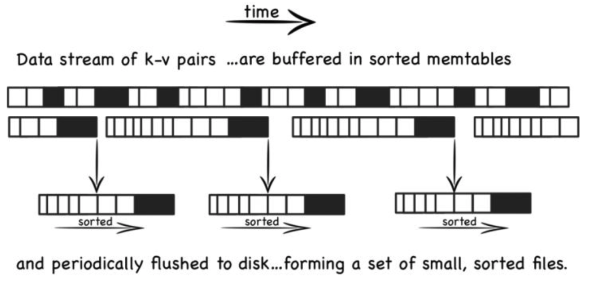

# TSDB时序数据库

## 数据库模型

1. 关系型数据库：MySql、PostgresQL
2. 文档型数据库：MongoDB、NoSQ
3. 键值对key-value数据库：redis、memcache
4. 时序数据库：influxDB、PrometheusDB

### 时序数据库特点

1. 写多读少，更新更少
2. 数据带有时间属性！且数据量随着时间递增
3. 插入数据多，每秒钟数据量成千上万条
4. 时序数据能够描述数据的变化！
5. 可以分析过去的数据，来检测现在的数据，并预测未来的数据变化！

### 时序数据的使用需求

1. 能够按照指标筛选数据
2. 能够按照区间、时间范围、统计信息聚合展示数据！

### 时序数据库使用场景

1. 监控软件系统：虚拟机、容器、服务、应用
2. 监控物理系统：工厂的设备监控、通讯监控、传感器数据、血糖仪、血压变化、心率等
3. 资产跟踪应用：汽车、卡车、物理容器
4. 金融交易系统：传统证券、新兴加密数字货币
5. 时间应用程序：跟踪用户、客户的交互数据
6. 商业智能工具：跟踪关键指标和业务的总体健康状态

### 时序数据库的底层数据结构

传统数据库使用的是B+树，原因是查询和顺序插入时有利于减少寻道次数。而TSDB使用LSM tree。

### LSM tree

- Log Structured Merge Trees ，影响写操作吞吐量的主要原因是**磁盘的随机操作慢，顺序读写快**，解决办法是将文件的随机存储改为顺序存储，因为完全是顺序的，提升了写操作的性能

- LSM算法是将之前使用的一个大的查找结构（造成随机读写、影响写性能的结构、比如B+树），变换为将写操作顺序的保存到有序文件中，且每个文件值保存短时间内的改动。

- 文件是有序的，所以读取的时候，查找会非常快（二分查找），且文件不可修改，新的更新操作只会写入到新的文件中。

- 读操作检查有序的文件，然后周期性的合并文件来减少文件的个数。

- 数据先写入内存，当内存容量达到一定阈值之后flush到文件。

- 譬如排名第一的tsdb：Infuxdb。它只支持insert和select。

  

  

## 参考资料

- [时序数据库入门](https://www.cnblogs.com/jpfss/p/12183214.html)

- [【技术分享】时序数据库简介（上海大学开源社区）](https://www.bilibili.com/video/BV1xt411x7qL?from=search&seid=11769815620461821564)

