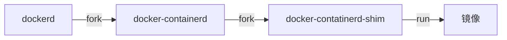
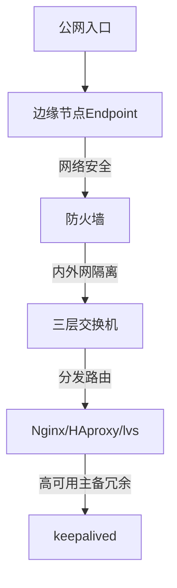

# Docker


## docker和传统VM比较

| 比较项         | 传统VM                                                       | Docker                                                   |
| -------------- | ------------------------------------------------------------ | -------------------------------------------------------- |
| 解决的核心问题 | 资源配置                                                     | 应用的开发、测试、部署                                   |
| 实现方法       | 通过Hypervisor层对宿主机硬件资源进行虚拟化。                 | 直接使用宿主机操作系统调度硬件资源，资源利用率上远超VM。 |
| 创建速度       | 提前统一配置、统一管理                                       | 容器是利用宿主机的系统内核创建的，可以在几秒内大量创建   |
| 缺点           | 会有计算、I/O、网络性能损耗，因本质多了一层软件，运行一个完整的OS。 | 因共享内核，对安全和隔离问题做出了一定妥协。             |


### docker技术实现要点

Go语言开发。基于Linux内核的CGroup + Namespace，以及AUFS类的Union FS技术，是对进程进行封装隔离的轻量级容器虚拟化。


LXC是Linux原生的容器工具，利用LXC容器能有效地将单个操作系统管理的资源划分到鼓励的组中，以更好地在孤立的组之间平衡有冲突的资源使用需求。

这样既不需要指令级模拟，也不需要即时编译。容器可以在核心CPU本地运行命令，而不需要任何专门的解释机制。


### tips

- Linux中都有一个进程号为1的init进程，系统服务的父进程都是init。但是**Docker容器中进程号为1 的进程号是bash**，而不是init。这得益于LXC功能。宿主机器中运行的Docker服务就是该容器中Ubuntu系统的init进程。
- 每个运行的容器仅仅是宿主机器中运行的一个进程而已，容器中运行的程序其实也是宿主机器中的一个进程。
- Docker通过**CGroup**将属于每个容器的进程分为一组进行资源（内存、CPU、网络、硬盘）控制，通过**Namespace**将属于同一个容器的进程划分为一组，使分属于同一个容器的进程拥有独立的进程名字和独立的进程号！

- 在Docker出现之前。很多技术方案就是**直接令应用调用CGroup隔离**来运行资源的，但是这种隔离是粗粒度、硬编码的，想同时隔离资源和进程组，Docker方案做的最好。

  

### docker进程模型




- docker服务启动的第一个进程是 `/usr/bin/dockerd`，是这个docker服务端启动的入口，即Docker Daemon、Docker Engine

- dockerd的子进程docker-container的，是docker服务端的核心进程，负责与docker客户端、docker容器进行通信交互，例如执行 `docker run`命令，fork出docker容器进程

  ```bash
  # 启动参数：listen，打开一个sock描述符，实现所有docker容器和docker客户端之间的通信
  /../docker-containerd -l unix:///var/run/Docker/libcontainerd/Docker-containerd.sock
  ```

  

### unix domain socket

一种更高效的IPC机制，使用Socket API，将应用层数据从一个进程复制到另一个进程，不需要结果网络协议栈！

| 比较项         | Unix Domain socker                                           | 网络通信                                                   |
| -------------- | ------------------------------------------------------------ | ---------------------------------------------------------- |
| 可靠性         | IPC机制本质上是可靠的通信                                    | 网络协议是为不可靠的通信设计的                             |
| 原理           | 将应用层数据从一个进程复制到另一个进程                       | 通过网络协议栈，打包拆包、计算校验、维护序号、应答等做通信 |
| 地址           | 是一个socker类型的文件在文件系统中的路径。<br/>这个文件由bind()方法创建，若已存在，则返回错误 | 是IP地址加端口号                                           |
| address family | AF_UNIX                                                      | AF_INET                                                    |


### 容器中进程启动的两种模式

所有docker容器内启动的进程全部都是宿主机上的独立进程。该进程号是不是docker容器进程本身，要依据dockerfile的写法：

| 比较项    | shell方式执行进程                                            | exec方式执行进程                                          |
| --------- | ------------------------------------------------------------ | --------------------------------------------------------- |
| 命令格式  | /bin/sh -c "executable param1 param2"                        | CMD ["executable", "param1", "param2"]                    |
| redis示例 | ...<br />CMD "/usr/bin/redis-server"                         | ...<br />CMD ["/usr/bin/redis-server"]                    |
| ps -ef    | PID CMD<br />1 /bin/sh -c "/usr/bin/redis-server"<br />5 /usr/bin/redis-server *:6379<br />8 ps -ef | PID CMD<br />1 /usr/bin/redis-server *:6379<br />7 ps -ef |
| 释义      | 1号进程为shell                                               | 1号进程为redis-server                                     |
| 容器退出  | 需要对容器进程增加SIGTERM的处理逻辑，否则docker stop不能做到优雅退出，docker daemon默认10秒超时后退出 | docker stop能自动优雅退出                                 |

结论：

如果容器中包含多个进程，需要1号进程能够正确地传播SIGTERM信号来结束素有的子进程，之后再推出。

**令每个容器中只包含一个进程，同时都采用exec模式启动进程。**也是docker官方文档推荐做法。


## docker与微服务

| 微服务                    | docker                                                       |
| ------------------------- | ------------------------------------------------------------ |
| X轴水平克隆、水平扩展能力 | docker镜像快速部署，镜像即代码                               |
| Y轴功能分模块解耦         | docker镜像独立完整，用docker-compose等技术串联docker容器启动 |
| Z轴分区部署               | docker与数据服务结合，一键式扩展？                           |

在常见的传统部署模式中：

1. 用边缘节点Endpoint来做公网入口
2. 配合防火墙和三层交换机进行内外网隔离和网络安全区的划分
3. 边缘节点会通过nginx/haproxy或者lvs进行四层或七层上的分发和路由
4. 边缘节点的高可用性可以通过keepalived进行主备，通过冗余节点保证CAP定理中的AP（可用性和分区容错性）




## docker的三大组件

- 镜像
- 容器（运行时）
- 仓库


## Docker底层原理

- docker是面向软件开发者的，没有虚拟机的完整的os概念和硬件资源的预划分
- docker依托自己的docker engine实现了硬件资源的调度，移除了VM的hypervisor的概念


### Docker for Mac配置镜像源：

在任务栏点击 Docker Desktop 应用图标 -> Perferences，在左侧导航菜单选择 Docker Engine，在右侧输入栏编辑 json 文件。将

https://n8bn2y81.mirror.aliyuncs.com加到"registry-mirrors"的数组里，点击 Apply & Restart按钮，等待Docker重启并应用配置的镜像加速器。


## 镜像分层原理

- 通过history查看镜像分层

  ```shell
  docker history nginx
  ```

- 镜像由若干个层组成，每个有size的层都放置不同的存储目录中

- 这些层是由docker的overlay2驱动的

- 使用 `docker inspect containerID` 查看每层文件的存储信息

  ```
          "GraphDriver": {
              "Data": {
                  "LowerDir": "/var/lib/docker/overlay2/0f75953d648f7360dd8056f932950d12141d89591a0498d8050a47eed5be1ebe-init/diff:/var/lib/docker/overlay2/e89983d5fa44d196b9bcc7e244bc3242207e576a9c08e6eb38fe6416111f813e/diff:/var/lib/docker/overlay2/e4163f54be653626a97e00dd6d7bc28c1449f55ef3b766a4791e1759ffbcb2b9/diff:/var/lib/docker/overlay2/a3764ea52f54653232be22ddcd516866ec56e65f09c67c61ed9205a04c913bf9/diff:/var/lib/docker/overlay2/bfeff87f5084396e793b015d060eec517a6e2fb65435b7668450e274cf495c19/diff:/var/lib/docker/overlay2/d3a68dbf675141cf3d2575f965e3d0b2c4aed69fb9c2046d9687bc83af4428ba/diff:/var/lib/docker/overlay2/9a2625e05ef607bc8b507efd8f9d6ef37663ecee2e449927765640b594871580/diff",
                  "MergedDir": "/var/lib/docker/overlay2/0f75953d648f7360dd8056f932950d12141d89591a0498d8050a47eed5be1ebe/merged",
                  "UpperDir": "/var/lib/docker/overlay2/0f75953d648f7360dd8056f932950d12141d89591a0498d8050a47eed5be1ebe/diff",
                  "WorkDir": "/var/lib/docker/overlay2/0f75953d648f7360dd8056f932950d12141d89591a0498d8050a47eed5be1ebe/work"
              },
              "Name": "overlay2"
          },
  ```

- 镜像层是Readonly的，容器层是Read/Write的

- 静态的只读层是可以被别的镜像锁引用的，避免不必要的磁盘占用

- 镜像层都是映射到宿主机的/var/lib/docker/overlay2目录中，分为 *下级目录、上级目录、合并目录、工作目录*


## 参考资料

- [docker核心基础](https://www.bilibili.com/video/BV1Vs411E7AR?p=11)

