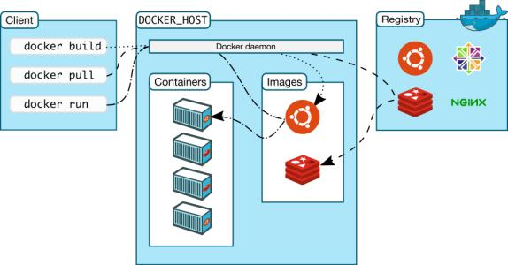
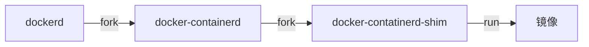
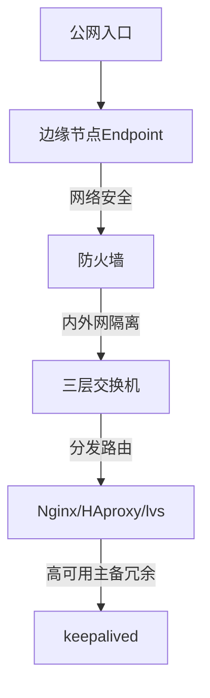
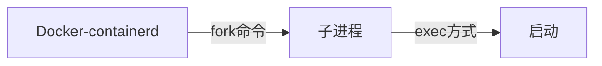
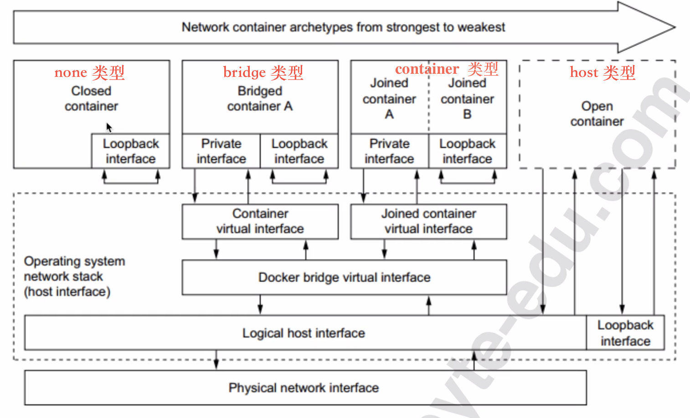
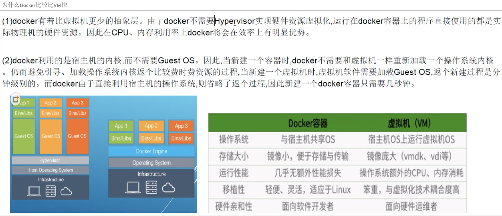
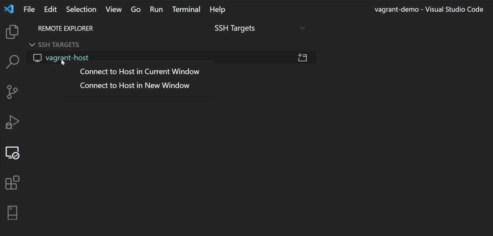

# Docker


## docker和传统VM比较

| 比较项         | 传统VM                                                       | Docker                                                   |
| -------------- | ------------------------------------------------------------ | -------------------------------------------------------- |
| 解决的核心问题 | 资源配置                                                     | 应用的开发、测试、部署                                   |
| 实现方法       | 通过Hypervisor层对宿主机硬件资源进行虚拟化。                 | 直接使用宿主机操作系统调度硬件资源，资源利用率上远超VM。 |
| 创建速度       | 提前统一配置、统一管理                                       | 容器是利用宿主机的系统内核创建的，可以在几秒内大量创建   |
| 缺点           | 会有计算、I/O、网络性能损耗，因本质多了一层软件，运行一个完整的OS。 | 因共享内核，对安全和隔离问题做出了一定妥协。             |


### docker技术实现要点

Go语言开发。基于Linux内核的CGroup + Namespace，以及AUFS类的Union FS技术，是对进程进行封装隔离的轻量级容器虚拟化。


LXC是Linux原生的容器工具，利用LXC容器能有效地将单个操作系统管理的资源划分到鼓励的组中，以更好地在孤立的组之间平衡有冲突的资源使用需求。

这样既不需要指令级模拟，也不需要即时编译。容器可以在核心CPU本地运行命令，而不需要任何专门的解释机制。


### tips

- Linux中都有一个进程号为1的init进程，系统服务的父进程都是init。但是**Docker容器中进程号为1 的进程号是bash**，而不是init。这得益于LXC功能。宿主机器中运行的Docker服务就是该容器中Ubuntu系统的init进程。
- 每个运行的容器仅仅是宿主机器中运行的一个进程而已，容器中运行的程序其实也是宿主机器中的一个进程。
- Docker通过**CGroup**将属于每个容器的进程分为一组进行资源（内存、CPU、网络、硬盘）控制，通过**Namespace**将属于同一个容器的进程划分为一组，使分属于同一个容器的进程拥有独立的进程名字和独立的进程号！

- 在Docker出现之前。很多技术方案就是**直接令应用调用CGroup隔离**来运行资源的，但是这种隔离是粗粒度、硬编码的，想同时隔离资源和进程组，Docker方案做的最好。
- docker的启动需要相当大的用户权限，所以实际上docker服务用户组的权限相当于root，并且该权限会通过fork传递下去，这个是安全隐患。

### docker进程模型





- docker服务启动的第一个进程是 `/usr/bin/dockerd`，是这个docker服务端启动的入口，即Docker Daemon、Docker Engine

- dockerd的子进程docker-container的，是docker服务端的核心进程，负责与docker客户端、docker容器进行通信交互，例如执行 `docker run`命令，fork出docker容器进程

  ```bash
  # 启动参数：listen，打开一个sock描述符，实现所有docker容器和docker客户端之间的通信
  /../docker-containerd -l unix:///var/run/Docker/libcontainerd/Docker-containerd.sock
  ```

  

### unix domain socket

一种更高效的IPC机制，使用Socket API，将应用层数据从一个进程复制到另一个进程，不需要结果网络协议栈！

| 比较项         | Unix Domain socker                                           | 网络通信                                                   |
| -------------- | ------------------------------------------------------------ | ---------------------------------------------------------- |
| 可靠性         | IPC机制本质上是可靠的通信                                    | 网络协议是为不可靠的通信设计的                             |
| 原理           | 将应用层数据从一个进程复制到另一个进程                       | 通过网络协议栈，打包拆包、计算校验、维护序号、应答等做通信 |
| 地址           | 是一个socker类型的文件在文件系统中的路径。<br/>这个文件由bind()方法创建，若已存在，则返回错误 | 是IP地址加端口号                                           |
| address family | AF_UNIX                                                      | AF_INET                                                    |


### 容器中进程启动的两种模式

所有docker容器内启动的进程全部都是宿主机上的独立进程。该进程号是不是docker容器进程本身，要依据dockerfile的写法：

| 比较项    | shell方式执行进程                                            | exec方式执行进程                                          |
| --------- | ------------------------------------------------------------ | --------------------------------------------------------- |
| 命令格式  | /bin/sh -c "executable param1 param2"                        | CMD ["executable", "param1", "param2"]                    |
| redis示例 | ...<br />CMD "/usr/bin/redis-server"                         | ...<br />CMD ["/usr/bin/redis-server"]                    |
| ps -ef    | PID CMD<br />1 /bin/sh -c "/usr/bin/redis-server"<br />5 /usr/bin/redis-server *:6379<br />8 ps -ef | PID CMD<br />1 /usr/bin/redis-server *:6379<br />7 ps -ef |
| 释义      | 1号进程为shell                                               | 1号进程为redis-server                                     |
| 容器退出  | 需要对容器进程增加SIGTERM的处理逻辑，否则docker stop不能做到优雅退出，docker daemon默认10秒超时后退出 | docker stop能自动优雅退出                                 |

结论：

如果容器中包含多个进程，需要1号进程能够正确地传播SIGTERM信号来结束素有的子进程，之后再推出。

**令每个容器中只包含一个进程，同时都采用exec模式启动进程。**也是docker官方文档推荐做法。


## docker与微服务

| 微服务                    | docker                                                       |
| ------------------------- | ------------------------------------------------------------ |
| X轴水平克隆、水平扩展能力 | docker镜像快速部署，镜像即代码                               |
| Y轴功能分模块解耦         | docker镜像独立完整，用docker-compose等技术串联docker容器启动 |
| Z轴分区部署               | docker与数据服务结合，一键式扩展？                           |

在常见的传统部署模式中：

1. 用边缘节点Endpoint来做公网入口
2. 配合防火墙和三层交换机进行内外网隔离和网络安全区的划分
3. 边缘节点会通过nginx/haproxy或者lvs进行四层或七层上的分发和路由
4. 边缘节点的高可用性可以通过keepalived进行主备，通过冗余节点保证CAP定理中的AP（可用性和分区容错性）




## docker的三大组件

- 镜像
- 容器（运行时）
- 仓库


## 容器的本质

容器 = CGroups + Namespace + Rootfs

### Namespace

Namespac是Linux提供的内核级别的环境隔离方法。

基于实现了内部资源无法访问外部资源的简单隔离的chroot技术。

Namespace的实现基于三个系统方法：

1. clone()：实现线程的系统调用，用来创建一个新的进程
2. unshare()：把某个进程脱离某个Namespace
3. setns()：把某个进程加入某个Namespace

**namespace概念**

namespace 是 Linux 内核用来隔离内核资源的方式。通过 namespace 可以让一些进程只能看到与自己相关的一部分资源，而另外一些进程也只能看到与它们自己相关的资源，这两拨进程根本就感觉不到对方的存在。具体的实现方式是把一个或多个进程的相关资源指定在同一个 namespace 中。

Linux namespaces 是对全局系统资源的一种封装隔离，使得处于不同 namespace 的进程拥有独立的全局系统资源，改变一个 namespace 中的系统资源只会影响当前 namespace 里的进程，对其他 namespace 中的进程没有影响。

**namespace用途**

Linux 内核实现 namespace 的一个主要目的就是实现轻量级虚拟化(容器)服务。在同一个 namespace 下的进程可以感知彼此的变化，而对外界的进程一无所知。这样就可以让容器中的进程产生错觉，认为自己置身于一个独立的系统中，从而达到隔离的目的。也就是说 linux 内核提供的 namespace 技术为 docker 等容器技术的出现和发展提供了基础条件。


### Rootfs

Rootfs是docker容器在**启动时**其内部进程的文件系统，即docker容器的根目录。

该目录下有docker容器所需要的：系统文件、工具、容器文件等。和Linux系统内核启动时挂载的Rootfs目录的思想。

docker源码中通过下面的方法在进程中切换Rootfs：

```go
syscall.PivotRoot(rootfs, pivotDir)
```


### CGroups

Control Groups，CGroups 就是把进程放到一个组里面统一加以控制。具体提供了：

1. 资源限制：Resource LImitation，超过上限就发出OOM信息
2. 优先级分配：Prioritization，对不同进程分配CPU时间片数量及硬盘IO带宽，相当于控制了进程运行的优先级
3. 资源统计：Accounting，如CPU使用时长、内存用来，适用于计费
4. 进程控制：Control，对进程组执行挂起、恢复等操作

CGroups本质是内核附加在程序上的一系列的钩子（hook）。

```bash
# 给docker容器设置内存限制为128M
docker run -m 128m redis

# docker会在系统的hierarchy中为每个容器创建CGroups
cd /sys/fs/CGroup/memory/Docker/$container_id

# 查看CGroups的内存限制
cat memory.limit_in_bytes
134217728

# 查看CGroups中进程所使用的内存大小
cat memory.usage_in_bytes
430080
```


## Docker容器的运行时模型

### Linux中的特殊进程

- ID为0的是调度进程，该进程是内核的一部分，不执行如何磁盘上的程序。
- ID为1的是init进程，init通常读取与系统有关的初始化文件例如：/etc/rc*文件、/etc/inittab文件、/etc/init.d中的文件
- ID为2的页守护进程，负责支持虚拟存储器系统的分页操作


### Linux进程模型

Linux中的父进程用fork命令创建子进程，然后调用exec执行子进程函数，进程ID可以复用，但要使用延迟算法，防止将新进程误认为使用同一ID的某个已经终止的先前进程。

Linux在进行fork操作的时候，会首先调用 copy_process 函数，然后根据父进程传入的flag判断是否要新建Namespace，随后复制父进程的进程描述符 task_struct。

task_struct中包括当前进程的各种系统配置信息，包括：

- 网络描述
- PID描述
- UID描述
- MNT描述等


### Docker进程模型

Docker启动的时候，也是：



容器进程被fork之后，便创建了Namespace，下面就执行一系列的初始化操作了，分三个阶段：

1. dockerinit负责初始化网络栈
2. ENTRYPOINT负责完成用户态配置
3. CMD负责启动入口

启动后的docker容器和docker daemon就是通过sock文件描述符进行通信的。


## Docker逻辑架构

分为：Client + Docker_Host + Registry

所有Docker Client的命令，docker build、docker pull、docker run都可以使用HTTPS、HTTP的restful api来通信：

```bash
vi /etc/sysconfig/docker
# 添加
DOCKER_OPTS="-H tcp://0.0.0.0:2375"
server docker restart
# test
curl -v -X GET localhost:2375/_ping
```

基于这些RESTful API，可以在自己的平台上实现从编译到发布的全流程自动化。

## Docker Registry选型: Habor

使用Habor。

- Habor以Docker公司开源的Registry为基础，提供了管理UI、基于角色的访问控制、AD/LDAP基础、日志审核等功能，还支持中文。是VMVare公司开源的企业级Docker Registry项目。

- Habor支持Docker Compose一键式安装。

- Habor支持镜像复制，可以在开发环境、测试环境、生产环境做镜像的复制


## Docker单机网络模型

这个Docker体系中最复杂、对生产上线最具影响力的就是网络模式。

### Bridge模式

默认的。使用etho0虚拟网桥进行通信。

执行 docker run -p 命令时，Docker实际是在 iptables 上遵循 DNAT 规则，实现了端口转发的功能。

Docker安装好后，Docker守护进程就会调用Linux内核，生成一个虚拟网桥。所有容器的地址段都是：

```ip
172.17.0.1/16
```

Linux网桥的本质是用一组代码模拟网络协议栈，类似软件交换机。


### Host模式

此模式容器将不会获得一个独立的Network Namespace，而是会和宿主机共用一个Network Namespace，直接使用宿主机的端口和IP地址。

```bash
docker run -d --net=host --privileged=true tomcat

docker exec -it 84ee1dce1de806e50bcf19a5042c81713c1a841eab72c8c14d66ab93d5d73c84 ip addr show
```

`--privileged=true` 命令使容器会被允许直接配置主机的网络堆栈。


### Container模式

将新建容器的进程让道一个已存在的容器的网络栈中，两者的进程直接通过lo回环接口进行通信：

```bash
docker run --net=container:$container_id -d tomcat
```


### None模式

令Docker新容器放到隔离的网络栈中，但是不进行网络配置。

```bash
docker run  --net=none -it tomcat ip addr show
```




## Docker底层原理

- docker是面向软件开发者的，没有虚拟机的完整的os概念和硬件资源的预划分
- docker依托自己的docker engine实现了硬件资源的调度，移除了VM的hypervisor的概念




### Docker for Mac配置镜像源：

在任务栏点击 Docker Desktop 应用图标 -> Perferences，在左侧导航菜单选择 Docker Engine，在右侧输入栏编辑 json 文件。将

https://n8bn2y81.mirror.aliyuncs.com加到"registry-mirrors"的数组里，点击 Apply & Restart按钮，等待Docker重启并应用配置的镜像加速器。


## 镜像分层原理

- 通过history查看镜像分层

  ```shell
  docker history nginx
  ```

- 镜像由若干个层组成，每个有size的层都放置不同的存储目录中

- 这些层是由docker的overlay2驱动的

- 使用 `docker inspect containerID` 查看每层文件的存储信息

  ```
          "GraphDriver": {
              "Data": {
                  "LowerDir": "/var/lib/docker/overlay2/0f75953d648f7360dd8056f932950d12141d89591a0498d8050a47eed5be1ebe-init/diff:/var/lib/docker/overlay2/e89983d5fa44d196b9bcc7e244bc3242207e576a9c08e6eb38fe6416111f813e/diff:/var/lib/docker/overlay2/e4163f54be653626a97e00dd6d7bc28c1449f55ef3b766a4791e1759ffbcb2b9/diff:/var/lib/docker/overlay2/a3764ea52f54653232be22ddcd516866ec56e65f09c67c61ed9205a04c913bf9/diff:/var/lib/docker/overlay2/bfeff87f5084396e793b015d060eec517a6e2fb65435b7668450e274cf495c19/diff:/var/lib/docker/overlay2/d3a68dbf675141cf3d2575f965e3d0b2c4aed69fb9c2046d9687bc83af4428ba/diff:/var/lib/docker/overlay2/9a2625e05ef607bc8b507efd8f9d6ef37663ecee2e449927765640b594871580/diff",
                  "MergedDir": "/var/lib/docker/overlay2/0f75953d648f7360dd8056f932950d12141d89591a0498d8050a47eed5be1ebe/merged",
                  "UpperDir": "/var/lib/docker/overlay2/0f75953d648f7360dd8056f932950d12141d89591a0498d8050a47eed5be1ebe/diff",
                  "WorkDir": "/var/lib/docker/overlay2/0f75953d648f7360dd8056f932950d12141d89591a0498d8050a47eed5be1ebe/work"
              },
              "Name": "overlay2"
          },
  ```

- 镜像层是Readonly的，容器层是Read/Write的

- 静态的只读层是可以被别的镜像锁引用的，避免不必要的磁盘占用

- 镜像层都是映射到宿主机的/var/lib/docker/overlay2目录中，分为 *下级目录、上级目录、合并目录、工作目录*


## 实操

### ENTRYPOINT

类似于 CMD 指令，但其不会被 docker run 的命令行参数指定的指令所覆盖，而且这些命令行参数会被当作参数送给 ENTRYPOINT 指令指定的程序。

但是, 如果运行 docker run 时使用了 --entrypoint 选项，将覆盖 CMD 指令指定的程序。

**优点**：在执行 docker run 的时候可以指定 ENTRYPOINT 运行所需的参数。

**注意**：如果 Dockerfile 中如果存在多个 ENTRYPOINT 指令，仅最后一个生效。

格式：

```dockerfile
ENTRYPOINT ["<executeable>","<param1>","<param2>",...]
```

可以搭配 CMD 命令使用：一般是变参才会使用 CMD ，这里的 CMD 等于是在给 ENTRYPOINT 传参，以下示例会提到。

示例：

假设已通过 Dockerfile 构建了 nginx:test 镜像：

```dockerfile
FROM nginx

ENTRYPOINT ["nginx", "-c"] # 定参
CMD ["/etc/nginx/nginx.conf"] # 变参 
```

1、不传参运行

```bash
$ docker run  nginx:test
```

容器内会默认运行以下命令，启动主进程。

```bash
nginx -c /etc/nginx/nginx.conf
```

2、传参运行

```
$ docker run  nginx:test -c /etc/nginx/new.conf
```

容器内会默认运行以下命令，启动主进程(/etc/nginx/new.conf:假设容器内已有此文件)

```bash
nginx -c /etc/nginx/new.conf
```


# vagrant

类似docker/visualBox，启动虚拟机，Hashicorp的另一个流行产品！[官网](https://www.vagrantup.com/)

```bash
$ vagrant init hashicorp/bionic64
$ vagrant up
  Bringing machine 'default' up with 'virtualbox' provider...
  ==> default: Importing base box 'hashicorp/bionic64'...
  ==> default: Forwarding ports...
  default: 22 (guest)
  => 2222 (host) (adapter 1)
  ==> default: Waiting for machine to boot...

$ vagrant ssh
  vagrant@bionic64:~$ _
```

useful commands:

```bash
# 显示ssh配置
vagrant ssh-config

# 异地访问
ssh vagrant@host-ip -i ".vagrant/machines/default/hyperv/private_key"
# 密码默认也是vagrant

# 修改password可以登录的选项
# PasswordAuthentication yes
vim /etc/ssh/sshd_config
```


# vscode远程开发

安装 `remote-ssh`插件，左侧会多出一个按钮：`Remote Explorer`

然后添加一个新的target，可以分不同平台例如WSL或SSH，SSH的会自动发现 `.ssh/config` 的中配置，自动发现远程主机



## 参考资料

- [docker核心基础](https://www.bilibili.com/video/BV1Vs411E7AR?p=11)

- [runnob-docker](https://www.runoob.com/docker/docker-dockerfile.html)

