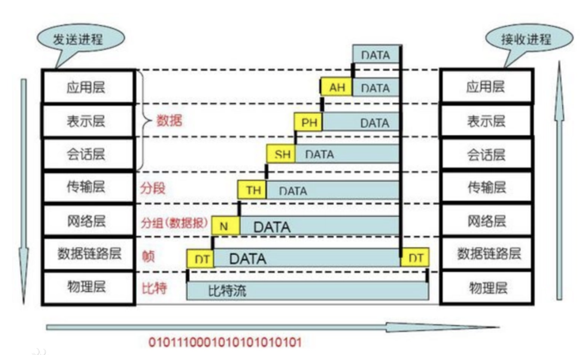
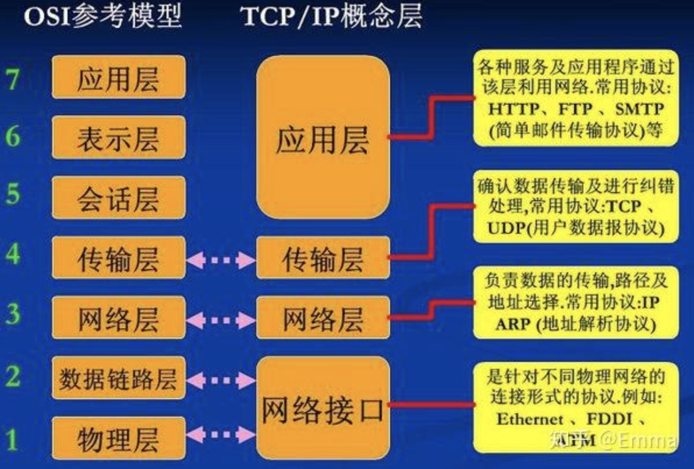

# 深入理解计算机系统

## 网关（Gateway）

网关是一种充当转换重任的[计算机系统](https://baike.baidu.com/item/计算机系统/7210959)或设备。使用在**不同的[通信协议](https://baike.baidu.com/item/通信协议/3351624)、数据格式或语言**，甚至[体系结构](https://baike.baidu.com/item/体系结构/8174145)完全不同的两种系统之间，网关是一个翻译器。网关对收到的信息要重新打包，以适应目的系统的需求。

- 网关在网络层以上实现[网络互连](https://baike.baidu.com/item/网络互连/108997)，是复杂的网络互连设备，仅用于两个高层协议不同的网络互连。
- 网关既可以用于[广域网](https://baike.baidu.com/item/广域网/422004)互连，也可以用于[局域网](https://baike.baidu.com/item/局域网)互连。

## 网络7层模型

