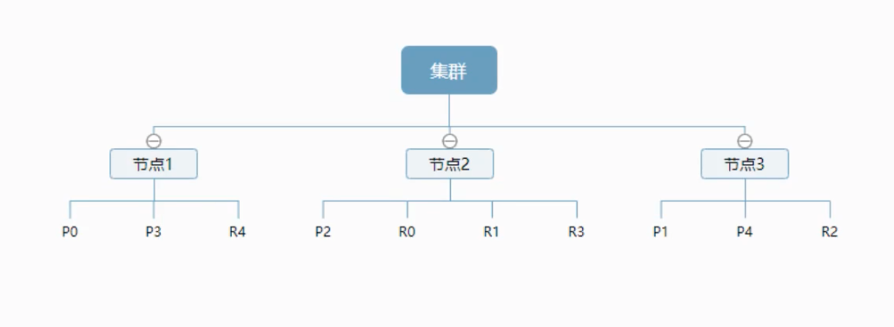

# ElasticSearch

- 全文搜索引擎，开源 
- java开发的，核心是Lucene.jar包
- 百度、谷歌、GitHub都在用的搜索引擎
- 只支持json数据格式
- Restful风格暴露出来的API
- 对标Solr：
  - solr安装部署麻烦，ES解压即可（需要jdk环境）
  - solr在数据量上来后，性能不行，ES管理GitHub千亿行代码
  - ES天生支持分布式部署
  - solr可以支持xml等各种然并卵的数据格式


## 基础介绍

- 服务端口9200，可到web网页查看当前ES的config：

  ```
  http://localhost:9200/
  ```

- 三剑客ELK之一

  - ElasticSearch
  - Logstatch - 日志收集
  - Kibana - web UI，高级的ES查询工具

- [elasticsearch-head](https://github.com/mobz/elasticsearch-head)是其简单的可视化web界面（需要nodejs环境）
  > npm i && npm i -g grunt && npm run start

  - open web: http://localhost:9100/
  - 添加elasticsearch.yml配置项以支持跨域访问：

    ```yml
    ...
    http.cors.enabled: true
    http.cors.allow-origin: "*"
    ```
    
  - 重启ES

- 就把ES当做一个数据库，索引就是一个库，文档就是库中的数据

- 目录结构

  ```
  bin 启动文件
  config 配置文件
  	log4j2	日志配置文件
  	jvm.options	java 虚拟机相关的配置
  	elasticsearch.yml		elasticsearch的配置文件！默认9200端口！跨域！
  lib		相关jar包
  logs	日志！
  modules	功能模块
  plugins	插件！
  ```


## ES核心概念

索引、字段类型、文档

- _index索引就是一个数据库
- 文档就是库中的数据
- 类型就是一个数据表 - 7.x已经没有了
- _score是个权重
- header当做数据展示工具，kibana做查询工具
- ES是一个基于Lucene、分布式、通过Restful方式进行交互的近实时搜索平台框架！

| Relation DB     | Elasticsearch  |
| --------------- | -------------- |
| 数据库 database | 索引 indices   |
| 表 tables       | 类型 types     |
| 行 rows         | 文档 documents |
| 字段 columns    | 字段 fields    |

- es是面向文档，一切都是json！
- es集群中可以包含多个索引（数据库），每个索引中可以包含多个类型（表），每个类型下又包含多个文档（行），每个文档中又包含多个字段（列）
- 类似是文档的逻辑容器，就像关系型数据库一样，表格是行的容器。类型中对于字段的定义称为映射，比如name映射为字符串类型


### 物理节点和分片如何工作

一个集群至少有一个节点，而一个节点就是一个elasticsearch进程，节点可以有多个索引默认的，如果你创建索引，那么索引将会有5个分片（primary shard，又称为主分片），每个主分片会有一个副本（replica shard，又称复制分片）



上图例如有3个节点的集群，可以看到主分片和对应的复制分片都不会在同一个节点内，这样有利于某个节点挂了，数据不会丢失。

一个分片就是一个Lucene的索引，一个包含**倒排索引**的文件目录。倒排索引的结构使得elasticsearch在不扫描全部文档的情况下，就能告诉你哪些文档包含特定的关键词。

#### 倒排索引

elasticsearch使用的是一种称为倒排索引的结构，采用Lucene倒排索作为底层。这种结构适用于快速的全文搜索，一个索引由文档中所有不重复的列表构成，对于每一个词。。。


### 物理设计：

elasticsearch在后头把**每个索引划分成多个分片**，每个分片可以在集群中的不同服务器减迁移

### 逻辑设计：


## Logstash

是ELK的中央数据流引擎，用于从不同目标（文件、数据存储、MQ等）收集的不同格式数据，经过过滤后支持输出到不同目的地（文件、MQ、redis、elasticsearch、kafak等）。


## Kibana

Kibana可以将elasticsearch的数据通过友好的web页面展示出来，提供实时分析的功能。

kibana页面中有个🔧，是开发工具，类似postman的功能！

**汉化**: 修改 `kibana/config/kibana.yml`，重启生效。

> i18n.locale: "zh-CN"


## IK分词器插件

分词：把一段中文或者别的划分成一个个关键词，即分成一个个的关键词

中文分词器IK分词器提供两个分词算法：

1. ik_smart：最少切分
2. ik_max_word：最细粒度划分

### 安装

1. 下载elasticsearch-ik: https://github.com/medcl/elasticsearch-analysis-ik

2. 在elasticsearch的plugins目录中建立一个ik目录，全部放入ik目录即可！ 

3. 重启ES，会看到日志：

   > ... loaded module [x-pack-wathcer]
   >
   > ... loaded plugin [analysis-ik]
   >
   > ...

4. 查看当前已有的插件：在ES的bin目录中执行命令：

   ```powershell
   elasticsearch-plugin list
   ik
   ```

5. 使用演示：

   打开kibana到console页面：http://localhost:5601/app/kibana#/dev_tools/console

   

6. 更新配置分词库：`plugins/ik/config/IKAnalyzer.cfg.xml`，增加一个**xxx.dic**，并配置到xml中，重启es应用生效


## Rest风格操作


```json
# 创建一个文档
PUT /test1/type1/1 # 7.x版本以后，type1默认是_doc！且ES不推荐设置typeName了
{
  "name": "gzc",
  "age": 22
}
# 执行结果
{
  "_index": "test1",
  "_type": "type1",
  "_id": "1",
  "_version": 1,
  "result": "created",
  "_shards": {
    "total": 2,
    "successful": 1,
    "failed": 0
  },
  "_seq_no": 0,
  "_primary_term": 1
}
```


PUT完成后，会自动增加了索引！在https://www.elastic.co/guide上可以查看example:

```json
# 创建一个index数据库
PUT /my_index
{
	"mappings": {
    "properties": {
      "name": {
        "type": "text"
      },
      "age": {
        "type": "long"
      }
    }
  }	
}

# 执行结果
{
  "acknowledged": true,
  "shards_acknowledged": true,
  "index": "my_index"
}
```

获取ES的很多信息（命令在kibana中会有自动提示）：

> GET _cat/indices?v

POST如果不传值，就会全部覆盖！类同MongoDB。 

复杂查询：

```json
GET test1/user/_search/?q=name:leo

GET test1/user/_search
{ # 查询的参数体
	"query": {
    "match": {
      "name": "gzc"
    }
  },
	"_source": ["name", "age"], // filter过滤字段
	"sort": [{
    "age": {
      "order": "desc" // 有了此字段后，score就为null了
    }
  }],
	"from": 0, // 分页 类同skip 此处等价于 /search/{current}/{pagesize}
	"size": 2, // 要多少个，pageSize，只要2个，类同limit 
}

# 执行结果
hits:
索引和文档的信息
查询的结果总数
查询处理的具体的文档，包括了_score字段，表示匹配的权重！
```


按bool条件返回的查询：

```json
GET test1/user/_search
{
  "query": {
    "bool": { // 结果返回true的
      "must": [ // 都要满足的多条件查询，must相当于and。另外，should相当于or，must_not相当于not
        {
          "match": {
            "name": "gzc"
          }
        },
        {
          "match": {
            "age": 22
          }
        }
      ],
      "filter": { // 结果集中的过滤条件！
        "range": { // 范围查询
          "age": {
            "gte": 10,
            "lte": 20
          }
        }
      }
    }
  }
}
```


数组类型的分词器查询

```json
GET test1/user/_search
{ # 查询的参数体
	"query": {
    "match": { # 会使用分词器
 			"tags": "男 技术" //tags原始["直男", "技术狂热者", "篮球爱好者"], 此空格分隔的条件相当于百度中的关键词搜索
		}
	}
}
```

**精确查找 term**

会使用倒排索引做精确查找

```json
GET _analyze
{
  "analyzer": "keyword", // 不会被分词
  "text": "gzc爱学习"
}

GET _analyze
{
  "analyzer": "standard", // 会被分词解析
  "text": "gzc爱学习"
}

GET testdb/_search
{
  "query": {
    "term": { // 精确查找
      ”name": "g"
    }
  }
}

# 精确查询多个值
GET testdb/_search
{
  "query": {
    "bool": {
      "should": [
        {
          "term": {
            "t1": "22"
          }
        },
        {
          "term": {
            "t1": "33"
          }
        }
      ]
    }
  }
}
```


### 高亮查询

```json
GET testdb/user/_search
{
  "query": {
    "match": {
      "name": "gzc"
    }
  },
  "highlight": { // 高亮
    "fields": {
      "pre_tags": "<p clas='key' style='color:red'>", // 自定义高亮条件！默认是<em>
      "post_tags": "</p>", // 原默认是</em>
      "name": {}
    }
  }
}

# 执行结果

```


### 数据类型

- 字符串类型：text、keyword，其中tex类型t是可被分词器处理的，keyword表示最小集了，不可再被分词
- 数值类型：long、integer、short、byte、double、float、half float、scaled float
- 日期类型：date
- 布尔值类型：Boolen
- 二级制类型：binary


## 参考资料

- [【狂神说Java】ElasticSearch7.6.x最新完整教程](https://www.bilibili.com/video/BV17a4y1x7zq?t=852&p=1)
- [狂神说笔记](https://gitee.com/kuangstudy/openclass)
- [复杂ES查询](https://www.bilibili.com/video/BV17a4y1x7zq?p=11)

