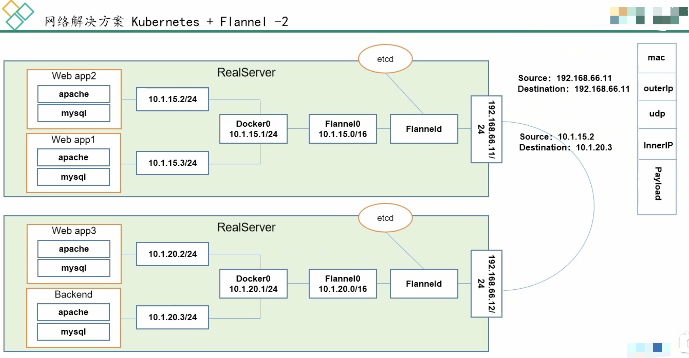
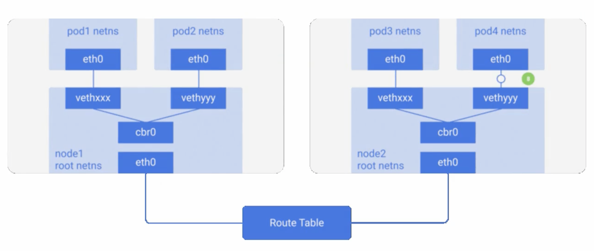
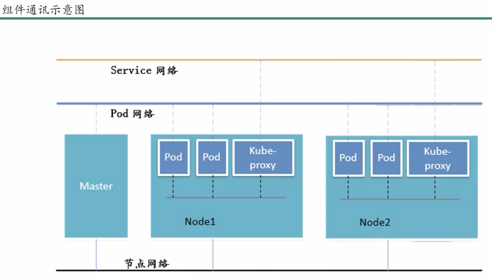

# kubernates

**Kubernetes协调连接在一起作为一个单元工作的高可用性计算机集群。**Kubernetes中的抽象允许您将容器化的应用程序部署到集群，而无需将它们专门绑定到单个机器。


k8s（k和s中间有8个字母）源自于Google的borg资源管理器，10年+容器化基础架构。后使用golang实现的超大规模分布式部署的解决方案。

docker的标准是鲸鱼🐳，k8s的图标是船舵，表示方向盘领航的意思。

[谷歌的容器之路：从 Borg 到 Kubernetes](https://www.infoq.cn/article/2015/05/Kubernetes-Borg-Eurosys)

> Borg 是谷歌公司的内部容器管理系统。早在十几年前，该公司就已经部署 Borg 系统对来自于几千个应用程序所提交的 job 进行接收、调试、启动、停止、重启和监控。该项目的目的是实现资源管理的自动化以及跨多个数据中心的资源利用率最大化。......


**IPVS：**

IP虚拟服务器（IP Virtual Server），基本上是一种高效的layer-4交换机！是运行在LVS下的提供负载平衡功能的一种技术。（from 章文嵩博士）[reference](https://baike.baidu.com/item/ipvs/5041817?fr=aladdin)

> 当一个TCP连接的初始SYN报文到达时，IPVS就选择一台服务器，将报文转发给它。此后通过查发报文的IP和TCP报文头地址，保证此连接的后继报文被转发到相同的服务器。这样，IPVS不用检查到请求的内容再选择服务器，这就要求后端的服务器组是提供相同的服务，不管请求被送到哪一台服务器，返回结果都应该是一样的。但是在有一些应用中后端的服务器可能功能不一，有的是提供HTML文档的Web服务器，有的是提供图片的Web服务器，有的是提供CGI的Web服务器。这时，就需要基于内容请求分发 (Content-Based Request Distribution)，同时基于内容请求分发可以提高后端服务器上访问的局部性。


**和apache的mesos比较**

也是分布式资源管理框架，Twitter之前使用的，2019年也放弃mesos，转向k8s


**和docker swarm比较**

是docker原厂出品，很轻量，本机只消耗几十MB。但功能相对于k8s太少，比如：滚动更新、回滚等操作，swarm手动实现起来很复杂。也能大规模化，但实现起来还是太费事。

阿里云也在2019年取消swarm，值支持k8s。


## 特点

- 轻量级：消耗资源少
- 开源
- 弹性伸缩：可大可小
- 负载均衡：IPVS


**borg框架：**


**k8s框架：**


**高可用集群副本数据最好是大于等于3的奇数个！**

### master组件

**主机负责管理群集。**主服务器协调集群中的所有活动，例如调度应用程序，维护应用程序的所需状态，扩展应用程序以及推出新的更新。

- api server： 所有服务访问的统一入口
- Replication controller：维持副本期望数目
- Scheduler：负责接收任务，选择合适的节点进行分配任务
- etcd：键值对数据库，储存k8s集群所有重要信息（持久化）

```shell
minikube start --docker-env HTTP_PROXY=http://localhost:5710 --docker-env HTTPS_PROXY=http://localhost:15710 --vm-driver=xhyve
```

### node组件

节点是作为Kubernetes集群中的工作机的虚拟机或物理计算机。每个节点都有一个Kubelet，它是管理节点和与Kubernetes主机通信的代理。

- kubelet：直接跟容器引擎交互，实现容器的生命周期管理。

- kube proxy：负责写入规则值IPtables、IPVS，实现服务映射访问的。


### 其他插件

- CoreDNS：可以为集群中的SVC创建一个域名映射IP的对应关系解析
- Dashboard：给k8s集群提供的BS结构的访问web界面
- Ingress Controller: 官方k8s实现了4层代理，Ingress可以实现七层代理（即主机名和域名的代理）
- Federation: 提供一个可以跨集群中心、多k8s的统一管理的功能
- Prometheus: tsdb，提供k8s集群的监控能力
- ELK：提供k8s集群日志统一分析介入平台


**ETCD版本选择：**


ETCD的V2版本数据都在内存中，V3版本引入了本地的卷的持久化操作，保证了数据不会丢失，所以建议使用v3版本etcd。


## WAL

> 为了保持存储系统内存中元数据和物理数据间的状态一致性，系统所有的数据操作对应的元数据变更都需要持久化到元数据db内，这里有一个性能问题，每次变更如果都要实时同步到外部db内，是否意味着高频的io操作？是否有延时写入的手段呢？

Write Ahead Log，在**分布式存储系统**中的**元数据更新**中应用得十分广泛。WAL的主要意思是说在将元数据的变更操作写入到持久稳定的db之前，**先预先写入到一个log中**，然后再由另外的操作将log apply到**外部的持久db**里去。这种模式会减少掉每次的db写入操作，尤其当系统要处理大量的transaction操作的时候，WAL的方式相比较于实时同步db的方式有着更高的效率。

WAL还有一点很重要的帮助是可以在disaster recovery过程中起到**状态恢复**的作用，系统在load完元数据db后，再把未来得及提交的WAL apply进来，就能恢复成和之前最终一致的状态。


> 实践操作！follow the tutorial！


## minikube

- [安装minikube](https://www.cnblogs.com/mengyucloud/p/12244168.html)

```bash
# Mac download & install
curl -Lo minikube https://github.com/kubernetes/minikube/releases/download/v1.6.2/minikube-darwin-amd64 && chmod +x minikube && sudo mv minikube /usr/local/bin/

# 安装minikube缺省支持的Kubernetes版本
minikube start --image-mirror-country cn \
    --iso-url=https://kubernetes.oss-cn-hangzhou.aliyuncs.com/minikube/iso/minikube-v1.6.0.iso \
    --registry-mirror=https://xxxxxx.mirror.aliyuncs.com

```


## Pod控制器

Pod控制器是k8s的灵魂！自主式Pod、控制器管理Pod，类型有：

- 同一个pod中的容器共享网络：可以相互以localhost访问，端口不可重复

- 同一个pod中共享存储卷

  

#### ReplicationController 和ReplicaSet

负责pod创建和销毁。用来确保容器应用的副本数十种保持在用户定义的副本数，即如果有容器异常退出，会自动创建新的Pod替代。如果多出来，也会自动回收。新版本中后者是取代前者的，后者也是大型项目中使用。


#### Deployment

自动管理ReplicaSet。Deployment比RC和RS多了支持rolling-update（滚动更新）。但Deployment不负责pod创建

> 若要更新V2版本，Deployment会创建另一个RS2，RS2负责产生V2版本的容器，此时V1的RS1会逐步停止，但不会删除，为回滚准备。


#### DaemonSet

DaemonSet确保全部Node上运行一个Pod的副本。当有Node加入集群时，也会为他们新增一个Pod。当有Node从集群移除时，这些Pod也会被回收。删除DaemonSet将会删除它创建的所有Pod。典型用法有：

- 运行集群部署daemon，例如在每个Node上运行glusterd、ceph。？？？
- 在每个Node上运行日志收集daemon，例如fluentd、logstash
- 在每个Node上运行监控daemon，例如Prometheus Node Exporter

当需要运行好几个不同daemon的时候，可以把他们放入一个pod来运行。


#### Job

负责执行批处理任务，仅执行一次。它保证批处理任务的一个或多个Pod成功结束。


#### CronJob

同linux的crob。


#### StatefulSet

为了解决有状态服务的问题。（Deployment和ReplicaSet为无状态服务而设计），应用场景包括：

- 稳定的持久化存储：即Pod重新调度后，还是能访问到相同的持久化数据，基于PVC实现
- 稳定的网络标志：即Pod重新调度后期PodName和HostName不变，基于Headless Service（即没有Cluster IP的Service）来实现
- 有序部署，有序扩展：即Pod是有顺序的，在部署或者扩展的时候，要依据定义的顺序依次进行（即从0到N-1，在下一个Pod运行之前所有之前的Pod必须都是Running 和Ready状态），基于init containers来实现。
- 有序收缩，有序删除：即从N-1到0


#### Horizontal Pod Autoscaling：HPA，

平滑扩缩容，根据Pod的CPU利用率（v1版本）（v1 alpha版本中可以根据内存和用户自定义metric）

>  if CPU > 80 then Max=10, Min=2


## 网络通讯模式

k8s的网络模型假定了所有Pod都在一个苦役互相连通（通过IP）的扁平化网络空间中。这在GCE（Google Compute Engine）里面是线程的网络模型，k8s嘉定这个网络已经存在。

在私有云里搭建k8s集群，我们需要自己实现网络互通，将不同节点上的docker容器之间的互相访问先打通，再运行k8s。

- 同一个Pod内的多个容器之间：localhost
- 各Pod之间的通讯：Overlay Network，覆盖网络
- Pod与Service之间的通讯：各节点的IPtables规则，新版本用LVS了，效率更高


Flannel 是CoreOS团队针对k8s使得网络规划服务，它是让集群中的不同节点主机创建的docker容器都具有全集群唯一的虚拟IP地址。而且它还能在这些IP地址之间建立一个覆盖网络（overlay network），通过这个覆盖网络，将数据包原封不动地传递到目标容器内。






etcd之flannel提供说明：

- 存储管理flannel可分配的IP地址段资源
- 监控etcd中每个pod的实际地址，并在内存中建立维护pod节点路由表


不同网络下通讯方式

- 同一个pod内部通信：共享了同一个网络命名空间，共享同一个linux协议栈

- pod1至pod2：
  - 不再同一台主机：pod的地址是与docker0在同一个网段的，但docker0网段与宿主网卡是两个不同的IP网段，并且不同Node之间的通信只能通过宿主机的物理网卡进行。将pod的IP和所在Node的IP关联起来，通过这个关联让Pod可以互相访问。
  - 在同一台主机：由docker0网桥直接转发请求至pod2，不需要结果flannel


- pod到service的网络：目前基于性能考虑，全部为iptables维护和转发；最新版为lvs。

- pod到外网：pod向外网发送请求，查找路由表，转发数据包到宿主机的网卡，宿主网卡完成路由选择后，iptables执行masquerade，把源IP更改为宿主网卡的IP，然后向外网服务器发送请求。

- 外网访问Pod：Service




## minikube

```bash
minikube start --vm-driver=virtualbox --image-mirror-country=cn --image-repository=registry.cn-hangzhou.aliyuncs.com/google_containers --iso-url=https://kubernetes.oss-cn-hangzhou.aliyuncs.com/minikube/iso/minikube-v1.7.3.iso --registry-mirror=https://reg-mirror.qiniu.com
```


## 存储

configMap: 专门用于存储配置文件

Secret：存储一些比较重要的数据，比如用户名密码，需要加密的

volume：存一些基本的数据，比如网页文件

PV：是动态的调用过程

实际生产中，需要根据实际情况选择不同的存储方式。


## 调度器

k8s会自动调用容器和pod调度到对应的节点！

也能实现把pod定义到想要的节点运行！


## 集群安全

集群的认证、鉴权、访问控制。需要反复温故知新！


## HELM

相当于linux中的yum安装包管理器


## 运维

CICD构建 With Jenkins

kubeadm源码修改：目的是修改默认1年的证书限制

k8s高可用构建