# nginx

nginx是异步框架的web服务器，也可以用作反向代理、负载平衡以及作为缓存服务器。nginx是目前互联网公司web服务器的主流技术，用于处理高并发甚至海量并发的网站数据。分为开源的社区版和闭源的商业版，**Tengine**就是淘宝在nginx基础上进行二次开发，以获取更高的稳定性和并发能力，经历了双十一的技术洗礼，足以证明其稳定性和高性能。


## 主要特性

- **高并发、高性能**：单台普通的服务器可以轻松处理上万并发连接（最多建议3w）

- **模块化设计，非常好的扩展性**：通过加载、卸载某个模块以实现相应的功能，

- **热部署、热更新**：支持配置文件的热更新，版本热升级、动态加载模块、日志热更换

  > reload操作的执行流程：nginx会新创建一个新的nginx进程，使用了新的配置文件；老的nginx停止listen服务，且处理完所有当前的请求之后，再graceful stop。

- **内存低消耗：据统计**，1w个keep-alive连接模式下的非活动连接，仅消耗内存2.5M

  > 非活动连接: 建立了连接，open状态，但此时并没有发生请求的发送和回应

- **配置、维护简单**：nginx的配置非常简单，运维非常友好


## 基本功能

- **web服务器**: 最基本的功能，也是非常重要的功能之一
- **反向代理服务器**：http协议的反向代理服务器，是生产环境中最常用的功能
- **FastCGI(php)、uWSGI(python) 代理服务器**：此时请求不是http协议，是跟后端服务相关的协议
- **TCP/UDP代理服务器**：也即作为四层调度器

- **Mail邮件代理服务器**：几乎不怎么使用了现在。


## 基础架构

如下图，`nginx`为`master/workers`架构，一个`master`主进程，负责管理和维护多个`worker`进程，真正接收并处理用户请求的其实是`worker`进程，`master`不对用户请求进行处理。即`master`主进程负责分析并加载配置文件，管理`worker`进程，接收用户信号传递以及平滑升级等功能。

`nginx`具有强大的缓存功能，其中`cache loader`负责载入缓存对象，`cache manager`负责管理缓存对象。


## mac下安装

```bash
# 常规操作
brew update
# 检查要安装的软件是否存在
brew search nginx
# 查看nginx的相关信息
brew info nginx
# 安装nginx
brew install nginx
# 查看nginx安装目录
open /usr/local/etc/nginx
# 查看nginx可执行文件目录
open  
# 启动nginx，没有报错即为启动成功
nginx
```

验证nginx是否启动成功：http://localhost:8080

nginx配置文件：/usr/local/etc/nginx/nginx.conf

nginx默认网站根目录：/usr/local/var/www

默认的索引文件为：index.html  index.htm


## centos下安装

```bash
[root@c93a66f92342 /]# rpm -ql nginx
/etc/logrotate.d/nginx
/etc/nginx
/etc/nginx/conf.d
/etc/nginx/conf.d/default.conf
/etc/nginx/fastcgi_params
/etc/nginx/koi-utf
/etc/nginx/koi-win
/etc/nginx/mime.types
/etc/nginx/modules
/etc/nginx/nginx.conf
/etc/nginx/scgi_params
/etc/nginx/uwsgi_params
/etc/nginx/win-utf
/etc/sysconfig/nginx
/etc/sysconfig/nginx-debug
/usr/lib/systemd/system/nginx-debug.service
/usr/lib/systemd/system/nginx.service
/usr/lib64/nginx
/usr/lib64/nginx/modules
/usr/libexec/initscripts/legacy-actions/nginx
/usr/libexec/initscripts/legacy-actions/nginx/check-reload
/usr/libexec/initscripts/legacy-actions/nginx/upgrade
/usr/sbin/nginx
/usr/sbin/nginx-debug
/usr/share/doc/nginx-1.18.0
/usr/share/doc/nginx-1.18.0/COPYRIGHT
/usr/share/man/man8/nginx.8.gz
/usr/share/nginx
/usr/share/nginx/html
/usr/share/nginx/html/50x.html
/usr/share/nginx/html/index.html
/var/cache/nginx
/var/log/nginx

[root@c93a66f92342 ~]# netstat -nlpt
Active Internet connections (only servers)
Proto Recv-Q Send-Q Local Address           Foreign Address         State       PID/Program name    
tcp        0      0 0.0.0.0:80              0.0.0.0:*               LISTEN      349/nginx: master p 
# Recv-Q字段表示全连接队列中正在使用的队列大小
# Send-Q表示backlog设置的大小

[root@c93a66f92342 ~]# nginx -V
nginx version: nginx/1.18.0
built by gcc 4.8.5 20150623 (Red Hat 4.8.5-39) (GCC) 
built with OpenSSL 1.0.2k-fips  26 Jan 2017
TLS SNI support enabled
configure arguments: --prefix=/etc/nginx --sbin-path=/usr/sbin/nginx --modules-path=/usr/lib64/nginx/modules --conf-path=/etc/nginx/nginx.conf --error-log-path=/var/log/nginx/error.log --http-log-path=/var/log/nginx/access.log --pid-path=/var/run/nginx.pid --lock-path=/var/run/nginx.lock --http-client-body-temp-path=/var/cache/nginx/client_temp --http-proxy-temp-path=/var/cache/nginx/proxy_temp --http-fastcgi-temp-path=/var/cache/nginx/fastcgi_temp --http-uwsgi-temp-path=/var/cache/nginx/uwsgi_temp --http-scgi-temp-path=/var/cache/nginx/scgi_temp --user=nginx --group=nginx --with-compat --with-file-aio --with-threads --with-http_addition_module --with-http_auth_request_module --with-http_dav_module --with-http_flv_module --with-http_gunzip_module --with-http_gzip_static_module --with-http_mp4_module --with-http_random_index_module --with-http_realip_module --with-http_secure_link_module --with-http_slice_module --with-http_ssl_module --with-http_stub_status_module --with-http_sub_module --with-http_v2_module --with-mail --with-mail_ssl_module --with-stream --with-stream_realip_module --with-stream_ssl_module --with-stream_ssl_preread_module --with-cc-opt='-O2 -g -pipe -Wall -Wp,-D_FORTIFY_SOURCE=2 -fexceptions -fstack-protector-strong --param=ssp-buffer-size=4 -grecord-gcc-switches -m64 -mtune=generic -fPIC' --with-ld-opt='-Wl,-z,relro -Wl,-z,now -pie'

```

 

## nginx的源码安装和重新编译

官网下载解压后：

```bash
# 重新编译nginx
./configure --prefix=/usr/local/nginx --with-http_stub_status_module
make
sudo make install

  # 输出nginx的相关目录：
  nginx path prefix: "/usr/local/nginx"
  nginx binary file: "/usr/local/nginx/sbin/nginx"
  nginx modules path: "/usr/local/nginx/modules"
  nginx configuration prefix: "/usr/local/nginx/conf"
  nginx configuration file: "/usr/local/nginx/conf/nginx.conf"
  nginx pid file: "/usr/local/nginx/logs/nginx.pid"
  nginx error log file: "/usr/local/nginx/logs/error.log"
  nginx http access log file: "/usr/local/nginx/logs/access.log"
  nginx http client request body temporary files: "client_body_temp"
  nginx http proxy temporary files: "proxy_temp"
  nginx http fastcgi temporary files: "fastcgi_temp"
  nginx http uwsgi temporary files: "uwsgi_temp"
  nginx http scgi temporary files: "scgi_temp"
  
# 启动
sudo /usr/local/nginx/sbin/nginx 

./nginx -V #查询版本信息

suod vim /usr/local/nginx/conf/nginx.conf
        # 增加配置开启状态查询 才能查询到指标数据
        location /nginx-status {
            stub_status on; 
            access_log off;
        }   

```

安装包1M左右，C语言编写，5w并发。

支持的负载均衡方式：轮询、权重、IP hash、动静分离（静态资源和非静态需要后台做业务处理的）


## 配置文件

### 常用配置

1. `location` 指定不同的请求后缀名，可以实现动态和静态请求的分离转发，譬如/public/*.html/css/js/image/icon...请求代理到静态，其他代理到动态

2. `expires`设置缓存过期时间，譬如为 `3d`为三天，会比对服务器该文件最后更新时间，若未过期，则返回状态码304；若修改了，则重新下载，返回状态码200

3. 动静态分离中，比如service-manager，go代码中就不管静态网页了，只做动态的API，静态网页用nginx驱起来

4. `root` 为重定向 的静态文件所在的根目录，访问路由在nginx服务器上的目录前缀

5. [nginx](http://nginx.org/en/download.html) 下周后，编译安装

   ```bash
   cd nginx-1.18.0
   ./configure
   make
   sudo make install
   # 启动服务
   nginx
   # 查看nginx帮助
   nginx -h
   ```

6. 配置文件示例（静态网页）

   ```nginx
   server {
   	listen 			80;
   	server_name	192.168.17.129;
   	...
   	location /www/ {
   		root	/data/; # http://192.168.17.129:80/www/ 会访问到静态磁盘文件：/data/www/index.html
   		index	index.html index.htm;
   	}
   	
   	location /image/ {
   		root	/data/;	# http://192.168.17.129:80/image/01.jpg 会访问到静态磁盘文件：/data/image/01.jpg
   		autoindex	on;	# 列出访问目录 http://192.168.17.129:80/image 可查看到文件列表
   	}
   }
   ```

7. 启动脚本：

   ```bash
   nginx -c nginx-1.18.0/conf/nginx.conf
   ```

8. 配置文件示例

```bash
# cat /etc/nginx/nginx.conf  

user  nginx;
worker_processes  auto;

error_log  /var/log/nginx/error.log warn;
pid        /var/run/nginx.pid;


events {
    worker_connections  1024;
}


http {
    include       /etc/nginx/mime.types;
    default_type  application/octet-stream;

    log_format  main  '$remote_addr - $remote_user [$time_local] "$request" '
                      '$status $body_bytes_sent "$http_referer" '
                      '"$http_user_agent" "$http_x_forwarded_for"';

    access_log  /var/log/nginx/access.log  main;

    sendfile        on;
    #tcp_nopush     on;

    keepalive_timeout  65;

    #gzip  on;

    include /etc/nginx/conf.d/*.conf;
}
```


### 配置文件示例

```nginx
#运行用户
user nobody;
#启动进程,通常设置成和cpu的数量相等
worker_processes  1;

#全局错误日志及PID文件
#error_log  logs/error.log;
#error_log  logs/error.log  notice;
#error_log  logs/error.log  info;

#pid        logs/nginx.pid;

#工作模式及连接数上限
events {
    #epoll是多路复用IO(I/O Multiplexing)中的一种方式,
    #仅用于linux2.6以上内核,可以大大提高nginx的性能
    use   epoll; 

    #单个后台worker process进程的最大并发链接数    
    worker_connections  1024;

    # 并发总数是 worker_processes 和 worker_connections 的乘积
    # 即 max_clients = worker_processes * worker_connections
    # 在设置了反向代理的情况下，max_clients = worker_processes * worker_connections / 4  为什么
    # 为什么上面反向代理要除以4，应该说是一个经验值
    # 根据以上条件，正常情况下的Nginx Server可以应付的最大连接数为：4 * 8000 = 32000
    # worker_connections 值的设置跟物理内存大小有关
    # 因为并发受IO约束，max_clients的值须小于系统可以打开的最大文件数
    # 而系统可以打开的最大文件数和内存大小成正比，一般1GB内存的机器上可以打开的文件数大约是10万左右
    # 我们来看看360M内存的VPS可以打开的文件句柄数是多少：
    # $ cat /proc/sys/fs/file-max
    # 输出 34336
    # 32000 < 34336，即并发连接总数小于系统可以打开的文件句柄总数，这样就在操作系统可以承受的范围之内
    # 所以，worker_connections 的值需根据 worker_processes 进程数目和系统可以打开的最大文件总数进行适当地进行设置
    # 使得并发总数小于操作系统可以打开的最大文件数目
    # 其实质也就是根据主机的物理CPU和内存进行配置
    # 当然，理论上的并发总数可能会和实际有所偏差，因为主机还有其他的工作进程需要消耗系统资源。
    # ulimit -SHn 65535

}


http {
    #设定mime类型,类型由mime.type文件定义
    include    mime.types;
    default_type  application/octet-stream;
    #设定日志格式
    log_format  main  '$remote_addr - $remote_user [$time_local] "$request" '
                      '$status $body_bytes_sent "$http_referer" '
                      '"$http_user_agent" "$http_x_forwarded_for"';

    access_log  logs/access.log  main;

    #sendfile 指令指定 nginx 是否调用 sendfile 函数（zero copy 方式）来输出文件，
    #对于普通应用，必须设为 on,
    #如果用来进行下载等应用磁盘IO重负载应用，可设置为 off，
    #以平衡磁盘与网络I/O处理速度，降低系统的uptime.
    sendfile     on;
    #tcp_nopush     on;

    #连接超时时间
    #keepalive_timeout  0;
    keepalive_timeout  65;
    tcp_nodelay     on;

    #开启gzip压缩
    gzip  on;
    gzip_disable "MSIE [1-6].";

    #设定请求缓冲
    client_header_buffer_size    128k;
    large_client_header_buffers  4 128k;


    #设定虚拟主机配置
    server {
        #侦听80端口
        listen    80;
        #定义使用 www.nginx.cn访问
        server_name  www.nginx.cn;

        #定义服务器的默认网站根目录位置
        root html;

        #设定本虚拟主机的访问日志
        access_log  logs/nginx.access.log  main;

        #默认请求
        location / {
            
            #定义首页索引文件的名称
            index index.php index.html index.htm;   

        }

        # 定义错误提示页面
        error_page   500 502 503 504 /50x.html;
        location = /50x.html {
        }

        #静态文件，nginx自己处理
        location ~ ^/(images|javascript|js|css|flash|media|static)/ {
            
            #过期30天，静态文件不怎么更新，过期可以设大一点，
            #如果频繁更新，则可以设置得小一点。
            expires 30d;
        }

        #PHP 脚本请求全部转发到 FastCGI处理. 使用FastCGI默认配置.
        location ~ .php$ {
            fastcgi_pass 127.0.0.1:9000;
            fastcgi_index index.php;
            fastcgi_param  SCRIPT_FILENAME  $document_root$fastcgi_script_name;
            include fastcgi_params;
        }

        #禁止访问 .htxxx 文件
            location ~ /.ht {
            deny all;
        }

    }
}
```


### 监听端口

root用户可以监听所有端口，普通用户只能监听1024以上的端口，nginx的80端口是master进程监听的root用户启动的。worker进程是nginx用户启动的。

```bash
[root@c93a66f92342 ~]# ps -ef|grep nginx
root       349     1  0 12:51 ?        00:00:00 nginx: master process nginx
nginx      350   349  0 12:51 ?        00:00:00 nginx: worker process
```


### worker进程数

`worker_processes`配置为auto，即为CPU的核数。可通过指令 `lscpu`查看cpu信息。


### pid

进程ID是为了运维此进程操作时使用的！

例如执行 `nginx -s reload` 时，就会从 `/var/run/nginx.pid中`读取pid，然后做reload操作。

`systemctl`也是读取文件的pid，来对进程做stop/restart操作的。

如果pid文件访问失败，可能是pid文件不存在或权限不对


### even ts{...}

用于定义事件驱动相关配置，该配置与连接的处理密切相关，其中：

```bash
use method; # 定义nginx使用哪种事件驱动类型，在linux中性能最好的是epoll模型
accept_mutex on|off; # 处理新连接的方法，on是指各个worker进程轮流处理，off则会通知所有worker，但只有一个worker进程获得处理连接的权限（惊群现象）。在centos7中将使用 reuseport 会有更好性能。
```


### http配置

http配置段中，可以设置多个server配置，该server就是用来配置虚拟主机的，可以基于IP地址，也可以基于port，生产中更多基于域名的方式来配置虚拟主机。在server配置段中还可以配置多个location字段，该字段用来配置虚拟主机不同uri的响应方式

```bash
# /etc/nginx/conf.d/ip.conf
server {
	listen	127.0.0.1;	# 监听端口
	root	/data/nginx/ip; # web服务根目录
	index	index.html;	
}

# nginx -s reload

# curl http://localhost/
```

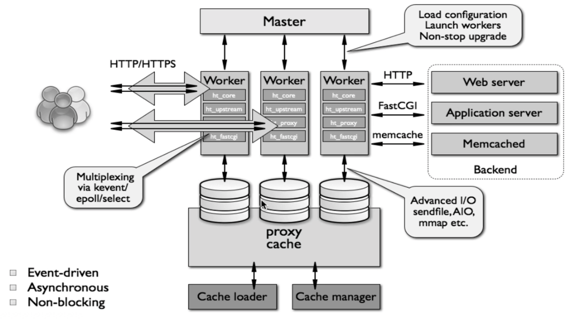


**linux网络数据的收发过程**


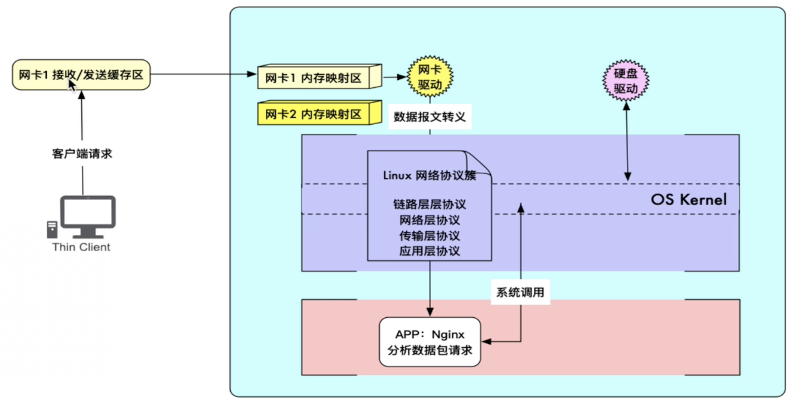


## nginx主配置文件优化


### 设置进程静态优先级

在Linux中调整`NICE`值，即静态优先级 `-20~19` 的大小来实现。NICE数值越小，CPU执行此进程的时间片优先级越高！

```bash
# /etc/nginx/nginx.conf
worker_priority -20;
```

```bash
[root@c93a66f92342 conf.d]# top -u nginx
Tasks:   6 total,   1 running,   5 sleeping,   0 stopped,   0 zombie
%Cpu(s):  0.0 us,  0.5 sy,  0.0 ni, 99.5 id,  0.0 wa,  0.0 hi,  0.0 si,  0.0 st
KiB Mem :  2038340 total,   110024 free,   390076 used,  1538240 buff/cache
KiB Swap:  1048572 total,  1027824 free,    20748 used.  1072372 avail Mem 

  PID USER      PR  NI    VIRT    RES    SHR S  %CPU %MEM     TIME+ COMMAND                                                                                                                                                  
  407 nginx     20   0   46984   3612   2376 S   0.0  0.2   0:00.00 nginx                                                                                                                                                    
  408 nginx     20   0   46984   3612   2376 S   0.0  0.2   0:00.00 nginx    
```


### 日志切割

修改配置文件：${nginx_home}/conf/vhost/www.conf

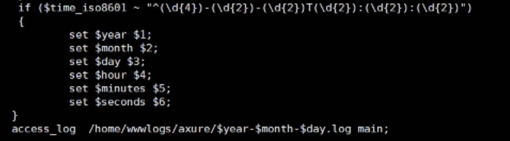


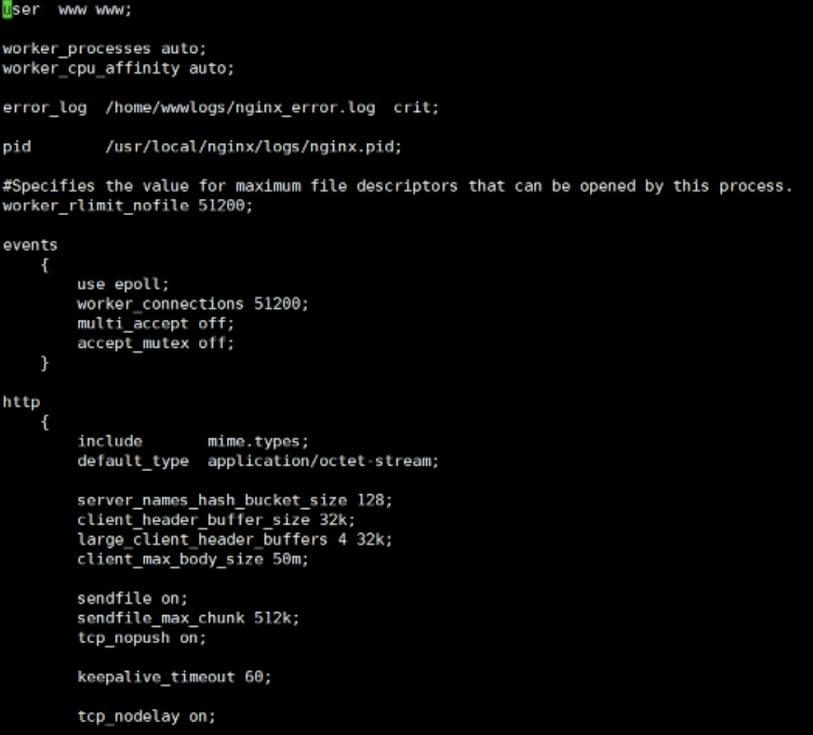

若日志没有生成，可能是目录权限不够，需要：

```bash
chown -R www:www ${log_dir}
```


### 设置worker进程数

```bash
# /etc/nginx/nginx.conf
worker_process auto;
```


# Linux网络IO模型


### 1. 阻塞I/O模型（Blocking I/O Model）

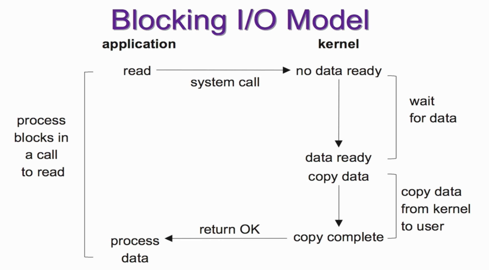

- 等待数据准备就绪（waiting data to be ready）- - **阻塞**
- 将数据从内核拷贝到进程中（copying data from kernal to the process）- - **阻塞**


### 2. 非阻塞I/O（nonblocking IO）

可以设置socket使其变为 non-blocking。就是告诉内核，当所有请求的IO操作无法完成是，不要将进程休眠，而是返回一个错误码 `EWOULDBLOCK`，这样请求就不会阻塞。

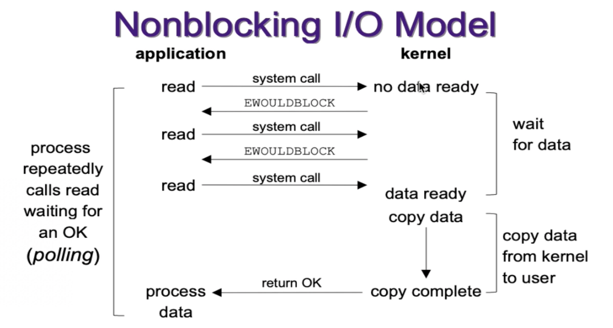

整个IO请求的过程中，虽然用户线程每次发起IO请求后可以立即返回，但是为了等到数据，仍需要不断地轮询、重复请求、消耗了大量的CPU资源。

- 等待数据准备就绪（waiting data to be ready）- - **非阻塞**
- 将数据从内核拷贝到进程中（copying data from kernal to the process）- - **阻塞**

一般很少直接使用这种模型。而是在其他IO模型中使用非阻塞IO这一特性，例如给IO多路复用普通了道路！


### 3. IO多路复用（IO multiplexing）

此模型的代表是：select、poll、epoll，又称事件驱动模型（event driven IO）。

select/poll/epoll的好处就在于单个系统process就可以同时处理多个网络连接的IO。它的基本原理就是这些个function会不断的轮询所负责的所有socket，当某个socket有数据到达了，就通知用户进程。

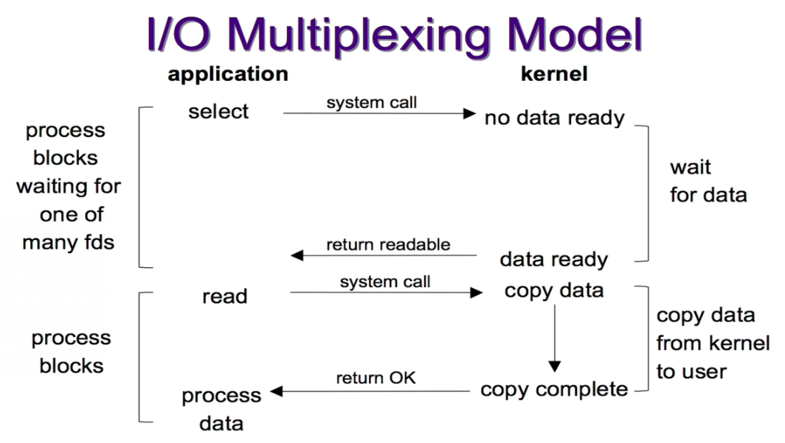

IO多路复用的特点是通过一种机制一个进程能同时等待多个文件描述符，而这些文件描述符（套接字描述符）其中的任意一个进入读就绪状态，select()函数就可以返回。

在处理的连接数不是很多的情况下，使用select/poll/epoll的web server并没有性能优势，可能延迟还更大（因为多了添加监视socket已经调用select函数的额外操作）。select/epoll的优势并不是对于单个连接能处理得更快，而是在于能处理更多的连接！

- 等待数据准备就绪（waiting data to be ready）- - **阻塞**
- 将数据从内核拷贝到进程中（copying data from kernal to the process）- - **阻塞**

| 系统调用             | select                                           | poll                                           | epoll                                                        |
| -------------------- | ------------------------------------------------ | ---------------------------------------------- | ------------------------------------------------------------ |
| 操作方式             | 遍历                                             | 遍历                                           | 回调                                                         |
| 底层实现             | 数组bitmap                                       | 链表                                           | 哈希表                                                       |
| 查询就绪fd时间复杂度 | O(n)                                             | O(n)                                           | O(1)                                                         |
| 最大支持文件描述符   | 一般由最大值限制                                 | 65535                                          | 65535                                                        |
| 工作模式             | LT水平触发                                       | LT水平触发                                     | 支持ET高效模式                                               |
| fd拷贝               | 每次调用select都需要把fd集合从用户态拷贝到内核态 | 每次调用poll都需要把fd集合从用户态拷贝到内核态 | 使用mmap()文件映射进内存来加速与内核空间的消息传递，减少复制开销 |

> 水平触发LT：默认工作模式，即当epoll_wait检测到某描述符事件就绪并通知应用程序，应用程序可以不立即处理该事件；下次调用epoll_wait时，会再次通知此事件。
>
> 边缘触发ET：当epoll_wait检测到某描述符事件就绪并通知应用程序时，应用程序必须立即处理该事件。如果不处理，下次调用epoll_wait时，不会再次通知此事件。即只在状态由未就绪变为就绪时只通知一次。


**mmap代替read调用：**

```c
buf = mmap(diskfd, len);
write(sockfd, buf, len);
```

应用程序调用`mmap()`，磁盘上的数据会通过DMA被拷贝到内核缓存区。接着OS会把这段内核缓存区与应用程序**共享**！应用程序再调用write时，OS直接将内核缓冲区的内容拷贝到socket缓冲区中，这一切都发生在kernal space，最后socket缓冲区再把数据发到网卡去。

缺点：

当map的这个文件被另一个进程截断（truncate）时，write系统调用会因为访问非法地址而被 `SIGBUG` 信号终止！SIGBUS信号默认会杀死你的进程并产生一个coredump。。可使用**文件租借锁**：

```c
// 在mmap文件之前加锁，并且在操作完文件后解锁：
if(fcntl(diskfd, F_SETSIG, RT_SIGNAL_LEASE) == -1) {
    perror("kernel lease set signal");
    return -1;
}
/* l_type can be F_RDLCK F_WRLCK  加锁*/
/* l_type can be  F_UNLCK 解锁*/
if(fcntl(diskfd, F_SETLEASE, l_type)){
    perror("kernel lease set type");
    return -1;
}
```


### 4. 信号IO

略，生产和开发中使用都很少。


### 5. 异步I/O （asynchronous IO）

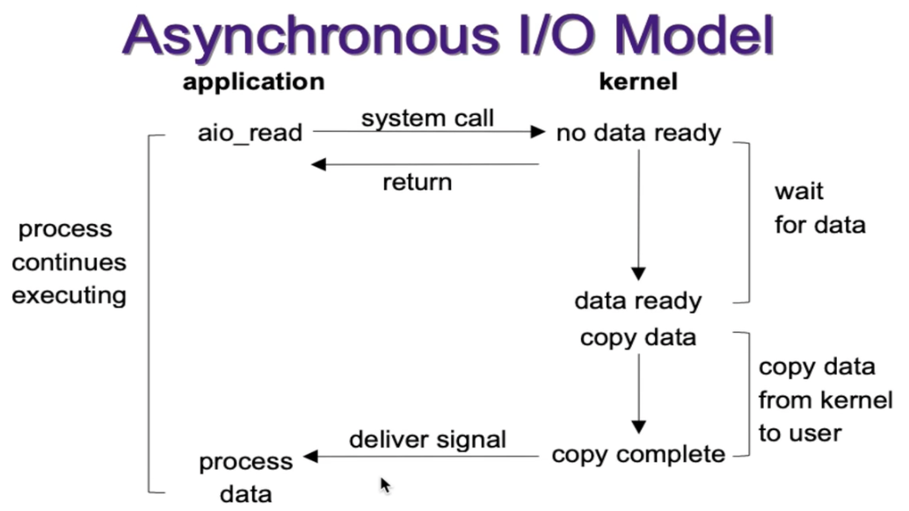

用户进程发起 `aio_read` 调用之后，就可以忙别的事情了。另一方面，kernal会发现一个 `asynchronous read` 之后，首先它会立刻返回，所以不会对用户进程产生任何block。kernal会等待数据准备完成，然后将数据拷贝到用户内存，当这一切都完成之后，kernal会给用户发送一个signal，告诉他read操作完成了。

异步IO模型使用了 `Proactor` 设计模式实现了这一机制。

> Reactor vs Proactor
>
> Reactor：能收了你跟俺说一声。非阻塞同步IO网络模型
> Proactor: 你给我收十个字节，收好了跟俺说一声。异步IO网络模型
>
> 它们都是IO复用下的事件驱动模型，然后就从同步异步这两个点来切入概念。注意关键区别在于何时IO，reactor是关心就绪事件，比如可读了，就通知你，就像epoll_wait 。proactor关心的是完成比如读完了，就通知你。
>
> Linux上没有好的proactor框架，就是因为内核没提供足够的异步支持。后面实现了aio。
> libevent是reactor。boost的asio是proactor。
>
> Linux epoll是reactor。Windows IOCP是proactor。


- 等待数据准备就绪（waiting data to be ready）- - **非阻塞**
- 将数据从内核拷贝到进程中（copying data from kernal to the process）- - **非阻塞**


### I/O模型比较

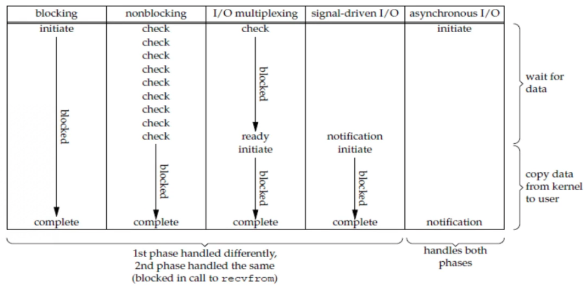

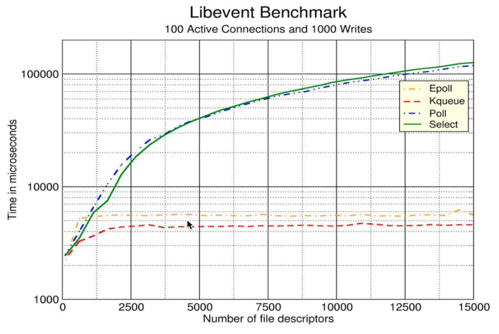

> 其中kqueue是在FreeBSD平台上实现的I/O多路复用模型，和epoll非常类似。


# TCP/IP

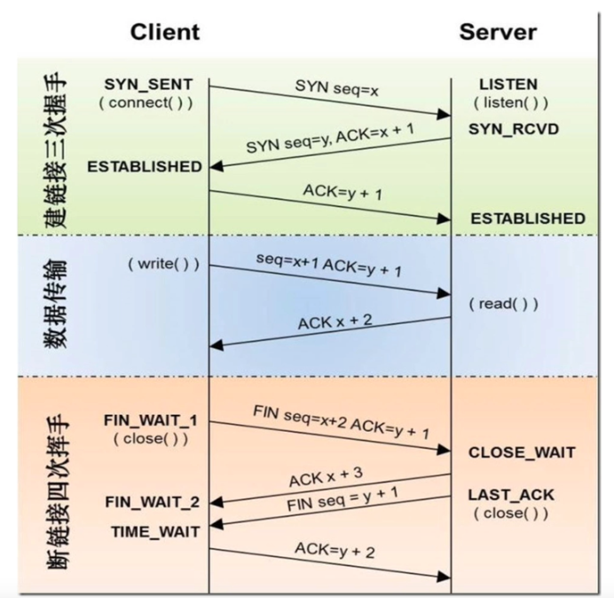


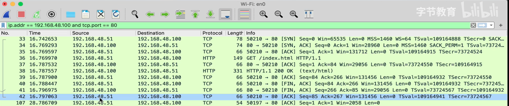


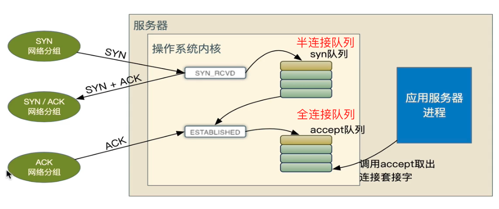

其中，即服务端向客户端返回的`SYN/ACK`尝试测试，在centos上是默认5次（1s+2s+4s+8s+16s=31s）,大概31s时间，可以优化此net.ipv4.tcp_synack_retries参数，防止半连接的flood攻击！

```bash
[root@c93a66f92342 conf.d]# sysctl -a | grep 'net.ipv4.tcp_synack_retries'
sysctl: reading key "net.ipv6.conf.all.stable_secret"
net.ipv4.tcp_synack_retries = 5
[root@c93a66f92342 conf.d]#  cat /proc/sys/net/ipv4/tcp_synack_retries 
5
[root@c93a66f92342 conf.d]#  cat /proc/sys/net/ipv4/tcp_syn_retries 
6
# 修改上面的参数然后重启一个应用服务如sshd，那么此新的内核参数将生效！
```

- **net.core.netdev_max_backlog**: 接收自网卡，但未被内核协议栈处理的报文队列长度
- **net.ipv4.tcp_max_syn_backlog**: `SYN_RCVD` 状态（即半连接）队列长度，默认128

- **backlog**: 全连接队列大小，该队列大小由系统参数和应用参数共同决定。在nginx中，backlog参数在listen参数后面指定。在centos中，默认值是511。取决于：`min(backlog, somaxconn)`，backlog由应用程序传入，somaxconn是一个os级别的系统参数，通过设置`net.core.somaxconn`来调整。
- 全连接队列如果满了，会清空半连接队列，这是一个TCP/IP的设计策略，设计者目的是希望应用能够通过读取全连接队列中的数据而慢慢恢复，而不必再care半连接队列。
- **net.ipv4.ip_local_port_port_range**: 表示主动连接端可以建立的随机端口号范围，默认值是32768~60999
- **net.ipv4.tcp_abort_on_overflow**: 如果`accept`队列即全连接推理额满了之后，此参数将决定如果响应：0表示直接丢弃该ACK，1表示发送`RST`通知`Client`，`Server`端会返回 `connection reset by peer`

> 另一个TCP标志RST：重置当前的连接，无论当前连接在何种状态下（握手、收发、挥手），以避免一些异常情况。

```bash
# 同步时间
ntpdate time1.aliyun.com
# 同步时区
timedatectl set-timezone Asia/Shanghai
# 硬件时钟
hwclock -w

# 建立cron任务
crontab -e
# 分时日月周 每分钟同步下时间
* * * * * ntpdate time1.aliyun.com > /dev/null 2>&1; hwclock -w > /dev/null 2>&1

# centos安装ss工具
yum install iproute                                                                           * 126982               

# 查看TCP监听的统计数据
gzc-pro:scripts apple$ netstat -s | grep 'listen'
netstat: sysctl: net.inet.ip.input_perf_data: No such file or directory
	0 listen queue overflow
	0 SYNs to LISTEN sockets dropped
		MLDv2 listener report: 4064
		MLDv1 listener report: 8
		MLDv1 listener done: 2
```

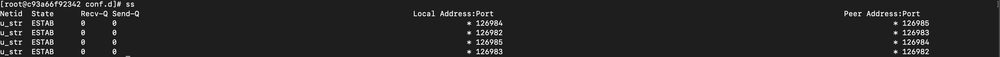


### SYN洪水攻击

攻击客户端在短时间内伪造大量不存在的IP地址，向服务器不断地发送SYN包，服务器回复确认包，并等待client的确认。由于源地址是不存在的，服务器需要不断的重发直至超时，这些伪造的SYN包将长时间占用半连接队列！导致正常的SYN请求被丢弃，目标系统会运行缓慢，严重者会引起网络堵塞甚至系统瘫痪。即用很少的带宽成功地拒绝了几乎所有TCP服务器的服务（DDos）

可以设置 `net.ipv4.tcp_syncookies = 1`来达到减少这种攻击的影响。

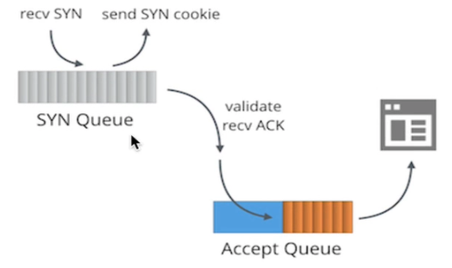


当`net.ipv4.tcp_syncookies = 1`时，SYN队列满了，新的SYN不进入队列，由服务端计算出cookie后再以`SYN+ACK`的方式返回给客户端，正常客户端发送报文时，服务器根据报文中携带的cookie信息重新恢复连接。

但此方法只能应对较小的SYN flood攻击。如果攻击数量报太多，可能需要使用专业的防火墙。

> 如果启用了tcp_syncookies， TCP_FAST_OPEN 功能无法使用。


### 模拟SYN flood攻击

```bash
# 1w个连接 80端口 1.1.1.1的假客户端IP -S表示发送SYN的标志位 --flood洪水 ASAP！
sudo hping3 -c 10000 192.168.48.100 -p 80 -a 1.1.1.1 -S --flood
```

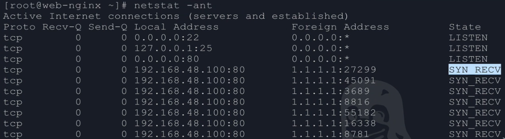


**全连接队列满时：**

- SYN队列的入站SYN数据包将被丢弃
- SYN队列的入站ACK数据包将被丢弃
- TcpExtListenOverflows & TcpExtListenDrops 计数增加


### DDos攻击

分布式拒绝访问，Distributed deny of service

1. 原理
   - 多台不同主机发送假请求到服务端，使服务器处理不过来，导致正常的用户请求无法响应
2. 攻击方式
   - 攻击网络带宽，网络中的待处理包是有上限的。
   - TCP的握手信息连接表的数目是有上限的，Sync Flood攻击
   - web服务就发送很多的恶意的http请求，耗尽目标网站的资源，达到DDOS的目的，也叫CC攻击，挑战黑洞
3. 防御方式
   - 备用网站继续提供服务或发出公告
   - 看有无相同特征，如IP、User-Agent，然后进行拦截，可以使用：
     - 硬件防火墙，软件前面加上上，效果最好，但价格最贵
     - 软件防火墙，系统一般自带
     - web服务器软件，例如nginx
   - 如果没有特征，只能带宽扩容，较低ddos的攻击危害
   - 使用CDN，使得用户可以就近访问到CDN的资源，主站减少压力，所有请求先到CDN，如果CDN没有，从CDN上访问主站，但注意不要泄露主站的地址，但CDN只能放置静态资源。


### CPU绑定提供缓存命中率

CPU的L1和L2缓存是单插槽上单核CPU独享，L3是单插槽上多核CPU共享：

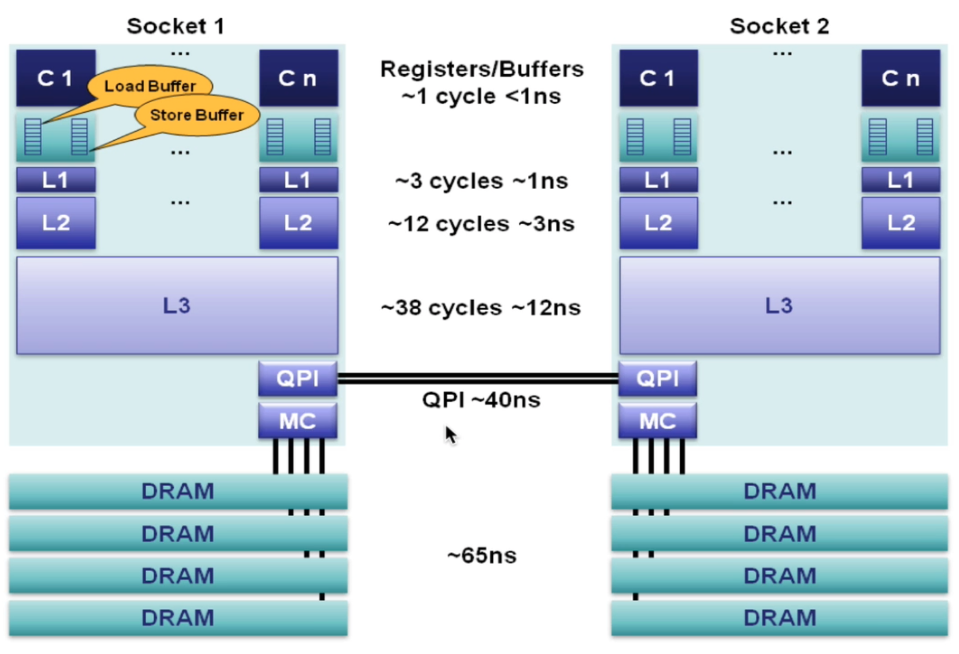

为了让worker能够更好的使用CPU的高速缓存，建议将worker与CPU核心进行一对一绑定：

```bash
# /etc/nginx/nginx.conf
worker_process 4;
worker_cpu_affinity	0001 0010 0100 1000; # 用掩码一对一绑定！
```

```bash
# 查看CPU的三级缓存大小
[root@c93a66f92342 conf.d]# cat /sys/devices/system/cpu/cpu0/cache/index1/size 
32K
[root@c93a66f92342 conf.d]# cat /sys/devices/system/cpu/cpu0/cache/index2/size 
256K
[root@c93a66f92342 conf.d]# cat /sys/devices/system/cpu/cpu0/cache/index3/size 
12288K
```


### reuseport配置

reuseport配置后，实现了worker进程的负载均衡调度，效果非常好：

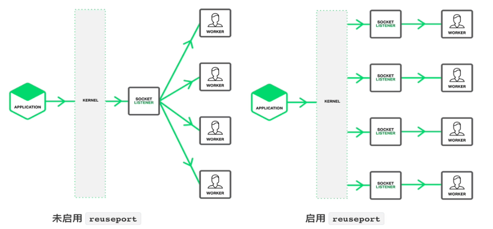


### 单个worker进程允许同时打开的连接数

```bash
# /etc/nginx/nginx.conf
worker_connections 51200;
```


### 所有woker进程允许同时打开的文件数

此值默认值未设置，将会受到系统级、用户级限制

```bash
# /etc/nginx/nginx.conf
worker_rlimit_nofile number;
```


### 使用epoll事件模型

linux系统中nginx编译后默认就是使用epoll模型：

```bash
# /etc/nginx/nginx.conf
events {
	use epoll;
	...
}

```


### 优化读取速度之sendfile

当然升级高效的SSD效果最明显！sendfile语法：

```bash
Syntax: sendfile on | off ;
Default: sendfile off;
Context: http, server, location, if in location
```

```c
#include<sys/sendfile.h>
ssize_t sendfile(int out_fd, int in_fd, off_t *offset, size_t count);
```

系统调用`sendfile()`在代表输入文件的描述符`in_fd`和代表输出文件的描述符`out_fd`之间传送文件内容（字节）。描述符`out_fd`必须指向一个套接字，而`in_fd`指向的文件必须是可以`mmap`的。这些局限限制了`sendfile`的使用，使`sendfile`只能将数据从文件传递到套接字上，反之则不行。


> DMA 直接内存存取（Direct Memory Access），是一种允许外围设备（硬件子系统）直接访问系统主内存的机制。也就是说，基于DMA访问方式，系统主内存于硬盘或网卡之间的数据传输可以绕开CPU的全程调度。目前大多数的硬件设备，包括硬盘控制器、网卡、显卡以及声卡等都支持DMA技术。
>
> 这个数据传输操作在一个DMA控制器的控制下进行的。CPU除了在数据传输开始和结束时做一点处理外（开始和结束时候要做中断处理），在传输过程中，CPU可以继续进行其他的工作！

用户程序通过sendfile系统调用，数据可以直接在内核空间内部进行I/O传输，从而省去了数据在用户空间和内核空间之间的来回拷贝！

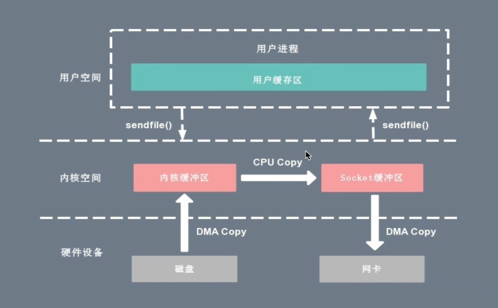

基于sendfile系统调用的零拷贝方式，整个过程会发生2次上下文切换，1次CPU拷贝和2次DMA拷贝。

但是此模式下用户程序不能对数据进行修改，比如对文件进行压缩后发送，而只是完成了一次数据传输。也只对静态资源处理有效。


**DMA gather方式**

如果硬件支持 `DMA Gather`操作，sendfile 拷贝方式不再从内核缓冲区的数据拷贝到socket缓冲区，而仅仅是缓冲区文件描述符和数据长度的拷贝，DMA引擎直接利用gather操作将也缓存中数据打包发送到网络中即可！

> DMA gather 将内核空间（kernal space）的读缓冲区（read buffer）中对应的数据描述信息（内存地址、地址偏移量）记录到相应的网络缓冲区（socket buffer）中，由DMA根据内存地址、地址偏移量将数据批量地从读缓冲区（read buffer）拷贝到网卡设备中，这样就省去了内核空间中仅剩的一次CPU拷贝操作

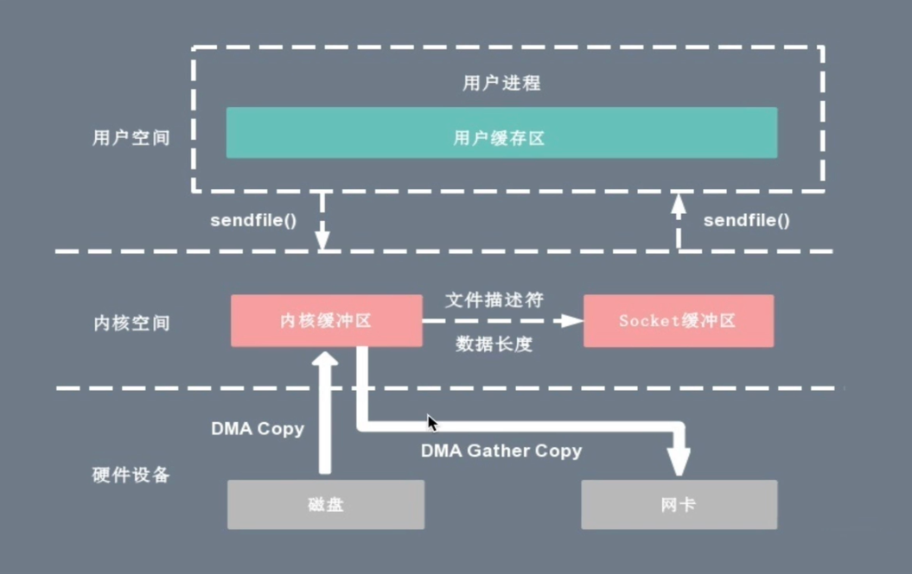

 

### 优化读写速度值direct I/O

在nginx中也是支持 `direct I/O`模式，相关参数为 directio，应用常见于读取大文件场景：

```bash
Syntax: directio size | off;
Default: directio off;
Context: http, server, location
```

凡是通过直接I/O方式进行数据传输，数据均直接在用户地址空间的缓冲区和磁盘之间直接进行传输，完全不需要页缓存的支持。操作系统层提供的缓存往往会使应用程序在读写数据的时候获得更好的性能！

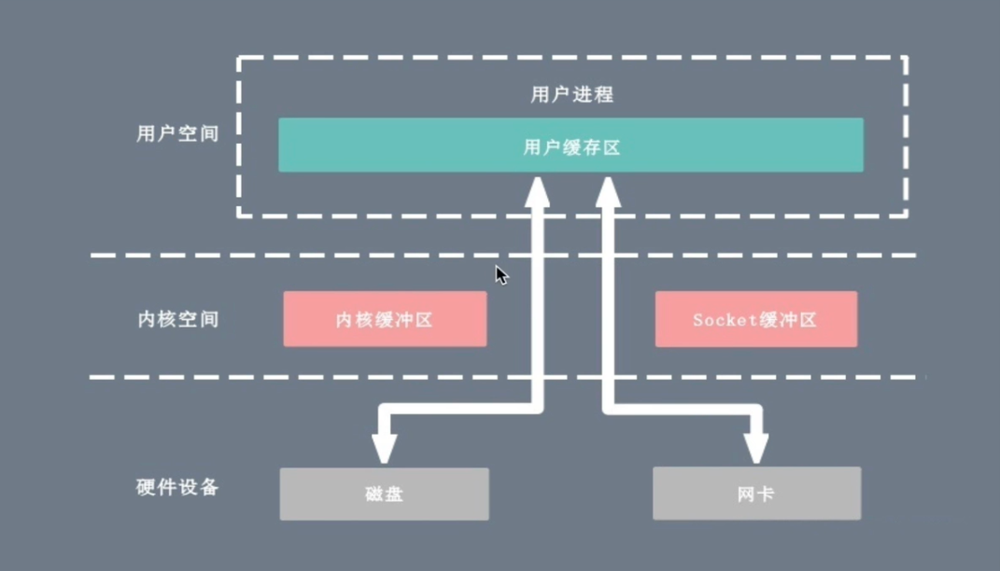


###  优化读写速度之异步I/O

```bash
Syntax: aio on | off | threads[=pool];
Default: aio off;
Context: http, server, location
```

**小结：**

- 在nginx中，我们会把directio与异步I/O即aio一起使用，以免造成数据读取阻塞。
- 在nginx中我们同样会将sendfile与异步I/O一起使用，aio会为sendfile提前预加载数据。
- 在nginx中在使用directio时会自动禁用sendfile

使用示例：

```bash
location /video/ {
	sendfile 	on;
	aio				on;
	directio	8m;
}
```

表示当文件大小超过8M时，启动AIO与Direct I/O，此时的sendfile会自动禁用；当文件小于8M时，AIO与sendfile一起使用，此时Direct I/O不生效。


#### 缓存的命中

术语Cache Line：缓存基本上来说就是把后面的数据加载到离自己近的地方，对于CPU来说，它是不会一个字节一个字节的加载的，因为这非常没有效率，一般来说都是要一块一块的加载的，对于这样的一块一块的数据单位，术语叫“Cache Line”，一般来说，一个主流的CPU的Cache Line 是 64 Bytes（也有的CPU用32Bytes和128Bytes），64Bytes也就是16个32位的整型，这就是CPU从内存中捞数据上来的最小数据单位。

比如：Cache Line是最小单位（64Bytes），所以先把Cache分布多个Cache Line，比如：一级缓存L1有32KB，那么，32KB/64B = 512 个 Cache Line。


**示例1**

```c
const int LEN = 64*1024*1024;
int *arr = new int[LEN];

for (int i = 0; i < LEN; i += 2) arr[i] *= i;

for (int i = 0; i < LEN; i += 8) arr[i] *= i;
```

按我们的想法来看，第二个循环要比第一个循环少4倍的计算量，其应该也是要快4倍的。但实际跑下来并不是，**在我的机器上，第一个循环需要127毫秒，第二个循环则需要121毫秒，相差无几**。这里最主要的原因就是 Cache Line，因为CPU会以一个Cache Line 64Bytes最小时单位加载，也就是16个32bits的整型，所以，无论你步长是2还是8，都差不多。而后面的乘法其实是不耗CPU时间的。


**示例2**

```c
const int row = 1024;
const int col = 512
int matrix[row][col];

//逐行遍历
int sum_row=0;
for(int _r=0; _r<row; _r++) {
    for(int _c=0; _c<col; _c++){
        sum_row += matrix[_r][_c];
    }
}

//逐列遍历
int sum_col=0;
for(int _c=0; _c<col; _c++) {
    for(int _r=0; _r<row; _r++){
        sum_col += matrix[_r][_c];
    }
}
```

- 逐行遍历：0.081ms
- 逐列遍历：1.069ms

执行时间有十几倍的差距。其中的原因，就是逐列遍历对于CPU Cache 的运作方式并不友好，所以，付出巨大的代价。


#### 缓存的一致性

对于主流的CPU来说，缓存的写操作基本上是两种策略（参看本站《[缓存更新的套路](https://coolshell.cn/articles/17416.html)》），

- 一种是Write Back，写操作只要在cache上，然后再flush到内存上。
- 一种是Write Through，写操作同时写到cache和内存上。

为了提高写的性能，一般来说，主流的CPU（如：Intel Core i7/i9）采用的是Write Back的策略，因为直接写内存实在是太慢了。


## 核心模块

- daemon参数配置

  配置daemon是否以后台运行。默认&通常是on状态。但docker中运行时，需要配置 daemon off，让nginx关闭后台运行！

- error_log配置

  ```bash
  Syntax: error_log file [level];
  Default: error_log logs/error.log error;
  Context: main, http, mail, stream, server, location
  ```

  举例：

  ```bash
  # 输出到另一台主机上 支持udp模式 也是调优的一种手段
  error_log	syslog:192.168.1.122 debug;
  
  # 输出到内存中 支持rotate 一般用于在线调试 共32M空间 需要源码编译 使用gdb导出来 麻烦的！
  erro_log memory:32m info
  ```

- include

  加载配置文件

  ```conf
  include /usr/share/nginx/modules/*.conf
  ```

  

- load_module

  一般nginx是通过加载*.conf文件，但其实 xx.conf中就是使用了load_module 来指定加载的具体的 so 模块

  ```conf
  load_module modules/ngx_stream.so
  ```


## 全站http跳转https

对 `http://www.a.com` 的访问全部跳转至：`https://www.a.com`，且请求URI和参数 `$query_string` 要保留下来

```bash
server {
	listen			80;
	server_name	www.a.com api.a.com;
	rewrite			^ https://www.a.com$request_uri? permanent; # 做法1：因为有正则匹配的步骤 性能有损耗
	return			301	https://$host$request_uri;		# 做法2：直接返回，性能好，官网推荐做法
}

server {
	listen								443	ssl;
	server_name						www.a.com;
	ssl_certificate				"/data/nginx/ssl/nginx.crt";
	ssl_certificate_key		"/data/nginx/ssl/nginx.key";
	root									/data/nginx/a;
	charset								utf-8;
	location	/ {
		index		index.html;
	}
}
```

但此方法性能最差。能不用if的地方都别用if。

```bash
gzc-pro:log apple$ curl -k -I https://www.baidu.com
HTTP/1.1 200 OK
Accept-Ranges: bytes
Cache-Control: private, no-cache, no-store, proxy-revalidate, no-transform
Connection: keep-alive
Content-Length: 277
Content-Type: text/html
Date: Thu, 18 Feb 2021 10:13:44 GMT
Etag: "575e1f7c-115"
Last-Modified: Mon, 13 Jun 2016 02:50:36 GMT
Pragma: no-cache
Server: bfe/1.0.8.18
```


## Web缓存基础


### 什么是Web缓存

Web缓存指的是从发起请求的客户端，到执行功能的web服务器之间的，用来保存服务器输出结果的副本，并提供给发起请求的客户使用，这样的一些缓存的统称。


### Web缓存的类型

1：客户端浏览器缓存

2：CDN(Content Delivery Networks)

3：反向代理服务器缓存 - nginx

4：Web服务器端的缓存，通常是应用程序来实现的动态页面缓存


# 内网DNS解析

Linux上使用bind服务

```bash
# 安装bind安装包
yum install bind-chroot -y
# 关闭防火墙
service iptables stop
```

其配置文件有：

```bash
/etc/named.conf
/etc/named.rfc1912.zones
/etc/named/
```

DNS的正向解释和反向解释：

正向解释：


反向解释：


```conf
// named.conf
options {
	listen-on port 53 { any; };
	listen-on-v6 port 53 { ::1; };
	directory		"/var/named";
	dump-file		"/var/named/data/cache_dump.db"
	allow-query	{ any;};
}

logging {
	channel default_debug {
		file			"data/named.run";
		severity	dynamic;
	}
}
```


## 参考资料

- [Linux 中的零拷贝技术](https://blog.csdn.net/hzrandd/article/details/51025341)
- [Nginx 从入门到百万并发实战](https://www.bilibili.com/video/BV1uT4y137vq?p=11&spm_id_from=pageDriver)
- [与程序员相关的CPU缓存知识](https://coolshell.cn/articles/20793.html)

- [Web缓存基础](https://www.cnblogs.com/kuexun/p/web_cache_1.html)

- [P2.Linux服务器项目实训-DNS服务器配置（bind的正向解释和反向解释）](https://www.bilibili.com/video/BV1JK411p7uz?t=1231)

