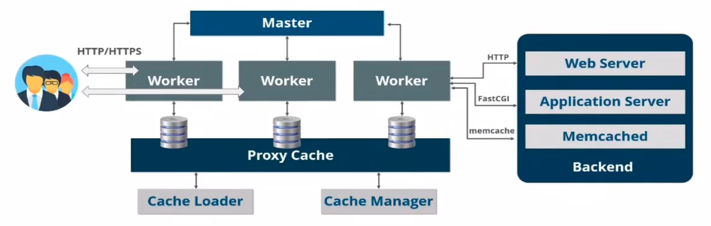

# nginx

nginx是异步框架的web服务器，也可以用作反向代理、负载平衡以及作为缓存服务器。nginx是目前互联网公司web服务器的主流计数，用于处理高并发甚至海量并发的网站数据。分为开源的社区版和闭源的商业版，**Tengine**就是淘宝在nginx基础上进行二次开发，以获取更高的稳定性和并发能力，经历了双十一的技术洗礼，足以证明其稳定性和高性能。


## 主要特性

- **高并发、高性能**：单台普通的服务器可以轻松处理上万并发连接（最多建议3w）

- **模块化设计，非常好的扩展性**：通过加载、卸载某个模块以实现相应的功能，

- **热部署、热更新**：支持配置文件的热更新，版本热升级、动态加载模块、日志热更换

  > reload操作的执行流程：nginx会新创建一个新的nginx进程，使用了新的配置文件；老的nginx停止listen服务，且处理完所有当前的请求之后，再graceful stop。

- **内存低消耗：据统计**，1w个keep-alive连接模式下的非活动连接，仅消耗内存2.5M

  > 非活动连接: 建立了连接，open状态，但此时并没有发生请求的发送和回应

- **配置、维护简单**：nginx的配置非常简单，运维非常友好


## 基本功能

- **web服务器**: 最基本的功能，也是非常重要的功能之一
- **反向代理服务器**：http协议的反向代理服务器，是生产环境中最常用的功能
- **FastCGI(php)、uWSGI(python) 代理服务器**：此时请求不是http协议，是跟后端服务相关的协议
- **TCP/UDP代理服务器**：也即作为四层调度器

- **Mail邮件代理服务器**：几乎不怎么使用了现在。


## 基础架构

如下图，`nginx`为`master/workers`架构，一个`master`主进程，负责管理和维护多个`worker`进程，真正接收并处理用户请求的其实是`worker`进程，`master`不对用户请求进行处理。即`master`主进程负责分析并加载配置文件，管理`worker`进程，接收用户信号传递以及平滑升级等功能。

`nginx`具有强大的缓存功能，其中`cache loader`负责载入缓存对象，`cache manager`负责管理缓存对象。





## mac下安装

```bash
# 常规操作
brew update
# 检查要安装的软件是否存在
brew search nginx
# 查看nginx的相关信息
brew info nginx
# 安装nginx
brew install nginx
# 查看nginx安装目录
open /usr/local/etc/nginx
# 查看nginx可执行文件目录
open  
# 启动nginx，没有报错即为启动成功
nginx
```

验证nginx是否启动成功：http://localhost:8080

nginx配置文件：/usr/local/etc/nginx/nginx.conf

nginx默认网站根目录：/usr/local/var/www

默认的索引文件为：index.html  index.htm


## centos下安装

```bash
[root@c93a66f92342 /]# rpm -ql nginx
/etc/logrotate.d/nginx
/etc/nginx
/etc/nginx/conf.d
/etc/nginx/conf.d/default.conf
/etc/nginx/fastcgi_params
/etc/nginx/koi-utf
/etc/nginx/koi-win
/etc/nginx/mime.types
/etc/nginx/modules
/etc/nginx/nginx.conf
/etc/nginx/scgi_params
/etc/nginx/uwsgi_params
/etc/nginx/win-utf
/etc/sysconfig/nginx
/etc/sysconfig/nginx-debug
/usr/lib/systemd/system/nginx-debug.service
/usr/lib/systemd/system/nginx.service
/usr/lib64/nginx
/usr/lib64/nginx/modules
/usr/libexec/initscripts/legacy-actions/nginx
/usr/libexec/initscripts/legacy-actions/nginx/check-reload
/usr/libexec/initscripts/legacy-actions/nginx/upgrade
/usr/sbin/nginx
/usr/sbin/nginx-debug
/usr/share/doc/nginx-1.18.0
/usr/share/doc/nginx-1.18.0/COPYRIGHT
/usr/share/man/man8/nginx.8.gz
/usr/share/nginx
/usr/share/nginx/html
/usr/share/nginx/html/50x.html
/usr/share/nginx/html/index.html
/var/cache/nginx
/var/log/nginx

[root@c93a66f92342 ~]# netstat -nlpt
Active Internet connections (only servers)
Proto Recv-Q Send-Q Local Address           Foreign Address         State       PID/Program name    
tcp        0      0 0.0.0.0:80              0.0.0.0:*               LISTEN      349/nginx: master p 
# Recv-Q字段表示全连接队列中正在使用的队列大小
# Send-Q表示backlog设置的大小

[root@c93a66f92342 ~]# nginx -V
nginx version: nginx/1.18.0
built by gcc 4.8.5 20150623 (Red Hat 4.8.5-39) (GCC) 
built with OpenSSL 1.0.2k-fips  26 Jan 2017
TLS SNI support enabled
configure arguments: --prefix=/etc/nginx --sbin-path=/usr/sbin/nginx --modules-path=/usr/lib64/nginx/modules --conf-path=/etc/nginx/nginx.conf --error-log-path=/var/log/nginx/error.log --http-log-path=/var/log/nginx/access.log --pid-path=/var/run/nginx.pid --lock-path=/var/run/nginx.lock --http-client-body-temp-path=/var/cache/nginx/client_temp --http-proxy-temp-path=/var/cache/nginx/proxy_temp --http-fastcgi-temp-path=/var/cache/nginx/fastcgi_temp --http-uwsgi-temp-path=/var/cache/nginx/uwsgi_temp --http-scgi-temp-path=/var/cache/nginx/scgi_temp --user=nginx --group=nginx --with-compat --with-file-aio --with-threads --with-http_addition_module --with-http_auth_request_module --with-http_dav_module --with-http_flv_module --with-http_gunzip_module --with-http_gzip_static_module --with-http_mp4_module --with-http_random_index_module --with-http_realip_module --with-http_secure_link_module --with-http_slice_module --with-http_ssl_module --with-http_stub_status_module --with-http_sub_module --with-http_v2_module --with-mail --with-mail_ssl_module --with-stream --with-stream_realip_module --with-stream_ssl_module --with-stream_ssl_preread_module --with-cc-opt='-O2 -g -pipe -Wall -Wp,-D_FORTIFY_SOURCE=2 -fexceptions -fstack-protector-strong --param=ssp-buffer-size=4 -grecord-gcc-switches -m64 -mtune=generic -fPIC' --with-ld-opt='-Wl,-z,relro -Wl,-z,now -pie'

```

 

## nginx的源码安装和重新编译

官网下载解压后：

```bash
# 重新编译nginx
./configure --prefix=/usr/local/nginx --with-http_stub_status_module
make
sudo make install

  # 输出nginx的相关目录：
  nginx path prefix: "/usr/local/nginx"
  nginx binary file: "/usr/local/nginx/sbin/nginx"
  nginx modules path: "/usr/local/nginx/modules"
  nginx configuration prefix: "/usr/local/nginx/conf"
  nginx configuration file: "/usr/local/nginx/conf/nginx.conf"
  nginx pid file: "/usr/local/nginx/logs/nginx.pid"
  nginx error log file: "/usr/local/nginx/logs/error.log"
  nginx http access log file: "/usr/local/nginx/logs/access.log"
  nginx http client request body temporary files: "client_body_temp"
  nginx http proxy temporary files: "proxy_temp"
  nginx http fastcgi temporary files: "fastcgi_temp"
  nginx http uwsgi temporary files: "uwsgi_temp"
  nginx http scgi temporary files: "scgi_temp"
  
# 启动
sudo /usr/local/nginx/sbin/nginx 

./nginx -V #查询版本信息

suod vim /usr/local/nginx/conf/nginx.conf
        # 增加配置开启状态查询 才能查询到指标数据
        location /nginx-status {
            stub_status on; 
            access_log off;
        }   

```

安装包1M左右，C语言编写，5w并发。

支持的负载均衡方式：轮询、权重、IP hash、动静分离（静态资源和非静态需要后台做业务处理的）


## 配置文件

```bash
# cat /etc/nginx/nginx.conf  

user  nginx;
worker_processes  auto;

error_log  /var/log/nginx/error.log warn;
pid        /var/run/nginx.pid;


events {
    worker_connections  1024;
}


http {
    include       /etc/nginx/mime.types;
    default_type  application/octet-stream;

    log_format  main  '$remote_addr - $remote_user [$time_local] "$request" '
                      '$status $body_bytes_sent "$http_referer" '
                      '"$http_user_agent" "$http_x_forwarded_for"';

    access_log  /var/log/nginx/access.log  main;

    sendfile        on;
    #tcp_nopush     on;

    keepalive_timeout  65;

    #gzip  on;

    include /etc/nginx/conf.d/*.conf;
}
```


### main主配置

#### 监听端口

root用户可以监听所有端口，普通用户只能监听1024以上的端口，nginx的80端口是master进程监听的root用户启动的。worker进程是nginx用户启动的。

```bash
[root@c93a66f92342 ~]# ps -ef|grep nginx
root       349     1  0 12:51 ?        00:00:00 nginx: master process nginx
nginx      350   349  0 12:51 ?        00:00:00 nginx: worker process
```


#### worker进程数

`worker_processes`配置为auto，即为CPU的核数。可通过指令 `lscpu`查看cpu信息。


#### pid

进程ID是为了运维此进程操作时使用的！

例如执行 `nginx -s reload` 时，就会从 `/var/run/nginx.pid中`读取pid，然后做reload操作。

`systemctl`也是读取文件的pid，来对进程做stop/restart操作的。

如果pid文件访问失败，可能是pid文件不存在或权限不对


#### events{...}

用于定义事件驱动相关配置，该配置与连接的处理密切相关，其中：

```bash
use method; # 定义nginx使用哪种事件驱动类型，在linux中性能最好的是epoll模型
accept_mutex on|off; # 处理新连接的方法，on是指各个worker进程轮流处理，off则会通知所有worker，但只有一个worker进程获得处理连接的权限（惊群现象）。在centos7中将使用 reuseport 会有更好性能。
```


### http配置

http配置段中，可以设置多个server配置，该server就是用来配置虚拟主机的，可以基于IP地址，也可以基于port，生产中更多基于域名的方式来配置虚拟主机。在server配置段中还可以配置多个location字段，该字段用来配置虚拟主机不同uri的响应方式

```bash
# /etc/nginx/conf.d/ip.conf
server {
	listen	127.0.0.1;	# 监听端口
	root	/data/nginx/ip; # web服务根目录
	index	index.html;	
}

# nginx -s reload

# curl http://localhost/
```


**linux网络数据的收发过程**


## Linux网络IO模型


### 1. 阻塞I/O模型（Blocking I/O Model）


- 等待数据准备就绪（waiting data to be ready）- - **阻塞**
- 将数据从内核拷贝到进程中（copying data from kernal to the process）- - **阻塞**


### 2. 非阻塞I/O（nonblocking IO）

可以设置socket使其变为 non-blocking。就是告诉内核，当所有请求的IO操作无法完成是，不要将进程休眠，而是返回一个错误码 `EWOULDBLOCK`，这样请求就不会阻塞。


整个IO请求的过程中，虽然用户线程每次发起IO请求后可以立即返回，但是为了等到数据，仍需要不断地轮询、重复请求、消耗了大量的CPU资源。

- 等待数据准备就绪（waiting data to be ready）- - **非阻塞**
- 将数据从内核拷贝到进程中（copying data from kernal to the process）- - **阻塞**

一般很少直接使用这种模型。而是在其他IO模型中使用非阻塞IO这一特性，例如给IO多路复用普通了道路！


### 3. IO多路复用（IO multiplexing）

此模型的代表是：select、poll、epoll，又称事件驱动模型（event driven IO）。

select/poll/epoll的好处就在于单个系统process就可以同时处理多个网络连接的IO。它的基本原理就是这些个function会不断的轮询所负责的所有socket，当某个socket有数据到达了，就通知用户进程。


IO多路复用的特点是通过一种机制一个进程能同时等待多个文件描述符，而这些文件描述符（套接字描述符）其中的任意一个进入读就绪状态，select()函数就可以返回。

在处理的连接数不是很多的情况下，使用select/poll/epoll的web server并没有性能优势，可能延迟还更大（因为多了添加监视socket已经调用select函数的额外操作）。select/epoll的优势并不是对于单个连接能处理得更快，而是在于能处理更多的连接！

- 等待数据准备就绪（waiting data to be ready）- - **阻塞**
- 将数据从内核拷贝到进程中（copying data from kernal to the process）- - **阻塞**

| 系统调用             | select                                           | poll                                           | epoll                                                        |
| -------------------- | ------------------------------------------------ | ---------------------------------------------- | ------------------------------------------------------------ |
| 操作方式             | 遍历                                             | 遍历                                           | 回调                                                         |
| 底层实现             | 数组bitmap                                       | 链表                                           | 哈希表                                                       |
| 查询就绪fd时间复杂度 | O(n)                                             | O(n)                                           | O(1)                                                         |
| 最大支持文件描述符   | 一般由最大值限制                                 | 65535                                          | 65535                                                        |
| 工作模式             | LT水平触发                                       | LT水平触发                                     | 支持ET高效模式                                               |
| fd拷贝               | 每次调用select都需要把fd集合从用户态拷贝到内核态 | 每次调用poll都需要把fd集合从用户态拷贝到内核态 | 使用mmap()文件映射进内存来加速与内核空间的消息传递，减少复制开销 |

> 水平触发LT：默认工作模式，即当epoll_wait检测到某描述符事件就绪并通知应用程序，应用程序可以不立即处理该事件；下次调用epoll_wait时，会在册通知此事件
>
> 边缘触发ET：当epoll_wait检测到某描述符事件就绪并通知应用程序时，应用程序必须立即处理该事件。如果不处理，下次调用epoll_wait时，不会再次通知此事件。即只在状态由未就绪变为就绪时只通知一次。


### 4. 信号IO

略，生产和开发中使用都很少。


### 5. 异步I/O （asynchronous IO）


用户进程发起 `aio_read` 调用之后，就可以忙别的事情了。另一方面，kernal会发现一个 `asynchronous read` 之后，首先它会立刻返回，所以不会对用户进程产生任何block。kernal会等待数据准备完成，然后将数据拷贝到用户内存，当这一切都完成之后，kernal会给用户发送一个signal，告诉他read操作完成了。

异步IO模型使用了 `Proactor` 设计模式实现了这一机制。

> Reactor vs Proactor
>
> Reactor：能收了你跟俺说一声。非阻塞同步IO网络模型
> Proactor: 你给我收十个字节，收好了跟俺说一声。异步IO网络模型
>
> 它们都是IO复用下的事件驱动模型，然后就从同步异步这两个点来切入概念。注意关键区别在于何时IO，reactor是关心就绪事件，比如可读了，就通知你，就像epoll_wait 。proactor关心的是完成比如读完了，就通知你。
>
> Linux上没有好的proactor框架，就是因为内核没提供足够的异步支持。后面实现了aio。
> libevent是reactor。boost的asio是proactor。
>
> Linux epoll是reactor。Windows IOCP是proactor。


- 等待数据准备就绪（waiting data to be ready）- - **非阻塞**
- 将数据从内核拷贝到进程中（copying data from kernal to the process）- - **非阻塞**


### I/O模型比较


> 其中kqueue是在FreeBSD平台上实现的I/O多路复用模型，和epoll非常类似。


## TCP/IP


其中，即服务端向客户端返回的`SYN/ACK`尝试测试，在centos上是默认5次（1s+2s+4s+8s+16s=31s）,大概31s时间，可以优化此net.ipv4.tcp_synack_retries参数，防止半连接的flood攻击！

```bash
[root@c93a66f92342 conf.d]# sysctl -a | grep 'net.ipv4.tcp_synack_retries'
sysctl: reading key "net.ipv6.conf.all.stable_secret"
net.ipv4.tcp_synack_retries = 5
[root@c93a66f92342 conf.d]#  cat /proc/sys/net/ipv4/tcp_synack_retries 
5
[root@c93a66f92342 conf.d]#  cat /proc/sys/net/ipv4/tcp_syn_retries 
6
# 修改上面的参数然后重启一个应用服务如sshd，那么此新的内核参数将生效！
```

- **net.core.netdev_max_backlog**: 接收自网卡，但未被内核协议栈处理的报文队列长度
- **net.ipv4.tcp_max_syn_backlog**: `SYN_RCVD` 状态（即半连接）队列长度，默认128

- **backlog**: 全连接队列大小，该队列大小由系统参数和应用参数共同决定。在nginx中，backlog参数在listen参数后面指定。在centos中，默认值是511。取决于：`min(backlog, somaxconn)`，backlog由应用程序传入，somaxconn是一个os级别的系统参数，通过设置`net.core.somaxconn`来调整。
- 全连接队列如果满了，会清空半连接队列，这是一个TCP/IP的设计策略，设计者目的是希望应用能够通过读取全连接队列中的数据而慢慢恢复，而不必再care半连接队列。
- **net.ipv4.ip_local_port_port_range**: 表示主动连接端可以建立的随机端口号范围，默认值是32768~60999
- **net.ipv4.tcp_abort_on_overflow**: 如果`accept`队列即全连接推理额满了之后，此参数将决定如果响应：0表示直接丢弃该ACK，1表示发送`RST`通知`Client`，`Server`端会返回 `connection reset by peer`

> 另一个TCP标志RST：重置当前的连接，无论当前连接在何种状态下（握手、收发、挥手），以避免一些异常情况。

```bash
# 同步时间
ntpdate time1.aliyun.com
# 同步时区
timedatectl set-timezone Asia/Shanghai
# 硬件时钟
hwclock -w

# 建立cron任务
crontab -e
# 分时日月周 每分钟同步下时间
* * * * * ntpdate time1.aliyun.com > /dev/null 2>&1; hwclock -w > /dev/null 2>&1

# centos安装ss工具
yum install iproute                                                                           * 126982               

# 查看TCP监听的统计数据
gzc-pro:scripts apple$ netstat -s | grep 'listen'
netstat: sysctl: net.inet.ip.input_perf_data: No such file or directory
	0 listen queue overflow
	0 SYNs to LISTEN sockets dropped
		MLDv2 listener report: 4064
		MLDv1 listener report: 8
		MLDv1 listener done: 2
```


### SYN洪水攻击

攻击客户端在短时间内伪造大量不存在的IP地址，向服务器不断地发送SYN包，服务器回复确认包，并等待client的确认。由于源地址是不存在的，服务器需要不断的重发直至超时，这些伪造的SYN包将长时间占用半连接队列！导致正常的SYN请求被丢弃，目标系统会运行缓慢，严重者会引起网络堵塞甚至系统瘫痪。即用很少的带宽成功地拒绝了几乎所有TCP服务器的服务（DDos）

可以设置 `net.ipv4.tcp_syncookies = 1`来达到减少这种攻击的影响。


当`net.ipv4.tcp_syncookies = 1`时，SYN队列满了，新的SYN不进入队列，由服务端计算出cookie后再以`SYN+ACK`的方式返回给客户端，正常客户端发送报文时，服务器根据报文中携带的cookie信息重新恢复连接。

但此方法只能应对较小的SYN flood攻击。如果攻击数量报太多，可能需要使用专业的防火墙。

> 如果启用了tcp_syncookies， TCP_FAST_OPEN 功能无法使用。


### 模拟SYN flood攻击

```bash
# 1w个连接 80端口 1.1.1.1的假客户端IP -S表示发送SYN的标志位 --flood洪水 ASAP！
sudo hping3 -c 10000 192.168.48.100 -p 80 -a 1.1.1.1 -S --flood
```


**全连接队列满时：**

- SYN队列的入站SYN数据包将被丢弃
- SYN队列的入站ACK数据包将被丢弃
- TcpExtListenOverflows & TcpExtListenDrops 计数增加


## DDos攻击

分布式拒绝访问，Distributed deny of service

1. 原理
   - 多台不同主机发送假请求到服务端，使服务器处理不过来，导致正常的用户请求无法响应
2. 攻击方式
   - 攻击网络带宽，网络中的待处理包是有上限的。
   - TCP的握手信息连接表的数目是有上限的，Sync Flood攻击
   - web服务就发送很多的恶意的http请求，耗尽目标网站的资源，达到DDOS的目的，也叫CC攻击，挑战黑洞
3. 防御方式
   - 备用网站继续提供服务或发出公告
   - 看有无相同特征，如IP、User-Agent，然后进行拦截，可以使用：
     - 硬件防火墙，软件前面加上上，效果最好，但价格最贵
     - 软件防火墙，系统一般自带
     - web服务器软件，例如nginx
   - 如果没有特征，只能带宽扩容，较低ddos的攻击危害
   - 使用CDN，使得用户可以就近访问到CDN的资源，主站减少压力，所有请求先到CDN，如果CDN没有，从CDN上访问主站，但注意不要泄露主站的地址，但CDN只能放置静态资源。