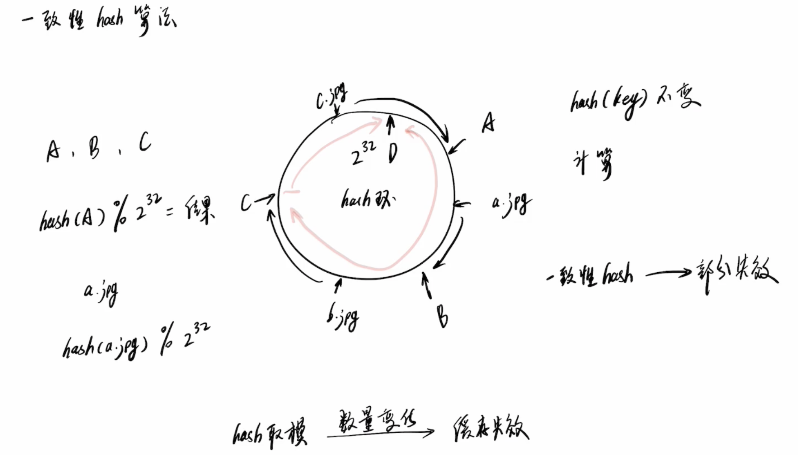
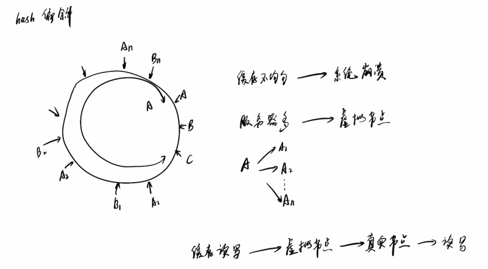
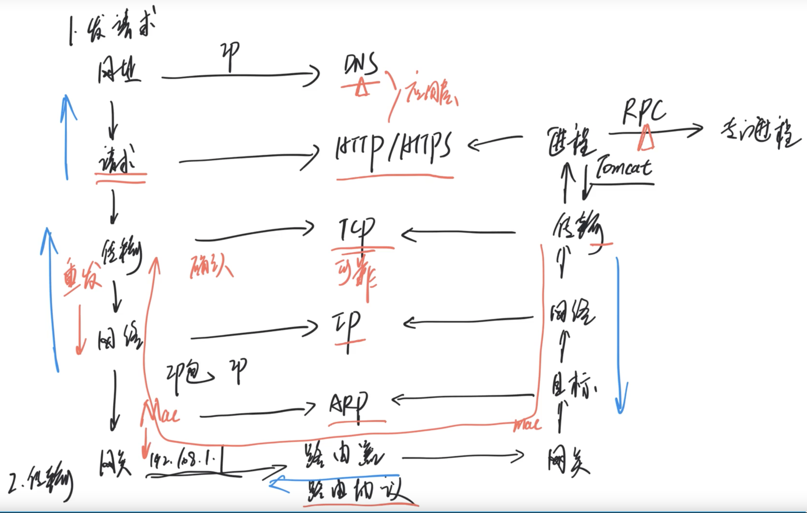

# 分布式

## 分布式事务

事务是对一系列操作的请求处理，要么全部执行，要么全部不执行。

数据库会将要执行的操作记录成日志（binlog、WAL），然后逐条执行操作。

如果执行都成功，就提交事务，如果某一条失败了，就根据日志做回滚操作。

分布式环境下，就引入了**协调者**，来统一管理多个参与者的执行情况：

- 每个都成功 --> 都各自提交
- 某一个失败 --> 都各自回滚

### 二阶段提交

**参与者将操作成败通知协调者，再由协调者根据所有参与者的反馈情报决定各参与者是否要提交操作还是中止操作。**

具体步骤：

1. 准备阶段 - 投票阶段：

   协调者**请求**各个参与者，参与者先做日志记录，再逐条执行，写本地的redo和undo日志，但并不提交，如果事务都成功，告诉协调者**同意**，否则告诉协调者**终止**

2. 提交阶段 - 执行阶段：

   协调者在收到所有参与者的**同意**后，告诉参与者**提交**事务。

   如果有参与者返回**终止**，协调者就告诉参与者**回滚**事务，撤回操作。

   

**缺点：**

由于二阶段提交存在着诸如同步阻塞、单点问题、脑裂等缺陷，所以，研究者们在二阶段提交的基础上做了改进，提出了三阶段提交。

两阶段提交协议有一个重要的优化：最末参与者优化。Last Participant Optimization，LPO，允许最后一个参与者不实现准备操作（单阶段参与者），只有提交阶段。

### 三阶段提交

1、引入超时机制。同时在协调者和参与者中都引入超时机制。

2、在第一阶段和第二阶段中插入一个准备阶段。保证了在最后提交阶段之前各参与节点的状态是一致的。

在二阶段提交之前增加了一个步骤，其他步骤操作一样，可以大幅减少故障率。

1. 预备 - CanCommit

   协调者**询问**各个参与者，同意后执行下一步的**准备**，不同意就告诉协调者**终止**

2. 准备 - PreCommit

   各个参与者执行各自的事务，但不提交，事务执行成功就告诉协调者同意

3. 提交 - DoCommit

   协调者根据各个参与者的回应做提交会回滚操作。

各个参与者在**预备**和**准备**阶段都可以提出**终止**的回应，此时协调者告诉所有参与者执行**回滚**操作。

**改进：**

如果遇到异常，各个参与者在超时时间内，会自动提交本地的事务！

极端情况（理论上）：

如果参与者1的中止回应发给协调者，协调者此时出现异常，不能告诉其他参与者中止，导致其他参与者业务执行了，参与者1未执行。。

此种情况可以通过**业务对数据进行补偿和修正**

## 柔性事务

柔性事务主要有日志保证。事务日志记录事务的开始、结束状态，可以还包括事务参与者信息。参与者节点也需要根据重做或回滚需求记录REDO、UNDO日志。当事务重试、回滚是，可以冠军这些日志最终将数据恢复到一致状态。

- [ ] 单机锁 = 时间消耗：微秒级

- [ ] 跨多机的锁 = 时间消耗：毫秒级 = 1000倍单机时间消耗

  

### 引入日志和补偿机制

事务日志记录在分布式节点上，数据redo/undo日志一般记录在业务数据库是

redo的重试异常步骤的正向补偿

undo的回滚前序步骤的反向补偿

### 可靠消息投递

由于**网络通信危险期**，需要多次投递消息，此时需要程序实现幂等。

最简单的幂等是根据业务流水号写日志（阿里叫排重表）

### 参考资料

- [关于分布式事务、两阶段提交协议、三阶提交协议](https://mp.weixin.qq.com/s/-92_4hQRXjj7x02Sc2IYqg)

### 一致性hash算法

- 典型应用场景是缓存集群中添加和删除服务节点，保证服务仅小部分失效，大部分仍有效，避免缓存雪崩

- 为了解决hash算法中服务节点数目变化后系统完全失效的情况

- 需要构建hash环，服务节点和数据节点都映射到hash环上

- 查找数据所在的服务节点，只需沿着顺时针找第一个服务节点，就是其存放节点

- 为了避免hash偏移，需要把实际的服务节点映射为虚拟节点，数据节点也都映射到虚拟节点

  

## 一次web请求涉及的网络协议

1. DNS域名解析
2. http/https的应用层
3. TCP的传输层
4. IP的网络层
5. 网关到路由器之间的路由协议
6. IP地址到网卡MAC地址的ARP协议
7. 服务进程间调度的RPC协议

