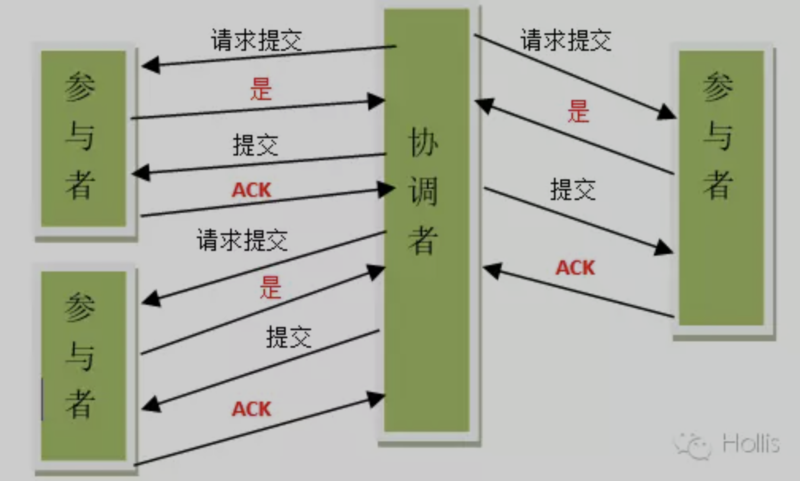
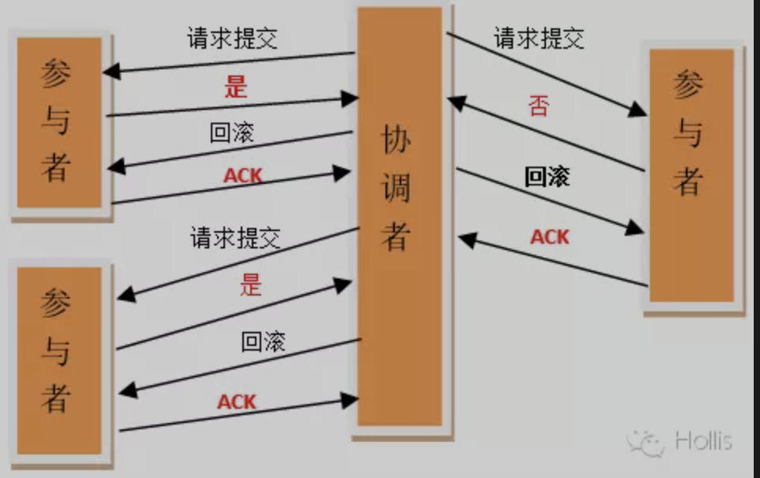
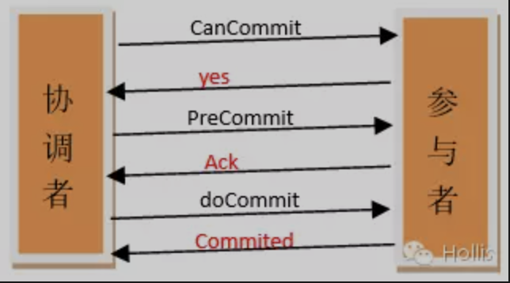

# 分布式

## 分布式事务

事务是对一系列操作的请求处理，要么全部执行，要么全部不执行。

数据库会将要执行的操作记录成日志（binlog、WAL），然后逐条执行操作。

如果执行都成功，就提交事务，如果某一条失败了，就根据日志做回滚操作。

分布式环境下，就引入了**协调者**，来统一管理多个参与者的执行情况：

- 每个都成功 --> 都各自提交
- 某一个失败 --> 都各自回滚

### 二阶段提交

**参与者将操作成败通知协调者，再由协调者根据所有参与者的反馈情报决定各参与者是否要提交操作还是中止操作。**

具体步骤：

1. 准备阶段 - 投票阶段：

   协调者**请求**各个参与者，参与者先做日志记录，再逐条执行，写本地的redo和undo日志，但并不提交，如果事务都成功，告诉协调者**同意**，否则告诉协调者**终止**

2. 提交阶段 - 执行阶段：

   协调者在收到所有参与者的**同意**后，告诉参与者**提交**事务。

   如果有参与者返回**终止**，协调者就告诉参与者**回滚**事务，撤回操作。

   

**缺点：**

1. 协调者是单点
2. 网络异常情况下的数据不一致

如果出现以上问题，二阶段提交是没办法继续执行的！

### 三阶段提交

在二阶段提交之前增加了一个步骤，其他步骤操作一样，可以大幅减少故障率。

1. 预备

   协调者**询问**各个参与者，同意后执行下一步的**准备**，不同意就告诉协调者**终止**

2. 准备

   各个参与者执行各自的事务，但不提交，事务执行成功就告诉协调者同意

3. 提交

   协调者根据各个参与者的回应做提交会回滚操作。

各个参与者在**预备**和**准备**阶段都可以提出**终止**的回应，此时协调者告诉所有参与者执行**回滚**操作。

**改进：**

如果遇到异常，各个参与者在超时时间内，会自动提交本地的事务！

极端情况（理论上）：

如果参与者1的中止回应发给协调者，协调者此时出现异常，不能告诉其他参与者中止，导致其他参与者业务执行了，参与者1未执行。。

此种情况可以通过**业务对数据进行补偿和修正**

### 一致性hash算法