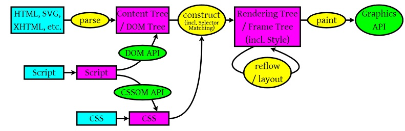

# React

JSX即JavaScript下的XML格式。

React库是用来创建视图的。ReactDOM库是用来在浏览器中渲染UI的。

使用虚拟DOM，运用Diffing算法。


## 特点

- **1.声明式设计** −React采用声明范式，可以轻松描述应用。
- **2.高效** −React通过对DOM的模拟，最大限度地减少与DOM的交互。
- **3.灵活** −React可以与已知的库或框架很好地配合。
- **4.JSX** − JSX 是 JavaScript 语法的扩展。React 开发不一定使用 JSX ，但我们建议使用它。
- **5.组件** − 通过 React 构建组件，使得代码更加容易得到复用，能够很好的应用在大项目的开发中。
- **6.单向响应的数据流** − React 实现了单向响应的数据流，这也是它为什么比传统数据绑定更简单。`数据 -> 视图 -> 事件 -> 数据`


## React内部运行机制

**浏览器工作大流程**




### React元素

HTML只是浏览器构造文档对象模型（DOM）时执行的一组简单指令。

在HTML中，层级中元素之间的关系和家族树类似。React元素表示应该如何创建浏览器DOM的一组指令。

使用`React.createElement`创建一个`React`元素来表示`h1`标题元素：

```jsx
React.createElement("h1", {id: "recipe-0", "data-type": "title"}, "Baked Salmon")
```

等同于下面实际的DOM元素：

```html
<h1 data-reactroot id="recipe-0" data-type="title">Baked Salmon</h1>
```

其中`data-reactroot`用来标记React组件的根元素的，渲染时跟踪元素的方法是基于元素的层级的。

createElement实际创建的内容：

```javascript
{
  $$typeof: Symbol(React.element),
  "type": "h1",														// 用来辅助React高效地更新DOM
  "key": null,
  "ref": null,
  "props": {"children": "Baked Salmon"},	// 构建一个DOM元素所需的数据和子元素 
    																			// children属性是用来将其他嵌套元素当做文本显示的
  "_owner": null,
  "_store": {}
}
```


### ReactDOM

```jsx
var dish = React.createElement("h1", {id: "recipe-0", "data-type": "title"}, "Baked Salmon")
// 第一个参数：渲染的元素
// 第二个参数：目标DOM节点
ReactDOM.render(dish, document.getElementById('react-container'))
```

React代码最终会在浏览器中运行。虚拟DOM是一个包含单个根元素的React元素树。React元素是一组操作指令，React将根据该指令在浏览器中构建UI界面。


**React.createClass**

组件即对象。他们可以像类一个封装代码。可以创建一个方法，用于渲染单个列表元素，继而构造所有列表元素：


```jsx
const IngredientsList = React.createClass({
  displayName: "IngredientsList",
  renderListItem(ingredient, i) {
    return React.createElement("li", {key: i}, ingredient)
  },
  render() {
    return React.createElement("ul", {className: "ingredients"},
                              this.props.items.map(this.renderListItem))
  }
})
```

等同于html code:

```html
<ul data-react-root class="ingredients">
  <li>1 1b Salmon</li>
  <li> 2 cups Butter Lettuce</li>
  <li> 1/2 cup Olive Oil</li>
</ul>
```


## 创建项目

1. 通过 CDN 获得 React 和 ReactDOM 的 UMD 版本

   ```js
   <script crossorigin src="https://unpkg.com/react@16/umd/react.production.min.js"></script>
   <script crossorigin src="https://unpkg.com/react-dom@16/umd/react-dom.production.min.js"></script>
   ```

   

2. 通过react的脚手架创建进行开发和部署：

   ```bash
   cnpm install -g create-react-app
   create-react-app hello_world
   ```


## 项目文件

```files
public						# 静态目录
	manifest.json		# 图标，桌面快捷图标
	robots.txt			# 防爬虫的过滤文件
src								# react的jsx源码  
```

虚拟DOM树  存在于内存中的内存树

React Diff算法即两棵tree的diff，实现了把O(N^3)复杂度变为了O(N)，N为树中的节点数。


## React库

| 文件名                   | 作用                                                         | 说明 |
| ------------------------ | ------------------------------------------------------------ | ---- |
| babel.min.js             | Babel 可以将 ES6 代码转为 ES5 代码，这样就能在目前不支持 ES6 浏览器上执行 React 代码。Babel 内嵌了对 JSX 的支持。通过将 Babel 和 babel-sublime 包（package）一同使用可以让源码的语法渲染上升到一个全新的水平。 |      |
| react.development.js     | React 的核心库-开发版                                        |      |
| react-dom.development.js | 提供与 DOM 相关的功能                                        |      |
| prop-type.js             |                                                              |      |
| react.min.js             | React 的核心库，react diff算法                               |      |

**注意:** 在浏览器中使用 Babel 来编译 JSX 效率是非常低的。


**React 只会更新必要的部分**

值得注意的是 React DOM 首先会比较元素内容先后的不同，而在渲染过程中只会更新改变了的部分。


# React JSX

React 使用 JSX 来替代常规的 JavaScript。

JSX 是一个看起来很像 XML 的 JavaScript 语法扩展。

- JSX 执行更快，因为它在编译为 JavaScript 代码后进行了优化。
- 它是**类型安全**的，在编译过程中就能发现错误。
- 中间如果需要插入变量用{}
- 使用 JSX 编写模板更加简单快速。（slower than VUE)

```jsx
const element3 = (
  <div>
    <p><span>横着</span></p>
    <p><span>竖着</span></p>
  </div>
)
const man = '正常'
const element2 = (
  <div>
    <h1>today it isolated?</h1>
    <h2>{man === '发热' ? <button>隔离</button> : element3}</h2>
  </div>
)

ReactDOM.render(
  element2,
  document.getElementById('root'),
)
```


## 自动编译

```bash
# 安装离线转换工具
npm install -g react-tools
# 在项目根目录下执行，将会把jsx文件自动转换为js文件，且为实时的
jsx --watch src/ build/
```

once update src directory files, the build directory files will change simultanously.


## 函数式编程要点

1. 不可变性

   对原生的数据不做任何修改，只修改其拷贝数据，并使用它取代原生的数据

2. 纯函数

   函数至少有一个参数，且只依赖输入参数，不对全局变量等参数做修改，且返回变量或函数。

   在React中，UI是用纯函数表示的。

3. 数据转换

   ```js
   Array.filter()		# 根据原数组创建新数组 条件筛选
   Array.map()				# 数组元素遍历操作 附加操作
   Array.reduce()		# 返回最大值
   ```

   


## React组件

使用函数定义了一个组件：

```jsx
function HelloMessage(props) {
    return <h1>Hello World!</h1>;
}
```

使用 ES6 class 来定义一个组件:

```jsx
class Welcome extends React.Component {
  render() {
    return <h1>Hello World!</h1>;
  }
}
```

**const element = <HelloMessage />** 为用户自定义的组件。


复合组件

创建多个组件来合成一个组件，即把组件的不同功能点进行分离。

```jsx
unction Name(props) {
    return <h1>网站名称：{props.name}</h1>;
}
function Url(props) {
    return <h1>网站地址：{props.url}</h1>;
}
function Nickname(props) {
    return <h1>网站小名：{props.nickname}</h1>;
}
function App() {
    return (
    <div>
        <Name name="菜鸟教程" />
        <Url url="http://www.runoob.com" />
        <Nickname nickname="Runoob" />
    </div>
    );
}
 
ReactDOM.render(
     <App />,
    document.getElementById('example')
);
```


## React State(状态)

React 把组件看成是一个状态机（State Machines）。通过与用户的交互，实现不同状态，然后渲染 UI，让用户界面和数据保持一致。

React 里，只需更新组件的 state，然后根据新的 state 重新渲染用户界面（不要操作 DOM）。

相当于Vue的data


## 注意事项

- *原生 HTML 元素名以小写字母开头，而自定义的 React 类名以大写字母开头，比如 HelloMessage 不能写成 helloMessage。除此之外还需要注意组件类只能包含一个顶层标签，否则也会报错。*
- *在添加属性时， class 属性需要写成 className ，for 属性需要写成 htmlFor ，这是因为 class 和 for 是 JavaScript 的保留字。*

- 添加自定义属性需要使用 **data-** 前缀。
- 在 JSX 中不能使用 **if else** 语句，但可以使用 **conditional (三元运算)** 表达式来替代。
- JSX 允许在模板中插入数组，数组会自动展开所有成员
-  React DOM 首先会比较元素内容先后的不同，而在渲染过程中只会更新改变了的部分。


## 参考资料

- [React中文文档翻译网](https://react.docschina.org/)
- [React 菜鸟教程](https://www.runoob.com/react/react-tutorial.html)

