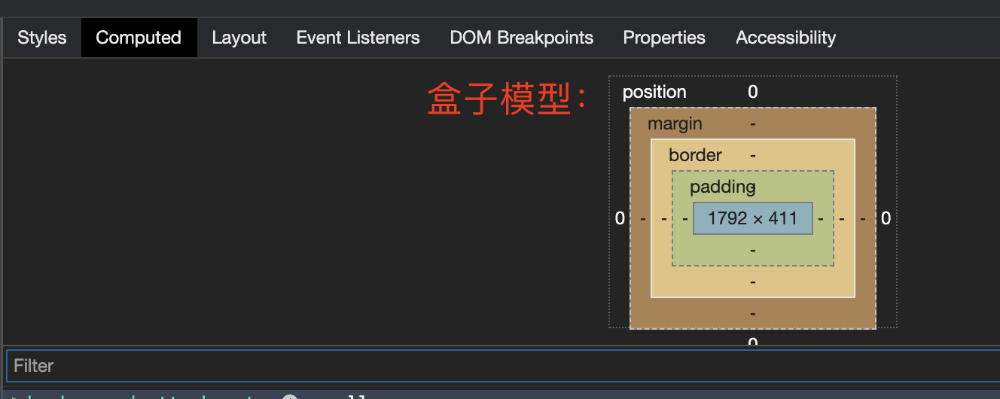
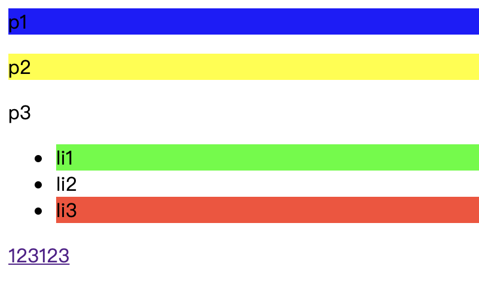

# css

Cascading Style Sheet 层叠级联样式表


## 什么是css

1. css选择器（重点+难点）

2. 美化网页（颜色，字体，宽度，高度，背景图片，文字、阴影、超链接、列表、渐变。。）

3. 盒子模型：

   

4. 浮动：广告弹窗

5. 定位：广告弹窗

6. 网页动画（特效效果）

参见，菜鸟教程，**css教程**和**css3教程**


## 发展史

css 1.0

css 2.0 	div块+css，html和css结构分离的思想，网页变得简单，利于SEO（搜索引擎优化）

css 2.1 	浮动，定位

css 3.0	圆角，阴影，动画。。。浏览器兼容性 


## **css的导入方式**

1. 行内样式

2. 内部样式

3. 外部样式（独立的.css文件）

   1. 链接式

      ```html
      	<link rel="stylesheet" href="style.css">
      ```

   2. 导入式，css2.1特有的，不建议使用！

      ```html
      <style>
        @import url("style.css")
      </style>
      ```

      

      

样式生效的优先级是**就近原则**：哪个样式离html元素的渲染最近，就以哪个为准！


## 选择器

作用：选择页面是的某一个或某一类元素


### 基本选择器

1. 标签选择器：h1/h2/..，对所有的标签都起作用，全局设置
2. 类选择器 class：选中所有class属性一致的标签，可以跨标签
3. Id选择器：全局唯一

在F12的Styles中直接修改样式，页面会实时显示，然后复制调好的style格式代码到项目中，就可以用了。


### 层次选择器

1. 后代选择器：在某个元素的后面

   ```css
   /*后代选择器：*/
   body p {
     background: red;
   }
   ```

   

2. 子选择器：只有一代，只对儿子起作用

   ```css
   /*    子选择器*/
   body > p {
     background: pink;
   }
   ```

   

3. 相邻选择器（兄弟选择器）,向下

   ```css
   .active + p {
     background: grey;
   }
   ```

   

4. 通用选择器

   ```css
   .active~p{
     background: bisque;
   }
   ```

   

### 结构 伪类选择器

所有带 : 号的就是。



### 高级选择器