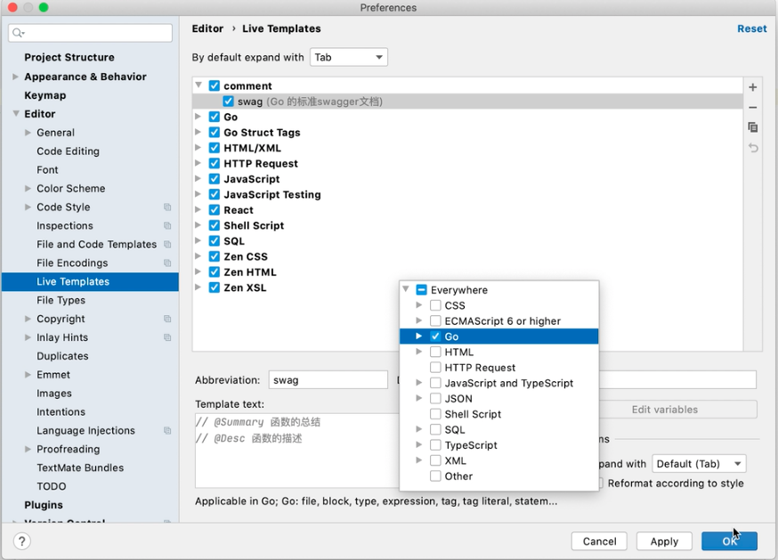

# Go IDE Tutorial


## Goland

- 添加tag做代码的自动完成

  

  

  > 代码中输入swag就会自动出:

  ```go
  // @Summary 函数的总结
  // @Desc 函数的描述
  func main() {
    ...
  }
  ```


## VS Code 

参考资料：[VS Code配置Go语言开发环境-liwenzhou](https://www.liwenzhou.com/posts/Go/00_go_in_vscode/)

