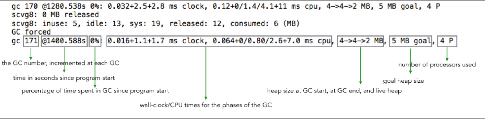
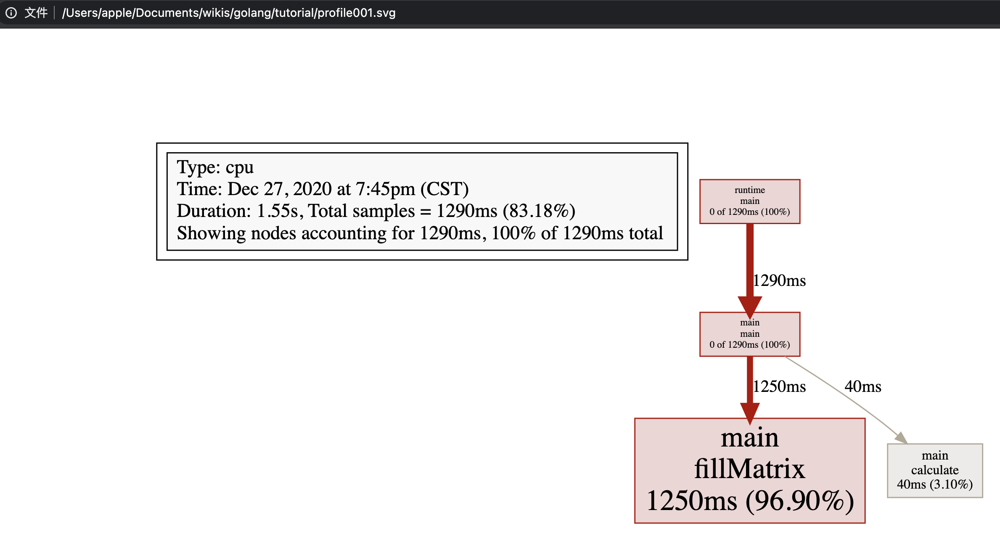
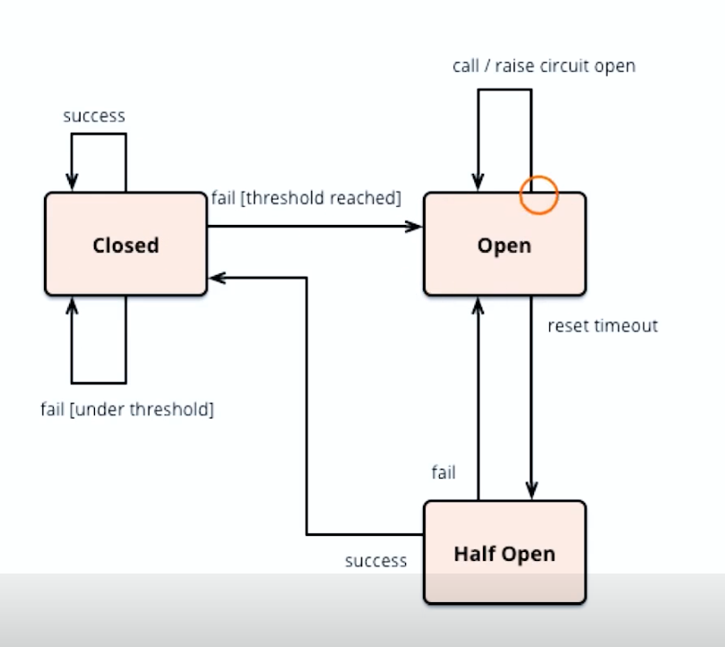
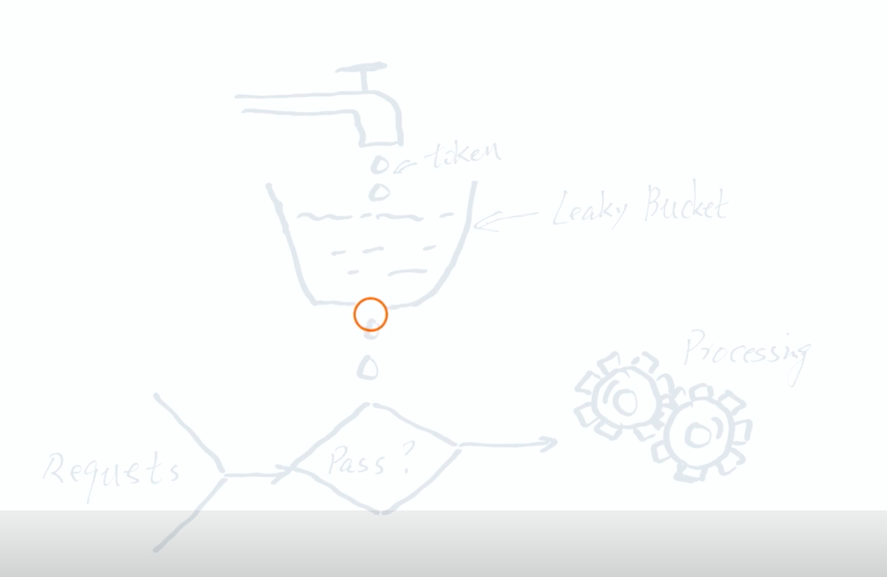
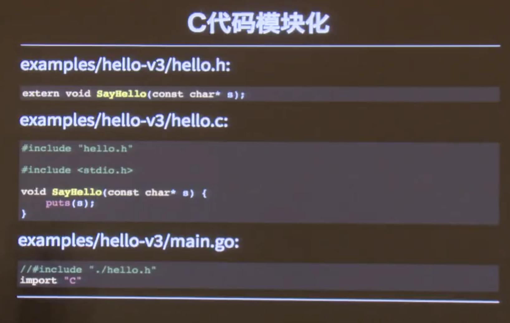
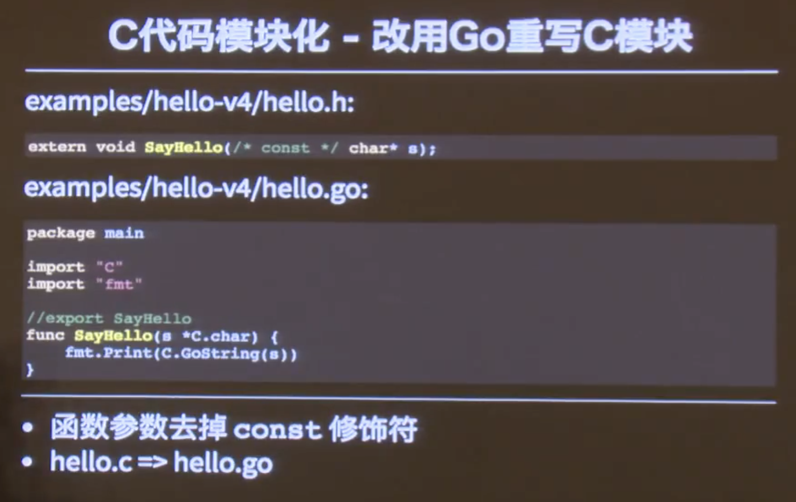

# go_learning


## 概念

- GOROOT：GO语言的安装目录


## 数组array

- 声明

  ```go
  var a[3]int //声明并初始化为默认零值
  b := [3]int{1,2,3}	//声明同时初始化
  c := [2][2]int{{1,2},{3,4}}	//多维数组初始化
  ```

- 数组截取

  > a[开始索引(包含), 结束索引(不包含)]

  ```go
  a := [...]int{1,2,3,4,5}
  a[1,2] //2
  a[1:len(a)] //2,3,4,5
  a[1:]	//2,3,4,5
  a[:3] //1,2,3
  ```

  

## 切片slice

- 内部是个结构体

  ```go
  type slice struct {
    void* ptr //Element
    len int //元素个数
    cap int	//内部数组的容量
  }
  
  var s0 [] int //声明len=0，cap=0的int切片
  s0 = append(s0, 1) //len=1, cap=1
  
  s2 := make([]int, 3, 5) // len=3 cap=5
  t.Log(s2[0], s2[1], s2[2], s2[3], s2[4]) // error index out of range! 后两个元素不可访问！
  ```

  


## Map

### Map与工厂模式

- map的value可以是一个方法
- 与go的dock type接口方式一起，可以方便的实现单一方法对象的工厂模式


### Map自实现Set

go内置集合中没有Set的实现，可以用 **map[type]bool** 来构造

- 作为key的type为任意类型，value为bool值
- 保证了元素的唯一性
- 基本操作：
  - 添加元素
  - 判断元素是否存在
  - 删除元素
  - 元素个数


## 字符串string

在go语言中：

1. string是数据类型，不是引用或指针类型

2. string是只读的byte slice，len函数可以获取它的长度，长度是byte的个数

3. string的byte数组可以存放任意数据，不知肉眼可读的字符串，二进制数据也都可以

   

   

### Unicode UTF8

1. Unicode 是一种**字符集**（In English：code point）
2. UTF8是unicode的存储实现，转换为字节序列的规则

|     字符      |        中        |
| :-----------: | :--------------: |
|    Unicode    |      0x4E2D      |
|     UTF-8     |     0xE4B8AD     |
| string/[]byte | [0xE4,0xB8,0xAD] |


## struct结构体

### 空结构体的使用场景

- 定义空channel
- 定义只包含一堆接口的结构做方法适配


## Go语言的函数

GO语言中的函数是一等公民。

1. 可以有多个返回值
2. 所有参数都是值传递：slice，map，channel会有传引用的错觉，因为函数调用时复制了指针，但指针指向的同一块内存空间
3. 函数可以作为变量的值
4. 函数可以作为参数和返回值


## 接口和方法

```go

// 第一种方法在实例方法被调用时，实例会被值拷贝一次
// 第一种定义方式在实例对应方法被调用时，实例的成员会进行值复制
func (e Employ) GetString() string {

	return fmt.Sprintf("Id=%d, Name=%s", e.Id, e.Name)
}

// 第二种方法避免了内存拷贝，通常使用
func (e *Employ) GetString2() string {

	return fmt.Sprintf("Id=%d, Name=%s", e.Id, e.Name)
}
```


## Go routine


### Thread vs Routine

Java和Go做比较：

1. 创建时默认的stack大小
   - java5以后的Java thread stack默认是1M
   - goroutine的stack初始化大小是2K
2. 和KSE（Kernal Space Entity）的对应关系
   - Java thread 是 1:1
   - goroutine是 M:N


### select控制程序流

- 多路选择，每个case跟着的是一个阻塞事件，比如channel、timer
- 对case的条件成立的执行是无序的，和switch不同！如果多个case都满足，随机只进入其中一个case！
- 可以实现超时控制！

#### 空select

```go
select {

}
```

会直接阻塞当前的goroutine，使得该goroutine进入无法被唤醒的永久休眠状态！

#### 只有一个case

```go
select {
case <-ch1
  ...
}
```

该select就变成了一个阻塞的channel读写操作

#### 有default语句

```go
select {
  case <-ch1:
  ...
  deafult:
  ...
}
```

相当于做了一个有阻塞的channel读取操作

#### 有优先级的select

[参考资料](https://www.liwenzhou.com/posts/Go/priority_in_go_select/)

```go
func worker(ch1, ch2<-chan int, stopCh chan struct{}) {
  for {
    select {
      case <-
    }
  }
}
```


## channel

### channel的关闭

- 向关闭的channel发送数据，会导致panic
- v, ok <- ch; ok=true/false表示通道正常接收/通道关闭
- 所有的channel接收者都会在channel关闭时，立刻从阻塞等待中返回且ok=false。此广播机制常被利用，进行向多个订阅者同时发送信号。如：进程或协程的退出信号。


### channel实现信号量和互斥锁

```go
type Empty interface{}    // 空接口
type semaphore chan Empty // 信号量
```

- 实现信号量的P操作，就是不断的往channel中放入数据，当channel满时，其他协程就不能再往channel放数据了，而只能阻塞，知道有一个协程释放资源，也就是执行V操作
- V操作就是从channel中取出资源
- 当channel容量**只有一个**时，P和V的数量变为1，同时进行P操作的协程只能有一个，在该协程执行完P操作没有执行V操作时，其他协程只能等待，这就实现了访问临界区资源的mutex功能。


### close(channel)做任务取消


### 只读/只写channel

```go
// 定义只读chann
read_only := make(<-chan int)
// 定义只写chann
write_only := make(chan<- int)
```

定义只读或只写的channel意义不大，一般用于参数传递中：

```go
func send(<-ch int){
  for i := 0; i < 10; i++ {
    c <- i
  }
}

func recv(c ch<- int) {
  for i := range c {
    fmt.Println(i)
  }
}
```


### 无缓冲chann和有缓冲chann

默认情况下 `ch := make(chan int)`，发送和接收操作在另一端准备好之前都会阻塞！这使得Go协程可以在没有显式的锁或竞态变量的情况下进行同步！

```go
ch1 := make(chan int) //无缓冲
ch2 := make(chan int, 1) //有缓冲
```

- 无缓冲：当向ch1中存值时，需要其他协程取值，否则一直阻塞在存值的那个step中！

- 有缓冲：当向ch2中存值时，只有放到第二个值时，才阻塞！

  

### select

- select语句使一个Go协程可以等待多个通信chann的操作
- select 会阻塞到某个分支可以继续执行为止，这时就会执行该分支。
- 当多个分支都准备好，会**随机选择**一个执行


### 构建对象池

- 因为一些对象例如数据库连接池的创建性能可能较大，需要预先创建

- 对象池需要有获取和归还接口

- 使用buffered channel实现对象池

  > 高可用系统中的一个金句：slow response比quick failure 更糟糕！

```go
runtime.GC() // 主动释放一次GC 会清除sync.pool中缓存的对象
```


## context与任务取消

- 根context：通过context.Background()获得

- 子context：通过context.WithCancel(parentContext)来创建

  ```go
  ctx, cancel := context.WithCancel(context.Background())
  ```

- 当前context被取消时，基于他的子context都会被取消

- 接收取消通知：<-ctx.Done()


## 测试

### Unit Test单元测试

- 表格测试法

  ```go
  func TestSquare(t *testing.T) {
    inputs := [...]int{1,2,3}
    expected := [...]int{1,4,9}
    for i:=0; i<len(inputs); i++ {
      if (squar(inputs[i])!=expected[i]) {
        t.Error("unexpected !")
      }
    }
  }
  ```

  

- 代码覆盖率，且显示tlog

  ```shell
  go test -v -cover
  ```

- 断言

  > github.com/stretchr/testify/assert


### Benchmark性能测试

```bash
# 能看出内存alloc次数
go test -bench=. -benchmem
```

>goos: darwin
>goarch: amd64
>BenchmarkConcatStringByAdd-12            9171664               122 ns/op              16 B/op          4 allocs/op
>BenchmarkConcatStringByBytesBuff-12     20660036                56.2 ns/op            64 B/op          1 allocs/op
>PASS
>ok      _/Users/apple/Documents/wikis/golang/tutorial/go_learning/src/ch35_benchmark    2.922s


### BDD

> Behavior Drive Design 行为驱动开发


#### BDD in Go

 - 项目网站

   > https://github.com/smartystreets/goconvey

- 安装

  > go get -v -u github.com/smartystreets/goconvey/convey

- 启动 WEB UI

  > $GOPATH/bin/goconvey


## 反射-reflect

### 利用反射编写灵活的代码

- 按名字访问结构的成员

  ```go
  reflect.ValueOf(*e).FieldByName("Name")
  ```

- 按名字访问结构的方法

  ```go
  reflect.ValueOf(*e).MethodByName("UpdateAge").Call([]reflect.Value{reflect.ValueOf(1)}) 
  ```

- 内置的JSON解析就是利用反射实现，通过FieldTag来标识对应的json值

- 更快的JSON解析：**EasyJson**，采用代码生成而非反射，用于生产环境，内置的json用了反射，性能不行，多用于配置文件解析

  - 安装

    > go get -u -v github.com/mailru/easyjson/ ...

  - 使用

    > easyjon -all <结构定义>.go

### 反射优缺点

- 可以构建key-value获取和赋值的万能程序
- 可读性变差，不如直接的set/get好，调试困难，也有性能问题


## Unsafe的不安全编程

- 不适合的场景：无意义的强制类型转换，其值可能有丢失，比如float64和int的unsafe.Pointer转换

  ```go
  i := 10
  f := *(*float64)(unsafe.Pointer(&i))
  ```

  

- 适合的场景：

  - 自定义了一个比如 type MyInt int，后面需要对int类的变量做使用MyInt的方法操作
  - 并发读写中，可以先把数据写到一个buffer内存中，再用atomic一次替换到读内存中，以后使用的读内存块就是最新的了


## Micro Kernel微内核架构

### 特点

- 易于扩展
- 错误隔离
- 保持架构一致性

### 要点

- 内核包含公共流程或通用逻辑
- 讲可变或可扩展部分规划为扩展点
- 抽象扩展点行为，定义接口
- 利用插件进行扩展

- <<Kernel>> Agent

  >  Extension Point

  - <<Plugin>> FileCollector
  - <<Plugin>>ProcessCollector
  - ...
  - <<Plugin>>AppCollector


## HTTP服务

- 内置的http服务

> net/http

- 路由规则：

  - URL分为两种，末尾是/表示一个子树，后面可以跟其他子路径；

  - 末尾不是/，表示一个叶子，固定的路径以/结尾的URL可以匹配他的任何子路径

    > 比如 /images/ 会匹配 /images/cute-cat.jpg

  - 它采用最长匹配原则，如果有多个匹配，一定采用匹配路径最长的那个进行处理
  - 如果没有找到任何匹配项，会返回404错误。

- 构建Restful服务，更好的router

  > https://github.com/julienshmidt/httprouter


## 性能工具

### 火焰图

- graphviz 安装

  > brew install graphviz

- go-torch ，安装
  - go get github.com/uber/go-torch
  - 下载并复制：flamegraph.pl (https://github.com/brendangregg/FlameGraph) 至 $GOPATH/bin路径下

### 通过文件方式输出profile

- 灵活性高，适用于特定代码段的分析
- 通过手动调用runtime/pprof的API
- API相关文档 https://studygolang.com/static/pkgdoc/pkg/runtime_pprof.htm
- go tool pprof [binary] [binary.prof]

### 通过http方式输出profile

- 简单，适合于持续性运行的应用
- 在应用程序中导入 import _ "net/http/pprof"，并启动http server即可
- go tool pprof http://<host>:<port>/debug/pprof/profile?seconds=10 （默认值为30秒）
- go-torch -seconds 10 http://<host>:<port>/debug/pprof/profifile

### Go支持的多种Profile

- go help testflag

- 常见分析指标
  - Wall Time: 墙上时钟时间
  - CPU Time
  - Block Time ??
  - Memory Allocation
  - GC times/time spent

### go test 输出profile文件

```shell
# 生产profile
go test -bench=. -cpuprofile=cpu.prof
go test -bench=. -blockprofile=block.prof
# 查看profile，用网页查看
go tool pprof cpu.prof
> top
> svg
> list GetFibonacci
> exit
go-torch cpu.prof
```

- 使用浏览器打开go tool中用命令svg生成的svg文件：红色或方框越大，就占比越高的！


## GC日志

- 查看GC：在程序执行之前加上环境变量：`GODEBUG=gctrace=1`

  ```bash
  GODEBUG=gctrace=1 go test -bench=.
  GODEBUG=gctrace=1 go run main.go
  ```

- 日志详细信息参考：**https://godoc.org/runtime**

  

- 避免内存分配和复制
  - 初始化至合适的大小，因为自动扩容是有代价的
  - 复用内存，传引用


## 性能调优

- 无锁的读，比有lock的读，性能高一个数量级！
- strings.Build比+操作符性能要好很多！
- sync.Map是协程安全的，适用于读多写少的场景
- sync.Map比内置的map存储空间大，因为它用到了空间换时间的方案！它分为ReadOnly块和Diry块，前者负责读，后者负责写
- [concurrent-map](https://github.com/orcaman/concurrent-map) 性能很好！
- 用ringbuffer实现无锁编程，支持百万的QPS



## go mod

- GO111MODULE来设置go mod

  - on：go命令行会使用modules，而一点也不会去GOPATH目录下查找
  - off：go命令行将不会支持module功能，寻找依赖包的方式将会沿用旧版本的vendor或GOPATH模式
  - auto：如项目放置在GOPATH/src中，则使用GOPATH，否则使用go mod

- 环境修改：

  ```shell
  # 开启go mod
  go env -w GO111MODULE=on
  # 配置依赖包的下载代理为国内阿里云
  go env -w GOPROXYhttp://mirrors.aliyun.com/goproxy/
  ```

- 常用指令：

  ```shell
  # 初始化模块
  go mod init rt.server.manager
  # 打印模块依赖图
  go mod graph
  # 解释为什么需要依赖
  go mod why
  # 下载依赖包
  go mod download
  
  ```


## CSP并发模型

- CSP模型用于描述两个独立的实体通过共享的通讯channel（管道）进行通信的并发模型。

- CSP中channel是第一类对象，它不关注发送消息的实体，而关注与发送消息时使用的channel。

- Golang实现了CSP并发模型作为并发基础，底层使用goroutine作为并发实体

- goroutine非常轻量级，可以创建几十万个实体。实体间通过channel继续匿名消息传递使之解耦！

- go在语言层面实现了自动调度！屏蔽了很多内部细节，对外提供简单的语法关键字，大大简化了并发编程的思维转换和管理线程的复杂性。

  

- 其中

  - M：是内核线程
  - P：是协调调度，用于协调调度M和G的执行，内核线程只有拿到了P才能对goroutine继续调度执行，一般都是通过限定P的个数来控制golang的并发度！
  - G：是待处理的协程，包含这个goroutine的栈空间
  - G1/G2/..：灰色的背景的Gn是已经挂起的goroutine。它们被添加到执行队列中。
  - 需要等待网络IO的goroutine，当P通过epoll查询到特定的fd的时候，会重新调度起对应的，正在挂起的goroutine重新运行。
  - golang为了调度的公平性，在调度器加入了steal working算法：在一个P自己的执行队列，执行完之后，它会优先到全局的执行队列中偷G来进行处理；如果没有的话；再回到其他P的执行队列中抢G来进行处理。
  - 


## 架构设计的关键部分

- 重用&隔离：即同一个系统，部署多份，每份起的作用可以不一样，起到隔离的作用

- 冗余设计：负载均衡

- 单点失效：譬如QPS是1500，分在两个各QPS1000的系统上，如果一个系统故障，会导致整个系统不可用

- 慢响应：A quick rejection is better than a slow response.

- 不要无休止的等待：给阻塞操作都加上一个期限

- 拒绝单体系统

- 面向错误和恢复的设计

  - 在依赖服务不可用时，可以继续存活！
  - 快速启动
  - 无状态！

- 与客户端协商：

  > server：我太忙了，请慢点发数据
  >
  > client：好，我一分钟后再发送

- 断路器：




- 令牌桶

  


- [github项目: service_decorator](https://github.com/easierway/service_decorators/blob/master/README.md)


## 左耳听风《Go语言编程模式实战》

### 切片

slice是一个结构体：

```go
type slice struct {
    array unsafe.Pointer //指向存放数据的数组指针
    len   int            //长度有多大
    cap   int            //容量有多大
}
```

这里数据会发生共享！

```go
func main() {
	path := []byte("AAAA/BBBBBBBBB")
	sepIndex := bytes.IndexByte(path, '/')

	dir1 := path[:sepIndex]
	dir2 := path[sepIndex+1:]

	fmt.Println("dir1 =>", string(dir1)) //prints: dir1 => AAAA
	fmt.Println("dir2 =>", string(dir2)) //prints: dir2 => BBBBBBBBB

	dir1 = append(dir1, "suffix"...)

	fmt.Println("dir1 =>", string(dir1)) //prints: dir1 => AAAAsuffix
	fmt.Println("dir2 =>", string(dir2)) //prints: dir2 => uffixBBBB
}
```

append()这个函数在 cap 不够用的时候，就会重新分配内存以扩大容量，如果够用，就不会重新分配内存了！

```go
dir1 := path[:sepIndex]	//旧代码
// 修改为下面的：
dir1 := path[:sepIndex:sepIndex]	//新代码
```

新的代码使用了 Full Slice Expression，最后一个参数叫“Limited Capacity”，于是，后续的 append() 操作会导致重新分配内存。


### 深度比较

使用到反射 reflect.DeepEqual() 来做深度比较做是否相等的判断：

```go
package main

import (
	"fmt"
	"reflect"
)

type data struct {
}

func main() {

	v1 := data{}
	v2 := data{}
	fmt.Println("v1 == v2:", reflect.DeepEqual(v1, v2))
	//prints: v1 == v2: true

	m1 := map[string]string{"one": "a", "two": "b"}
	m2 := map[string]string{"two": "b", "one": "a"}
	fmt.Println("m1 == m2:", reflect.DeepEqual(m1, m2))
	//prints: m1 == m2: true

	s1 := []int{1, 2, 3}
	s2 := []int{1, 2, 3}
	fmt.Println("s1 == s2:", reflect.DeepEqual(s1, s2))
	//prints: s1 == s2: true
}
```


### 接口编程

面向对象编程方法的黄金法则——“Program to an interface not an implementation”。

```go
type Country struct {
    Name string
}

type City struct {
    Name string
}

type Stringable interface {
    ToString() string
}
func (c Country) ToString() string {
    return "Country = " + c.Name
}
func (c City) ToString() string{
    return "City = " + c.Name
}

func PrintStr(p Stringable) {
    fmt.Println(p.ToString())
}

d1 := Country {"USA"}
d2 := City{"Los Angeles"}
PrintStr(d1)
PrintStr(d2)
```


### 接口完整性检查

Go 语言的编译器并没有严格检查一个对象是否实现了某接口所有的接口方法：

在 Go 语言编程圈里，有一个比较标准的做法：

```go
var _ Shape = (*Square)(nil)
```

声明一个 _ 变量（没人用）会把一个 nil 的空指针从 Square 转成 Shape，这样，如果没有实现完相关的接口方法，编译器就会报错：

```bash
cannot use (*Square)(nil) (type *Square) as type Shape in assignment: *Square does not implement Shape (missing Area method)
```

这样就做到了强验证的方法。


### 时间

时间有时区、格式、精度等问题，其复杂度不是一般人能处理的。所以，一定要重用已有的时间处理，而不是自己干。

在 Go 语言中，你一定要使用 time.Time 和 time.Duration 这两个类型。

- 在命令行上，flag 通过 time.ParseDuration 支持了 time.Duration。
- JSON 中的 encoding/json 中也可以把time.Time 编码成 [RFC 3339 的格式](https://tools.ietf.org/html/rfc3339)。
- 数据库使用的 database/sql 也支持把 DATATIME 或 TIMESTAMP 类型转成 time.Time。
- YAML 也可以使用 gopkg.in/yaml.v2 支持 time.Time 、time.Duration 和 RFC 3339 格式。
- 如果你要和第三方交互，实在没有办法，也请使用 RFC 3339 的格式。

最后，如果你要做全球化跨时区的应用，一定要把所有服务器和时间全部使用 UTC 时间。


### 性能提示

Go 语言是一个高性能的语言，但并不是说这样我们就不用关心性能了。下面提供一份在编程方面和性能相关的提示。

- 如果需要把数字转换成字符串，使用 strconv.Itoa() 比 fmt.Sprintf() 要快一倍左右。
- 尽可能避免把String转成[]Byte ，这个转换会导致性能下降。
- 如果在 for-loop 里对某个 Slice 使用 append()，请先把 Slice 的容量扩充到位，这样可以避免内存重新分配以及系统自动按 2 的 N 次方幂进行扩展但又用不到的情况，从而避免浪费内存。
- 使用StringBuffer 或是StringBuild 来拼接字符串，性能会比使用 + 或 +=高三到四个数量级。
- 尽可能使用并发的 goroutine，然后使用 sync.WaitGroup 来同步分片操作。
- 避免在热代码中进行内存分配，这样会导致 gc 很忙。尽可能使用 sync.Pool 来重用对象。
- 使用 lock-free 的操作，避免使用 mutex，尽可能使用 sync/Atomic包（关于无锁编程的相关话题，可参看[《无锁队列实现》](https://coolshell.cn/articles/8239.html)或[《无锁 Hashmap 实现》](https://coolshell.cn/articles/9703.html)）。
- 使用 I/O 缓冲，I/O 是个非常非常慢的操作，使用 bufio.NewWrite() 和 bufio.NewReader() 可以带来更高的性能。
- 对于在 for-loop 里的固定的正则表达式，一定要使用 regexp.Compile() 编译正则表达式。性能会提升两个数量级。
- 如果你需要更高性能的协议，就要考虑使用 [protobuf](https://github.com/golang/protobuf) 或 [msgp](https://github.com/tinylib/msgp) 而不是 JSON，因为 JSON 的序列化和反序列化里使用了反射。
- 你在使用 Map 的时候，使用整型的 key 会比字符串的要快，因为整型比较比字符串比较要快。


## CGO编程







## 参考资料

- [教程课件](https://gitee.com/geektime-geekbang/go_learning)
- [Go go.mod入门](https://blog.csdn.net/weixin_39003229/article/details/97638573)
- [golang CSP并发模型](https://www.jianshu.com/p/36e246c6153d)
- [Go语言在select语句中实现优先级-liwenzhou](https://www.liwenzhou.com/posts/Go/priority_in_go_select/)

- [Go语言编程模式实战](https://time.geekbang.org/column/article/330178)