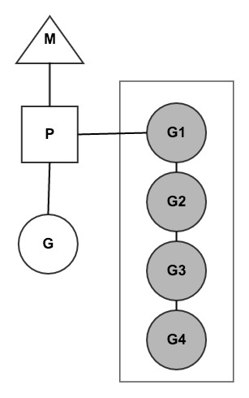

# golang wiki

## golang CSP并发模型

- CSP模型用于描述两个独立的实体通过共享的通讯channel（管道）进行通信的并发模型。

- CSP中channel是第一类对象，它不关注发送消息的实体，而关注与发送消息时使用的channel。

- Golang实现了CSP并发模型作为并发基础，底层使用goroutine作为并发实体

- goroutine非常轻量级，可以创建几十万个实体。实体间通过channel继续匿名消息传递使之解耦！

- go在语言层面实现了自动调度！屏蔽了很多内部细节，对外提供简单的语法关键字，大大简化了并发编程的思维转换和管理线程的复杂性。

  

- 其中
  - M：是内核线程
  - P：是协调调度，用于协调调度M和G的执行，内核线程只有拿到了P才能对goroutine继续调度执行，一般都是通过限定P的个数来控制golang的并发度！
  - G：是待处理的协程，包含这个goroutine的栈空间
  - G1/G2/..：灰色的背景的Gn是已经挂起的goroutine。它们被添加到执行队列中。
  - 需要等待网络IO的goroutine，当P通过epoll查询到特定的fd的时候，会重新调度起对应的，正在挂起的goroutine重新运行。
  - golang为了调度的公平性，在调度器加入了steal working算法：在一个P自己的执行队列，执行完之后，它会优先到全局的执行队列中偷G来进行处理；如果没有的话；再回到其他P的执行队列中抢G来进行处理。
  - 

### 参考资料

- [golang CSP并发模型](https://www.jianshu.com/p/36e246c6153d)

