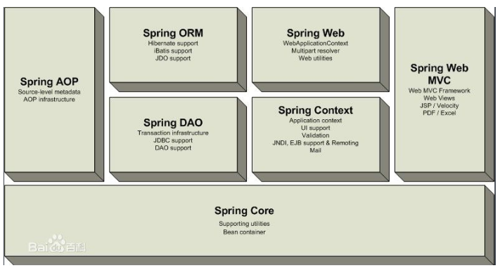
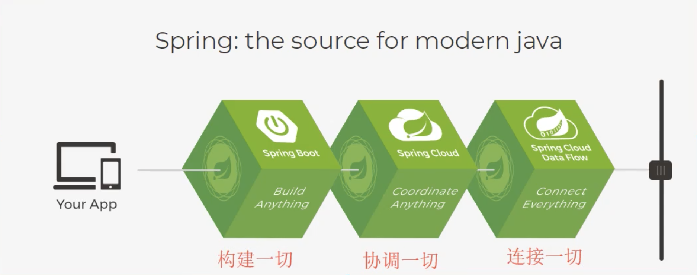

# spring

spring是如何简化java开发的？4种关键策略：

1. 基于POJO的轻量级和最小侵入性编程
2. 通过IOC，依赖注入（DI）和面向接口实现松耦合
3. 基于切面（AOP）和惯了进行声明式编程
4. 通过切面和模板减少样式代码

现代化的Java（养活了这么多的程序员）：

## springboot

核心是：自动装配！

## springcloud

- netfilx使用的，已经不维护了，但还是有很多人在使用
- springcloud Alibaba新孵化的，开发和维护中
- 

## jvm

## 参考资料

- [*Martin Fowler的[microservices](http://martinfowler.com/articles/microservices.html),*](http://blog.cuicc.com/blog/2015/07/22/microservices/)

- [读数遍：微服务论文中文版](http://blog.cuicc.com/blog/2015/07/22/microservices/)

- [Spring框架的七大模块](https://www.cnblogs.com/lanseyitai1224/p/7895767.html)