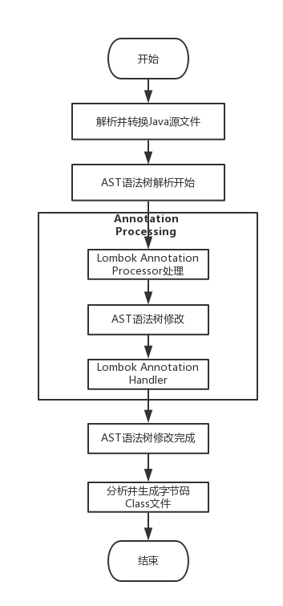

# Java技术栈学习


## 应用领域：

- 银行系统
- 支付系统
- 政企信息系统
- 大数据平台
- 网站后台
- SaaS云
- 手机APP：Android OS
- 云管理系统后台
- 电商系统后台
- 桌面工具

做分布式的复杂应用场景


## 特点

- **Java 语言是体系结构中立的：**

  Java 程序（后缀为 java 的文件）在 Java 平台上被编译为体系结构中立的字节码格式（后缀为 class 的文件），然后可以在实现这个 Java 平台的任何系统中运行。这种途径适合于异构的网络环境和软件的分发。

- **Java 语言是解释型的：**

  Java 程序在 Java 平台上被编译为字节码格式，然后可以在实现这个 Java 平台的任何系统中运行。在运行时，Java 平台中的 Java 解释器对这些字节码进行解释执行，执行过程中需要的类在联接阶段被载入到运行环境中。

- **Java 语言是多线程的：**

  在 Java 语言中，线程是一种特殊的对象，它必须由 **Thread** 类或其子（孙）类来创建。通常有两种方法来创建线程：其一，使用型构为 Thread(Runnable) 的**构造子类**将一个实现了 **Runnable** 接口的对象包装成一个线程，其二，从 Thread 类派生出子类并重写 **run** 方法，使用该子类创建的对象即为线程。值得注意的是 Thread 类已经实现了 Runnable 接口，因此，任何一个线程均有它的 run 方法，而 **run 方法中包含了线程所要运行的代码**。线程的活动由一组方法来控制。Java 语言支持多个线程的同时执行，并提供多线程之间的同步机制（关键字为 synchronized）。

- **Java 语言是动态的：**

  Java 语言的设计目标之一是适应于动态变化的环境。Java 程序需要的类能够动态地被载入到运行环境，也**可以通过网络来载入所需要的类。这也有利于软件的升级**。另外，Java 中的类有一个运行时刻的表示，能进行运行时刻的类型检查。


## Java学习的思维导图


### 历史及特点


### Object类


### Java程序设计基础


### java程序设计进阶


## 概念

- JDK：Java Development Kit，包含JRE和JVM

- JRE：Java Runtime Environment

- JVM：Java Virtual Machine

  

JAVA_HOME中有一个src.zip包，里面是java系统库的源代码！


### Java标记接口

标记接口是没有任何方法和属性的接口.它仅仅表明它的类属于一个特定的类型,供其他代码来测试允许做一些事情。目的有：

1. 建立一个公共的父接口

2. 向一个类添加数据类型?


### Java 包

一般使用公司域名倒置作为包名

```java
// www.baidu.com
package com.baidu.www; // 定义包名

import java.util.Date; // 导入包
```


### Java修饰符

Java可以使用修饰符来修饰类中方法和属性。主要有两类修饰符：

- 访问控制修饰符 : default, public , protected, private

  **default** (即默认，什么也不写）: 在同一包内可见，不使用任何修饰符。使用对象：类、接口、变量、方法。

  | 修饰符      | 当前类 | 同一包内 | 子孙类(同一包) | 子孙类(不同包)                                               | 其他包 |
  | :---------- | :----- | :------- | :------------- | :----------------------------------------------------------- | :----- |
  | `public`    | Y      | Y        | Y              | Y                                                            | Y      |
  | `protected` | Y      | Y        | Y              | Y/N（[说明](https://www.runoob.com/java/java-modifier-types.html#protected-desc)） | N      |
  | `default`   | Y      | Y        | Y              | N                                                            | N      |
  | `private`   | Y      | N        | N              | N                                                            | N      |

- 非访问控制修饰符 : final, abstract, static, synchronized


### Java运行时

**Java既是编译型语言，也是解释型语言！**


**Java 源程序与编译型运行区别**


### 变量类型

- 局部变量
- 成员变量

- **类变量**：类变量也声明在类中，方法体之外，但必须声明为 **static** 类型。


### 数据类型

| 包装类    | 基本数据类型 |
| :-------- | :----------- |
| Boolean   | boolean      |
| Byte      | byte         |
| Short     | short        |
| Integer   | int          |
| Long      | long         |
| Character | char         |
| Float     | float        |
| Double    | double       |


这种由编译器特别支持的包装称为**装箱**，所以当内置数据类型被当作对象使用的时候，编译器会把内置类型装箱为包装类。相似的，编译器也可以把一个对象**拆箱**为内置类型。Number 类属于 java.lang 包。


### Java 注解（Annotation）

Java 注解（Annotation）又称 Java 标注，是 JDK5.0 引入的一种注释机制。

Java 语言中的类、方法、变量、参数和包等都可以被标注。和 Javadoc 不同，Java 标注可以通过**反射**获取标注内容。在编译器生成类文件时，标注可以被嵌入到字节码中。Java 虚拟机可以保留标注内容，在运行时可以获取到标注内容 。 当然它也支持自定义 Java 标注。


### Java StringBuffer 和 StringBuilder 类

当对字符串进行修改的时候，需要使用 StringBuffer 和 StringBuilder 类。

和 String 类不同的是，StringBuffer 和 StringBuilder 类的对象能够被多次的修改，并且不产生新的未使用对象。


在使用 StringBuffer 类时，每次都会对 StringBuffer 对象本身进行操作，而不是生成新的对象，所以如果需要对字符串进行修改推荐使用 StringBuffer。

StringBuilder 类在 Java 5 中被提出，它和 StringBuffer 之间的最大不同在于 **StringBuilder 的方法不是线程安全的**（不能同步访问）。

由于 **StringBuilder 相较于 StringBuffer 有速度优势**，所以多数情况下建议使用 StringBuilder 类。


### JavaBean

> Java是咖啡，bean是豆子，JavaBean即咖啡豆，也就是实体的意思。

JavaBean 是一种[JAVA语言](https://baike.baidu.com/item/JAVA语言/4148931)写成的**可重用组件**。为写成JavaBean，类必须是具体的和公共的，并且具有无参数的[构造器](https://baike.baidu.com/item/构造器/9844976)。JavaBean 通过提供符合一致性设计模式的公共方法将内部域暴露成员属性，set和get方法获取。众所周知，属性名称符合这种模式，其他Java 类可以通过自省机制(**反射机制**)发现和操作这些JavaBean 的属性。

JavaBean是一种可重用的[Java组件](https://baike.baidu.com/item/Java组件/53178233)，它可以被Applet、Servlet、JSP等Java应用程序调用．也可以可视化地被Java开发工具使用。它包含**属性(Properties)、方法(Methods)、事件(Events)**等特性。


**Java IDE SDK选择：**

 


**Java-Doc注释**

```java
/**
* @Description: HelloWorld
* @Author: gzc
*/
public class HelloWorld {
    public static void main(String[] args) {
        // 输出文本
        System.out.println("Hello World");
    }
}

```

### 虚函数

Java 中其实没有虚函数的概念，它的普通函数就相当于 C++ 的虚函数，动态绑定是Java的默认行为。如果 Java 中不希望某个函数具有虚函数特性，可以加上 final 关键字变成非虚函数。


### 重写

当子类对象调用重写的方法时，调用的是子类的方法，而不是父类中被重写的方法。

要想调用父类中被重写的方法，则必须使用关键字 super。


### JPA

 JPA是Java Persistence API的简称，中文名Java持久层API，是JDK 5.0注解或XML描述对象－关系表的映射关系，并将运行期的实体[对象持久化](https://baike.baidu.com/item/对象持久化/7316192)到数据库中。

Sun引入新的JPA ORM规范出于两个原因：其一，简化现有Java EE和Java SE应用开发工作；其二，Sun希望整合ORM技术，实现天下归一。


[Spring Data JPA 中常用注解](https://www.cnblogs.com/pascall/p/10280825.html)

### Hibernate

通过整合Hibernate，我们能够以操作Java实体的方式来完成对数据的操作，通过框架的帮助，对Java实体的变更最终将自动地映射到数据库表中。

在Hibernate的帮助下，Java实体映射到数据库表数据完成之后，再进一步解决抽象各个Java实体基本的“增删改查”操作，我们通常会以泛型的方式封装一个模板Dao来进行抽象简化，但是这样依然不是很方便，我们需要针对每个实体编写一个继承自泛型模板Dao的接口，再编写该接口的实现。虽然一些基础的数据访问已经可以得到很好的复用，但是在代码结构上针对每个实体都会有一堆Dao的接口和实现。

由于模板Dao的实现，使得这些具体实体的Dao层已经变的非常“薄”，有一些具体实体的Dao实现可能完全就是对模板Dao的简单代理，并且往往这样的实现类可能会出现在很多实体上。Spring Data JPA的出现正可以让这样一个已经很“薄”的数据访问层变成只是一层接口的编写方式。比如，下面的例子：

```java
public interface UserRepository extends JpaRepository<User, Long> {

    User findByName(String name);

    @Query("from User u where u.name=:name")
    User findUser(@Param("name") String name);

}
```

我们只需要通过编写一个继承自`JpaRepository`的接口就能完成数据访问，下面以一个具体实例来体验Spring Data JPA给我们带来的强大功能。


### Lombok

Lombok是一款Java开发插件，使得Java开发者可以通过其定义的一些注解来消除业务工程中冗长和繁琐的代码，尤其对于简单的Java模型对象（POJO）。在开发环境中使用Lombok插件后，Java开发人员可以节省出重复构建，诸如hashCode和equals这样的方法以及各种业务对象模型的accessor和ToString等方法的大量时间。对于这些方法，它能够在编译源代码期间自动帮我们生成这些方法，并没有如反射那样降低程序的性能。


- 注解的执行原理图：


- lombok插件的执行流程：



## Spring框架

Spring是Java企业版（Java Enterprise Edition， JEE， 也称J2EE）的轻量级替代品，无需开发重量级的Enterprise JavaBean（EJB)，Spring为企业级Java开发提供了一种相对简单的方法，通过依赖注入和面向切面编程，用简单的Java对象（Plain Old Java Object，POJO）实现了EJB的功能。


Spring框架是由于[软件开发](https://baike.baidu.com/item/软件开发/3448966)的复杂性而创建的。Spring使用的是基本的`JavaBean`来完成以前只可能由[EJB](https://baike.baidu.com/item/EJB/144195)完成的事情。然而，Spring的用途不仅仅限于服务器端的开发。从简单性、可测试性和松耦合性角度而言，**绝大部分Java应用都可以从Spring中受益**。

◆目的：解决企业应用开发的复杂性

◆功能：使用基本的JavaBean代替EJB，并提供了更多的企业应用功能

◆范围：任何Java应用

**Spring是一个轻量级控制反转(IoC)和面向切面(AOP)的容器框架。**


主要的maven依赖模块：

```xml
spring-webmvc

spring-jdbc
```


## Spring Boot框架

通过Spring Boot，可以轻松地创建独立的，基于生产级别的基于Spring的应用程序，并且可以“直接运行”它们。大多数Spring Boot应用程序需要最少的Spring配置。


SpringBoot不是对Spring的功能增强，而是提供快速使用Spring的方式

SpringBoot还提供了大型项目中常用的例如嵌入服务器，安全、指标、健康监测、外部配置等非功能性的特性

Spring Boot 是基于 Spring Framework 来构建的，Spring Framework 是一种 J2EE 的框架（[什么是 J2EE？](https://blog.csdn.net/qq_40147863/article/details/83011705)）

Spring Boot 是一种快速构建 Spring 应用
Spring Cloud 是构建 Spring Boot 分布式环境，也就是常说的云应用
Spring Boot 中流砥柱，承上启下


### SpringBoot的核心功能

- 起步依赖：starter，本质上是一个maven项目对象模型（POM），定义了对其他库的传递依赖

  springboot项目要继承springboot的起步依赖：`spring-boot-starter-parent`

- 自动配置：@AutoConfiguration


### 快速开始

- [IDEA创建Spring Boot项目无法连接http://start.spring.io 解决方法](https://blog.csdn.net/lidai352710967/article/details/81089305)

- 热部署：

  ```xml
  <artifactId>spring-boot-devtools</artifactId>
  ```

- 代码中已经使用了yml参数配置，在yml中配置时编译器可以自动补全：

  ```xml
  <artifactId>spring-boot-configuration-processor</artifactId>
  ```

- 查找自动配置的参数名称：

  ```bash
  # Maven: spring-boot-
  /META-INF/spring-configuration-metadata.json
  ```

- todo: 基础MyBatis、Junit、SpringData


### mvc注解


**SpringBoot：**

　　SpringBoot本身更倾向于快速开发,快速构建,快速集成的这样的功能，通过用MAVEN依赖的继承方式，帮助我们快速整合第三方常用框架，完全采用注解化（使用注解方式启动SpringMVC），简化XML配置，内置HTTP服务器（Tomcat，Jetty），最终以Java应用程序进行执行。

**SpringCloud：** 

　　SpringCloud是一整套的微服务解决方案,目前完整的微服务框架，它是是一系列框架的有序集合。它只是将目前各家公司开发的比较成熟、经得起实际考验的服务框架组合起来，通过SpringBoot风格进行再封装屏蔽掉了复杂的配置和实现原理，最终给开发者留出了一套简单易懂、易部署和易维护的分布式系统开发工具包。它利用Spring Boot的开发便利性巧妙地简化了分布式系统基础设施的开发，如服务发现注册、配置中心、消息总线、负载均衡、断路器、数据监控等，都可以用SpringBoot的开发风格做到一键启动和部署。


## Spring Cloud微服务

Spring Cloud 基于 Spring Boot，为微服务体系开发中的架构问题，提供了**一整套的解决方案**——服务注册与发现，服务消费，服务保护与熔断，网关，分布式调用追踪，分布式配置管理等。

> Spring Boot 是 Spring 的一套快速配置脚手架，使用默认大于配置的理念，用于快速开发单个微服务。
>
> 构建分布式系统不需要复杂和容易出错。Spring Cloud 为最常见的分布式系统模式提供了一种简单且易于接受的编程模型，帮助开发人员构建有弹性的、可靠的、协调的应用程序。Spring Cloud 构建于 Spring Boot 之上，使得开发者很容易入手并快速应用于生产中。


### Spring Cloud 完整技术：


### Spring Cloud 组件架构：


**流程：**

- 请求统一通过 API 网关（Zuul）来访问内部服务。
- 网关接收到请求后，从注册中心（Eureka）获取可用服务。
- 由 Ribbon 进行均衡负载后，分发到后端具体实例。
- 微服务之间通过 Feign 进行通信处理业务。
- Hystrix 负责处理服务超时熔断。
- Turbine 监控服务间的调用和熔断相关指标。


### Spring Cloud工具框架

- **Spring Cloud Config 配置中心**，利用 Git 集中管理程序的配置。
- Spring Cloud Netflix 集成众多Netflix的开源软件。
- **Spring Cloud Netflix Eureka 服务中心**（类似于管家的概念，需要什么直接从这里取，就可以了），一个基于 REST 的服务，用于定位服务，以实现云端中间层服务发现和故障转移。
- **Spring Cloud Netflix Hystrix 熔断器**，容错管理工具，旨在通过熔断机制控制服务和第三方库的节点，从而对延迟和故障提供更强大的容错能力。
- **Spring Cloud Netflix Zuul 网关**，是在云平台上提供动态路由，监控，弹性，安全等边缘服务的框架。Web 网站后端所有请求的前门。
- Spring Cloud Netflix Archaius 配置管理 API，包含一系列配置管理API，提供动态类型化属性、线程安全配置操作、轮询框架、回调机制等功能。
- **Spring Cloud Netflix Ribbon 负载均衡**。
- **Spring Cloud Netflix Fegin REST客户端**。
- **Spring Cloud Bus 消息总线**，利用分布式消息将服务和服务实例连接在一起，用于在一个集群中传播状态的变化。
- Spring Cloud for Cloud Foundry 利用 Pivotal Cloudfoundry 集成你的应用程序。
- Spring Cloud Cloud Foundry Service Broker 为建立管理云托管服务的服务代理提供了一个起点。
- **Spring Cloud Cluster 集群工具**，基于 Zookeeper, Redis, Hazelcast, Consul 实现的领导选举和平民状态模式的抽象和实现。
- Spring Cloud Consul 基于 Hashicorp Consul 实现的服务发现和配置管理。
- **Spring Cloud Security 安全控制**，在 Zuul 代理中为 OAuth2 REST 客户端和认证头转发提供负载均衡。
- **Spring Cloud Sleuth 分布式链路监控**，SpringCloud 应用的分布式追踪系统，和 Zipkin，HTrace，ELK 兼容。
- Spring Cloud Data Flow 一个云本地程序和操作模型，组成数据微服务在一个结构化的平台上。
- **Spring Cloud Stream 消息组件**，基于 Redis，Rabbit，Kafka 实现的消息微服务，简单声明模型用以在 Spring Cloud 应用中收发消息。
- Spring Cloud Stream App Starters 基于 Spring Boot 为外部系统提供 Spring 的集成。
- Spring Cloud Task 短生命周期的微服务，为 Spring Booot 应用简单声明添加功能和非功能特性。
- Spring Cloud Task App Starters。
- Spring Cloud Zookeeper 服务发现和配置管理基于 Apache Zookeeper。
- Spring Cloud for Amazon Web Services 快速和亚马逊网络服务集成。
- Spring Cloud Connectors 便于PaaS应用在各种平台上连接到后端像数据库和消息经纪服务。
- Spring Cloud Starters （项目已经终止并且在 Angel.SR2 后的版本和其他项目合并）
- **Spring Cloud CLI 命令行工具**，插件用 Groovy 快速的创建 Spring Cloud 组件应用。


### 服务发现框架—Eureka

Eureka是基于REST（代表性状态转移）的服务，主要在AWS云中用于定位服务，以实现负载均衡和中间层服务器的故障转移。我们称此服务为Eureka服务器。Eureka还带有一个基于Java的客户端组件Eureka Client，它使与服务的交互变得更加容易。客户端还具有一个内置的负载平衡器，可以执行基本的循环负载平衡。在Netflix，更复杂的负载均衡器将Eureka包装起来，以基于流量，资源使用，错误条件等多种因素提供加权负载均衡，以提供出色的弹性。


**`Netflix` 官方给出的 `Eureka` 架构图：**


**RestTemplate是什么**

**`RestTemplate`是`Spring`提供的一个访问Http服务的客户端类**，就是微服务之间的调用是使用的 `RestTemplate` 。比如这个时候我们 消费者B 需要调用 提供者A 所提供的服务我们就需要这么写。例如：

```java
@Autowired
private RestTemplate restTemplate;
// 这里是提供者A的ip地址，但是如果使用了 Eureka 那么就应该是提供者A的名称
private static final String SERVICE_PROVIDER_A = "http://localhost:8081";
 
@PostMapping("/judge")
public boolean judge(@RequestBody Request request) {
    String url = SERVICE_PROVIDER_A + "/service1";
    return restTemplate.postForObject(url, request, Boolean.class);
}
```

`Eureka` 框架中的 **注册**、**续约** 等，底层都是使用的 `RestTemplate` 。


### 负载均衡之 Ribbon

`Ribbon` 是 `Netflix` 公司的一个开源的负载均衡 项目，是一个客户端/进程内负载均衡器，**运行在消费者端**。

`Ribbon` 是运行在消费者端的负载均衡器的工作原理： `Consumer` 端获取到了所有的服务列表之后，在其**内部**使用**负载均衡算法**，进行对多个系统的调用。

`Nignx` 是一种**集中式**的负载均衡器：**将所有请求都集中起来，然后再进行负载均衡**


**负载均衡算法:**

- **RoundRobinRule**：轮询策略。`Ribbon` 默认采用的策略。若经过一轮轮询没有找到可用的 `provider`，其最多轮询 10 轮。若最终还没有找到，则返回 null。默认的。
- **RandomRule**: 随机策略，从所有可用的 provider 中随机选择一个。
- **RetryRule**: 重试策略。先按照 RoundRobinRule 策略获取 provider，若获取失败，则在指定的时限内重试。默认的时限为 500 毫秒。
- ...


### Hystrix 服务降级熔断器


### 什么是 Open Feign

使用 `Eureka + RestTemplate + Ribbon` 还是不方便，服务调用每次都要这样：

```java
@Autowired
private RestTemplate restTemplate;
// 这里是提供者A的ip地址，但是如果使用了 Eureka 那么就应该是提供者A的名称
private static final String SERVICE_PROVIDER_A = "http://localhost:8081";
 
@PostMapping("/judge")
public boolean judge(@RequestBody Request request) {
    String url = SERVICE_PROVIDER_A + "/service1";
    // 是不是太麻烦了？？？每次都要 url、请求、返回类型的 
    return restTemplate.postForObject(url, request, Boolean.class);
}
```

这样每次都调用 `RestRemplate` 的 `API` 太麻烦，OpenFeign实现了像**调用原来代码一样进行各个服务间的调用**，将被调用的服务代码映射到消费者端。

> OpenFeign 也是运行在消费者端的，使用 Ribbon 进行负载均衡，所以 OpenFeign 直接内置了 Ribbon。

在导入了 `Open Feign` 之后写 `Consumer` 端代码：

```java
// 使用 @FeignClient 注解来指定提供者的名字
@FeignClient(value = "eureka-client-provider")
public interface TestClient {
    // 这里一定要注意需要使用的是提供者那端的请求相对路径，这里就相当于映射了
    @RequestMapping(value = "/provider/xxx",
    method = RequestMethod.POST)
    CommonResponse<List<Plan>> getPlans(@RequestBody planGetRequest request);
}
```

然后我们在 `Controller` 就可以像原来调用 `Service` 层代码一样调用它：

```java
@RestController
public class TestController {
    // 这里就相当于原来自动注入的 Service
    @Autowired
    private TestClient testClient;
    // controller 调用 service 层代码
    @RequestMapping(value = "/test", method = RequestMethod.POST)
    public CommonResponse<List<Plan>> get(@RequestBody planGetRequest request) {
        return testClient.getPlans(request);
    }
}
```


### 服务路由和过滤器--zuul

ZUUL 是从设备和 web 站点到 Netflix 流应用后端的所有请求的前门。作为边界服务应用，ZUUL 是为了实现动态路由、监视、弹性和安全性而构建的。

网关有的功能，`Zuul` 基本都有。而 `Zuul` 中最关键的就是 **路由和过滤器** 了，在官方文档中 `Zuul` 的标题就是：**Router and Filter : Zuul**

> 网关是系统唯一对外的入口，介于客户端与服务器端之间，用于对请求进行**鉴权**、**限流**、 **路由**、**监控**等功能。


**路由**


`Zuul` 需要向 `Eureka` 进行注册，就能拿到所有 `Consumer` 的元数据(名称，ip，端口)信息，然后做**路由映射**。

> 例如：原来用户调用 `Consumer1` 的接口 `localhost:8001/studentInfo/update` 
>
> 现在可以这样调用：`localhost:9000/consumer1/studentInfo/update` 

 `Zuul` 基本配置

```config
server:
  port: 9000
eureka:
  client:
    service-url:
      # 这里只要注册 Eureka 就行了
      defaultZone: http://localhost:9997/eureka
```

在启动类上加入 `@EnableZuulProxy` 注解就行了。


**过滤器**

类型：Pre、Routing、Post。前置Pre就是在请求之前进行过滤，Routing路由过滤器就是我们上面所讲的路由策略，而Post后置过滤器就是在 `Response` 之前进行过滤的过滤器。可以实现 **权限校验**， **灰度发布** 等等


**令牌桶限流**

有个桶，如果里面没有满那么就会以一定 **固定的速率** 会往里面放令牌，一个请求过来首先要从桶中获取令牌，如果没有获取到，那么这个请求就拒绝，如果获取到那么就放行。


### 配置管理—Config

**既能对配置文件统一地进行管理，又能在项目运行时动态修改配置文件**

> 对于分布式系统而言就不应该去每个应用下去分别修改配置文件，再者对于重启应用来说，服务无法访问所以直接抛弃了可用性。

`SpringCloud Config` 为分布式系统中的外部化配置提供服务器和客户端支持。使用 `Config` 服务器，可以在中心位置管理所有环境中应用程序的外部属性。


### Spring **Cloud** Bus

用于将服务和服务实例与分布式消息系统链接在一起的事件总线。在集群中传播状态更改很有用（例如配置更改事件）。

可以简单理解为 `Spring Cloud Bus` 的作用就是**管理和广播分布式系统中的消息**，也就是消息引擎系统中的广播模式。当然作为 **消息总线** 的 `Spring Cloud Bus` 可以做很多事而不仅仅是客户端的配置刷新功能。

而拥有了 `Sprin Cloud Bus` 之后，只需要创建一个简单的请求，并且加上 `@ResfreshScope` 注解就能进行配置的动态修改了：

<<<<<<< HEAD

=======

>>>>>>> b503bac5315c069d8495cb876baa456611e39682


### SpringData

**SpringData**简化了基于Spring框架应用的数据库访问，包括对关系型、非关系型、Map-Reduce、云数据服务等都支持，它具备ORM框架的对象关系映射的功能，**提供统一的Repository接口实现CRUD**、分页、排序等相关操作，也提供了统一的模板类。


#### 优点：

1. 基本的sql语句不需要写，只需要继承JpaRepository接口，按照规范编写接口方法名即可
2. 对于不想按照规范对接口方法名进行规范的写，提供了@Query()接口
3. 提供了快速分页并排序的接口

####  **缺点：**   

           1. 即使提供了@Query，但是对于某些查询，还是无能无力，比如某个需求，多表联查，只取其中一列
           2. 多表查询很是无力，远远比不上mybatis


#### 统一的Repository接口：

```java
Repository<T, ID extends Serializable>; // 统一接口
RevisionRepository<T, ID extends Serializable, N extends Number & Comparable<N>>; // 基于乐观锁机制
CrudRepository<T, ID extends Serializable>; // 基于CRUD操作
PagingAndSortingRepository<T, ID extends Serializable>; // 基本CRUD及分页
```


> 不论你是要访问什么数据存储产品，它们的编码方式几乎都是一样的！这就是Spring Data这个项目充满魅力的地方！通过对数据访问操作的抽象来屏蔽细节，用不同子项目的方式去实现细节。让开发者只需要学会使用Spring Data，就能方便快捷的学会对各种数据存储的操作。所以，对于Spring Data，我是强烈推荐Java开发者们可以学、甚至读一下源码的重要框架。虽然，目前来说很多大型互联网公司并不会选择它（性能考量居多，能真正用好它的人不多）作为主要的开发框架，但是其背后的抽象思想是非常值得我们学习的。并且，在做一些非高并发项目的时候，这简直就是一个快捷开发神器，它可以帮助我们少写非常多的代码！


### Mybatis

Mybatis是一种**半自动的ORM框架**，它简单易上手，没有第三方依赖，支持对象与数据库的ORM关系映射，将sql代码与业务代码分离，使得开发人员可以更自如的写出高效的sql，不过反过来说不像SpringData 这种全自动的ORM框架，它需要自己实现sql语句，对开发人员的sql编写能力要求高，虽然将sql代码写在**xml**文件里方便了修改和编写，可这同时也降低了可读性。

#### 优点 ：

1. 可以处理比spring data 更加复杂的sql语句，可以指定查询某些列的信息，对分页处理做的也是很好的
2. 上手难度低
3. 对于dao层的接口命名没有spring data的严格
4. 可以对需要的列名指定查询
5. 可以将查询的结果直接映射到对象中
6. 支持编写动态sql语句（这一点是spring data无法比拟的）

#### 缺点：

1. SQL语句的编写工作量较大，尤其是字段多、关联表多时，更是如此，对开发人员编写SQL语句的功底有一定要求。
2. SQL语句依赖于数据库，导致数据库移植性差，不能随意更换数据库。


### S3 SDK

Amazon Simple Storage Service 是**互联网存储解决方案**。该服务旨在降低开发人员进行网络规模级计算的难度。

Amazon S3 提供了一个简单 Web 服务接口，可用于随时在 Web 上的任何位置存储和检索任何数量的数据。此服务让所有开发人员都能访问同一个具备高扩展性、可靠性、安全性和快速价廉的数据存储基础设施， Amazon 用它来运行其全球的网站网络。此服务旨在为开发人员带来最大化的规模效益。


### 如何才算掌握Java

Java本身是一种设计的非常简单，非常精巧的语言，所以Java背后的原理也很简单，归结起来就是两点：
1、JVM的内存管理
	理解了这一点，所有和对象相关的问题统统都能解决
2、JVM Class Loader
　理解了这一点，所有和Java相关的配置问题，包括各种App Server的配置，应用的发布问题统统都能解决


## Java VS C#

| 比较项         | 现有技术栈      | Java技术栈                       |
| -------------- | --------------- | -------------------------------- |
| web代理服务器  | IIS             | Tomcat                           |
| web微服务框架  | ABP Framework   | spring-boot                      |
| 数据库ORM访问  | EntityFramework | spring-boot-jpa（基于Hibernate） |
| 依赖项配置工具 | nuget           | maven                            |
| 依赖项配置文件 | ？              | pom.xml                          |
|                |                 |                                  |
|                |                 |                                  |


### Todos

- 使用u+的commonlib建立工程

- 做现有技术栈的Java翻译

- 打包部署到新机上运行

  |      |      |      |
  | ---- | ---- | ---- |
  | 日志 |      |      |
  |      |      |      |
  |      |      |      |
  |      |      |      |
  |      |      |      |

  


### 数据库ORM调研：

- 数据库表变动的migration
- SQL控制语句
- 数据库的初始化


## GitHub示例代码推荐

- [spring-boot-examples](https://github.com/ityouknow/spring-boot-examples.git)

- [SpringBoot-Learning]( https://github.com/dyc87112/SpringBoot-Learning.git)


## 参考资料

- [java思维导图](https://blog.csdn.net/qq_42370505/article/details/109114725)
- [Java 微服务架构选型](https://www.cnblogs.com/zengyjun/p/10309391.html)
- [Spring Cloud 入门总结](https://zhuanlan.zhihu.com/p/95696180?from_voters_page=true)
- [SpringData JPA和Mybatis的优缺点](https://blog.csdn.net/worshipme/article/details/107369640)
- [Spring思维导图，让spring不再难懂](https://my.oschina.net/u/3080373/blog/891918)
- [微服务、SpringBoot和SpringCloud的关系和区别](https://www.cnblogs.com/wwct/p/12942982.html)
- [Spring Boot -01- 快速入门篇（图文教程）](https://blog.csdn.net/qq_40147863/article/details/84194493)
- [IDEA如何在项目中快速添加Maven依赖](https://cloud.tencent.com/developer/article/1482956)
- [一步一步学Spring Boot](https://blog.csdn.net/huangwenyi1010/article/details/76359275)
- [Gradle和Maven性能对比](https://blog.csdn.net/u011054333/article/details/103221226)
- [idea如何打包项目(java)](https://www.cnblogs.com/july7/p/11473751.html)
- [Spring Boot 2.x基础教程：使用Spring Data JPA访问MySQL](https://blog.didispace.com/spring-boot-learning-21-3-4/)
- [Java开发神器Lombok的使用与原理](https://blog.didispace.com/java-lombok-how-to-use/)
- [cnblogs-kuangshen-SpringBoot系列](https://www.cnblogs.com/hellokuangshen/tag/SpringBoot%E7%B3%BB%E5%88%97/)
- [使用spring JPA访问MySQL数据](https://spring.io/guides/gs/accessing-data-mysql/)
- [运行原理探究](https://www.cnblogs.com/hellokuangshen/p/12450327.html)