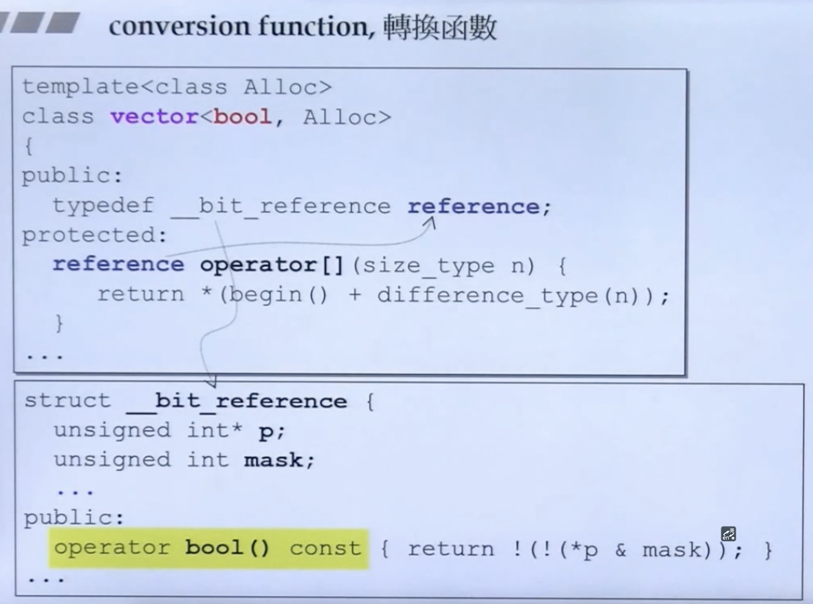
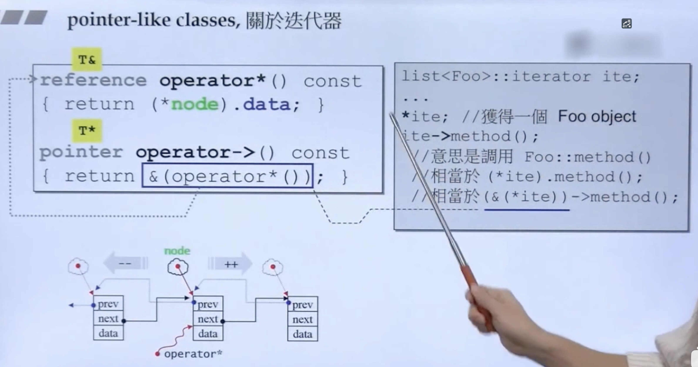
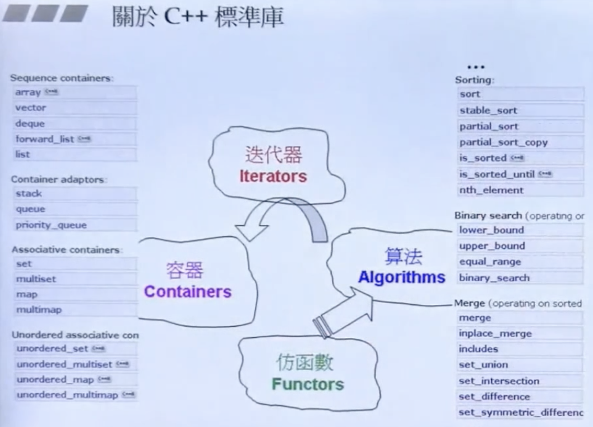
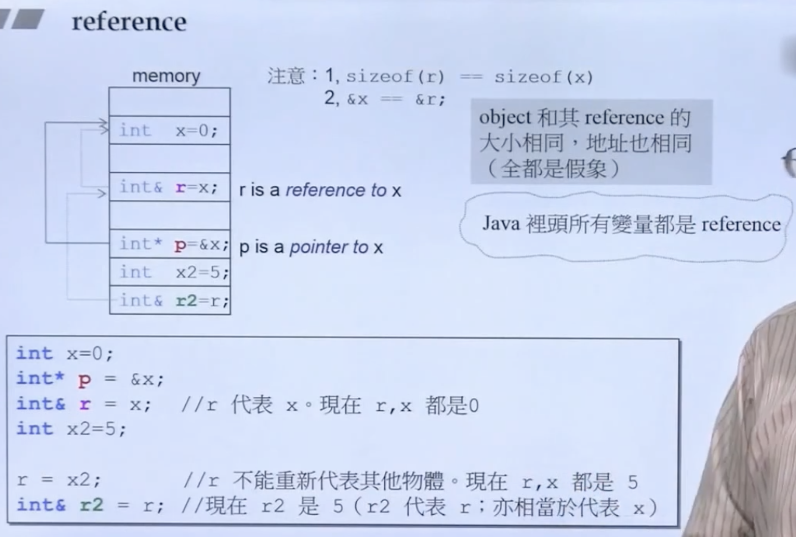
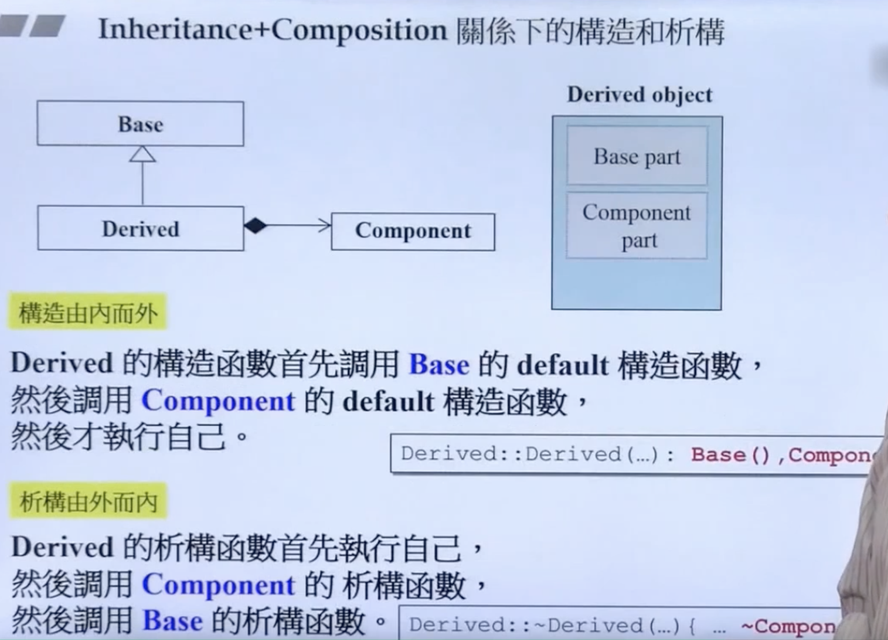
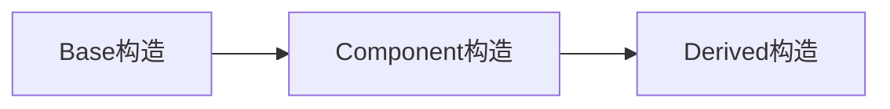
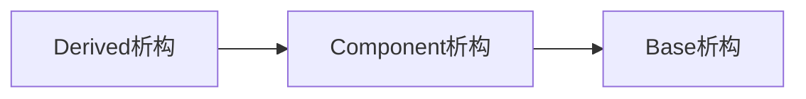

# C++面向对象高级编程(下)

## function conversion 转换函数



转换函数有两个方向的转换，都可以。上栗是反向转。有偏特化概念

## explicit

明白的，明确的；

告诉编译器不要暗度陈仓自动的做些什么事情

```c++
explict Fraction(int num, int den=1);
```


## pointer-like classes




## specialization 模板特化

特化就是泛化的反面，泛化就是泛型编程，特化就是反之：面对独特的类型做特殊的设计

```c++
// 泛化
template <class Key>
struct hash {};

// 特化
template<>
struct hash<char>
{
	size_t operator()(char x) const { return x; }
};

template<>
struct hash<int>
{
	size_t operator()(int x) const { return x; }
};
```

上面的是全泛化（full generalization）。


模板偏特化（partial generalizaion)

偏特化分为两种：

- 个数上的偏

  ```c++
  template <typename T, typename Alloc=...>
  class vector
  {
  	...
  };
  
  template<typename Alloc=...>
  class vector<bool, Alloc> // T被偏特化为bool，个数的偏
  {
  	...
  };
  ```

  

- 范围上的偏

  ```c++
  template <typename T>
  class C {...}; // 模板泛化
  
  template <typename T>
  class C<T*> {...}; //模板偏特化（范围偏，泛化中多了个特殊的指针型模板）
  
  {
    C<string> obj1;
    C<string*> obj2;
  }
  ```


## 标准库



```c++
// 确认C++版本：macro __cpluscplus 此值是如何编译器都要设的值
{
  cout << __cpluscplus;
}
// 201103
```


## ranged-base for

```c++
vector<int> vec;
for (auto& elem : vec) { // pass by reference
  elem *= 3;
}
```


## reference

> 侯捷：引用就是指针！因为，所有的编译器实现引用的方式，都是用pointer去做！
>
> 或者说，reference就是const类型的pointer！
>
> 地址就是一种指针！指针就是地址的一种形式！



`reference` 通常不用于声明变量，而用于参数类型（`parameter type`）和返回类型（`return type`）的描述。


以下被视为 `same signature`（不能并存！）：

```c++
double imag(const double& im) { ... }
double imag(const double  im) { ... } 	// Ambiguity
```

const的成员函数是算作函数签名的一部分！


## 构造和析构顺序

构造由内而外

析构由外而内







