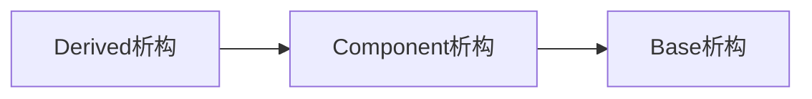
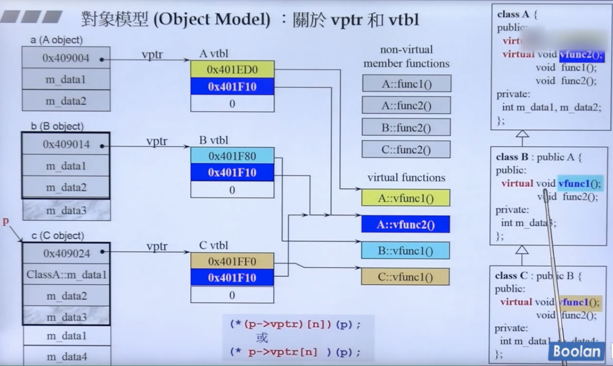
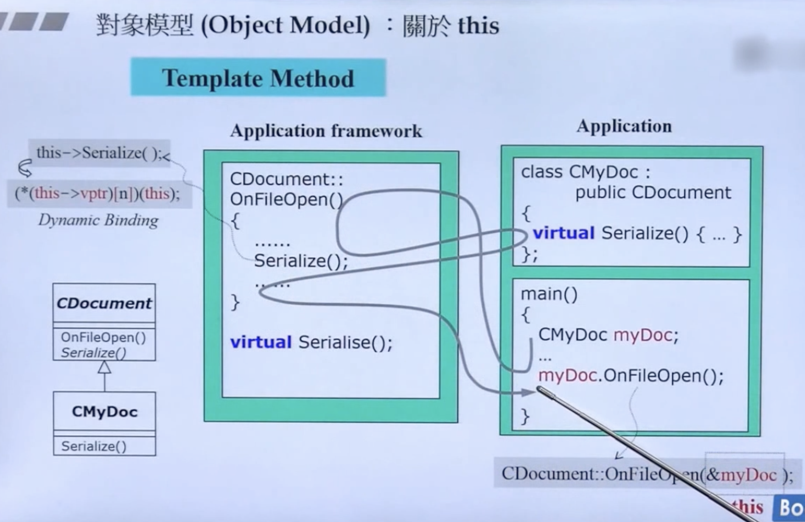
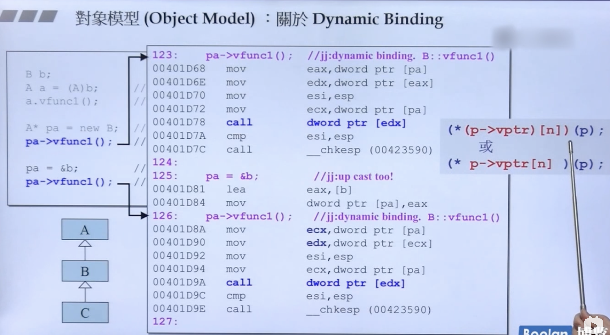
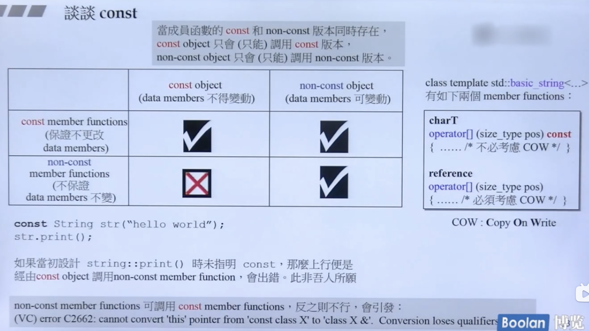
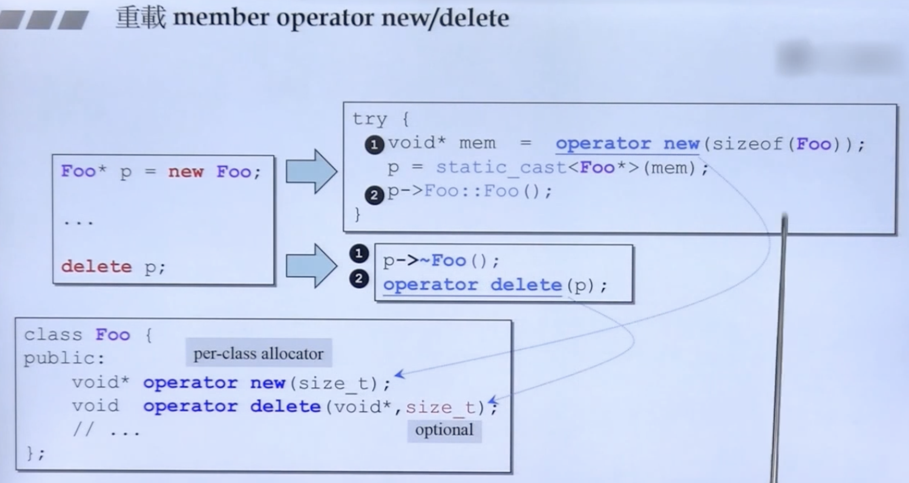
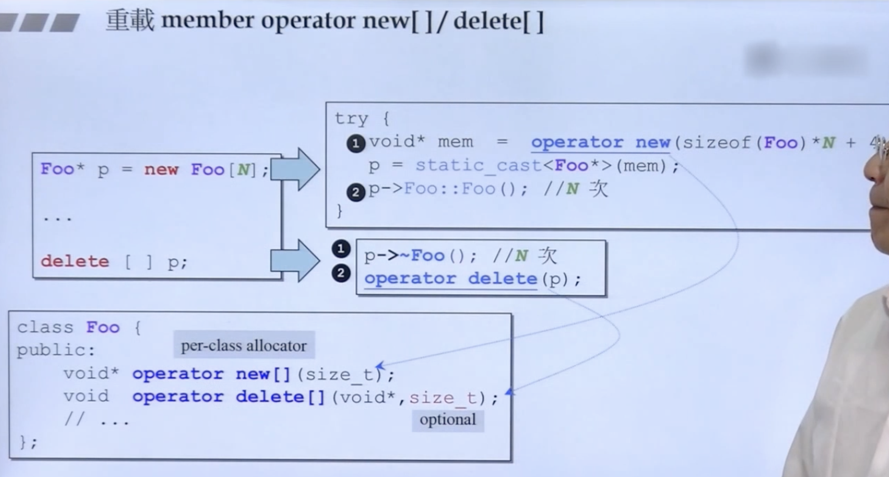
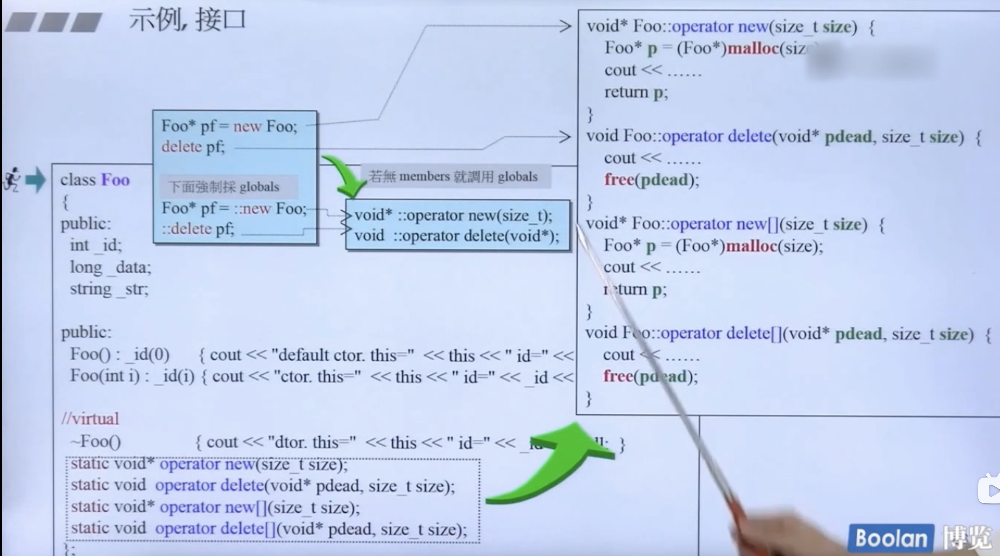

# C++面向对象高级编程(下)

## function conversion 转换函数


转换函数有两个方向的转换，都可以。上栗是反向转。有偏特化概念

## explicit

明白的，明确的；

告诉编译器不要暗度陈仓自动的做些什么事情

```c++
explict Fraction(int num, int den=1);
```


## pointer-like classes


## specialization 模板特化

特化就是泛化的反面，泛化就是泛型编程，特化就是反之：面对独特的类型做特殊的设计

```c++
// 泛化
template <class Key>
struct hash {};

// 特化
template<>
struct hash<char>
{
	size_t operator()(char x) const { return x; }
};

template<>
struct hash<int>
{
	size_t operator()(int x) const { return x; }
};
```

上面的是全泛化（full generalization）。


模板偏特化（partial generalizaion)

偏特化分为两种：

- 个数上的偏

  ```c++
  template <typename T, typename Alloc=...>
  class vector
  {
  	...
  };
  
  template<typename Alloc=...>
  class vector<bool, Alloc> // T被偏特化为bool，个数的偏
  {
  	...
  };
  ```

  

- 范围上的偏

  ```c++
  template <typename T>
  class C {...}; // 模板泛化
  
  template <typename T>
  class C<T*> {...}; //模板偏特化（范围偏，泛化中多了个特殊的指针型模板）
  
  {
    C<string> obj1;
    C<string*> obj2;
  }
  ```


## 标准库


```c++
// 确认C++版本：macro __cpluscplus 此值是如何编译器都要设的值
{
  cout << __cpluscplus;
}
// 201103
```


## ranged-base for

```c++
vector<int> vec;
for (auto& elem : vec) { // pass by reference
  elem *= 3;
}
```


## reference

> 侯捷：引用就是指针！因为，所有的编译器实现引用的方式，都是用pointer去做！
>
> 或者说，reference就是const类型的pointer！
>
> 地址就是一种指针！指针就是地址的一种形式！


`reference` 通常不用于声明变量，而用于参数类型（`parameter type`）和返回类型（`return type`）的描述。


以下被视为 `same signature`（不能并存！）：

```c++
double imag(const double& im) { ... }
double imag(const double  im) { ... } 	// Ambiguity
```

const的成员函数是算作函数签名的一部分！


## 构造和析构顺序

构造由内而外

析构由外而内





## vptr和vtbl

继承时重写`override`的实现：




多态的实现：


父子类的多态实例（MFC）：




vtbl: virtual table, table里面放的都是函数指针！指向虚函数所在的位置！此处叫动态绑定！而不再是C语言里的 `call xxx()`的静态绑定！

> 虚指针指向一个虚函数表，虚函数表里保存着每个对象锁含的虚函数的地址

C++类中的所有成员函数，都有个隐藏参数 `this`，实现了多态的指向。


## 动态绑定dynamic binding



```c++
B b;
A a = (A)b; // 对象的强制转换
a.vfunc1(); // 此处调用的是对象A的vfunc1，静态绑定，因为用的不是指针，从下文编译器的汇编执行代码可以逻辑推演出来
```


## const

- 非常量对象不能调用非常量成员函数

  |                                                           | const object<br />(data members 不得变动) | non-const object<br />(data memebers 可变动) |
  | --------------------------------------------------------- | ----------------------------------------- | -------------------------------------------- |
  | const member functions<br />(保证不更改 data memebers)    | 可                                        | 可                                           |
  | non-const member functions<br />(不保证data memebers不变) | 否                                        | 否                                           |

  ```c++
  const String str("hello"); // 此处为const对象
  str.print(); // 此处的print()必须为String的const成员函数，否则此处报错！不应该！
  						 // 因为print()语义是不会修改成员变量的，理当为const成员函数，设计才够合格。
  ```

  



- `copy on write` 重载的`[]`，上面的一个是读场景，下面一个是写场景
- 如果是常量字符串，调用`[]`，调用的会是上面的那个


## new delete

- 代码中使用的 `new`、`delete` 都是expression，表达式

- new的内部实现的第一个步骤 `operator new`是new操作符重载，这一步的内部实现是 `malloc`。同理 `delete`。（free..)

- new先分配内存，再执行构造函数

- 我们自己设计的class，可以重载 new、delete，用于内存管理和内存池设计

  ```c++
  // 重载operator new，operator delete，operator new[]，operator delete
  
  void* myAlloc(size_t size) {
  	return malloc(size);
  }
  
  void myFree(void* ptr) {
  	return free(ptr);
  }
  
  //它们不可用被声明于一个Namespace内
  inline void* operator new(size_t size) {
  	cout << "global new()\n";
  	return myAlloc(size);
  }
  
  inline void* operator new[](size_t size) {
  	cout << "global new[]()\n";
  	return myAlloc(size);
  }
  
  
  inline void* operator delete(void* ptr) {
  	cout << "global delete()\n";
  	return myFree(size);
  }
  
  inline void* operator delete[](void* ptr) {
  	cout << "global delete[]()\n";
  	return myFree(size);
  }
  ```

  




- 接管之后，做一个内存池的设计




示例：




内存分配：


- 其中`size:4`表示array的counter，数组元素个数的计数器，譬如上图里记录的是5，下图记录的是6
- 下图的 `virtual dtor` 会多出一根指针，内存多出4个bytes
- 上图：4 + 4 * 3 * 5 =64 ，数组元素个数+4个字节*3个成员变量 * 5 个对象，下图多了个虚指针


## 栗子

对于类中的placement new，如果在ctor中的异常，并不会自动调用 placement delete！

```c++
class Foo {
public:
  Foo() {cout << "Foo:Foo()" << endl; throw "ctor error!"}
  
  void* operator new(size_t size) {
    return malloc(size);
  }
  
  void operator delete(void*, size_t) {
    cout << "operator delete()" << endl;
  }
}
```

