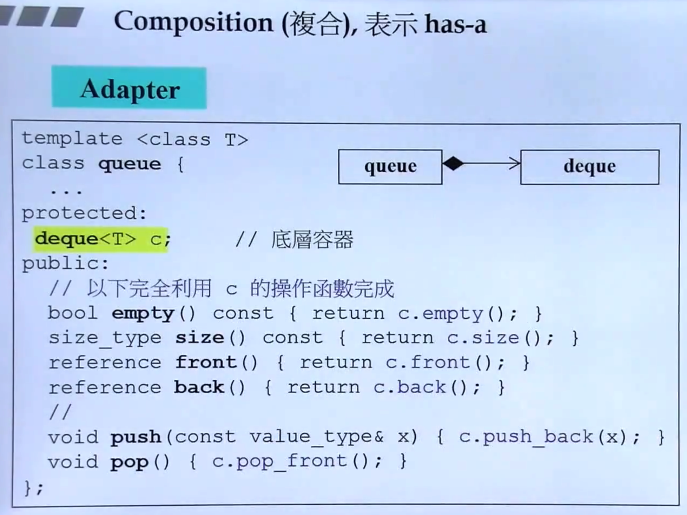

# C++面向对象高级编程

C++ 98：1.0

C++ 11：2.0

《Effective C++ 中文版 改善程序技术与设计思维的55个有效方法--侯捷》

《STL 源码剖析 --侯捷》


## 拷贝构造 & 拷贝赋值

`String`类:

```c++
class String
{
public:
  String(const char* cstr=0);
  // 以下三个为：Big Three
  String(const String& str);
  String& operator = (const String& str);
  ~String();
  char* get_c_str() const { return m_data};
private;
  char* m_data;
};
```

```c++
inline 
String::String(const char* cstr=0) 
{
  if (cstr) 
  {
    m_data = new char[strlen(cstr)+1];
    strcpy(m_data, cstr);
  }
  else 
  {
    m_data = new char[1];
    *m_data = '\0';
  }
}

String::~String() 
{
  delte [] m_data;
}

inline 
String::String(const String& str)
{
  // 直接取另一个object的private data：兄弟之间互为friend
  m_data = new char[strlen(str.m_data)+1];
  strcpy(m_data, str.m_data);
}

inline
String& String::operator=(const String& str)
{
  if (this === &str) // 检查自我赋值，如果是self assignment，但未检查，下面的代码会出错
    return *this;
  
  delete[] m_data;
  m_data = new char[strlen(str.m_data)+1];
  strcpy(m_data, str.m_data);
  return *this;
}
```


使用 `String`:

```c++
int main() {
  String s1();
  String s2("hello");
  // 拷贝构造
  String s3(s1);
  // 拷贝赋值 重载=符号
  s3 = s2;
}
```

- 如果类中没有写 拷贝构造 和 拷贝赋值 函数，编译器就会给出默认的，机制是一个bit一个bit的忠实的做内存拷贝

- 如果类中有指针型的成员变量，就需要明确给出 拷贝构造 和 拷贝赋值 函数，以免在被使用的时候，出现浅拷贝（理当是深拷贝）

  > class with pointer members must have copy ctor and copy op=


## 单例Singleton

```c++
class A {
public:
  static A& getInstance();
  setup() {...}
private:
  A();
  A(const A& rhs);
  ...
};

A& A::getInstance()
{
  static A a;
  return a;
}

// 使用
A::getInstance().setup();
```


## 复数类complex

> 此示例来自于 `STL` 源码，感谢 侯捷！

```c++
class complex
{
public:
  complex(double r=0, double i=0)
    : re(r), im(i)
    {}
  // return by reference 尽量
  complex& operator += (const complex&);
  double real() const {return re;}
  double imag() const {return im;}
private:
  double re, im;
  
  // 友元
  // do assignment plus 
  // 注意：第一个参数为引用，第二个参数为const引用！
  friend complex& __doapl (complex*, const complex&);
}
```

使用：

```c++
{
  const complex c1(2,1);
  cout << c1.real(); // 如果real()不是const成员函数，此处会报错！
  cout << c1.imag();
}
```

> 传参时，尽量都穿引用，因为引用是广义的指针，传的时候，只占4个字节的空间，更快。
>
> 如果不希望参数被修改，就传：`pass by reference to const`


## 操作符重载

```c++
ostream& operator << (ostream& os, const complex& x)
{
  return os << real(x) << ',' << imag(x);
}
```


注意上面是全局函数，非成员函数。

`<<` 操作符的重载，必须是全局函数，不可为成员函数。`<<` 是作用在左边的操作数上（c++就没有作用在右边的语法）

`<<` 是很多年前就有的，只认识当时既有的，触发修改标准库的`ostream`实现

```c++
inline complex conj(const complex& x) // 共轭复数：实部相等，虚部相反
{
	return complex(real(x), -imag(x));  
}

ostream& operator << (ostream& os, const complex& x) // 不可为const成员函数；注意返回类型！可看下面的使用方式！
{
  return os << '(' << real(x) << ',' << img(x) << ')';
}

// use
{
  complex c1(2,1);
  cout << conj(c1); // 注意此句！ (2,-1)
  cout << c1 << conj(c2); // (2,1)(2,-1)
}
```


## 友元

```c++
inline complex&
  __doapl(complex* ths, const complex& r) 
{
  // 自由取得friend的private成员
  ths->res += r.re;
  ths->im += r.im;;
  return *ths;
}
```

**相同class的各个object互为friend（友元）**

```c++
class complex
{
...
int func(const complex& param) { return param.re + param.im};
}

{
  complex c1(2,1);
  complex c2;
  c2.func(c1); // focus it !
}
```


### return by reference

好处：传递者无需知道接收者是以 `reference`接收

```c++
inline complex&
  __doapl(complex* ths, const complex& r)
{
  ...
  return *ths;
}

inline complex&
  complex::operator += (const complex& r)
{
  return __doapl(this, r);
}

complex c1(2,1);
complex c2(5);
c2 += c1;
c3 += c2 += c1; // 注意：+=的返回值不可为void，需要为complex&
```


注意：`typename()` 表示要创建的是临时对象，例如 `int(i)`, `complex(1,2)`


## 类与类的关系

### 组合 Composition



### 委托Delegation


以上写法很有名：`pointer to implementation`,学术界没有 `by pointer`说法，只有 `by refrerence`说法。右边的`cpp`实现代码怎么变都不会影响左边的头文件`hpp`代码！有名“编译防火墙”！


### 继承 Inheritance


- 继承最重要的是搭配好虚函数！


## 虚函数

| 分类                  | 说明                                                         |
| --------------------- | ------------------------------------------------------------ |
| non-virtual 非虚函数  | 你不希望 `derived class`重新定义(override 复写/重写)实现它   |
| virtual 虚函数        | 你希望 `derived class` 重新定义(override)实现它，它也已有默认定义 |
| pure virtual 纯虚函数 | 你希望 `derived class` 一定要从新定义它，因为你对它没有默认定义 |


## 设计模式实现

### 模板模式实现FileOpen

- 典型场景：对象调用父类的方法，父类的方法中调用的 virtual 函数又是被子类override的
- 在模板模式（Template Pattern）中，一个抽象类公开定义了执行它的方法的方式/模板。它的子类可以按需要重写方法实现，但调用将以抽象类中定义的方式进行。这种类型的设计模式属于行为型模式。
- 下面的栗子来自于MFC源码：


构造和析构顺序：


- 第一个是:

  ```bash
  Base ctor
  Component ctor
  Derived ctor
  Derived dector
  Component dector
  Base dector
  ```

  

- 第二个是先构造Component，再Base，后Derived

  ```bash
  Component ctor
  Base ctor
  Derived ctor
  Derived dector
  Base dector
  Component dector
  ```


### 组合模式实现FileSystem


- `Component`相当于实体，`Primitive`相当于文件，`Composite`相当于目录！
- 鼎鼎大名的`Composite`组合模式实现方式！经典！


### Prototype原型模式

目标：解决后面的人在框架中创建对象的问题！

**意图：**用原型实例指定创建对象的种类，并且通过拷贝这些原型创建新的对象。

> 例如，一个对象需要在一个高代价的数据库操作之后被创建。我们可以缓存该对象，在下一个请求时返回它的克隆，在需要的时候更新数据库，以此来减少数据库调用。

**注意事项：**与通过对一个类进行实例化来构造新对象不同的是，原型模式是通过拷贝一个现有对象生成新对象的。浅拷贝实现 Cloneable，重写，深拷贝是通过实现 Serializable 读取二进制流。


- 相当于在父类中写了一个钩子 `clone`，后来的子类将其地址挂在这个钩子上，然后父类得以通过勾上的地址对新类进行操作！即多态！实现了多种形态的效果！

## 参考资料

- [C++面向对象高级编程(上)-基于对象＆面向对象](https://www.bilibili.com/video/BV1Lb4y1R7fs?p=7)

