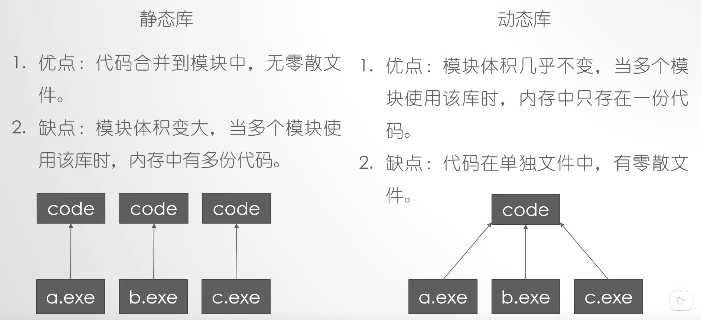
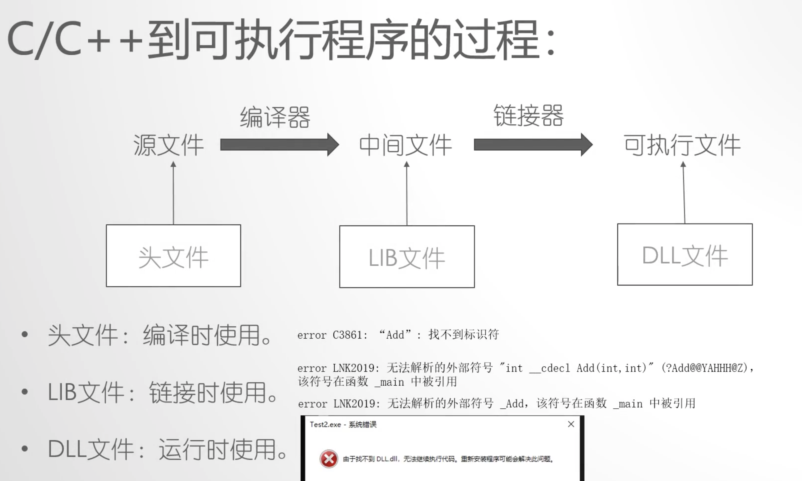

# c++ wikis


## 模板

参数化编程是模板的起源！

- 模板把函数或类要处理的数据类型参数化，表现为参数的多态性，成为类属
- 模板用于表达逻辑结构相同，但具体数据元素类型不同的数据对象的通用行为


### 函数模板

```c++
template <typename T>
void swap(T &a, T&b) {
  T tmp;
  tmp = a;
  a = b;
  b = tmp;
}

int main(void) {
  int a=2, b=3;
  swap(a, b); // 模板函数1
  //swap<>(a, b); // 模板函数1 complie ok
  //swap<int>(a, b); // 模板函数1 complie ok

  double x=10,y=8;
  swap(x, y); // 模板函数2

  char p='a';
  int data = 23;
	// swap<int>(p,data); // 语法错误：函数模板不提供隐式类型转化！
}
```


- 函数模板和模板函数的辨析：
- 当函数模板和普通函数都符合调用规则的时候，优先使用普通函数
  - 因为普通函数在编译的期间就生成了函数体
  - 而模板函数的生成需要在调用的时候，运行时才会编译？
- 重复模板实例！
  - 相同的模板可能只有前一个生效！
  - 称为：name mangling 命名混淆
  - 函数加命名空间就可以规避
- 函数模板定义在头文件中，譬如 .h 或 .hpp中


### 类模板


### STL分配器 allocator

STL中使用allocator为STL的容器分配内存，其中涉及到内存的数组形式、链表形式、数组+链表形式。

```c++
// TEMPLATE CLASS vector
template <class _Ty,
	class _Alloc = allocator<_Ty>>
  class vector
    : public _Vector_alloc<_Vec_base_types<_Ty, _Alloc>>
  {...
```

- tips：VS中build之后，再点击代码中的 vector，转到定义，可以看到上面的代码。


### template<> 模板特化的元编程

阶乘的示例：
```c++
int factorial(int n) 
{
    if (n == 0)
       return 1;
    return n * factorial(n - 1);
}
 
void foo()
{
    int x = factorial(4); // == (4 * 3 * 2 * 1 * 1) == 24
    int y = factorial(0); // == 0! == 1
}
```
模板特化改造：
```c++
template <int N>
struct Factorial 
{
    enum { value = N * Factorial<N - 1>::value };
};
 
template <>
struct Factorial<0> 
{
    enum { value = 1 };
};
 
// Factorial<4>::value == 24
// Factorial<0>::value == 1
void foo()
{
    int x = Factorial<4>::value; // == 24
    int y = Factorial<0>::value; // == 1
}
```


## 全局对象声明

**全局对象的初始化顺序，编译器是不保证的**。所以一个全局对象要调用另一个全局对象的时候，往往无法确定被调用的全局对象是否已经被构造出来了。 

```c++
//main.cpp
Class1 gclass1;
Class2 gclass2;

//class2.h
class Class2 {
  public:
  	int m_i = 0;
}

//class2.cpp
Class2::Class2(): m_i(5) 
{
  
}

//class1.cpp
extern Class2 gclass2;
Class1::Class1() {
  cout << gclass2.m_i << endl; //输出0，而不是5
}
```

此时可以把被调用的全局对象放入**函数体中构造**，来确保初始化顺序：

```c++
//class2.cpp
Class2& getClass2Obj()
{
  static Class2 gclass2; //静态局部对象
  return gclass2;
}

//func.h
class Class2; //类的前向(前置)声明
Class2& getClass2Obj(); //函数声明
```


## 锁

### lock_guard

- 使用方式
  - 严格基于作用域的锁管理类模板
  - 构造时是否枷锁是可选的（不加锁时是假定当前线程已经获得锁的所有权）
  - 析构时自动释放锁
  - 所有权不可转移。？
  - 对象生存期内不允许手动加锁和释放锁

- 实现方式
  - 默认构造函数里锁定互斥量，即调用互斥量的lock函数
  - 析构函数利解锁互斥量，即调用互斥量的unlock函数
- 作用
  - 简化了mutex对象的上锁和解锁操作，方便线程对互斥量上锁
  - 即在某个lock_guard对象的声明周期内，它所管理的锁对象会一直保持上锁状态
  - 而lock_guard的生命周期结束之后，它所管理的锁对象会被解锁


### unique_lock

与lock_guard基本一致，但更灵活

- 所有权可以转移
- 对象生命期内允许手动加锁和释放锁：提供了lock/unlock/try_lock等控制接口
- 在程序抛出异常后，先前已被上锁的mutex对象可以正确进行解锁操作

| std::lock_guard  | 更简单，没有多余的接口，构造函数时拿到锁，析构函数时释放锁，但更省时 |
| ---------------- | ------------------------------------------------------------ |
| std::unique_lock | 更灵活，提供了lock，try_lock, try_lock_for, try_lock_until, unlock等接口 |


### lock选项

- std::adopt_lock选项在lock_guard和unique_lock中的含义相同，需要自己把mutex给lock住，两者都无需再做lock的动作，用于后面对象析构后的自动释放锁

- std::try_to_lock是试图获取锁，不能自己先做lock！它是不阻塞的：

  ```c++
  std::unique_lock(std::mutex) guard(mutex1, std::try_to_lock);
  if (guard.owns_lock()) {
    //拿到锁了
    recvQueue.push_back(i);
  }
  else {
    //没拿到锁
  }
  ```

- std::defer_lock：给出后续的没有加锁的mutex，针对unique_lock做灵活的lock和unlock的自定义操作！在单个业务流程中灵活地随时上锁和解锁！

- unique_lock的try_lock()方法返回bool，不阻塞，锁成功返回true，锁失败返回false。类似std::try_to_lock

- unique_lock的release()方法：返回mutex指针，并释放mutex的所有权！

- 所有权转移：unique_lock的对象可以把自己所拥有的mutex锁对象，释放给另一个unique_lock对象！

  ```c++
  std::unique_lock<std::mutex> guard2(std::move(guard1)); //左值转右值的移动语义,guard1指向空，guard2获得所有权
  
  std::unique_lock<std::mutex> rtn_unique_lock()
  {
    std::unique_lock<std::mutex> tmpguard(m_mutex1);
    return tmpguard; // 从函数返回一个局部的unique_lock对象是可以的。反正这种局部对象tmpguard会导致系统调用unique_lock的移动构造函数，其间会生成临时unique_lock对象！
  }
  ```


### condition_variable 

条件对象

#### wait notify_one notify_all

类似信号量，消息队列的读线程和写线程的同步操作，每生产了一个消息，就notify_one()，消费线程的wait()就被激活，取得消息完成工作线程里的任务。


#### 虚假唤醒

wait()执行后，并没有取到东西，原因可能是notify_one()被错误的触发了多次，或直接被notify_all()，总之wait()的工作线程取不到消息，这是，需要酱紫做：

```c++
std::condition_variable my_cond;
std::mutex my_mutex1; //互斥量 一把锁头
std::list<int> mgsRecvQueue;

...
std::unique_lock<mutex> sbguard1(my_mutex1); //临界区
my_cond.wait(sbguargd1, [this] {
  if (!mgsRecvQueue.empty())
    return true;	// 该lambda返回true，则wait就返回，流程下去了，互斥锁被本线程拿到。
  return false; 	//解锁并休眠，卡在wait，等待被再次唤醒
})
```


## 异常

- 异常有类型（int/fload/classObject/..)，catch中可以捕获特定异常类型，catch(int n)..
- catch(...) 捕获所有类型的异常
- 如果调用堆栈都捕捉不到这个异常，主程序就会崩溃退出
- catch块中再抛异常，需要外面的函数调用栈有人接，否则也会捕获不到
- 0xc0000005是指针无效的错误

```c++
int main(int argc, char* argv[])
{
  try {
    foo(1, argc-1);
    throw std::exception("hello123");
  }
  catch(int n)
  {
    
  }
  catch (std::exception& e)
  {
    cout << e.what() << endl;
  }
}
```


## 线程

c++11中的线程：传参数需要用std::ref或右值引用

[Mac上利用VScode配置c/c++开发环境](https://www.cnblogs.com/love-study-chase/p/11962064.html)


```c++
std::thread t1(func);
// thread(const thread&) = delete;
std::thread t2 = std::move(t1); // thread对象不可拷贝构造，只可移动
const threadNum = std::thread::hardware_concurrency(); //返回可以创建多少个线程
```


### 线程死锁

A线程持有了mutexA，在等待mutexB，B线程持有了mutexB，在等待mutextA，导致互相等待，导致线程死锁。


### 线程的坑

- 传递临时对象作为线程参数

- 传递类对象、智能指针做线程参数

- 用成员函数指针做线程参数

  

  ```c++
  void myprint(const int& i, char *pmybuf) {
  	cout << i << endl;	//调试发现，这里i是值传递！和外面的mvar的地址不一样
    cout << pmybuf << endl; //调试发现，这里pmybuf是指针传递！和外面的是mybuf地址一样！线程detach时会不安全！
  }
  
  class A {
    private:
    	int m_i;
    public:
    	A(int i): m_i(i){}
    	A(&A a): m_i(a.m_i) {}
    	~A(){}
    	void thread_work(int m)
    	void operator (int num) {} 	// thread mytobj(std::ref(myobj, 15))
  }
  
  int main() {
  	int mvar = 1;
  	int &mvary = mvar;
  	char mybuf[] = "this is buffer test!";
  
  	thread mytobj(myprint, mvar, mvary); // thread构造函数这里执行了参数的拷贝构造！所以i才是值引用
  	mytobj.detach(); // 异步的子线程和提前结束的主线程，引发线程资源回收的问题！
    
    std::chrono::millseconds dura(2000);
    std::this_thread::sleep_for(dura); //休息2秒
    
    // 类对象
    thread myobj2(myprinxUP, std::ref(objA));
    
    // 智能指针
    unique_ptr<int> mySmartPointer(new int(100));
    thread myobjUP(myprinxUP, std::move(mySmartPointer)); // 注意用thread.join()，不可用detach，否则内存可能泄露
             
    // 类的成员函数
    A myobj(5);
    thread mytobj2(&A::thread_work, &myobj, 15);	// &myobj == std::ref(myobj)
    return 0;
  }
  
  // 优化方法：void myprint(const int i, const string& pmybuf)
  // 使用方法：void myprint(mvar, string(mybuf));
  ```

  - tips: shift+F9查看指定变量名的内存值和地址
  - thread是模板类，如果要传引用的话，就用`std::ref(i)` ！
  - thread的构造函数会调用`std::forward`,把实参的控制权传递给线程对象去了！
  - return之后的临时变量无名，无名临时变量，thread构造函数的右值引用！
  - string()是构造函数，会先于线程执行！
  - 在创建线程的同时，创建**临时对象**来解决：`string(mybuf)`，代码逻辑是先构造，再拷贝构造
  - detach时：int这种参数类型就传值，类类型就用显示类型转换，用引用类型做形参接
  - 隐式类型转换是大坑，用explicit声明为显示类型：className(objectA)
  - 线程的存储空间：主线程先把数据是复制到子线程的存储空间，再由子线程取调用指定的函数去使用数据
  - const是常量左值引用（万能引用），临时变量具有常性
  - T&&类型，universal reference，万能引用，既能绑定右值，又能绑定左值
  - 用类对象做形参，或智能指针做形参，用`std::ref`


### 线程池和线程数量建议

建议先创建一定数量的线程池，而不是用的时候再创建，后面再销魂

线程数量不要超过2000，否则容易崩溃。最好控制在200个以内。不同的电脑做不同的实际业务测试为准。


### aync/future/packaged_task/promise

- std::async是个函数模板，用于启动一个异步线程

- std::future是个类模板

- std::async执行后，会返回一个std::future的类对象，其中的get方法可以获取线程的执行结果

  ```c++
  int myThread() {
    cout << "[begin] thread id is: " << std::this_thread::get_id() << endl;
    sleep(5000);
    cout << "[end] thread id is: " << std::this_thread::get_id() << endl;
    return 123;
  }
  
  std::future<int> result = std::async(myThread); // 绑定关系
  cout << "continuing.." << endl;
  int def = result.get(); // 线程卡在这里，等待thread执行完毕，get返回结果！def=123
  cout << def << endl;
  /*
  continuing..
  [begin] thread id is:1732
  [end] thread id is:1732
  123
  */
  ```

- std::future的对象析构时会自动调用`result.wait()`，导致调用线程等待

- 类方法调用方式：`std::async(&A:myThread, &a, tmpVal);`

- std::async中还可以再传递一个`std::launch::deferred`枚举变量，表示线程函数只有在调用`wait`或`get`时才开始执行，此时是直接在调用线程里同步执行的函数调用，没有产出新的线程！

- `std::packeged_task`打包任务：

  ```c++
  int mythread(int param) {
    ...
  }
  std::packeged_task<int(int)> mypt(mythread); // 打包多个任务
  std::thread t1(std::ref(mypt), 1); // 线程直接开始执行 param=1
  t1.join();
  std::future<int> result = mypt.get_future();
  ```

  ```c++
  std::packaged_task<int(int)> mypt([](int mypar)){
    ...
      return 5;
  }
  
  std::packaged_task<int(int)> mytasks;
  mytasks.push_back(std::move(mypt)); // 移动语义，入进去之后mypt就为空
  auto iter = mytasks.begin();
  mypt2 = std::move(*iter);
  mytasks.erase(iter);
  mypt2(123);
  
  ```

- `std::promise`，类模板

  ```c++
  void mythread(std::promise<int> &tmpp, int calc) {
    int result = calc++;
    tmpp.set_value(result); // 结果保存在这个tmpp对象中
  }
  std::promise<int> myprom;
  std::thread t1(mythread, std::ref(myprom), 1);
  t1.join();
  std::future<int> fu1 = myprom.get_future(); // promise和future绑定，用于获取线程返回值
  auto result = ful.get(); // get只能调用一次，不能调用多次
  ```

  

### future其他成员函数、shared_future、atomic

- std::future_status，通过std::future<T>.wait_for(timeout) 返回的枚举：

  - ready：执行完毕
  - timeout：执行超时
  - deferred：执行被延迟，使用了`std::launch::deferred`

- shared_future是类模板，和future功能相似，但是其get()函数可以执行多次，因为是拷贝复制

- atomic的是否原子和写法有关：

  ```c++
  std::atomic<int> count=0;
  count++;	// ok
  count += 1;	// ok
  count = count + 1; // fail
  
  auto count2= count; //不允许！拷贝构造函数应该被delete了
  auto count3(count.load()); //ok
  ```

- std::async 异步执行任务，它有不确定问题：是否创建新线程执行任务

  ```c++
  std::future<int> result = std::async(mythread);
  count << result.get() << endl; // 线程可能在此处才开始创建并执行，根据系统繁忙情况吧！
  
  std::future<int> result = std::async(std::launch::deferred, mythread);
  count << result.get() << endl; // 此不创建新线程，是在主线程中执行！
  
  std::future<int> result = std::async(std::launch::async, mythread);
  count << result.get() << endl; // 强制创建新线程
  
  // 位标志
  std::future<int> result = std::async(std::launch::async | std::launch::deferred, mythread);
  count << result.get() << endl; // 可能也可能不创建新线程！
  ```

  std::async 和 std::thread的区别是前者可能不创建新线程，后者肯定创建新线程，但创建线程是有可以失败的！

  **经验：**一个程序里，线程数量不宜超过100-200。

- std::chrono

  ```c++
  std::async(mythread).wait_for(10s);
  
  chrono::seconds operator ""s(unsigned long long _val) {
    return (chrono::seconds(_val))
  }
  ```


## C++ Stream

```c++
#include <iostream>
#include <fstream>
using namespace std;

int main() {
  int a = 123, b=456;
  // 写文件 ios::out表示没有就创建，有则覆盖
  ofstream out("d1.txt", ios::out);
  out << a << " " << b;
  out.close();
  cout << "save done" << endl;
  
  // 读文件
  ifstream in("d1.txt");
  int aa, bb;
  in >> aa >> bb;
  cout <<< "aa=" << aa << " bb=" << bb << endl;
  in.close();
  
  system("pause");
  return 0;
}
```


## C语言

### errno是线程安全的

将errno设置为线程局部变量，GCC中就是这么干的。他保证了线程之间的错误原因不会互相串改，当你在一个线程中串行执行一系列过程，那么得到的errno仍然是正确的。

errno实际上，并不是我们通常认为的是个整型数值，而是通过整型指针来获取值的。这个整型就是线程安全的。

**errno的实现**

```c
static pthread_key_t key;
static pthread_once_t key_once = PTHREAD_ONCE_INIT;
static void make_key()
{
  (void) pthread_key_create(&key, NULL);
}

int *_errno()
{
  int *ptr ;
  (void) pthread_once(&key_once, make_key);
  if ((ptr = pthread_getspecific(key)) == NULL) 
  {
    ptr = malloc(sizeof(int));    
    (void) pthread_setspecific(key, ptr);
  }
  return ptr ;
}
```


## 静态库 vs 动态库






- 静态库的代码如果有改动，所有依赖它的文件都要重新编译。动态库不用。

| 比较项       | 差异                                                         | details                                                      |
| ------------ | ------------------------------------------------------------ | ------------------------------------------------------------ |
| 使用场景     | lib是编译时用到的，dll是运行时用到的。                       | 如果要完成源代码的编译，只需要 lib；如果要使动态链接的程序运行起来，只需要dll。 |
| 应用对象不同 | 动态链接的情况下，有两个文件：一个是LIB文件，一个是DLL文件。LIB包含被DLL导出的函数名称和位置，DLL包含实际的函数和数据，应用程序使用LIB文件链接到DLL 文件。 | 在应用程序的可执行文件中，存放的不是被调用的函数代码，而是DLL中相应函数代码的地址，从而节省了内存资源。 |
| 用途         | **如果有dll文件，那么lib一般是一些索引信息，记录了dll中函数的入口和位 置，dll中是函数的具体内容；****如果只有lib文件，那么这个lib文件是静态编译出来的，索引和实现都在其中。** | 使用静态编译的lib文件，在运行程序时 不需要再挂动态库，缺点是导致应用程序比较大，而且失去了动态库的灵活性，发布新版本时要发布新的应用程序才可以。 |
| 发布         | DLL和LIB文件必须随应用程序 一起发行，否则应用程序会产生错误。如果不想用lib文件或者没有lib文件，可以用WIN32 API函数LoadLibrary、GetProcAddress装载。 | -                                                            |

- 参考资料：[dll库和lib库有什么区别？](https://zhidao.baidu.com/question/73129648.html)


## zlib

- [uvoteam](https://github.com/uvoteam)/**[gunzip_mmap](https://github.com/uvoteam/gunzip_mmap)**
- [使用zlib进行内存中解压缩](https://xbuba.com/questions/4901842)
- [zlib库内存压缩解压缩函数的C++便利性封装](https://blog.csdn.net/10km/article/details/51007527)

- [mateidavid](https://github.com/mateidavid)/**[zstr](https://github.com/mateidavid/zstr)**


## 参考资料

- [C++并发与多线程](https://www.bilibili.com/video/BV1Yb411L7ak?p=1)
- [中文版cppreference参考文档](https://github.com/myfreeer/cppreference2mshelp/releases)

- [C++ 模板技术与 STL实战开发](https://www.bilibili.com/video/BV1wJ411h7GC?p=1)
- [C++11 带来的新特性 （3）—— 关键字noexcept](https://www.cnblogs.com/sword03/p/10020344.html)