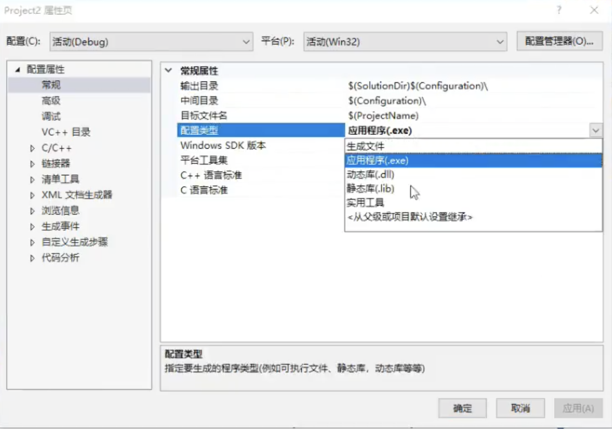

# lib/dll

- 静态库的*.lib
  - 如果文件名是lib*.lib，则是静态链接的静态库，编译时会都编译进去，运行时无需dll
  - 如果文件名是*.lib，则是动态链接的静态库，编译时不会都编译进去，运行时需要dll
- 项目导入库时，pragma有先后顺序


## 实际开发

- visual studio安装时需要选中【使用C++的桌面开发】

- 新建项目，选择【空项目】

  

- 类头文件 `interface.h`：

  ```c++
  #pragma once
  #define MATHLIBRARY_API __declspec(dllexport)
  
  class MATHLIBRARY_API Interface
  {
  public:
    void Print();
  }
  ```

- 类源文件 `interface.cpp`:

  ```c++
  #include "interface.h"
  #include <iostream>
  using namespace std;
  
  void Interface::Print() {
  	cout << "hello world" << endl;  
  }
  ```

- 项目配置：项目属性--常规--配置类型，默认是应用程序(.exe)

  1. 选择【动态库(.dll)】编译生成一次，将生成：interface.dll
  2. 选择【静态库(.lib)】编译再生成一次，将生成: interface.lib



- 发布：把头文件复制到一个include的文件夹中，将lib和dll文件复制到lib文件夹中。打包给使用者
- 使用：使用的项目中，依次配置：
  - 附加包含目录：指向include目录，例如：D:\interface\include
  - 附加库目录：指向lib目录，例如：D:\interface\lib
  - 附加依赖项：添加lib文件名，例如：interface.lib
  - 运行的exe目录中需要放入interface.dll


## hpp头文件

实质就是.cpp的实现代码混入.h头文件中，定义和实现都包含在同一文件。

- header plus plus的简写

- xx.cpp可以include此hpp，hpp会一起直接编译到xx.obj中，不再生成单独的obj，也不用加入到project这样中进行编译

- 如果被多个cpp引用，hpp中就不可定义全局变量和全局静态变量，否则会有符号重定义错误，可封装为类的静态方法

- 类之间不可循环调用，可用前向引用声明解决

- 一般来说，*.h里面只有声明，没有实现，而*.hpp里声明实现都有，后者可以减少.cpp的数量。

- 采用hpp将大幅减少调用project的cpp文件数和编译次数，适合做公共的开源库

  


## 参考资料

- [演练：创建和使用自己的动态链接库 (C++)](https://docs.microsoft.com/zh-cn/cpp/build/walkthrough-creating-and-using-a-dynamic-link-library-cpp?view=msvc-160)
- [hpp头文件与h头文件的区别](https://blog.csdn.net/follow_blast/article/details/81706698)