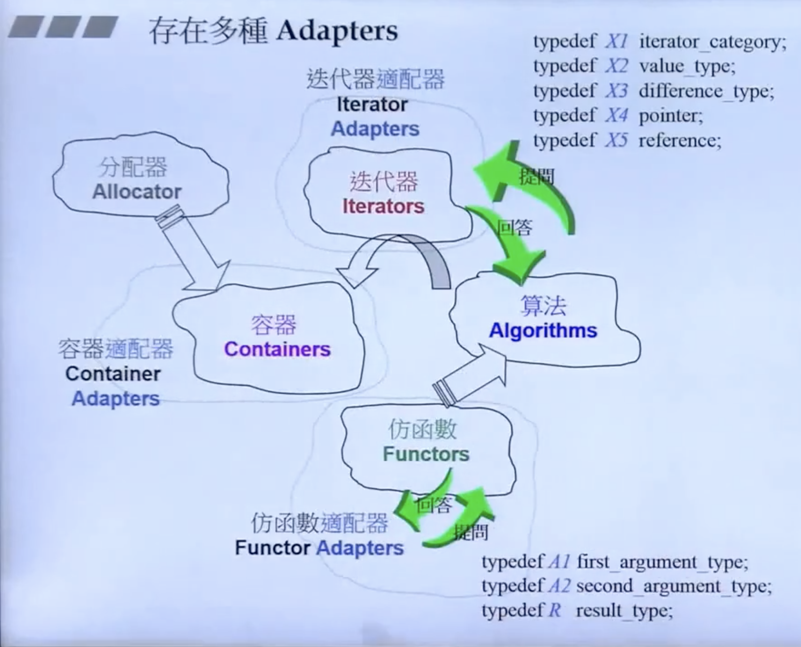
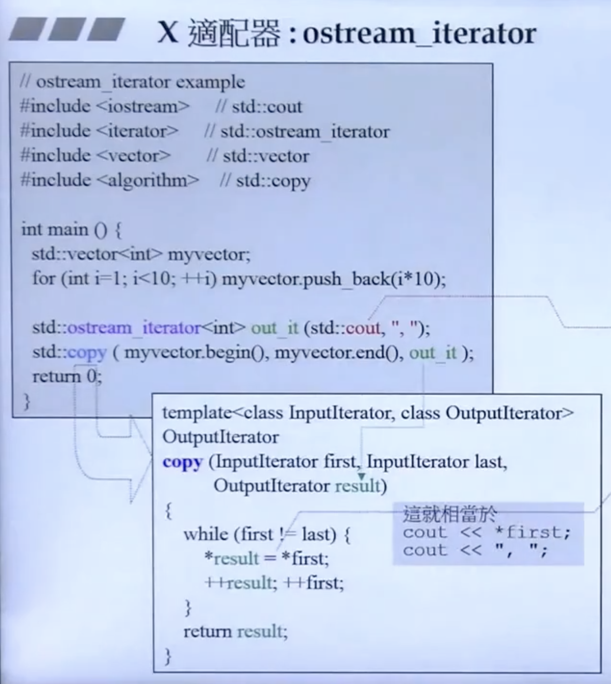

# 标准库

C++标准库：Standard Libaray，以header files的形式呈现，C++标准库的80%都是STL。

STL：Standard Template Library 标准模板库，惠普实验室开发。


## STL六大部件

1. **容器 containers**，如vector、list、deque、set、map，从实现角度来看，STL容器是一种 class template
2. **算法Algorithms**，如sort、find、copy、for_each。从实现的角度来看，STL算法是一泓 function template
3. **迭代器 Iterators**，使容器和算法进行无缝连接，共5种类型，从实现角度来看，迭代器是一种将 operator *、operator->、operator++、operator--等指针相关操作予以重载的 class template。所有 STL 容器都附带有自己专属的迭代器！只有容器的设计者才知道如何遍历自己的元素。原生指针（native pointer)也是一种迭代器。
4. **仿函数 Functors**，行为类似函数，可以作为算法的某种策略。从实现角度来看，仿函数是一种重载了 operator() 的 class 或者 class template
5. **容器适配器 Container Adapters**，一种用来修饰容器或者仿函数或迭代器接口的东西。主要是以扩展参数的形式实现。比如本来是2个参数，用适配器可以适配为传三个参数。
6. **分配器 Allocators**，负责内存的配置与管理。从实现角度看，分配器是一个实现了动态内存配置、内存管理、内存释放


## 相互关系

- 容器通过空间分配器去的数据存储空间
- 算法通过迭代器访问容器中的内容
- 仿函数可以协助算法完成不同的策略的变化
- 适配器可以修饰仿函数


## 容器

容器，置物之所也。

研究数据的特定排列方式，以利于搜索或排序或其他特殊目的，称之为数据结构。

分为序列式容器和关联式容器两种。

序列式容器强调值得排序，如vector、deque、list等

关联式容器是非线性的树结构，更准确的说是二叉树结构。如map


## 算法

算法，问题之解法也。

以有限的步骤，解决逻辑或数学上的问题，即为算法。

算法分为：**质变算法**和**非质变算法**。

质变算法：运算过程中会更改区间内的元素的内容。例如：拷贝、替换、删除等

非质变算法：是指运算过程中不会更改区间内的元素内容，例如：查找、计数、遍历、寻找极值等


## 迭代器

迭代器的种类：

| 类别           | 含义                                                         | 举例                                    |
| -------------- | ------------------------------------------------------------ | --------------------------------------- |
| 输入迭代器     | 提供对数据的只读访问                                         | 只读，支持++、==、!=                    |
| 输出迭代器     | 提供对数据的只写访问                                         | 只写，支持++                            |
| 前向迭代器     | 提供读写操作，并能向前推进迭代器                             | 读写，支持++、==、!=                    |
| 双向迭代器     | 提供读写操作，并能向前和向后操作                             | 读写，支持++、--                        |
| 随机访问迭代器 | 提供读写操作，并能以跳跃的方式访问容器的任意数据，是功能最强的迭代器 | 读写，支持++、--、[n]、-n、<、<=、>、>= |




stream_iterator:



会输出：

```bash
10,20,30,40,50,60,70,80,90
```


## 仿函数

重载了 () 操作符的类，使得类对象可以像函数那样调用，叫仿函数。又叫**函数对象**。

示例1：

```c++
class MyAdd
{
public:
  int operator()(int a, int b) {
    return a + b;
  }
}

void test1
{
  cout << MyAdd()(4,5) << endl;
}
```

示例2：

```c++
class Print
{
public:
  void operator(int a) {
    cout << a << endl;
  }
}

void test2
{
  vector<int> v;
  v.push_back(1);
  v.push_back(3);
  v.push_back(5);
  for_each(v.begin(), v.end(), Print())
}
// 1
// 3
// 5
```

如果重载的 operator() 形参是一个参数，叫一元仿函数（unary functor）；

如果重载的 operator() 形参是两个参数，叫一元仿函数（binary functor）；


### STL内建函数对象（仿函数）

#### 6个算数类对象

```c++
template<class T> T plus<T>; // 加法仿函数
template<class T> T minus<T>; // 减法仿函数
template<class T> T multiplies<T>; // 乘法仿函数
template<class T> T divides<T>; // 除法仿函数
template<class T> T modulus<T>; // 取模仿函数
template<class T> T negate<T>; // 取反函数 一元
```


## 谓词

概念：

谓词是指普通函数或重载的 operator() 返回值是 bool 类型的函数对象（仿函数）。如果 operator 接受一个参数，那么叫做一元谓词；如果接受两个参数，那么叫做二元谓词；谓词可作为一个判断式。

```c++
class GreaterThanFile
{
public:  	
  // 一元谓词
  bool operator()(int num) {
    return num > 5;
  }
}

// 二元谓词
bool compare(int a, int b) {
  return a > b;
}

vector<int>::iterator it = find_if(vec.begin(), vec.end(), compare);
auto it2 = find_if(vec.begin(), vec.end(), GreaterThanFile())
```


## 参考资料

- [C++标准库 体系结构与内核分析 - 候捷](https://www.bilibili.com/video/BV1yo4y1o7yA?p=1)


