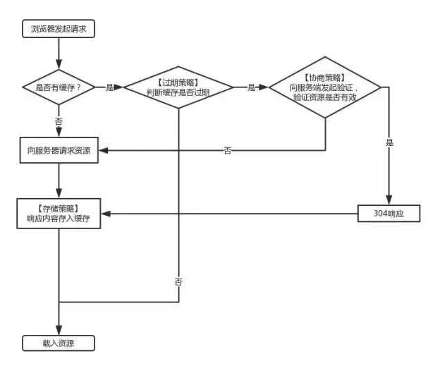

# 浏览器基础

## 浏览器缓存

### 缓存的资源去哪里了?

两个地方：

#### memory cache

> MemoryCache顾名思义，就是将资源缓存到内存中，等待下次访问时不需要重新下载资源，而直接从内存中获取。[Webki](https://baike.baidu.com/item/webkit/1467841?fr=aladdin)t早已支持memoryCache。（Chrome、Safari都是WebKit浏览器引擎，IE、FireFox不是）
> 目前Webkit资源分成两类，一类是主资源，比如HTML页面，或者下载项，一类是派生资源，比如HTML页面中内嵌的图片或者脚本链接，分别对应代码中两个类：MainResourceLoader和SubresourceLoader。虽然Webkit支持memoryCache，但是也只是针对派生资源，它对应的类为CachedResource，用于保存原始数据（比如CSS，JS等），以及解码过的图片数据。

#### disk cache

> DiskCache顾名思义，就是将资源缓存到磁盘中，等待下次访问时不需要重新下载资源，而直接从磁盘中获取，它的直接操作对象为CurlCacheManager。

|          | memory cache                       | disk cache                        |
| -------- | ---------------------------------- | --------------------------------- |
| 相同点   | 只能存储一些派生类资源文件         | 只能存储一些派生类资源文件        |
| 不同点   | 退出进程时数据会被清除             | 退出进程时数据不会被清除          |
| 存储资源 | 一般脚本、字体、图片会存在内存当中 | 一般非脚本会存在内存当中，如css等 |

**因为CSS文件加载一次就可渲染出来,我们不会频繁读取它,所以它不适合缓存到内存中,但是js之类的脚本却随时可能会执行,如果脚本在磁盘当中,我们在执行脚本的时候需要从磁盘取到内存中来,这样IO开销就很大了,有可能导致浏览器失去响应。**

### 三级缓存原理 (访问缓存优先级)

1. 先在内存中查找,如果有,直接加载。
2. 如果内存中不存在,则在硬盘中查找,如果有直接加载。
3. 如果硬盘中也没有,那么就进行网络请求。
4. 请求获取的资源缓存到硬盘和内存。

### 浏览器缓存的分类

1. 强缓存
2. 协商缓存

浏览器再向服务器请求资源时,首先判断是否命中强缓存,再判断是否命中协商缓存!

### 强缓存

浏览器在加载资源时，会先根据本地缓存资源的 header 中的信息判断是否命中强缓存，如果命中则直接使用缓存中的资源不会再向服务器发送请求。

这里的 header 中的信息指的是 expires 和 cahe-control.

#### Expires

该字段是 **http1.0** 时的规范，它的值为一个**绝对时间**的 GMT 格式的时间字符串，比如 Expires:Mon,18 Oct 2066 23:59:59 GMT。这个时间代表着这个资源的失效时间，在此时间之前，即命中缓存。这种方式有一个明显的缺点，由于失效时间是一个绝对时间，所以当服务器与客户端时间偏差较大时，就会导致缓存混乱。

#### Cache-Control

Cache-Control 是 **http1.1** 时出现的 header 信息，主要是利用该字段的 **max-age** 值来进行判断，它是一个**相对时间**，例如 Cache-Control:max-age=3600，代表着资源的有效期是 3600 秒。cache-control 除了该字段外，还有下面几个比较常用的设置值：

**no-cache**：需要进行协商缓存，发送请求到服务器确认是否使用缓存。

**no-store**：禁止使用缓存，每一次都要重新请求数据。

**public**：可以被所有的用户缓存，包括终端用户和 CDN 等中间代理服务器。

**private**：只能被终端用户的浏览器缓存，不允许 CDN 等中继缓存服务器对其缓存。

**Cache-Control 与 Expires 可以在服务端配置同时启用，同时启用的时候 Cache-Control 优先级高。**

### 协商缓存

当强缓存没有命中的时候，浏览器会发送一个请求到服务器，服务器根据 header 中的部分信息来判断是否命中缓存。如果命中，则返回 304 ，告诉浏览器资源未更新，可使用本地的缓存。

这里的 header 中的信息指的是 Last-Modify/If-Modify-Since 和 ETag/If-None-Match.

#### Last-Modify/If-Modify-Since

浏览器第一次请求一个资源的时候，服务器返回的 header 中会加上 Last-Modify，Last-modify 是一个时间标识该资源的最后修改时间。

当浏览器再次请求该资源时，request 的请求头中会包含 If-Modify-Since，该值为缓存之前返回的 Last-Modify。服务器收到 If-Modify-Since 后，根据资源的最后修改时间判断是否命中缓存。

如果命中缓存，则返回 304，并且不会返回资源内容，并且不会返回 Last-Modify。

缺点:

短时间内资源发生了改变，Last-Modified 并不会发生变化。

周期性变化。如果这个资源在一个周期内修改回原来的样子了，我们认为是可以使用缓存的，但是 Last-Modified 可不这样认为,因此便有了 ETag。

#### ETag/If-None-Match

与 Last-Modify/If-Modify-Since 不同的是，Etag/If-None-Match 返回的是一个校验码。ETag 可以保证每一个资源是唯一的，资源变化都会导致 ETag 变化。服务器根据浏览器上送的 If-None-Match 值来判断是否命中缓存。

与 Last-Modified 不一样的是，当服务器返回 304 Not Modified 的响应时，由于 ETag 重新生成过，response header 中还会把这个 ETag 返回，即使这个 ETag 跟之前的没有变化。

**Last-Modified 与 ETag 是可以一起使用的，服务器会优先验证 ETag，一致的情况下，才会继续比对 Last-Modified，最后才决定是否返回 304。**

### 参考资料

- [[浏览器缓存机制](https://segmentfault.com/a/1190000017962411)](https://segmentfault.com/a/1190000017962411)

