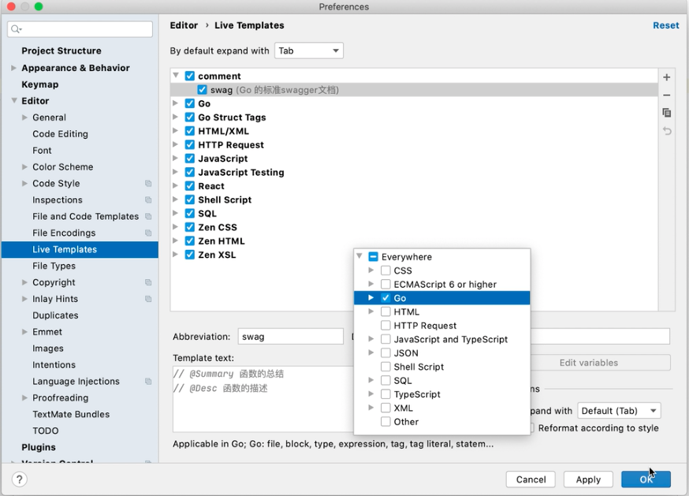

# Go IDE Tutorial


## Goland

- 添加tag做代码的自动完成

  

  

  > 代码中输入swag就会自动出:

  ```go
  // @Summary 函数的总结
  // @Desc 函数的描述
  func main() {
    ...
  }
  ```

- [Goland 2019.2.3下载和安装（带破解补丁和汉化包）](http://c.biancheng.net/view/6124.html)
  1. 下载2019.2.3版本
  2. 破解补丁“jetbrains-agent.jar”复制到 Goland 安装目录下的 bin 目录中
  3. 在 Goland 安装目录的 bin 目录下找到goland.exe.vmoptions”和“goland64.exe.vmoptions”两个文件
  4. 在两个文件的最后面追加 “-javaagent:$Goland安装目录\bin\jetbrains-agent.jar”
  5. 运行 Goland 进入激活界面，选择“Activate”，激活方式选择“Activation code”使用激活码激活，并将激活码粘贴到下面，点击 OK 即可。


## VS Code 

参考资料：[VS Code配置Go语言开发环境-liwenzhou](https://www.liwenzhou.com/posts/Go/00_go_in_vscode/)

