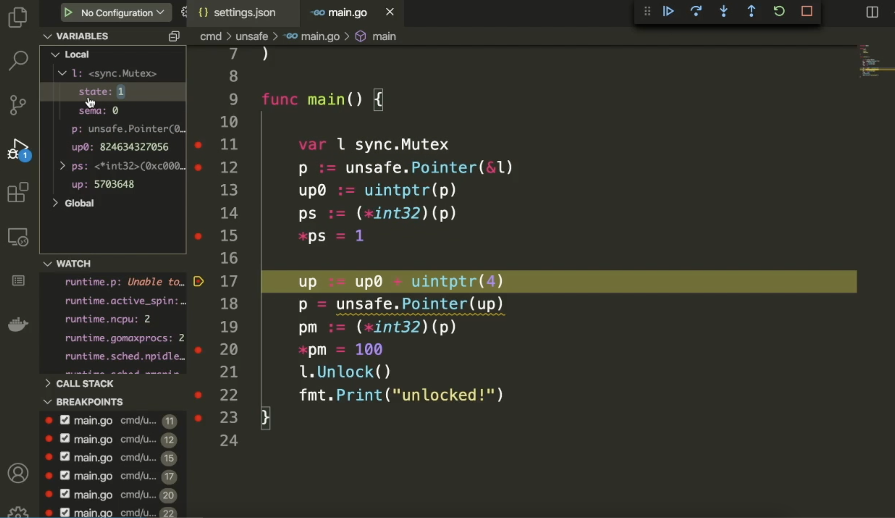
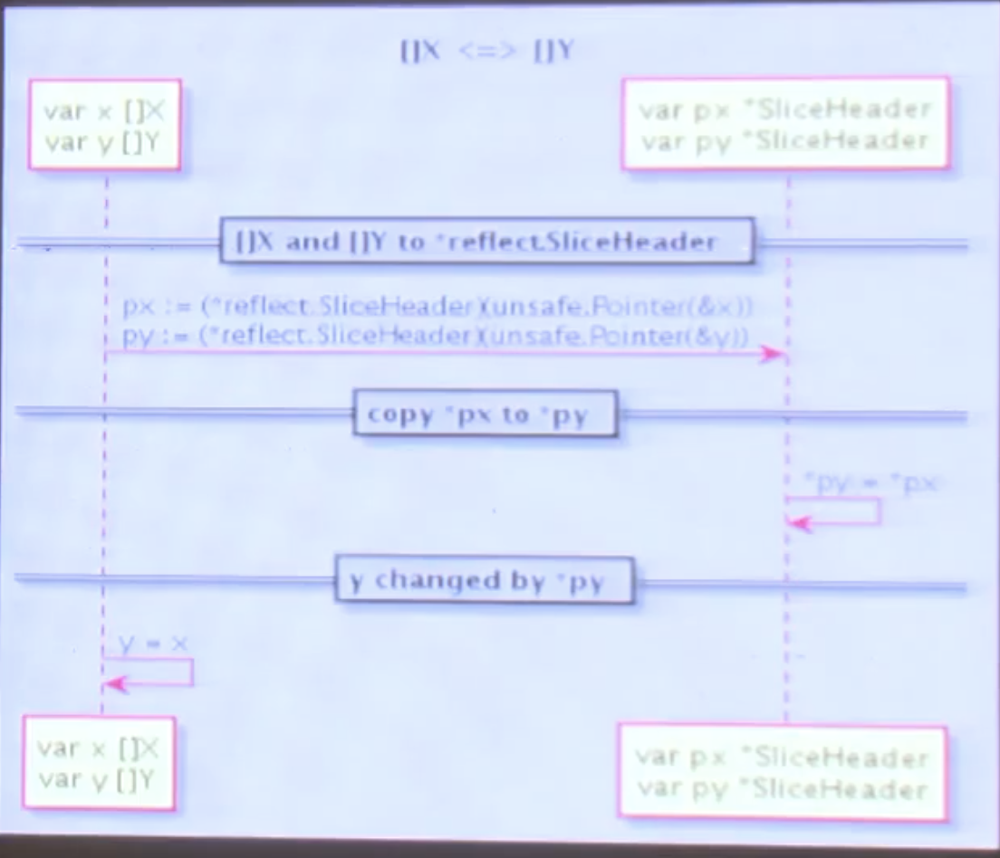
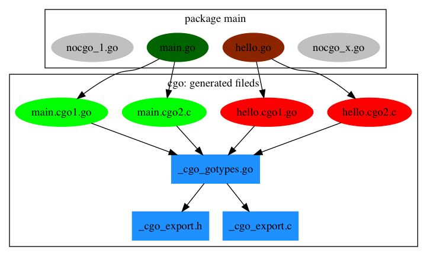

# cgo

- go build命令会在编译和链接阶段启动gcc编译器
- unsafe包提供了一些跳过go语言类型安全限制的操作。



```go
import "unsafe"

type A struct {
  a bool	// 偏移4字节，内存对齐
  b int32	// 4字节对齐的依据！(64位平台上int默认为8字节，此处为int32)
}

func main() {
  var c A
  p := unsafe.Pointer(&c)
  up0 := uintptr(p)
  ps := (*bool)(p)
  *ps = true
  
  up := up0 + uintptr(4)
  p = unsafe.Pointer(up)
  pm := (*int32)(p)
  *pm = 100
  fmt.Println(c.a, c.b)
  
  // output:
	// true 100
}

func m2() {
  var a A
  fmt.Println(unsafe.Alignof(a))
  p := unsafe.Pointer(&a)
  up0 := uintptr(p)
  up := up0 + unsafe.Offsetof(a.c)
  ps := (*int32)(unsafe.Pointer(up))
  *ps = 100
  fmt.Println(a.b, a.c, unsafe.Offsetof(a.c))
  
  // output
  // 4
  // false 100 4
}
```


## cgo内存模型

- Go语言因为函数栈的动态伸缩可能导致栈中内存地址的移动
- C语言持有的是移动之前的Go指针，那么以旧指针访问Go对象时会导致程序崩溃。
- 无法在Go语言中创建大于2GB内存的切片


在C语言环境创建大于2GB的内存，然后转为Go语言的切片使用

```go
package main

/*
#include <stdlib.h>

void* makeslice(size_t memsize) {
	return malloc(memsize);
}
*/
import "C"
import "unsafe"

func makeByteSlize(n int) []byte {
	p := C.makeslice(C.size_t(n))
	return ((*[1 << 31]byte)(p))[0:n:n]
}

func freeByteSlice(p []byte) {
	C.free(unsafe.Pointer(&p[0]))
}

func main() {
	s := makeByteSlize(1<<32+1)
	s[len[s]-1] = 1234
	print(s[len[s]-1])
	freeByteSlice(p)
}
```

> 通过makeByteSlize来创建大于4G内存大小的切片，从而绕过了Go语言实现的限制（需要代码验证）。而freeByteSlice辅助函数则用于释放从C语言函数创建的切片。


## 指针 - unsafe包的灵魂

Go版无类型指针和数值化的指针：

```go
var p unsafe.Pointer = nil		// unsafe
var q uintprt	= uintptr(p)		// builtin
```

C版无类型指针和数值化的指针：

```c
void *p = NULL;
uintptr_t q = (uintptr_t)(p);	// <stdint.h>
```

- `unsafe.Pointer` 是Go指针和C指针转换的中介
- `uintptr`是Go中数值化和指针转换的中介


## unsafe包

```go
type ArbitraryType int
type Pointer *ArbitraryType

func Sizeof(x ArbitraryTypr) uintptr
func Alignof(x ArbitraryType) uintptr

func Offsetof(x ArbitraryType) uintptr
```

- `Pointer`：面向编译器无法保证安全的指针类型转换
- `Sizeof`：值所对应变量在内存中的大小
- `Alignof`：值所对应变量在内存中地址几个字节对齐
- `Offsetof`： 结构体中成员的偏移量


C语言版本：

```c
typedef void* Pointer;
sizeof(type or expression); // C
offsetof(type, member);			// <stddef.h>
alignof(type-id);						// C++ 11
```

- C指针的安全性永远需要自己负责
- `sizeof`是关键字，语义和Go基本一致
- `offsetof`是宏，展开为表达式，语义和Go基本一致
- `alignof` 是新特性，可忽略


## Go字符串和切片的结构

```go
type reflect.StringHeader struct {
  Data uintptr
  Len int
}

type reflect.SliceHeader struct {
  Data uintptr
  Len int
  Cap int
}
```

```c
typedef struct {
  const char *p; 
  GoInt n;
} GoString;

typedef struct {
  void *data; 
  GoInt len; 
  GoInt cap;
} GoSlice;
```

- `reflect` 包定义的结构和CGO生成的C结构是一致的
- `GoString` 和 `Golice` 的头部结构是兼容的


## int32和*C.char相互转换

```go
// int32 => *C.char
var x = int32(9527)
var p *C.char = (*C.char)(unsafe.Pointer(uintptr(x)))

// *C.char => int32
var y *C.char
var q int32 = int32(uintptr(unsafe.Pointer(y)))
```

1. 第一步：int32 => uintptr
2. 第二步：uintptr => unsafe.pointer
3. 第三步：unsafe.Pointer => *C.char
4. 反之亦然


## *X 和 *Y 相互转换

X和Y是两个结构体：

```go
var p *X
var q *Y

q = (*Y)(unsafe.Pointer(p))		// *X => *Y
q = (*X)(unsafe.Pointer(q))		// *Y => *X
```


## []X 和 []Y 相互转换

X和Y是结构相同但名称不相同的`struct`：



- Go语言中切片，普通数据类型的切片，或结构体的切片，都有 `reflect.SliceHeader` 的指针，可以互转

```go
var p []X
var q []Y	// q = p

pHdr := (*reflect.SliceHeader)(unsafe.Pointer(&p))
qHdr := (*reflect.SliceHeader)(unsafe.Pointer(&q))

pHdr.Data = qHdr.Data
pHdr.Len = qHdr.Len * unsafe.Sizeof(q[0]) / unsafe.Sizeof(p[0])
pHdr.Cap = qHdr.Cap * unsafe.Sizeof(q[0]) / unsafe.Sizeof(p[0])
```

- 所有切片拥有相同的头部 `reflect.SliceHeader`
- 重新构造切片头部即可完成转换


## 示例：float64 数组排序优化

```go
func main() {
  // []float64 强制类型转换为 []int
  var a = []float64{4,2,5,7,2,1,88,1}
  var b []int = ((*[1 << 20]int)(unsafe.Pointer(&a[0])))[:len(a):cap(a)]
  
  // 以int方式给float64排序
  sort.Ints(b)
  
  // 再打印a的话，就是排序好了的a
}
```

- `float64` 遵循 IEEE754 浮点数标准特性
- 当浮点数有序时，对应的整数也必然是有序的


## Go调用C函数

### Example A

```go
/*
static int add(int a, int b) {
	return a+b;
}
*/
import "C"

func main() {
  C.add(1, 1)
}
```

- `C.add` 通过C虚拟包访问
- 最终会转为 `_Cfunc_add` 名字


### Example B

```go
/*
static int add(int a, int b) {
	return a+b;
}
*/
import "C"

func main() {
  v, err := C.add(1, 1)
  fmt.Println(v, err)
  
  // output:
  // 2 <nil>
}
```

- 任何C函数都可以带两个返回值

- 第二个返回值是 `errno`，对应`error`接口类型


### Example C

```go
/*
#include <errno.h>
static void seterrno(int v) {
	errno = v;
}
*/
import "C"
import "fmt"

func main() {
  _, err := C.seterrno(9527)
  fmt.Println(err)
  
  // output:
  // errno 9527
}
```

- 即使没有返回值，依然可以通过第二个返回值获取errno
- 对应voide类型函数，第一个返回值可以用_占位


### Example D

```go
// static void noreturn() {}

import "C"
import "fmt"

func main() {
  x, _ := C.noreturn()
  fmt.Printf("%#v\n", x)
  
  // output:
  // main._Ctype_void{}
}
```

- 甚至可以获取一个 void 类型函数的返回值
- 返回值类型：`type _Ctype_void [0]byte`


## 导出Go函数

```go
import "C"

//export GoAdd
func GoAdd(a, b C.int) C.int {
  return a + b
}
```

- 可以导出go的私有函数
- 导出C函数名没有名字空间约束，需保证全局没有重名
- main 包的导出函数会在 `_cgo_export.h` ，都是函数声明


不用Go导出的头文件，自己手写 `add.h` 也是可以的，这也是cgo常用的使用方式（默认的有些约束），例如：

add.h:

```c
int c_add(int a, int b);
```

add.c:

```c
#include "add.h"
#include "_cgo_export.h"

int c_add(int a, int b) {
  return GoAdd(a, b)
}
```

- 在C文件中使用 `_cgo_export.h` 头文件
- C文件必须在同一个包，否则会找不到头文件


### Example D

```go
// extern void SayHello(GoString s);
import "C"

//export SayHello
func SayHello(s string) {
  fmt.Print(s)
}
```

- 导出函数的参数是Go字符串
- C类型为GoString，在 `_cgo_export.h` 文件定义
- 要使用GoString类型就要引用 _cgo_export.h 文件
- 注意：GoString 会出现循环依赖（？）


### Example E

```go
// +build go1.10

// extern void SayHello(_GoString_ s);
import "C"

//export SayHello
func SayHello(s string) {
  fmt.Print(s)
}
```

- Go 1.10增加了 `_GoString_` 类型
- `_GoString_`是预定义的类型，和GoString等价
- 避免手写函数声明是出现循环依赖


## 内部机制

CGO特性主要是通过一个叫cgo的命令行工具来辅助输出Go和C之间的桥接代码。

CGO生成了哪些中间文件？

- 在构建一个cgo包时增加一个`-work`输出中间生成文件所在的目录并且在构建完成时保留中间文件。

- 也可以直接通过手工调用`go tool cgo`命令来查看生成的中间文件。




## 代码示例

```go
package main

// #include <stdio.h>
// #include <stdlib.h>
//
// static void myprint(char* s) {
//   printf("%s\n", s);
// }
import "C"
import "unsafe"

func main() {
  cs := C.CString("Hello from stdio")
  C.myprint(cs)
  C.free(unsafe.Pointer(cs)) // 注: 去除这行将发生内存泄漏
}
```


文档中也对`C.CString`的释放做了如下强调说明：

- cgo介绍：https://golang.org/cmd/cgo/
- cgo源码文档：https://github.com/golang/go/blob/master/src/cmd/cgo/doc.go

```go
// Go string to C string
// The C string is allocated in the C heap using malloc.
// It is the caller's responsibility to arrange for it to be
// freed, such as by calling C.free (be sure to include stdlib.h
// if C.free is needed).
func C.CString(string) *C.char {}

// 翻译成中文：
// C string在C的堆上使用malloc申请。
// 调用者有责任在合适的时候对该字符串进行释放，释放方式可以是调用C.free（调用C.free需包含stdlib.h）
```

以下几种类型转换，都会发生内存拷贝:

```go
// Go string to C string
func C.CString(string) *C.char {}

// Go []byte slice to C array
// 这个和C.CString一样，也需要手动释放申请的内存
func C.CBytes([]byte) unsafe.Pointer {}

// C string to Go string
func C.GoString(*C.char) string {}

// C data with explicit length to Go string
func C.GoStringN(*C.char, C.int) string {}

// C data with explicit length to Go []byte
func C.GoBytes(unsafe.Pointer, C.int) []byte {}
```


使用cgo时：

1. 和日常Go对象被gc管理释放的表现略有不同的是，Go和c代码的类型相互转化传递时，有时需要在调用结束后手动释放内存。
2. 有时类型转换伴随着内存拷贝的开销。
3. 如果想消除拷贝开销，可以通过`unsafe.Pointer`获取原始指针进行传递。
4. c代码中的内存泄漏，依然可以使用valgrind检查。但是需要注意，像`C.CString`这种泄漏，valgrind无法给出泄漏的准确位置。
5. `go pprof`无法检查c代码中的内存泄漏。


作者：就想叫yoko
链接：https://www.jianshu.com/p/0b89e3c72315
来源：简书
著作权归作者所有。商业转载请联系作者获得授权，非商业转载请注明出处。

## 参考资料

- [package unsafe](https://studygolang.com/pkgdoc)

- [深入cgo编程](https://www.bilibili.com/video/BV1rs411M75T?from=search&seid=3978510227066577408)

- [cgo编程 - cntofu.com](https://www.cntofu.com/book/73/ch2-cgo/ch2-01-hello-cgo.md)

- [Convert Go [\]byte to a C *char](https://stackoverflow.com/questions/35673161/convert-go-byte-to-a-c-char)

- [How to return [\]byte from internal void * in C function by CGO?](https://stackoverflow.com/questions/52156444/how-to-return-byte-from-internal-void-in-c-function-by-cgo)

- [Go语言使用cgo时的内存管理笔记](https://www.jianshu.com/p/0b89e3c72315)

