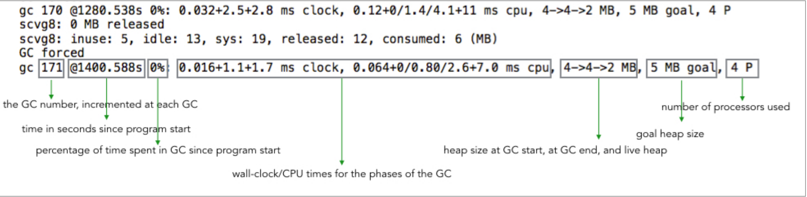
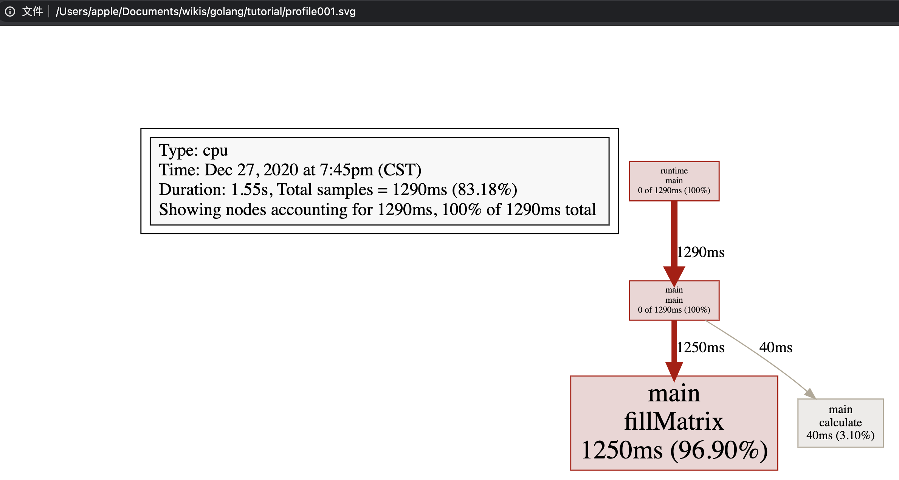
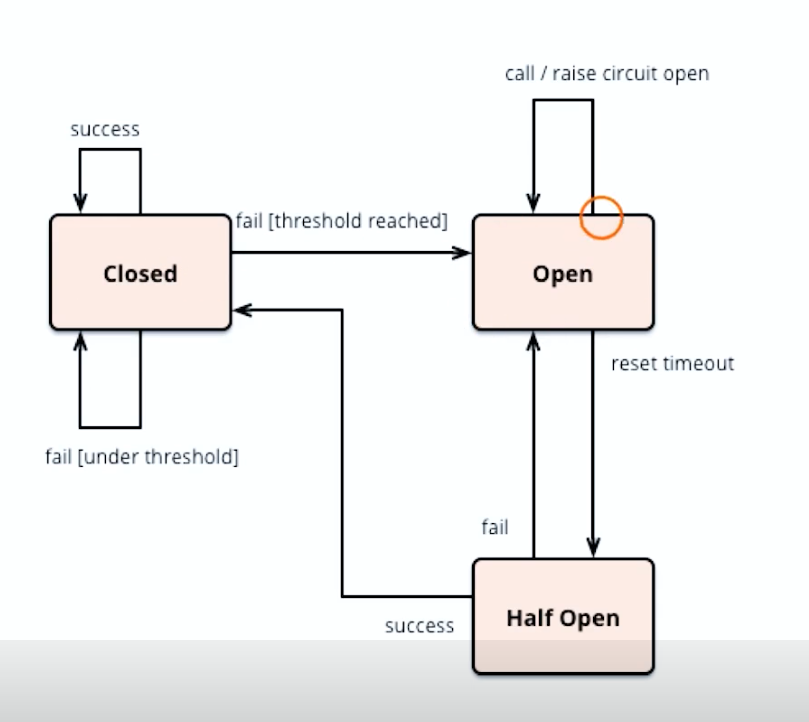
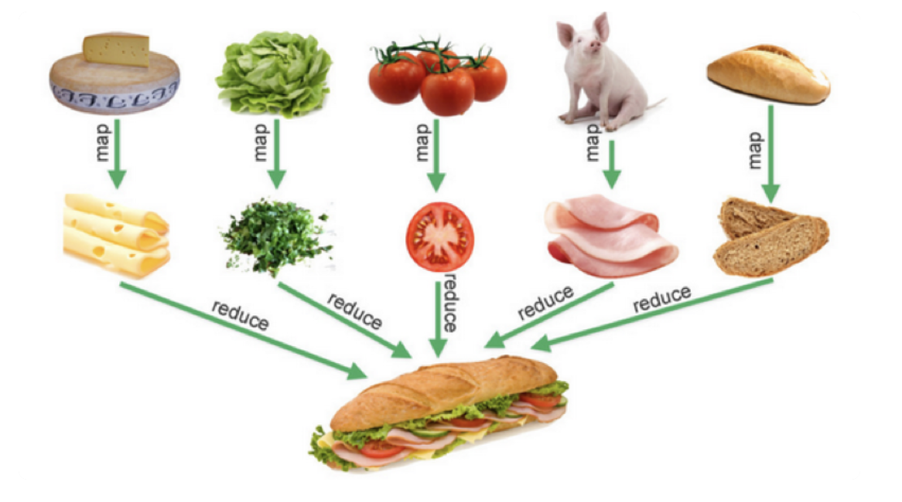
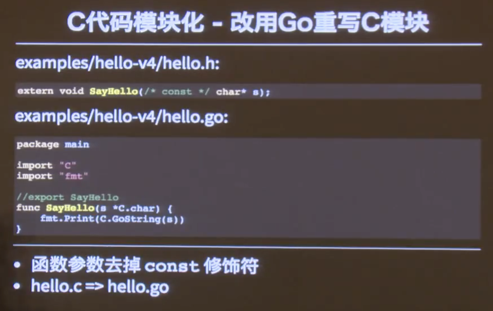
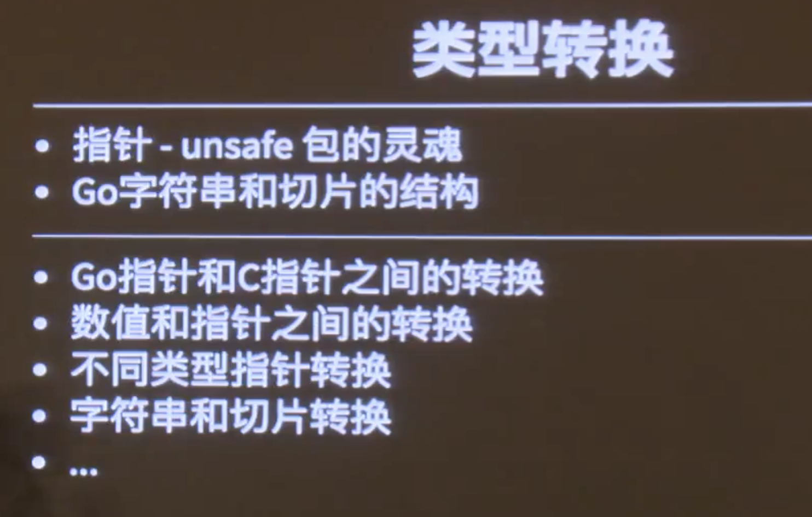
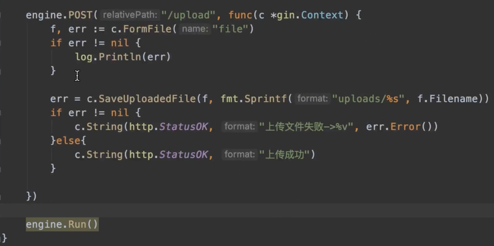

# go_learning


## 概念

- GOROOT：GO语言的安装目录


## 数据类型

### 数组array

- 声明

  ```go
  var a[3]int //声明并初始化为默认零值
  b := [3]int{1,2,3}	//声明同时初始化
  c := [2][2]int{{1,2},{3,4}}	//多维数组初始化
  ```

- 数组截取

  > a[开始索引(包含), 结束索引(不包含)]

  ```go
  a := [...]int{1,2,3,4,5}
  a[1,2] //2
  a[1:len(a)] //2,3,4,5
  a[1:]	//2,3,4,5
  a[:3] //1,2,3
  ```

- 数组是值类型

  在 Go 中数组是值类型而不是引用类型。这意味着当数组变量被赋值时，将会获得原数组（*译者注：也就是等号右面的数组*）的拷贝。新数组中元素的改变不会影响原数组中元素的值。


### 切片slice

- 切片（slice）是建立在数组之上的更方便，更灵活，更强大的数据结构。切片并不存储任何元素而只是对现有数组的引用。

- **修改切片：**

  切片本身不包含任何数据。它仅仅是底层数组的一个上层表示。对切片进行的任何修改都将反映在底层数组中。

  当多个切片共享同一个数组时，对每一个切片的修改都将会反映到这个数组中。

- **切片的长度和容量**：

  切片的长度是指切片中元素的个数。切片的容量是指从切片的起始元素开始到其底层数组中的最后一个元素的个数。

- 内部是个结构体

  ```go
  type slice struct {
    void* ptr //Element
    len int //元素个数
    cap int	//内部数组的容量
  }
  
  var s0 [] int //声明len=0，cap=0的int切片
  s0 = append(s0, 1) //len=1, cap=1
  
  s2 := make([]int, 3, 5) // len=3 cap=5
  t.Log(s2[0], s2[1], s2[2], s2[3], s2[4]) // error index out of range! 后两个元素不可访问！
  ```

  

**内存优化**

切片保留对底层数组的引用。只要切片存在于内存中，数组就不能被垃圾回收。这在内存管理方便可能是值得关注的。假设我们有一个非常大的数组，而我们只需要处理它的一小部分，为此我们创建这个数组的一个切片，并处理这个切片。这里要注意的事情是，数组仍然存在于内存中，因为切片正在引用它。

解决该问题的一个方法是使用 [copy](https://golang.org/pkg/builtin/#copy) 函数 `func copy(dst, src []T) int` 来创建该切片的一个拷贝。这样我们就可以使用这个新的切片，原来的数组可以被垃圾回收。


### Map与工厂模式

- map的value可以是一个方法
- 与go的dock type接口方式一起，可以方便的实现单一方法对象的工厂模式


### Map自实现Set

go内置集合中没有Set的实现，可以用 **map[type]bool** 来构造

- 作为key的type为任意类型，value为bool值
- 保证了元素的唯一性
- 基本操作：
  - 添加元素
  - 判断元素是否存在
  - 删除元素
  - 元素个数


### Json的map的转换

```go
package main
import (
    "encoding/json"
    "fmt"
)

func main() {
    b := []byte(`{
    "Title":"go programming language",
    "Author":["john","ada","alice"],
    "Publisher":"qinghua",
    "IsPublished":true,
    "Price":99
  }`)
    // 先创建一个目标类型的实例对象，用于存放解码后的值
    var inter interface{}
    err := json.Unmarshal(b, &inter)
    if err != nil {
        fmt.Println("error in translating,", err.Error())
        return
    }
    // 要访问解码后的数据结构，需要先判断目标结构是否为预期的数据类型
    book, ok := inter.(map[string]interface{})
    // 然后通过for循环一一访问解码后的目标数据
    if ok {
        for k, v := range book {
            switch vt := v.(type) {
            case float64:
                fmt.Println(k, " is float64 ", vt)
            case string:
                fmt.Println(k, " is string ", vt)
            case []interface{}:
                fmt.Println(k, " is an array:")
                for i, iv := range vt {
                    fmt.Println(i, iv)
                }
            default:
                fmt.Println("illegle type")
            }
        }
    }
}
```


### 字符串string

在go语言中：

1. string是数据类型，不是引用或指针类型

2. string是只读的byte slice，len函数可以获取它的长度，长度是byte的个数

3. string的byte数组可以存放任意数据，不知肉眼可读的字符串，二进制数据也都可以

   

   

**Unicode UTF8**

1. Unicode 是一种**字符集**（In English：code point）
2. UTF8是unicode的存储实现，转换为字节序列的规则

|     字符      |        中        |
| :-----------: | :--------------: |
|    Unicode    |      0x4E2D      |
|     UTF-8     |     0xE4B8AD     |
| string/[]byte | [0xE4,0xB8,0xAD] |


### struct结构体

**空结构体的使用场景**

- 定义空channel
- 定义只包含一堆接口的结构做方法适配


## Go语言的函数

GO语言中的函数是一等公民。

1. 可以有多个返回值
2. 所有参数都是值传递：slice，map，channel会有传引用的错觉，因为函数调用时复制了指针，但指针指向的同一块内存空间
3. 函数可以作为变量的值
4. 函数可以作为参数和返回值


## 接口和方法

```go

// 第一种方法在实例方法被调用时，实例会被值拷贝一次
// 第一种定义方式在实例对应方法被调用时，实例的成员会进行值复制
func (e Employ) GetString() string {

	return fmt.Sprintf("Id=%d, Name=%s", e.Id, e.Name)
}

// 第二种方法避免了内存拷贝，通常使用
func (e *Employ) GetString2() string {

	return fmt.Sprintf("Id=%d, Name=%s", e.Id, e.Name)
}
```


## Go routine

### [goroutine并发介绍](http://www.topgoer.com/%E5%B9%B6%E5%8F%91%E7%BC%96%E7%A8%8B/%E5%B9%B6%E5%8F%91%E4%BB%8B%E7%BB%8D.html)

```
协程：独立的栈空间，共享堆空间，调度由用户自己控制，本质上有点类似于用户级线程，这些用户级线程的调度也是自己实现的。
线程：一个线程上可以跑多个协程，协程是轻量级的线程。
```

**goroutine 只是由官方实现的超级"线程池"。**

每个实例`4~5KB`的栈内存占用和由于实现机制而大幅减少的创建和销毁开销是go高并发的根本原因。


在java/c++中我们要实现并发编程的时候，我们通常需要自己维护一个线程池，并且需要自己去包装一个又一个的任务，同时需要自己去调度线程执行任务并维护上下文切换，这一切通常**会耗费程序员大量的心智**。那么能不能有一种机制，程序员只需要定义很多个任务，让系统去帮助我们把这些任务分配到CPU上实现并发执行呢？

**goroutine是由Go的运行时（runtime）调度和管理的。**Go程序会智能地将 goroutine 中的任务合理地分配给每个CPU。Go语言之所以被称为现代化的编程语言，就是因为它在语言层面已经内置了调度和上下文切换的机制。


### goroutine可增长的栈

OS线程（操作系统线程）一般都有固定的栈内存（通常为2MB）**,一个goroutine的栈在其生命周期开始时只有很小的栈（典型情况下2KB），goroutine的栈不是固定的，他可以按需增大和缩小**，goroutine的栈大小限制可以达到1GB，虽然极少会用到这个大。所以在Go语言中一次创建十万左右的goroutine也是可以的。


### goroutine调度

GPM是Go语言运行时（runtime）层面的实现，是go语言自己实现的一套调度系统。区别于操作系统调度OS线程。

- 1.G很好理解，就是个goroutine的，里面除了存放本goroutine信息外 还有与所在P的绑定等信息。
- 2.**P管理着一组goroutine队列，P里面会存储当前goroutine运行的上下文环境（函数指针，堆栈地址及地址边界），P会对自己管理的goroutine队列做一些调度（比如把占用CPU时间较长的goroutine暂停、运行后续的goroutine等等）当自己的队列消费完了就去全局队列里取，如果全局队列里也消费完了会去其他P的队列里抢任务。**
- 3.M（machine）是Go运行时（runtime）对操作系统内核线程的虚拟， **M与内核线程一般是一一映射的关系**， 一个groutine最终是要放到M上执行的；


**P与M一般也是一一对应的**。他们关系是： **P管理着一组G挂载在M上运行。当一个G长久阻塞在一个M上时，runtime会新建一个M，阻塞G所在的P会把其他的G 挂载在新建的M上。当旧的G阻塞完成或者认为其已经死掉时 回收旧的M。**

P的个数是通过runtime.GOMAXPROCS设定（最大256），Go1.5版本之后默认为物理线程数。 在并发量大的时候会增加一些P和M，但不会太多，切换太频繁的话得不偿失。


单从线程调度讲，Go语言相比起其他语言的优势在于:

- OS线程是由OS内核来调度的，goroutine则是由Go运行时（runtime）自己的调度器调度的，这个调度器**使用一个称为m:n调度的技术（复用/调度m个goroutine到n个OS线程）**。 
- 其一大特点是**goroutine的调度是在用户态下完成的， 不涉及内核态与用户态之间的频繁切换，包括内存的分配与释放，都是在用户态维护着一块大的内存池， 不直接调用系统的malloc函数（除非内存池需要改变），成本比调度OS线程低很多。**
- 另一方面充分利用了多核的硬件资源，**近似的把若干goroutine均分在物理线程上**， 
- 再加上本身goroutine的超轻量，以上种种保证了go调度方面的性能。


### Thread vs Routine

Java和Go做比较：

1. 创建时默认的stack大小
   - java5以后的Java thread stack默认是1M
   - goroutine的stack初始化大小是2K
2. 和KSE（Kernal Space Entity）的对应关系
   - Java thread 是 1:1
   - goroutine是 M:N


### select控制程序流

- 多路选择，每个case跟着的是一个阻塞事件，比如channel、timer
- 对case的条件成立的执行是无序的，和switch不同！如果多个case都满足，随机只进入其中一个case！
- 可以实现超时控制！

#### 空select

```go
select {

}
```

会直接阻塞当前的goroutine，使得该goroutine进入无法被唤醒的永久休眠状态！

#### 只有一个case

```go
select {
case <-ch1
  ...
}
```

该select就变成了一个阻塞的channel读写操作

#### 有default语句

```go
select {
  case <-ch1:
  ...
  deafult:
  ...
}
```

相当于做了一个有阻塞的channel读取操作

#### 有优先级的select

[参考资料](https://www.liwenzhou.com/posts/Go/priority_in_go_select/)

```go
func worker2(ch1, ch2 <-chan int, stopCh chan struct{}) {
	for {
		select {
		case <-stopCh:
			return
		case job1 := <-ch1:
			fmt.Println(job1)
		case job2 := <-ch2:
		priority:
			for {
				select {
				case job1 := <-ch1:
					fmt.Println(job1)
				default:
					break priority
				}
			}
			fmt.Println(job2)
		}
	}
}
```

使用了嵌套的`select`，还组合使用了`for`循环和`LABEL`来实现题目的要求。上面的代码在外层`select`选中执行`job2 := <-ch2`时，进入到内层`select`循环继续尝试执行`job1 := <-ch1`,当`ch1`就绪时就会一直执行，否则跳出内层`select`。

在`select`中实现优先级在实际生产中是有实际应用场景的，例如[K8s的controller](https://github.com/kubernetes/kubernetes/blob/7509c4eb478a3ab94ff26be2b4068da53212d538/pkg/controller/nodelifecycle/scheduler/taint_manager.go#L244)中就有关于上面这个技巧的实际使用示例。


## channel

### channel的关闭

- 向关闭的channel发送数据，会导致panic
- v, ok <- ch; ok=true/false表示通道正常接收/通道关闭
- 所有的channel接收者都会在channel关闭时，立刻从阻塞等待中返回且ok=false。此广播机制常被利用，进行向多个订阅者同时发送信号。如：进程或协程的退出信号。

```
 		1.对一个关闭的通道再发送值就会导致panic。
    2.对一个关闭的通道进行接收会一直获取值直到通道为空。
    3.对一个关闭的并且没有值的通道执行接收操作会得到对应类型的零值。
    4.关闭一个已经关闭的通道会导致panic。
```


**如何优雅的从通道循环取值**

```go
// 方法1
i, ok := <-ch1 // 通道关闭后再取值ok=false
if !ok {
  break
}

// 方法2
for i := range ch2 { // 通道关闭后会退出for range循环
  fmt.Println(i)
}
```

通常使用的是for range的方式。


### channel实现信号量和互斥锁

```go
type Empty interface{}    // 空接口
type semaphore chan Empty // 信号量
```

- 实现信号量的P操作，就是不断的往channel中放入数据，当channel满时，其他协程就不能再往channel放数据了，而只能阻塞，直到有一个协程释放资源，也就是执行V操作
- V操作就是从channel中取出资源
- 当channel容量**只有一个**时，P和V的数量变为1，同时进行P操作的协程只能有一个，在该协程执行完P操作没有执行V操作时，其他协程只能等待，这就实现了访问临界区资源的mutex功能。


### close(channel)做任务取消


### 只读/只写channel

```go
// 定义只读chann
read_only := make(<-chan int)
// 定义只写chann
write_only := make(chan<- int)
```

定义只读或只写的channel意义不大，一般用于参数传递中：

```go
func send(<-ch int){
  for i := 0; i < 10; i++ {
    c <- i
  }
}

func recv(c ch<- int) {
  for i := range c {
    fmt.Println(i)
  }
}
```


### 无缓冲chann和有缓冲chann

默认情况下 `ch := make(chan int)`，发送和接收操作在另一端准备好之前都会阻塞！这使得Go协程可以在没有显式的锁或竞态变量的情况下进行同步！

```go
ch1 := make(chan int) //无缓冲
ch2 := make(chan int, 1) //有缓冲
```

- **无缓冲**：当向ch1中存值时，需要其他协程取值，否则一直阻塞在存值的那个step中！

  > 在默认不带缓冲的channel中，每一个发送者与接收者都会阻塞当前协程！

  ```go
  package main
  import (
      "fmt"
  )
  func main() {
      c := make(chan int)
      c <- 1
      fmt.Println(<-c)
  }
  /**
  fatal error: all goroutines are asleep - deadlock!
  
  goroutine 1 [chan send]:
  main.main()
  	/Users/apple/Downloads/software-mac/chan-nobuffer.go:7 +0x59
  exit status 2
  */
  ```

  

- **有缓冲**：当向ch2中存值时，只有放到第二个值时，才阻塞！

  

### select

- select语句使一个Go协程可以等待多个通信chann的操作
- select 会阻塞到某个分支可以继续执行为止，这时就会执行该分支。
- 当多个分支都准备好，会**随机选择**一个执行


### 构建对象池

- 因为一些对象例如数据库连接池的创建性能可能较大，需要预先创建

- 对象池需要有获取和归还接口

- 使用buffered channel实现对象池

  > 高可用系统中的一个金句：slow response比quick failure 更糟糕！

```go
runtime.GC() // 主动释放一次GC 会清除sync.pool中缓存的对象
```


## context与任务取消

- 根context：通过context.Background()获得

- 子context：通过context.WithCancel(parentContext)来创建

  ```go
  ctx, cancel := context.WithCancel(context.Background())
  ```

- 当前context被取消时，基于他的子context都会被取消

- 接收取消通知：<-ctx.Done()


## 测试

### Unit Test单元测试

- 表格测试法

  ```go
  func TestSquare(t *testing.T) {
    inputs := [...]int{1,2,3}
    expected := [...]int{1,4,9}
    for i:=0; i<len(inputs); i++ {
      if (squar(inputs[i])!=expected[i]) {
        t.Error("unexpected !")
      }
    }
  }
  ```

  

- 代码覆盖率，且显示tlog

  ```shell
  go test -v -cover
  ```

- 断言

  > github.com/stretchr/testify/assert


### Benchmark性能测试

```bash
# 能看出内存alloc次数
go test -bench=. -benchmem
```

>goos: darwin
>goarch: amd64
>BenchmarkConcatStringByAdd-12            9171664               122 ns/op              16 B/op          4 allocs/op
>BenchmarkConcatStringByBytesBuff-12     20660036                56.2 ns/op            64 B/op          1 allocs/op
>PASS
>ok      _/Users/apple/Documents/wikis/golang/tutorial/go_learning/src/ch35_benchmark    2.922s


### BDD

> Behavior Drive Design 行为驱动开发


#### BDD in Go

 - 项目网站

   > https://github.com/smartystreets/goconvey

- 安装

  > go get -v -u github.com/smartystreets/goconvey/convey

- 启动 WEB UI

  > $GOPATH/bin/goconvey


## 反射-reflect

### 利用反射编写灵活的代码

- 按名字访问结构的成员

  ```go
  reflect.ValueOf(*e).FieldByName("Name")
  ```

- 按名字访问结构的方法

  ```go
  reflect.ValueOf(*e).MethodByName("UpdateAge").Call([]reflect.Value{reflect.ValueOf(1)}) 
  ```

- 内置的JSON解析就是利用反射实现，通过FieldTag来标识对应的json值

- 更快的JSON解析：**EasyJson**，采用代码生成而非反射，用于生产环境，内置的json用了反射，性能不行，多用于配置文件解析

  - 安装

    > go get -u -v github.com/mailru/easyjson/ ...

  - 使用

    > easyjon -all <结构定义>.go


### 反射优缺点

- 可以构建key-value获取和赋值的万能程序
- 可读性变差，不如直接的set/get好，调试困难，也有性能问题


## Unsafe的不安全编程

- 不适合的场景：无意义的强制类型转换，其值可能有丢失，比如float64和int的unsafe.Pointer转换

  ```go
  i := 10
  f := *(*float64)(unsafe.Pointer(&i))
  ```

  

- 适合的场景：

  - 自定义了一个比如 type MyInt int，后面需要对int类的变量做使用MyInt的方法操作
  - 并发读写中，可以先把数据写到一个buffer内存中，再用atomic一次替换到读内存中，以后使用的读内存块就是最新的了


## Micro Kernel微内核架构

### 特点

- 易于扩展
- 错误隔离
- 保持架构一致性

### 要点

- 内核包含公共流程或通用逻辑
- 讲可变或可扩展部分规划为扩展点
- 抽象扩展点行为，定义接口
- 利用插件进行扩展

- <<Kernel>> Agent

  >  Extension Point

  - <<Plugin>> FileCollector
  - <<Plugin>>ProcessCollector
  - ...
  - <<Plugin>>AppCollector


## HTTP服务

- 内置的http服务

> net/http

- 路由规则：

  - URL分为两种，末尾是/表示一个子树，后面可以跟其他子路径；

  - 末尾不是/，表示一个叶子，固定的路径以/结尾的URL可以匹配他的任何子路径

    > 比如 /images/ 会匹配 /images/cute-cat.jpg

  - 它采用最长匹配原则，如果有多个匹配，一定采用匹配路径最长的那个进行处理
  - 如果没有找到任何匹配项，会返回404错误。

- 构建Restful服务，更好的router

  > https://github.com/julienshmidt/httprouter


## 性能工具

### 火焰图

- **graphviz** 安装

  > brew install graphviz

- **go-torch** ，安装
  
  - go get github.com/uber/go-torch
  - 下载并复制：flamegraph.pl (https://github.com/brendangregg/FlameGraph) 至 $GOPATH/bin路径下


### 通过文件方式输出profile

- 灵活性高，适用于特定代码段的分析
- 通过手动调用runtime/pprof的API
- API相关文档 https://studygolang.com/static/pkgdoc/pkg/runtime_pprof.htm
- go tool pprof [binary] [binary.prof]


### 通过http方式输出profile

- 简单，适合于持续性运行的应用
- 在应用程序中导入 import _ "net/http/pprof"，并启动http server即可
- go tool pprof http://<host>:<port>/debug/pprof/profile?seconds=10 （默认值为30秒）
- go-torch -seconds 10 http://<host>:<port>/debug/pprof/profifile


### Go支持的多种Profile

- go help testflag

- 常见分析指标
  - Wall Time: 墙上时钟时间
  - CPU Time
  - Block Time ??
  - Memory Allocation
  - GC times/time spent


### go test 输出profile文件

```shell
# 生产profile
go test -bench=. -cpuprofile=cpu.prof
go test -bench=. -blockprofile=block.prof
# 查看profile，用网页查看
go tool pprof cpu.prof
> top
> svg
> list GetFibonacci
> exit
go-torch cpu.prof
```

- 使用浏览器打开go tool中用命令svg生成的svg文件：红色或方框越大，就占比越高的！


## GC日志

- 查看GC：在程序执行之前加上环境变量：`GODEBUG=gctrace=1`

  ```bash
  GODEBUG=gctrace=1 go test -bench=.
  GODEBUG=gctrace=1 go run main.go
  ```

- 日志详细信息参考：**https://godoc.org/runtime**

  

- 避免内存分配和复制
  - 初始化至合适的大小，因为自动扩容是有代价的
  - 复用内存，传引用


## 性能调优

- 无锁的读，比有lock的读，性能高一个数量级！
- strings.Build比+操作符性能要好很多！
- sync.Map是协程安全的，适用于读多写少的场景
- sync.Map比内置的map存储空间大，因为它用到了空间换时间的方案！它分为ReadOnly块和Diry块，前者负责读，后者负责写
- [concurrent-map](https://github.com/orcaman/concurrent-map) 性能很好！
- 用ringbuffer实现无锁编程，支持百万的QPS



## go mod

- GO111MODULE来设置go mod

  - on：go命令行会使用modules，而一点也不会去GOPATH目录下查找
  - off：go命令行将不会支持module功能，寻找依赖包的方式将会沿用旧版本的vendor或GOPATH模式
  - auto：如项目放置在GOPATH/src中，则使用GOPATH，否则使用go mod

- 环境修改：

  ```shell
  # 开启go mod
  go env -w GO111MODULE=on
  # 配置依赖包的下载代理为国内阿里云
  go env -w GOPROXY=http://mirrors.aliyun.com/goproxy/
  ```

- 常用指令：

  ```shell
  # 初始化模块
  go mod init rt.server.manager
  # 打印模块依赖图
  go mod graph
  # 解释为什么需要依赖
  go mod why
  # 下载依赖包
  go mod download
  ```

- 依赖的第三方包被下载到了$GOPATH/pkg/mod路径下

- 依赖包中的地址失效了怎么办？比如 [golang.org/x/…](https://link.zhihu.com/?target=http%3A//golang.org/x/%E2%80%A6) 下的包都无法下载怎么办？

  > 在go.mod文件里用 replace 替换包，例如
  >
  > replace [golang.org/x/text](https://link.zhihu.com/?target=http%3A//golang.org/x/text) => [golang/text](https://link.zhihu.com/?target=http%3A//github.com/golang/text) latest
  >
  > 这样，go会用 [github.com/golang/text](https://link.zhihu.com/?target=http%3A//github.com/golang/text) [替代golang.org/x/text，原理就是下载github.com/golang/text](https://link.zhihu.com/?target=http%3A//%E6%9B%BF%E4%BB%A3golang.org/x/text%EF%BC%8C%E5%8E%9F%E7%90%86%E5%B0%B1%E6%98%AF%E4%B8%8B%E8%BD%BDgithub.com/golang/text) 的最新版本到 $GOPATH/pkg/mod/golang.org/x/text下。

- 依赖包的版本是怎么控制的？

  > $GOPATH/pkg/mod里可以保存相同包的不同版本。
  >
  > 版本是在go.mod中指定的。
  >
  > 如果，在go.mod中没有指定，go命令会自动下载代码中的依赖的最新版本。
  >
  > 如果，在go.mod用require语句指定包和版本 ，go命令会根据指定的路径和版本下载包。
  >
  > 指定版本时可以用latest，这样它会自动下载指定包的最新版本；

- 参考资料：[Go go.mod入门](https://zhuanlan.zhihu.com/p/126561786)


## CSP并发模型

- CSP模型用于描述两个独立的实体通过共享的通讯channel（管道）进行通信的并发模型。

- CSP中channel是第一类对象，它不关注发送消息的实体，而关注与发送消息时使用的channel。

- Golang实现了CSP并发模型作为并发基础，底层使用goroutine作为并发实体。

- goroutine非常轻量级，可以创建几十万个实体。实体间通过channel继续匿名消息传递使之解耦！

- go在语言层面实现了自动调度！屏蔽了很多内部细节，对外提供简单的语法关键字，大大简化了并发编程的思维转换和管理线程的复杂性。

  

- 其中

  - M：是内核线程
  - P：是协调调度，用于协调调度M和G的执行，内核线程只有拿到了P才能对goroutine继续调度执行，一般都是通过限定P的个数来控制golang的并发度！
  - G：是待处理的协程，包含这个goroutine的栈空间
  - G1/G2/..：灰色的背景的Gn是已经挂起的goroutine。它们被添加到执行队列中。
  - 需要等待网络IO的goroutine，当P通过epoll查询到特定的fd的时候，会重新调度起对应的，正在挂起的goroutine重新运行。
  - golang为了调度的公平性，在调度器加入了steal working算法：在一个P自己的执行队列，执行完之后，它会优先到全局的执行队列中偷G来进行处理；如果没有的话；再回到其他P的执行队列中抢G来进行处理。
  - 


## 架构设计的关键部分

- 重用&隔离：即同一个系统，部署多份，每份起的作用可以不一样，起到隔离的作用

- 冗余设计：负载均衡

- 单点失效：譬如QPS是1500，分在两个各QPS1000的系统上，如果一个系统故障，会导致整个系统不可用

- 慢响应：A quick rejection is better than a slow response.

- 不要无休止的等待：给阻塞操作都加上一个期限

- 拒绝单体系统

- 面向错误和恢复的设计

  - 在依赖服务不可用时，可以继续存活！
  - 快速启动
  - 无状态！

- 与客户端协商：

  > server：我太忙了，请慢点发数据
  >
  > client：好，我一分钟后再发送

- 断路器：




- 令牌桶

  


- [github项目: service_decorator](https://github.com/easierway/service_decorators/blob/master/README.md)


### go的共享内存

要使用共享内存要执行以下几步：

1. 发起一个系统调用，让系统帮你生产一块内存，或者取得一块已经存在的内存来使用。
2. 把内存attach到当前进程，让当前进程可以使用。大家都知道，我们在进程中访问的是虚拟内存地址，系统会把它映射到物理内存中。如果没有这一步，第1步创建的内存就不能在当前进程访问。
3. 这时就可以对内存进程读写操作了。
4. 进程结束的时候要把上面attach的内存给释放。


**关键代码1：**

```go
func Syscall(trap, a1, a2, a3 uintptr) (r1, r2 uintptr, err Errno)

shmid, _, err := syscall.Syscall(syscall.SYS_SHMGET, 2, 4, IpcCreate|0600)
shmaddr, _, err := syscall.Syscall(syscall.SYS_SHMAT, shmid, 0, 0)
defer syscall.Syscall(syscall.SYS_SHMDT, shmaddr, 0, 0)
```

涉及到的系统调用有：

`SYS_SHMGET`: 创建或者取得共享内存。
`SYS_SHMAT`: 将共享内存attach到当前进程空间。
`SYS_SHMDT`: 将共享内存从当前进程中deattach。

对应：

```c
int shmget(key_t key, size_t size, int shmflg);  
void *shmat(int shm_id, const void *shm_addr, int shmflg); 
int shmdt(const void *shmaddr);
```

**关键代码2：**

```go
    handle, err := syscall.CreateFileMapping(0, nil, syscall.PAGE_READWRITE, 0, uint32(size), file)
    defer syscall.CloseHandle(handle)
    addr, err := syscall.MapViewOfFile(handle, syscall.FILE_MAP_WRITE, 0, 0, 0)

    handle, err := syscall.CreateFileMapping(0, nil, syscall.PAGE_READONLY, 0, uint32(size), file)
    defer syscall.CloseHandle(handle)
    addr, err := syscall.MapViewOfFile(handle, syscall.FILE_MAP_READ, 0, 0, 0)
    defer syscall.UnmapViewOfFile(addr)
```

**参考资料：**

- [Golang直接操作共享内存](https://studygolang.com/articles/10203)

- [golang 进程间共享内存](https://blog.csdn.net/az44yao/article/details/103463898)

  

## 左耳听风《Go语言编程模式实战》

### 切片

slice是一个结构体：

```go
type slice struct {
    array unsafe.Pointer //指向存放数据的数组指针
    len   int            //长度有多大
    cap   int            //容量有多大
}
```

这里数据会发生共享！

```go
func main() {
	path := []byte("AAAA/BBBBBBBBB")
	sepIndex := bytes.IndexByte(path, '/')

	dir1 := path[:sepIndex]
	dir2 := path[sepIndex+1:]

	fmt.Println("dir1 =>", string(dir1)) //prints: dir1 => AAAA
	fmt.Println("dir2 =>", string(dir2)) //prints: dir2 => BBBBBBBBB

	dir1 = append(dir1, "suffix"...)

	fmt.Println("dir1 =>", string(dir1)) //prints: dir1 => AAAAsuffix
	fmt.Println("dir2 =>", string(dir2)) //prints: dir2 => uffixBBBB
}
```

append()这个函数在 cap 不够用的时候，就会重新分配内存以扩大容量，如果够用，就不会重新分配内存了！

```go
dir1 := path[:sepIndex]	//旧代码
// 修改为下面的：
dir1 := path[:sepIndex:sepIndex]	//新代码
```

新的代码使用了 Full Slice Expression，最后一个参数叫“Limited Capacity”，于是，后续的 append() 操作会导致重新分配内存。


### 深度比较

使用到反射 reflect.DeepEqual() 来做深度比较做是否相等的判断：

```go
package main

import (
	"fmt"
	"reflect"
)

type data struct {
}

func main() {

	v1 := data{}
	v2 := data{}
	fmt.Println("v1 == v2:", reflect.DeepEqual(v1, v2))
	//prints: v1 == v2: true

	m1 := map[string]string{"one": "a", "two": "b"}
	m2 := map[string]string{"two": "b", "one": "a"}
	fmt.Println("m1 == m2:", reflect.DeepEqual(m1, m2))
	//prints: m1 == m2: true

	s1 := []int{1, 2, 3}
	s2 := []int{1, 2, 3}
	fmt.Println("s1 == s2:", reflect.DeepEqual(s1, s2))
	//prints: s1 == s2: true
}
```


### 接口编程

面向对象编程方法的黄金法则——“Program to an interface not an implementation”。

```go
type Country struct {
    Name string
}

type City struct {
    Name string
}

type Stringable interface {
    ToString() string
}
func (c Country) ToString() string {
    return "Country = " + c.Name
}
func (c City) ToString() string{
    return "City = " + c.Name
}

func PrintStr(p Stringable) {
    fmt.Println(p.ToString())
}

d1 := Country {"USA"}
d2 := City{"Los Angeles"}
PrintStr(d1)
PrintStr(d2)
```


### 接口完整性检查

Go 语言的编译器并没有严格检查一个对象是否实现了某接口所有的接口方法：

在 Go 语言编程圈里，有一个比较标准的做法：

```go
var _ Shape = (*Square)(nil)
```

声明一个 _ 变量（没人用）会把一个 nil 的空指针从 Square 转成 Shape，这样，如果没有实现完相关的接口方法，编译器就会报错：

```bash
cannot use (*Square)(nil) (type *Square) as type Shape in assignment: *Square does not implement Shape (missing Area method)
```

这样就做到了强验证的方法。


### 时间

时间有时区、格式、精度等问题，其复杂度不是一般人能处理的。所以，一定要重用已有的时间处理，而不是自己干。

在 Go 语言中，你一定要使用 time.Time 和 time.Duration 这两个类型。

- 在命令行上，flag 通过 time.ParseDuration 支持了 time.Duration。
- JSON 中的 encoding/json 中也可以把time.Time 编码成 [RFC 3339 的格式](https://tools.ietf.org/html/rfc3339)。
- 数据库使用的 database/sql 也支持把 DATATIME 或 TIMESTAMP 类型转成 time.Time。
- YAML 也可以使用 gopkg.in/yaml.v2 支持 time.Time 、time.Duration 和 RFC 3339 格式。
- 如果你要和第三方交互，实在没有办法，也请使用 RFC 3339 的格式。

最后，如果你要做全球化跨时区的应用，一定要把所有服务器和时间全部使用 UTC 时间。


### 性能提示

Go 语言是一个高性能的语言，但并不是说这样我们就不用关心性能了。下面提供一份在编程方面和性能相关的提示。

- 如果需要把数字转换成字符串，使用 strconv.Itoa() 比 fmt.Sprintf() 要快一倍左右。
- 尽可能避免把String转成[]Byte ，这个转换会导致性能下降。
- 如果在 for-loop 里对某个 Slice 使用 append()，请先把 Slice 的容量扩充到位，这样可以避免内存重新分配以及系统自动按 2 的 N 次方幂进行扩展但又用不到的情况，从而避免浪费内存。
- 使用StringBuffer 或是StringBuild 来拼接字符串，性能会比使用 + 或 +=高三到四个数量级。
- 尽可能使用并发的 goroutine，然后使用 sync.WaitGroup 来同步分片操作。
- 避免在热代码中进行内存分配，这样会导致 gc 很忙。尽可能使用 sync.Pool 来重用对象。
- 使用 lock-free 的操作，避免使用 mutex，尽可能使用 sync/Atomic包（关于无锁编程的相关话题，可参看[《无锁队列实现》](https://coolshell.cn/articles/8239.html)或[《无锁 Hashmap 实现》](https://coolshell.cn/articles/9703.html)）。
- 使用 I/O 缓冲，I/O 是个非常非常慢的操作，使用 bufio.NewWrite() 和 bufio.NewReader() 可以带来更高的性能。
- 对于在 for-loop 里的固定的正则表达式，一定要使用 regexp.Compile() 编译正则表达式。性能会提升两个数量级。
- 如果你需要更高性能的协议，就要考虑使用 [protobuf](https://github.com/golang/protobuf) 或 [msgp](https://github.com/tinylib/msgp) 而不是 JSON，因为 JSON 的序列化和反序列化里使用了反射。
- 你在使用 Map 的时候，使用整型的 key 会比字符串的要快，因为整型比较比字符串比较要快。


### 错误处理

C 语言，基本上来说，其通过函数的返回值标识是否有错，然后通过全局的 errno 变量加一个 errstr 的数组来告诉你为什么出错。

Java 语言使用 try-catch-finally 通过使用异常的方式来处理错误，其实，这比起 C 语言的错误处理进了一大步，使用抛异常和抓异常的方式可以让我们的代码有这样一些好处。

- 函数接口在 input（参数）和 output（返回值）以及错误处理的语义是比较清楚的。
- 正常逻辑的代码可以跟错误处理和资源清理的代码分开，提高了代码的可读性。
- 异常不能被忽略（如果要忽略也需要 catch 住，这是显式忽略）。
- 在面向对象的语言中（如 Java），异常是个对象，所以，可以实现多态式的 catch。
- 与状态返回码相比，异常捕捉有一个显著的好处，那就是函数可以嵌套调用，或是链式调用，比如：

```java
int x = add(a, div(b,c));
Pizza p = PizzaBuilder().SetSize(sz).SetPrice(p)...;
```


Go 语言的函数支持多返回值，所以，可以在返回接口把业务语义（业务返回值）和控制语义（出错返回值）区分开。Go 语言的很多函数都会返回 result、err 两个值，于是就有这样几点：

- 参数上基本上就是入参，而返回接口把结果和错误分离，这样使得函数的接口语义清晰；
- 而且，Go 语言中的错误参数如果要忽略，需要显式地忽略，用 _ 这样的变量来忽略；
- 另外，因为返回的 error 是个接口（其中只有一个方法 Error()，返回一个 string ），所以你可以扩展自定义的错误处理。

另外，如果一个函数返回了多个不同类型的 error，你也可以使用下面这样的方式：

```go
if err != nil {
  switch err.(type) {
    case *json.SyntaxError:
      ...
    case *ZeroDivisionError:
      ...
    case *NullPointerError:
      ...
    default:
      ...
  }
}
```


#### 资源清理

出错后是需要做资源清理的，不同的编程语言有不同的资源清理的编程模式。

- C 语言：使用的是 goto fail; 的方式到一个集中的地方进行清理。
- C++ 语言：一般来说使用 RAII 模式，通过面向对象的代理模式，把需要清理的资源交给一个代理类，然后再析构函数来解决。
- Java 语言：可以在 finally 语句块里进行清理。
- Go 语言：使用 defer 关键词进行清理。


#### 包装错误

有一个第三方的错误库，对于这个库，我无论到哪儿都能看到它的存在，所以，这个基本上来说就是事实上的标准了。

```go

import "github.com/pkg/errors"

//错误包装
if err != nil {
    return errors.Wrap(err, "read failed")
}

// Cause接口
switch err := errors.Cause(err).(type) {
case *MyError:
    // handle specifically
default:
    // unknown error
}
```


### Functional Options

定义一个函数类型：

```go
type Option func(*Server)
```


使用函数式的方式定义一组返回高阶函数的函数:

```go
func Protocol(p string) Option {
    return func(s *Server) {
        s.Protocol = p
    }
}
func Timeout(timeout time.Duration) Option {
    return func(s *Server) {
        s.Timeout = timeout
    }
}
func MaxConns(maxconns int) Option {
    return func(s *Server) {
        s.MaxConns = maxconns
    }
}
func TLS(tls *tls.Config) Option {
    return func(s *Server) {
        s.TLS = tls
    }
}
```

NewServer()的函数，其中，有一个可变参数 options ，它可以传出多个上面的函数，然后使用一个 for-loop 来设置我们的 Server 对象。

```go
func NewServer(addr string, port int, options ...func(*Server)) (*Server, error) {

  srv := Server{
    Addr:     addr,
    Port:     port,
    Protocol: "tcp",
    Timeout:  30 * time.Second,
    MaxConns: 1000,
    TLS:      nil,
  }
  for _, option := range options {
    option(&srv)
  }
  //...
  return &srv, nil
}
```


### 委托和反转控制

#### 嵌入和委托

```go
type Widget struct {
    X, Y int
}
type Label struct {
    Widget        // Embedding (delegation)
    Text   string // Aggregation
}

type Button struct {
    Label // Embedding (delegation)
}

type ListBox struct {
    Widget          // Embedding (delegation)
    Texts  []string // Aggregation
    Index  int      // Aggregation
}
```


#### 方法重写

```go
type Painter interface {
    Paint()
}
 
type Clicker interface {
    Click()
}

func (label Label) Paint() {
  fmt.Printf("%p:Label.Paint(%q)\n", &label, label.Text)
}

//因为这个接口可以通过 Label 的嵌入带到新的结构体，
//所以，可以在 Button 中重载这个接口方法
func (button Button) Paint() { // Override
    fmt.Printf("Button.Paint(%s)\n", button.Text)
}
func (button Button) Click() {
    fmt.Printf("Button.Click(%s)\n", button.Text)
}


func (listBox ListBox) Paint() {
    fmt.Printf("ListBox.Paint(%q)\n", listBox.Texts)
}
func (listBox ListBox) Click() {
    fmt.Printf("ListBox.Click(%q)\n", listBox.Texts)
}

```

Button.Paint() 接口可以通过 Label 的嵌入带到新的结构体，如果 Button.Paint() 不实现的话，会调用 Label.Paint() ，所以，在 Button 中声明 Paint() 方法，相当于 Override。

#### 嵌入结构多态

可以使用接口来多态，也可以使用泛型的 interface{} 来多态，但是需要有一个类型转换。

```go
button1 := Button{Label{Widget{10, 70}, "OK"}}
button2 := NewButton(50, 70, "Cancel")
listBox := ListBox{Widget{10, 40}, 
    []string{"AL", "AK", "AZ", "AR"}, 0}

for _, painter := range []Painter{label, listBox, button1, button2} {
    painter.Paint()
}
 
for _, widget := range []interface{}{label, listBox, button1, button2} {
  widget.(Painter).Paint()
  if clicker, ok := widget.(Clicker); ok {
    clicker.Click()
  }
  fmt.Println() // print a empty line 
}
```

#### 反转依赖

先声明一种函数接口，表示我们的 Undo 控制可以接受的函数签名是什么样的

```go
type Undo []func()
```

有了这个协议之后，我们的 Undo 控制逻辑就可以写成下面这样：

```go

func (undo *Undo) Add(function func()) {
  *undo = append(*undo, function)
}

func (undo *Undo) Undo() error {
  functions := *undo
  if len(functions) == 0 {
    return errors.New("No functions to undo")
  }
  index := len(functions) - 1
  if function := functions[index]; function != nil {
    function()
    functions[index] = nil // For garbage collection
  }
  *undo = functions[:index]
  return nil
}
```

在 IntSet 里嵌入 Undo，接着在 Add() 和 Delete() 里使用刚刚的方法，就可以完成功能了。

```go

type IntSet struct {
    data map[int]bool
    undo Undo
}
 
func NewIntSet() IntSet {
    return IntSet{data: make(map[int]bool)}
}

func (set *IntSet) Undo() error {
    return set.undo.Undo()
}
 
func (set *IntSet) Contains(x int) bool {
    return set.data[x]
}

func (set *IntSet) Add(x int) {
    if !set.Contains(x) {
        set.data[x] = true
        set.undo.Add(func() { set.Delete(x) })
    } else {
        set.undo.Add(nil)
    }
}
 
func (set *IntSet) Delete(x int) {
    if set.Contains(x) {
        delete(set.data, x)
        set.undo.Add(func() { set.Add(x) })
    } else {
        set.undo.Add(nil)
    }
}
```

这个就是控制反转，不是由控制逻辑 Undo 来依赖业务逻辑 IntSet，而是由业务逻辑 IntSet 依赖 Undo 。这里依赖的是其实是一个协议，这个协议是一个没有参数的函数数组。可以看到，这样一来， Undo 的代码就可以复用了。


### 编程模式：Map-Reduce

函数式编程中非常重要的 Map、Reduce、Filter 这三种操作。这三种操作可以轻松灵活地进行一些数据处理，毕竟，程序大多数情况下都在倒腾数据。尤其是对于一些需要统计的业务场景来说，Map、Reduce、Filter 是非常通用的玩法。

#### Map 示例

```go

func MapStrToStr(arr []string, fn func(s string) string) []string {
    var newArray = []string{}
    for _, it := range arr {
        newArray = append(newArray, fn(it))
    }
    return newArray
}

func MapStrToInt(arr []string, fn func(s string) int) []int {
    var newArray = []int{}
    for _, it := range arr {
        newArray = append(newArray, fn(it))
    }
    return newArray
}

var list = []string{"Hao", "Chen", "MegaEase"}

x := MapStrToStr(list, func(s string) string {
    return strings.ToUpper(s)
})
fmt.Printf("%v\n", x)
//["HAO", "CHEN", "MEGAEASE"]

y := MapStrToInt(list, func(s string) int {
    return len(s)
})
fmt.Printf("%v\n", y)
//[3, 4, 8]
```

#### Reduce 示例

```go

func Reduce(arr []string, fn func(s string) int) int {
    sum := 0
    for _, it := range arr {
        sum += fn(it)
    }
    return sum
}

var list = []string{"Hao", "Chen", "MegaEase"}

x := Reduce(list, func(s string) int {
    return len(s)
})
fmt.Printf("%v\n", x)
// 15
```

#### Filter 示例

```go

func Filter(arr []int, fn func(n int) bool) []int {
    var newArray = []int{}
    for _, it := range arr {
        if fn(it) {
            newArray = append(newArray, it)
        }
    }
    return newArray
}

var intset = []int{1, 2, 3, 4, 5, 6, 7, 8, 9, 10}
out := Filter(intset, func(n int) bool {
   return n%2 == 1
})
fmt.Printf("%v\n", out)

out = Filter(intset, func(n int) bool {
    return n > 5
})
fmt.Printf("%v\n", out)
```

Map-Reduce 的业务语义经典示例图：



Map、Reduce、Filter 只是一种控制逻辑，真正的业务逻辑是以传给它们的数据和函数来定义的。是的，这是一个很经典的“业务逻辑”和“控制逻辑”分离解耦的编程模式。


#### Generic Map

Go 泛型将在 Go 1.18 版本落地，时间是 2022 年 2 月。目前的 Go 语言的泛型只能用 interface{} + reflect来完成。

interface{} 可以理解为 C 中的 void*、Java 中的 Object ，reflect是 Go 的反射机制包，作用是在运行时检查类型。


#### 健壮版的 Generic Map

```go

func Transform(slice, function interface{}) interface{} {
  return transform(slice, function, false)
}

func TransformInPlace(slice, function interface{}) interface{} {
  return transform(slice, function, true)
}

func transform(slice, function interface{}, inPlace bool) interface{} {
 
  //check the `slice` type is Slice
  sliceInType := reflect.ValueOf(slice)
  if sliceInType.Kind() != reflect.Slice {
    panic("transform: not slice")
  }

  //check the function signature
  fn := reflect.ValueOf(function)
  elemType := sliceInType.Type().Elem()
  if !verifyFuncSignature(fn, elemType, nil) {
    panic("trasform: function must be of type func(" + sliceInType.Type().Elem().String() + ") outputElemType")
  }

  sliceOutType := sliceInType
  if !inPlace {
    sliceOutType = reflect.MakeSlice(reflect.SliceOf(fn.Type().Out(0)), sliceInType.Len(), sliceInType.Len())
  }
  for i := 0; i < sliceInType.Len(); i++ {
    sliceOutType.Index(i).Set(fn.Call([]reflect.Value{sliceInType.Index(i)})[0])
  }
  return sliceOutType.Interface()

}

func verifyFuncSignature(fn reflect.Value, types ...reflect.Type) bool {

  //Check it is a funciton
  if fn.Kind() != reflect.Func {
    return false
  }
  // NumIn() - returns a function type's input parameter count.
  // NumOut() - returns a function type's output parameter count.
  if (fn.Type().NumIn() != len(types)-1) || (fn.Type().NumOut() != 1) {
    return false
  }
  // In() - returns the type of a function type's i'th input parameter.
  for i := 0; i < len(types)-1; i++ {
    if fn.Type().In(i) != types[i] {
      return false
    }
  }
  // Out() - returns the type of a function type's i'th output parameter.
  outType := types[len(types)-1]
  if outType != nil && fn.Type().Out(0) != outType {
    return false
  }
  return true
}
```

代码中的几个要点。

- 代码中没有使用 Map 函数，因为和数据结构有含义冲突的问题，所以使用Transform，这个来源于 C++ STL 库中的命名。
- 有两个版本的函数，一个是返回一个全新的数组 Transform()，一个是“就地完成” TransformInPlace()。
- 在主函数中，用 Kind() 方法检查了数据类型是不是 Slice，函数类型是不是 Func。
- 检查函数的参数和返回类型是通过 verifyFuncSignature() 来完成的：NumIn()用来检查函数的“入参”；NumOut() ：用来检查函数的“返回值”。
- 如果需要新生成一个 Slice，会使用 reflect.MakeSlice() 来完成。

1. 可以用于字符串数组：

   ```go
   
   list := []string{"1", "2", "3", "4", "5", "6"}
   result := Transform(list, func(a string) string{
       return a +a +a
   })
   //{"111","222","333","444","555","666"}
   ```

   

2. 可以用于整形数组：

   ```go
   
   list := []int{1, 2, 3, 4, 5, 6, 7, 8, 9}
   TransformInPlace(list, func (a int) int {
     return a*3
   })
   //{3, 6, 9, 12, 15, 18, 21, 24, 27}
   ```

   

3. 可以用于结构体：

   ```go
   
   var list = []Employee{
       {"Hao", 44, 0, 8000},
       {"Bob", 34, 10, 5000},
       {"Alice", 23, 5, 9000},
       {"Jack", 26, 0, 4000},
       {"Tom", 48, 9, 7500},
   }
   
   result := TransformInPlace(list, func(e Employee) Employee {
       e.Salary += 1000
       e.Age += 1
       return e
   })
   ```


#### 健壮版的 Generic Reduce

#### 健壮版的 Generic Filter

[Go 编程模式：Map-Reduce](https://time.geekbang.org/column/article/330232)


### 修饰器模式

```go

package main

import "fmt"

func decorator(f func(s string)) func(s string) {

    return func(s string) {
        fmt.Println("Started")
        f(s)
        fmt.Println("Done")
    }
}

func Hello(s string) {
    fmt.Println(s)
}

func main() {
    decorator(Hello)("Hello, World!")

  	hello := decorator(Hello)
		hello("Hello")
}
```

多个修饰器的 Pipeline

```go
func WithServerHeader(h http.HandlerFunc) http.HandlerFunc ...
func WithBasicAuth(h http.HandlerFunc) http.HandlerFunc ...
  
type HttpHandlerDecorator func(http.HandlerFunc) http.HandlerFunc
// 需要先写一个工具函数(代理函数)，用来遍历并调用各个修饰器：
func Handler(h http.HandlerFunc, decors ...HttpHandlerDecorator) http.HandlerFunc {
    for i := range decors {
        d := decors[len(decors)-1-i] // iterate in reverse
        h = d(h)
    }
    return h
}
```


### pipeline模式

```go
func echo(nums []int) <-chan int...
func sq(in <-chan int) <-chan int { 
  out := make(chan int) 
  go func() { 
    for n := range in { 
      out <- n * n 
    } 
    close(out) 
  }() 
  return out
}

//
var nums = []int{1, 2, 3, 4, 5, 6, 7, 8, 9, 10}
for n := range sum(sq(odd(echo(nums)))) {
  fmt.Println(n)
}

type EchoFunc func ([]int) (<- chan int) 
type PipeFunc func (<- chan int) (<- chan int) 
// 代理函数
func pipeline(nums []int, echo EchoFunc, pipeFns ... PipeFunc) <- chan int {
  ch  := echo(nums)
  for i := range pipeFns {
    ch = pipeFns[i](ch)
  }
  return ch
}


var nums = []int{1, 2, 3, 4, 5, 6, 7, 8, 9, 10}    
for n := range pipeline(nums, gen, odd, sq, sum) {
    fmt.Println(n)
  }
```


## CGO编程







## Go开源框架

### Gin

- 官网：https://gin-gonic.com/

- 上传文件

- 

  


## Go 面向包的设计和架构分层（cmd, internal, pkg)

每个应用项目通常包含三个根目录，分别是 `cmd, internal, pkg`。在 internal 文件里也会包含 `pkg` 目录，但是它和 internal 里其他的包有着不同的设计约束。

```
paper-code/examples/groupevent
├── cmd/
│   └── eventtimer/
│       └── update/
│       └── main.go
│   └── eventserver/
│       └── router/
│           └── handler/
│           └── router.go
│       └── tests/
│       └── main.go
├── internal/
│   └── eventserver/
│       └── biz/
│           └── event/
│           └── member/
│       └── data/
│           └── service/
│   └── eventpopdserver/
│       └── event/
│       └── member/
│   └── pkg/
│       └── cfg/
│       └── db/
│       └── log/
└── vendor/
│   ├── github.com/
│   │   ├── ardanlabs/
│   │   ├── golang/
│   │   ├── prometheus/
│   └── golang.org/
├── go.mod
├── go.sum
```


#### cmd/

项目中的所有你将要编译成可执行程序的入口代码都放在`cmd/` 文件夹里，这些代码和业务没有关系。每个程序对应一个文件夹，文件夹的名称应该以程序的名称命名。一般在名称后面加上`d` 代表该程序是一个守护进程运行。 每个文件夹必须有一个`main`包的源文件，该源文件的名称也最好命名成可执行程序的名称，当然也可以保留main文件名。在此会导入和调用`internal/`和`pkg/`等其他文件夹中相关的代码。


#### internal/

在go语言中，变量，函数，方法等的存取权限只有exported(全局)和unexported(包可见，局部)2种。

在项目中不被复用，也不能被其他项目导入，仅被本项目内部使用的代码包即私有的代码包都应该放在`internal`文件夹下。该文件夹下的所有包及相应文件都有一个项目保护级别，即其他项目是不能导入这些包的，仅仅是该项目内部使用。

如果你在其他项目中导入另一个项目的`internal`的代码包，保存或`go build` 编译时会报错`use of internal package ... not allowed`，该特性是在go 1.4版本开始支持的，编译时强行校验。


#### internal/pkg/

在同一个项目中不同程序需要访问，但又不能让其他项目访问的代码包，需要放在这里。这些包是比较基础但又提供了很特殊的功能，比如**数据库、日志、用户验证**等功能。


#### pkg/

如果你把代码包放在根目录的`pkg`下，其他项目是可以直接导入`pkg`下的代码包的，即这里的代码包是开放的，当然你的项目本身也可以直接访问的。但是如果你要把代码放在`pkg`下，还想需要三思而后行吧，有没必要这样做，毕竟`internal`目录是最好的方式保护你的代码并且被go编译器强制校验`internal`的代码包不可分享的。如果你的项目是一个开源的并且让其他人使用你封装的一些函数等，这样做是合适的，如果你自己或公司的某一个项目，个人的经验，基本上用不上`pkg`


## go-swagger

go-swagger规范：

```go
// swagger:operation PUT /api/v1/addr/update/{id} addr del
// ---
// summary: 修改用户地址
// description: 修改指定用户的addr
// parameters:
// - name: token
//   in: header
//   description: token
//   type: string
//   required: true
// - name: id
//   in: path
//   description: 地址id  
//   type: string
//   required: true
// - name: addr
//   in: body
//   description: addr
//   type: string
//   required: true
// responses:
//   200: repoResp
//   400: badReq
```

常用命令：

```bash
# 根据swagger规范 创建 swagger.json 规范文档
swagger generate spec -o ./swagger.json   

# 启动一个http 服务同时将json文档放入http://petstore.swagger.io 执行
swagger serve -F=swagger swagger.json     
```


## 参考资料

- [教程课件](https://gitee.com/geektime-geekbang/go_learning)
- [Go go.mod入门](https://blog.csdn.net/weixin_39003229/article/details/97638573)
- [golang CSP并发模型](https://www.jianshu.com/p/36e246c6153d)
- [Go语言在select语句中实现优先级-liwenzhou](https://www.liwenzhou.com/posts/Go/priority_in_go_select/)
- [Go语言编程模式实战](https://time.geekbang.org/column/article/330178)
- [Go 面向包的设计和架构分层（cmd, internal, pkg)](https://studygolang.com/articles/30164)

- [go-swagger的简单使用](https://www.cnblogs.com/xiaobaiskill/p/10696621.html)