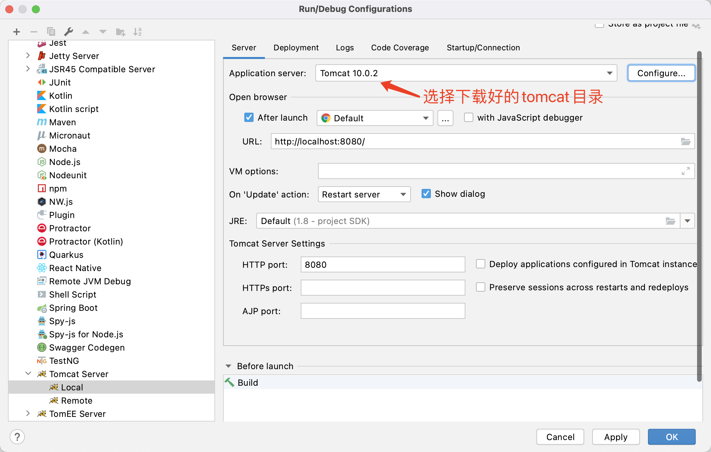
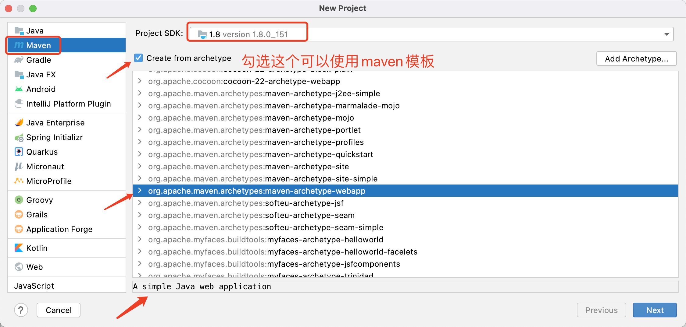

# Java原理篇


## Java的核心包

```bash
jdk8/jdk/bin/rt.jar
```


### bean

JavaBean 表示咖啡豆，实体类，一般都是和数据库中的表结构一一对应的！

bean作用域

- singleton：全局唯一
- prototype：原型，每个对象它都有一个自己的
- ....

spring框架中，托管了bean，对象都由spring自动创建和管理了，程序员只需要负责创建bean的class，使用resources/beans.xml，把class的路径信息填入beans.xml中，利用反射，通过setter方法，即实现了IOC的控制反转。

`pom.xml`

```xml
<dependency>
  <groupId>org.springframework</groupId>
  <artifactId>spring-webmvc</artifactId>
  <version>5.1.10.RELEASE</version>
</dependency>
```

`Hello.java`

```java
public class Hello {
  private String name;
  public String getName() {
    return name;
  }
  public void setName() {
    this.name = name;
  }
  public void show () {
    System.out.println("Hello" + name);
  }
}
```

`beans.xml`

```xml
<beans xmlns="...">
  <bean id="hello" class="com.example.model.Hello">
    <property name="str" value="Spring"/>
  </bean>
</beans>
```

`MyTest.java`

```java
import org.springframework.context.ApplicationContext;
import org.springframework.context.support.ClassPathXmlApplicationContext;
  
public class MyTest {
  public static void main(String[] args) {
    ApplicationContext context = new ClassPathXmlApplicationContext("beans.xml");
    Hello hello = (Hello)(context.getBean("hello"));
    System.out.println(hello.toString());
  }
}
```

- Hello对象是Spring创建的
- Hello对象的属性是有Spring容器设置的

即对象由Spring来创建、管理，装配！

这个过程就叫控制反转。

- 控制：谁来控制对象的创建，传统应用程序的对象有程序本身控制创建的，使用Spring后，对象是Spring来创建的。
- 反转：程序本身不创建对象，而变成被动的接受对象。
- 依赖注入：就是利用set方法来进行注入的。

IOC是一种编程思想，由主动的编程变成被动的接收。


### 接口

在Java中，类的多继承是不合法，但接口允许多继承。

```java
public interface Hockey extends Sports, Event
```

在 JDK1.8，允许我们给接口添加两种非抽象的方法实现：

1、默认方法，添加 **default** 修饰即可；

2、静态方法，使用 static 修饰；示例如下：

```java
interface Test{
    //这个是默认方法
    default String get(String aa){
        System.out.println("我是jdk1.8默认实现方法...");
        return "";
    }   
    //这个是静态方法    
    static void staticmethod(){
        System.out.println("我是静态方法");
    }
}
```

调用得话，静态方法只能通过接口名调用，不可以通过实现类的类名或者实现类的对象调用，default 方法只能通过接口实现类的对象来调用。


### 线程

- 自定义线程类继承 `Thread` 类
- 重写 `run()` 方法，编写线程执行体
- 创建线程对象，调用 start() 方法启动线程
- 推荐使用 实现Runnable 接口 来创建线程
- 守护线程（daemon）：
  - 线程分为用户线程和守护线程
  - 虚拟机必须确保用户线程执行完毕，否则不可终止进程
  - 虚拟机不用等待守护线程执行完毕，就可退出进程
  - 如：后台记录操作日志、监控内存、垃圾回收等等

- `thread.join()` 指定特定的线程插队强制执行，此线程跑完了，其他的线程才能继续走
- `callable`：可以定义返回值；可以抛出异常
- 静态代理设计模式：
  - thread和Runnable就是此模式，例如婚庆公司和结婚新人
  - 真实对象和代理对象都要实现同一个接口
  - 代理对象要代理真实角色
  - 代理对象可以做很多真实对象做不了的事情，真实对象专注做自己的事情


### 数据结构

- 枚举（Enumeration）

  > 这种传统接口已被迭代器取代，虽然Enumeration 还未被遗弃，但在现代代码中已经被很少使用了。尽管如此，它还是使用在诸如Vector和Properties这些传统类所定义的方法中，除此之外，还用在一些API类，并且在应用程序中也广泛被使用。

- Java Bitset类

  > 一个Bitset类创建一种特殊类型的数组来保存位值。BitSet中数组大小会随需要增加。这和位向量（vector of bits）比较类似。

- 线程安全的 `CopyOnWriteArrayList<T>`，都在JUC包下（`java.util.concurrent.xxx`）


### 匿名代码块和static代码块

```java
public class Person {
  {
    // 匿名代码块 对象生成时执行，先于构造器前执行！
  }
  
  static {
    // 静态代码块 和类一起执行
  }
}
```


### 类

- 一个java文件中，只能有一个public的class，但可以有多个其他修饰符的class

**Class对象的生成方式如下：**

**1、类名.class**  

说明： JVM将使用类装载器, 将类装入内存(前提是:类还没有装入内存),不做类的初始化工作.返回Class的对象

**2、Class.forName("类名字符串")** （注：类名字符串是包名+类名） 

说明：装入类,并做类的静态初始化，返回Class的对象

**3、实例对象.getClass()** 

说明：对类进行静态初始化、非静态初始化；返回引用o运行时真正所指的对象(因为:子对象的引用可能会赋给父对象的引用变量中)所属的类的Class的对象


### 抽象类

- 抽象类中可以写普通的方法，也可以写抽象的方法

- 抽象的方法必须在抽象类中

  ```java
  public abstract class Test {
    public abstract void doSth() {
      
    }
    public void show() {
      System.out.pringln("show");
    }
  }
  ```

- 声明抽象类的唯一目的是为了将来对该类进行扩充

- 如果一个类包含抽象方法，那么该类一定要声明为抽象类，否则将出现编译错误。


### 接口

- 接口就是规范，是对现实世界的抽象，定义的是一组规则
- OO的精髓，就是对对象的抽象；设计模式所研究的，实际上就是如何合理的去抽象；
- 接口就是一直契约，面向接口编程~
- 接口中所有方法都是默认的 `public abstract`，此可以不写


### synchronized 修饰符

**synchronized 关键字声明的方法同一时间只能被一个线程访问**。synchronized 修饰符可以应用于四个访问修饰符。


### final

- final 修饰的方法不能被继承类重新定义

- final 修饰的变量为常量，是不可修改的

- final 修饰的类不能够被继承，例如 Math 类：

  ```java
  public final class Math {
    ...
  }
  ```

- 接口里的变量都隐式声明为 **public static final**,而接口里的方法默认情况下访问权限为 **public**。

- final 修饰符通常和 static 修饰符一起使用来创建**类常量**。


### transient修饰符

java 的transient关键字为我们提供了便利，你只需要实现Serilizable接口，将不需要序列化的属性前**添加关键字transient，序列化对象的时候，这个属性就不会序列化**到指定的目的地中。


### volatile 修饰符

volatile 修饰的成员变量在每次被线程访问时，都强制从共享内存中重新读取该成员变量的值。而且，当成员变量发生变化时，会强制线程将变化值回写到共享内存。这样在任何时刻，两个不同的线程总是看到某个成员变量的同一个值。


### 静态导入包

```java
// 静态导入包
import static java.lang.Math.random;

public class Test {
  public static void main(String[] args) {
    // 直接使用Math类下的random方法而不用加类名前缀
    System.out.println(random());
  }
}
```


### IOC依赖反转

```java
private UserDao userDao;

// 利用set进行动态实现值的注入！
public void setUserDao(UserDao userDao) {
  this.userDao = userDao;
}
```

- 之前是程序创建对象！控制权在程序员手术！

- 使用了set注入后，程序不再具有主动性，而是变成了被动的接受对象！程序员不用再去管理对象的创建了。

  > DI（Dependency Inversion）是实现IoC（Inversion of Control）的一种方法
  >
  > 采用xml方式配置bean的时候，bean的定义信息是和实现分离的；而采用注解的方式可以把两者合为一体，bean的定义信息直接以注解的形式定义在实现类中，从而达到了零配置的目的。


### JDBC

Java Database Connect，java的数据库连接，类似USB接口的通用接口，各家数据库的驱动需要实现此接口才可以使用Java开发。

```java
// 加载mysql数据库驱动
Class.forName("come.mysql.jdbc.Driver");

String url = "jdbc:mysql://localhost:3306/test";
String username = "root";
String password = "111111";
Connection conn = null;
			
//2.获取与数据库的链接
conn = DriverManager.getConnection(url, username, password);

PreperedStatement st = null;
String sql = "select * from users where name=? and password=?";
 
//3.获取用于向数据库发送sql语句的Preperedstatement
st = conn.preparedStatement(sql);//在此次传入，进行预编译
st.setString(1, username);
st.setString(2, password);
//4.向数据库发sql
st.executeQuery();//在这里不需要传入sql
```


### JUnit

pom.xml 中导入包：

```xml
<!--单元测试-->
<dependency>
  <groupId>junit</groupId>
  <artifactId>junit</artifactId>
  <version>4.12</version>
</dependency>
```


在随便一个类的方法上面加上 `@Test` 注解 ，即可单元测试此方法：

```java
public class TestJunit {
  @Test
  public void Show() {
    System.out.println("hello");
  }
}
```

```java
// /Users/apple/.m2/repository/junit/junit/4.12/junit-4.12.jar!/org/junit/Test.class
@Retention(RetentionPolicy.RUNTIME) // 仅运行时有效
@Target({ElementType.METHOD})  // 只能作用在方法上
public @interface Test {
...
```


### DDD领域驱动模型

DDD把模型分为四层：

| 分层                           | 功能         | 举例                           |
| ------------------------------ | ------------ | ------------------------------ |
| UI层                           | 负责界面展示 | 商品列表                       |
| 应用层（Application Layer）    | 负责领域逻辑 | 购买商品                       |
| 领域层（Domain Layer）         | 负责领域逻辑 | 账单、用户、编辑商品、编辑库存 |
| 基建层（Infrastructure Layer） | 负责提供基建 | 持续储存、网络传输             |

> 领域模型应该捕捉“业务规则”或者“领域逻辑”（business rules/ domain logic）
>
> 应用模型则捕捉"应用逻辑"（application logic）

模型属于哪一层，有个粗略的判断方式：如果是一个实体（Entity）和针对实体的增删改查，就属于领域层；如果是一个场景，比如在UI菜单上的选项，就属于应用层。

领域模型只管“合规”，但不管“合理”。譬如在黑名单的客户不允许购买，这个检查通常在应用层做。


> 一个流可以理解为一个数据的序列。输入流表示从一个源读取数据，输出流表示向一个目标写数据。


## Tomcat

使用的engine是Catalina

Tomcat目录结构

```bash
bin	# 启动脚本 startup.sh shutdown.sh catalina.sh
conf # 配置目录 server.xml 8080端口配置
webapps	# 默认网站存储目录 ROOT docs http://localhost:8080/docs
```

jsp中嵌入了java代码

```java
--webapps: Tomcat服务器目录
  -Root
  -yourWebsite: 网站的目录名
    -WEB-INF
    	-classes: java程序
      -lib: web应用锁依赖的jar包 
      -web.xml: 网站的配置文件
    -index.html: 默认的首页    
    -static
      -css
      	-style.css
      -html
      -js
      -img
```


下载好的Tomcat中的bin目录下脚本，需要加可执行权限：

```bash
chmod +x startup.sh
chmod +x catalina.sh
```

否则无法启动Tomcat服务.


使用idea的 maven-tomcat-webapp 的maven模板，做 tomcat服务器：




可以把项目中web.xml修改为和Tomcat中一样

项目中：

```bash
/Users/apple/wikis/java/javaweb-01-maven/hello2/src/main/webapp/WEB-INF/web.xml
```

```xml
<!DOCTYPE web-app PUBLIC
 "-//Sun Microsystems, Inc.//DTD Web Application 2.3//EN"
 "http://java.sun.com/dtd/web-app_2_3.dtd" >

<web-app>
  <display-name>Archetype Created Web Application</display-name>
</web-app>
```

Tomcat中：

```bash
/apache-tomcat-10.0.2/conf/web.xml
```

```xml
<web-app xmlns="https://jakarta.ee/xml/ns/jakartaee"
  xmlns:xsi="http://www.w3.org/2001/XMLSchema-instance"
  xsi:schemaLocation="https://jakarta.ee/xml/ns/jakartaee
                      https://jakarta.ee/xml/ns/jakartaee/web-app_5_0.xsd"
  version="5.0">
```


## Idea IDE

- 自动生成变量的setter和getter快捷键：Alt + Insert


## logging

比较以下的技术标准对比：

- log4j
- log4j2
- logback


`application.properties` 中配置项目控制台日志输出级别：

```properties
# application.properties
logging.level.root=debug

# 指定到文件或者目录的日志输出级别
logging.level.com.example.springboot.controller.UserController=trace

# 输出到控制台中的格式
logging.pattern.console= %d{yyyy-MM-dd HH:mm:ss} - %logger{36} - %msg%n

logging.file.name=/Users/apple/codes/java/logger/example.log
logging.logback.rollingpolicy.max-file-size=10MB
# 输出到文件中的格式
logging.pattern.file= file: %d{yyyy-MM-dd HH:mm:ss} - %logger{36} - %msg%n
```


`UserController.java:`

```java
package com.example.springboot.controller;

import org.slf4j.Logger;
import org.slf4j.LoggerFactory;
import org.springframework.web.bind.annotation.GetMapping;
import org.springframework.web.bind.annotation.PathVariable;
import org.springframework.web.bind.annotation.RestController;

import java.util.Date;

@RestController
public class UserController {
    private static final Logger log = LoggerFactory.getLogger(UserController.class);

    @GetMapping("/user/{id}")
    public String getUser(@PathVariable("id") Integer id) {
        log.info("this is a info msg: {}", new Date());

        return "jack";
    }
}
```


## maven

IDE都是调用的maven做java项目的依赖管理和编译发布。



对不同的打包环境，可配置pom.xml中的project参数值，指定dev/qa/pre/prod环境的编译选项，对应项目的pom.xml的同级根文件中，也建立系统名称的目录


### maven打包

**1. 添加profile配置到pom.xml：**

```xml
<profiles>
  <profile>
    <id>dev</id>
    <properties>
      <env>dev</env>
    </properties>
    <!-- 未指定环境时，默认打包dev环境 -->
    <activation>
      <activeByDefatult>true</activeByDefatult>
    </activation>
  </profile>

  <profile>
    <id>product</id>
    <properties>
      <env>product</env>
    </properties>
  </profile>

</profiles>
```

放入`pom.xml`的`dependencies`标签以外


**2. 对应的resources目录建立环境目录：**


**3. resources的资源文件配置：**

```xml
<resources>
  <resource>
    <directory>src/main/resources/${env}</directory>
  </resource>
  <resource>
    <directory>src/main/java</directory>
    <includes>
      <include>**/*.xml</include>
      <include>**/*.properties</include>
    </includes>
    <filtering>false</filtering>
  </resource>
</resources>
```

放入`pom.xml`的`build`标签中


**4. 执行打包操作**

打开 `Run/Debug/Edit Configuration` 窗口，`Command line`中配置打包命令：

```bash
clean compiler package -Pdev -Dmaven.test.skip-true
```

 

maven由于它的约定大于配置，可能会遇到写的配置文件，无法被导出或者生效的问题，解决方案

在pom.xml的build标签中，加一个resources：

```xml
<!--在build中配置resources，来防止我们资源导出失败的问题-->
    <build>
        <resources>
            <resource>
                <directory>src/main/resources</directory>
                <includes>
                    <include>**/*.properties</include>
                    <include>**/*.xml</include>
                </includes>
            </resource>
            <resource>
                <directory>src/main/java</directory>
                <includes>
                    <include>**/*.properties</include>
                    <include>**/*.xml</include>
                </includes>
                <filtering>true</filtering>
            </resource>
        </resources>
    </build>
```

后面mybatis可能会遇到。


## Questions

- JVM的位置
- JVM的体系结构

- 类加载器
- 双亲委派机制
- 沙箱安全机制
- Native
- 三种JVM
- 栈、堆、堆内存调优


## 参考资料

- [jdk1.8谷歌版本中文文档](https://blog.csdn.net/minyunfei6/article/details/88848396)

