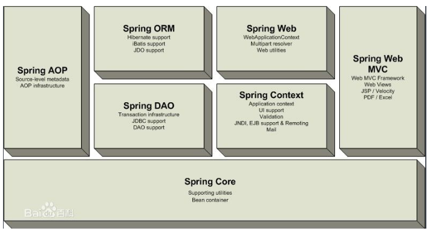
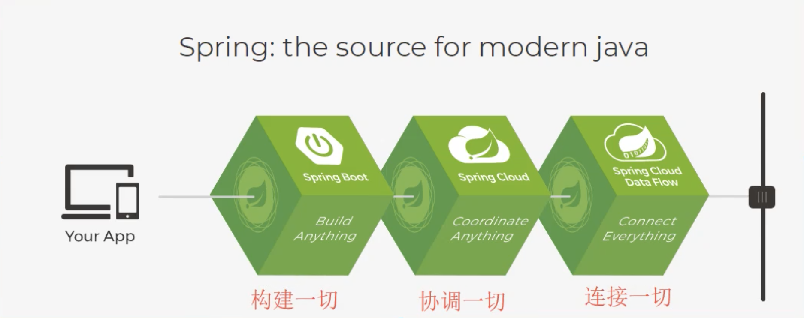

# spring

spring是如何简化java开发的？4种关键策略：

1. 基于POJO的轻量级和最小侵入性编程
2. 通过IOC，依赖注入（DI）和面向接口实现松耦合
3. 基于切面（AOP）和惯了进行声明式编程
4. 通过切面和模板减少样式代码





现代化的Java（养活了这么多的程序员）：




- 自构建bean教程：https://docs.spring.io/spring-framework/docs/5.2.0.RELEASE/spring-framework-reference/core.html#beans-factory-metadata


## springboot

核心是：自动装配！


### pom.xml

- 父依赖

  pom.xml中它主要是依赖一个父项目，主要是管理项目的资源过滤及插件！

  ```xml
  <parent>
      <groupId>org.springframework.boot</groupId>
      <artifactId>spring-boot-starter-parent</artifactId>
      <version>2.2.5.RELEASE</version>
      <relativePath/>
  </parent>
  ```

  

- SpringBoot将所有的功能场景都抽取出来，做成一个个的starter （启动器），只需要在项目中引入这些starter即可，所有相关的依赖都会导入进来 ， 我们要用什么功能就导入什么样的场景启动器即可 ；我们未来也可以自己自定义 starter；

  **springboot-boot-starter-web**：就是spring-boot的web场景启动器，帮我们导入了web模块正常运行所依赖的组件；


## springcloud

- netfilx使用的，已经不维护了，但还是有很多人在使用
- springcloud Alibaba新孵化的，开发和维护中
- 

## jvm


## 参考资料

- [*Martin Fowler的[microservices](http://martinfowler.com/articles/microservices.html),*](http://blog.cuicc.com/blog/2015/07/22/microservices/)

- [读数遍：微服务论文中文版](http://blog.cuicc.com/blog/2015/07/22/microservices/)

- [Spring框架的七大模块](https://www.cnblogs.com/lanseyitai1224/p/7895767.html)