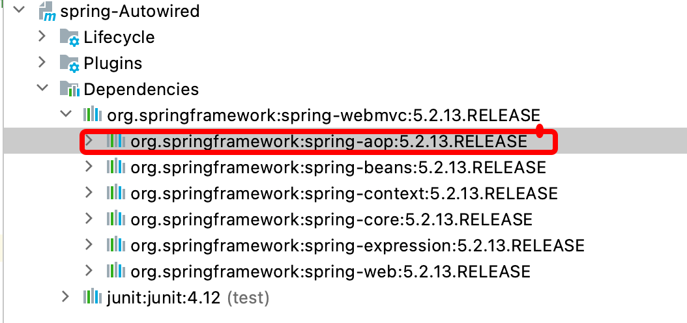
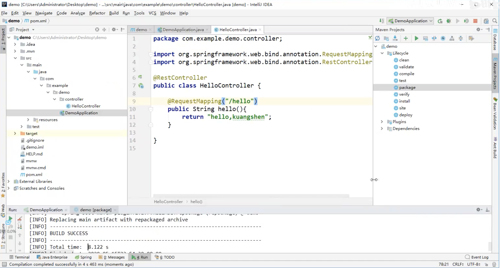

# spring

- 基于 [interface21.io](https://www.interface21.io/)

- 2004年诞生，春天
- Spring Framework创始人Rod Johnson，音乐学博士
- [Spring Design Philosophy](https://docs.spring.io/spring-framework/docs/5.2.0.RELEASE/spring-framework-reference/overview.html#overview)
- 解决企业应用开发的复杂性
- 


spring是如何简化java开发的？4种关键策略：

1. 基于POJO的轻量级和最小侵入性编程
2. 通过IOC，依赖注入（DI）和面向接口实现松耦合
3. 基于切面（AOP）和惯了进行声明式编程
4. 通过切面和模板减少样式代码


现代化的Java（养活了这么多的程序员）：


- 自构建bean教程：https://docs.spring.io/spring-framework/docs/5.2.0.RELEASE/spring-framework-reference/core.html#beans-factory-metadata


## springboot

核心是：自动装配！


### pom.xml

- 父依赖

  pom.xml中它主要是依赖一个父项目，主要是管理项目的资源过滤及插件！

  ```xml
  <parent>
      <groupId>org.springframework.boot</groupId>
      <artifactId>spring-boot-starter-parent</artifactId>
      <version>2.2.5.RELEASE</version>
      <relativePath/>
  </parent>
  ```

  

- SpringBoot将所有的功能场景都抽取出来，做成一个个的starter （启动器），只需要在项目中引入这些starter即可，所有相关的依赖都会导入进来 ， 我们要用什么功能就导入什么样的场景启动器即可 ；我们未来也可以自己自定义 starter；

  **springboot-boot-starter-web**：就是spring-boot的web场景启动器，帮我们导入了web模块正常运行所依赖的组件；


## springcloud

- netfilx使用的，已经不维护了，但还是有很多人在使用
- springcloud Alibaba新孵化的，开发和维护中
- 

## jvm


## 注解开发

- 要使用注解开发，必须要保证AOP的包导入

- 使用注解需要导入context约束，增加注解的支持！




## 应用打包

使用Ideal的maven的package，即可完成打包，输出的单个jar包出现在target目录中，执行：

```bash
java -jar xxx-SNAPSHOT.jar
```




## jar vs war

**1.jar包的介绍**

JAR（Java Archive，Java 归档文件）是与平台无关的文件格式，它允许将许多文件组合成一个压缩文件。**JavaSE程序可以打包成Jar包**(J其实可以理解为Java了)。

JAR 文件格式以流行的 ZIP 文件格式为基础。与 ZIP 文件不同的是，JAR 文件不仅用于压缩和发布，而且还用于部署和封装**库**、**组件**和**插件程序**，并可被像编译器和 JVM 这样的工具直接使用。在 JAR 中包含特殊的文件，如 manifests 和部署描述符，用来指示工具如何处理特定的 JAR。

简单来说，jar包就是别人已经写好的一些类，然后对这些类进行打包。可以将这些jar包引入到你的项目中，可以直接使用这些jar包中的类和属性，这些jar包一般放在lib目录下。


**2.war包的介绍**

war是一个可以直接运行的web模块，通常用于网站，打成包部署到容器中。以Tomcat来说，将war包放置在其\webapps\目录下，然后启动Tomcat，这个包就会自动解压，就相当于发布了。

war包是Sun提出的一种web应用程序格式，与jar类似，是很多文件的压缩包。war包中的文件按照一定目录结构来组织。根据其根目录下包含有html和jsp文件，或者包含有这两种文件的目录，另外还有WEB-INF目录。通常在WEB-INF目录下含有一个web.xml文件和一个classes目录，web.xml是这个应用的配置文件，而classes目录下则包含编译好的servlet类和jsp，或者servlet所依赖的其他类（如JavaBean）。通常这些所依赖的类也可以打包成jar包放在WEB-INF下的lib目录下。

简单来说，**war包是JavaWeb程序打的包**，war包里面包括写的代码编译成的class文件，依赖的包，配置文件，所有的网站页面，包括html，jsp等等。一个war包可以理解为是一个web项目，里面是项目的所有东西。


**3.区别：**（**WAR文件代表了一个Web应用程序，JAR是类的归档文件。**）

**4.部署war包到Tomcat**

- [Java程序员的日常](https://www.jianshu.com/p/3b5c45e8e5bd)


## 参考资料

- [*Martin Fowler的[microservices](http://martinfowler.com/articles/microservices.html),*](http://blog.cuicc.com/blog/2015/07/22/microservices/)

- [读数遍：微服务论文中文版](http://blog.cuicc.com/blog/2015/07/22/microservices/)

- [Spring框架的七大模块](https://www.cnblogs.com/lanseyitai1224/p/7895767.html)