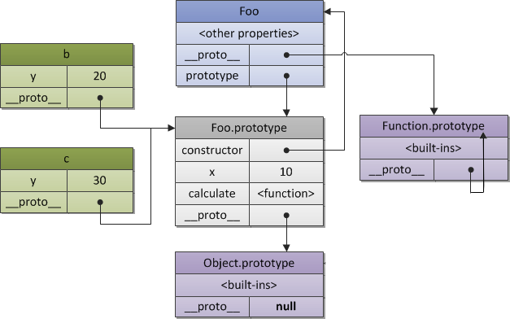

# 编程范式


## 从C 语言开始

为了讲清楚编程范式这个问题，需要从 C 语言开始讲起。因为 C 语言历史悠久，而几乎现在看到的所有编程语言都是以 C 语言为基础来拓展的，不管是 C++、Java、C#、Go、Python、PHP、Perl、JavaScript、Lua，还是 Shell。

自 C 语言问世 40 多年以来，其影响了太多太多的编程语言，到现在还一直被广泛使用，不得不佩服它的生命力。但是，我们也要清楚地知道，大多数 C Like 编程语言其实都是在改善 C 语言带来的问题。

那 C 语言有哪些特性呢？简单来总结下：

- C 语言是一个静态弱类型语言，在使用变量时需要声明变量类型，但是类型间可以有隐式转换；
- 不同的变量类型可以用结构体（struct）组合在一起，以此来声明新的数据类型；
- C 语言可以用 typedef 关键字来定义类型的别名，以此来达到变量类型的抽象；
- C 语言是一个有结构化程序设计、具有变量作用域以及递归功能的过程式语言；
- C 语言传递参数一般是以值传递，也可以传递指针；
- 通过指针，C 语言可以容易地对内存进行低级控制，然而这加大了编程复杂度；
- 编译预处理让 C 语言的编译更具有弹性，比如跨平台。

C 语言的这些特性，可以让程序员在微观层面写出非常精细和精确的编程操作，让程序员可以在底层和系统细节上非常自由、灵活和精准地控制代码。

然而，在代码组织和功能编程上，C 语言的上述特性，却不那么美妙了。


## C++ 语言

1980 年，AT&T 贝尔实验室的 Bjarne Stroustrup 创建的 C++ 语言横空出世，它既可以全面兼容 C 语言，又巧妙揉和了一些面向对象的编程理念。


C++ 很大程度就是用来解决 C 语言中的各种问题和各种不方便的。比如：

- 用引用来解决指针的问题。
- 用 namespace 来解决名字空间冲突的问题。
- 通过 try-catch 来解决检查返回值编程的问题。
- 用 class 来解决对象的创建、复制、销毁的问题，从而可以达到在结构体嵌套时可以深度复制的内存安全问题。
- 通过重载操作符来达到操作上的泛型。（比如用>>操作符消除printf()的数据类型不够泛型的问题。）
- 通过模板 template 和虚函数的多态以及运行时识别来达到更高层次的泛型和多态。
- 用 RAII、智能指针的方式，解决了 C 语言中因为需要释放资源而出现的那些非常 ugly 也很容易出错的代码的问题。
- 用 STL 解决了 C 语言中算法和数据结构的 N 多种坑。


C++ 是如何有效解决程序泛型问题的：

**第一，它通过类的方式来解决。**

类里面会有构造函数、析构函数表示这个类的分配和释放。还有它的拷贝构造函数，表示了对内存的复制。还有重载操作符，像我们要去比较大于、等于、不等于。这样可以让一个用户自定义的数据类型和内建的那些数据类型就很一致了。

**第二，通过模板达到类型和算法的妥协。**

模板的特化会根据使用者的类型在编译时期生成那个模板的代码。模板可以通过一个虚拟类型来做类型绑定，这样不会导致类型转换时的问题。模板很好地取代了 C 时代宏定义带来的问题。

**第三，通过虚函数和运行时类型识别。**

- 虚函数带来的多态在语义上可以支持“同一类”的类型泛型。
- 运行时类型识别技术可以做到在泛型时对具体类型的特殊处理。

这样一来，就可以写出基于抽象接口的泛型。


## 泛型编程

一个良好的泛型编程需要解决如下几个泛型编程的问题：

- 算法的泛型；
- 类型的泛型；
- 数据结构（数据容器）的泛型。


为了解决泛型的问题，我们需要动用以下几个 C++ 的技术。

- 使用模板技术来抽象类型，这样可以写出类型无关的数据结构（数据容器）。
- 使用一个迭代器来遍历或是操作数据结构内的元素。


### C++ 泛型版search()函数：

C语言版：

```c
int search(void* a, size_t size, void* target, 
  size_t elem_size, int(*cmpFn)(void*, void*) )
{
  for(int i=0; i<size; i++) {
    if ( cmpFn (a + elem_size * i, target) == 0 ) {
      return i;
    }
  }
  return -1;
}
```

C++版：

```c++
template<typename T, typename Iter>
Iter search(Iter pStart, Iter pEnd, T target) 
{
  for(Iter p = pStart; p != pEnd; p++) {
    if ( *p == target ) 
      return p;
  }
  return NULL;
}
```

在 C++ 的泛型版本中，我们可以看到：

1. 使用typename T抽象了数据结构中存储数据的**类型**。
2. 使用typename Iter，这是不同的数据结构需要自己实现的“**迭代器**”，这样也就抽象掉了不同类型的数据结构。
3. 然后，我们对数据容器的遍历使用了Iter中的++方法，这是数据容器需要**重载的操作符**，这样通过操作符重载也就泛型掉了遍历。
4. 在函数的入参上使用了pStart和pEnd来表示**遍历的起止**。
5. 使用*Iter来取得这个“指针”的内容。这也是通过**重载 * 取值操作符**来达到的泛型。


### C++ STL 中的find()函数的代码。

```c++
template<class InputIterator, class T>
  InputIterator find (InputIterator first, InputIterator last, const T& val)
{
  while (first!=last) {
    if (*first==val) return first;
    ++first;
  }
  return last;
}
```


### 泛型的本质

要了解泛型的本质，就需要了解类型的本质。

- 类型是对内存的一种抽象。
- 不同的类型，会有不同的内存布局和内存分配的策略。
- 不同的类型，有不同的操作。所以，对于特定的类型，也有特定的一组操作。

所以，要做到泛型，我们需要做下面的事情：

- 标准化掉类型的内存分配、释放和访问。
- 标准化掉类型的操作。比如：比较操作，I/O 操作，复制操作……
- 标准化掉数据容器的操作。比如：查找算法、过滤算法、聚合算法……标准化掉类型上特有的操作。
- 需要有标准化的接口来回调不同类型的具体操作……


所以，C++ 动用了非常繁多和复杂的技术来达到泛型编程的目标。

- 通过类中的构造、析构、拷贝构造，重载赋值操作符，标准化（隐藏）了类型的内存分配、释放和复制的操作。
- 通过重载操作符，可以标准化类型的比较等操作。
- 通过 iostream，标准化了类型的输入、输出控制。
- 通过模板技术（包括模板的特化），来为不同的类型生成类型专属的代码。
- 通过迭代器来标准化数据容器的遍历操作。
- 通过面向对象的接口依赖（虚函数技术），来标准化了特定类型在特定算法上的操作。
- 通过函数式（函数对象），来标准化对于不同类型的特定操作。

> **屏蔽掉数据和操作数据的细节，让算法更为通用，让编程者更多地关注算法的结构，而不是在算法中处理不同的数据类型。**


### Reduce

把整个迭代器值给你一个 operation：

```c++
template<class Iter, class T, class Op>
T reduce(Iter start, Iter end, T init, Op op) {
  T result = init;
  while (start != end) {
    result = op(result, *start);
    start ++;
  }
  return result;
}  
```

在 C++ STL 中，与我的这个 reduce 函数对应的函数名叫 accumulate()，其实际代码有两个版本。

```c++
template<class InputIt, class T>
T accumulate(InputIt first, InputIt last, T init)
{
  for (; first != last; ++first) {
    init = init + *first;
  }
  return init;
}
```

第二个版本，更为抽象，因为需要传入一个“二元操作函数”——BinaryOperation op来做 accumulate。

```c++
template<class InputIt, class T, class BinaryOperation>
T accumulate(InputIt first, InputIt last, T init, BinaryOperation op)
{
  for (; first != last; ++ first) {
    init = op(init, *first);
  }
  return init;
}
```

实际使用：

```c++
struct Employee {
  string name;
  string id;
  int vacation;
  double salary；
};

double sum_salaries = 
  reduce(staff.begin(), staff.end(), 0,0, 
        [](double s, Employee e)
         {return s + e.salary;});

double max_salary = 
  redule(staff.begin(), staff.end(), 0,0,
        [](double s, Employee e)
         {return s > e.salary ? s : e.salary;})
```


## 函数式编程

核心思想是将**运算过程**尽量写成一系列嵌套的函数调用，关注的是**做什么**而不是怎么做，因而被称为**声明式编程**。

函数式编程，它的理念就来自于数学中的代数。

```mathematica
f(x)=5x^2+4x+3
g(x)=2f(x)+5=10x^2+8x+11
h(x)=f(x)+g(x)=15x^2+12x+14

# 斐波拉契数列
f(x)=f(x-1)+f(x-2)
```

对于函数式编程来说，它只关心定义**输入数据和输出数据相关的关系，数学表达式里面其实是在做一种映射（mapping），输入的数据和输出的数据关系是什么样的，是用函数来定义的。**


### 特征

- stateless：函数不维护任何状态。函数式编程的核心精神是 stateless，简而言之就是它不能存在状态，打个比方，你给我数据我处理完扔出来。里面的数据是不变的。
- immutable：输入数据是不能动的，动了输入数据就有危险，所以要返回新的数据集。


### 优势

- 没有状态就没有伤害。
- 并行执行无伤害。
- Copy-Paste 重构代码无伤害。
- 函数的执行没有顺序上的问题。


### 柯里化（Curring）

柯里化，Currying，将一个函数的多个参数分解成多个函数， 然后将函数多层封装起来，每层函数都返回一个函数去接收下一个参数，这可以简化函数的多个参数。在 C++ 中，这很像 STL 中的 bind1st 或是 bind2nd。

```javascript
// 普通的add函数
function add(x, y) {
    return x + y
}

// Currying后
function curryingAdd(x) {
    return function (y) {
        return x + y
    }
}

add(1, 2)           // 3
curryingAdd(1)(2)   // 3
```

技术实践：

```javascript
// 实现一个add方法，使计算结果能够满足如下预期：
add(1)(2)(3) = 6;
add(1, 2, 3)(4) = 10;
add(1)(2)(3)(4)(5) = 15;

function add() {
    // 第一次执行时，定义一个数组专门用来存储所有的参数
    var _args = Array.prototype.slice.call(arguments);

    // 在内部声明一个函数，利用闭包的特性保存_args并收集所有的参数值
    var _adder = function() {
        _args.push(...arguments);
        return _adder;
    };

    // 利用toString隐式转换的特性，当最后执行时隐式转换，并计算最终的值返回
    _adder.toString = function () {
        return _args.reduce(function (a, b) {
            return a + b;
        });
    }
    return _adder;
}

add(1)(2)(3)                // 6
add(1, 2, 3)(4)             // 10
add(1)(2)(3)(4)(5)          // 15
add(2, 6)(1)                // 9

```

把一个字符串数组中的字符串都转成小写:

python版：

```python
# 函数式
def toUpper(item):
  return item.upper()
 
upper_name = map(toUpper, ["Can", "You", "Hear", "Me"])

print upper_name
# 输出 ['CAN', 'YOU', 'HEAR', 'ME']
```

C++版：

```c++
string s = "hello";
transform(s.begin(), s.end(), back_inserter(out), ::toupper);
```

**map 和 reduce 不关心源输入数据，它们只是控制，并不是业务。控制是描述怎么干，而业务是描述要干什么。**


### 函数式的 pipeline 模式

```python

def even_filter(nums):
    for num in nums:
        if num % 2 == 0:
            yield num
def multiply_by_three(nums):
    for num in nums:
        yield num * 3
def convert_to_string(nums):
    for num in nums:
        yield 'The Number: %s' % num

nums = [1, 2, 3, 4, 5, 6, 7, 8, 9, 10]
pipeline = convert_to_string(multiply_by_three(even_filter(nums)))
for num in pipeline:
    print num
# 输出：
# The Number: 6
# The Number: 12
# The Number: 18
# The Number: 24
# The Number: 30        
```


Python 的关键字 yield，它是一个类似 return 的关键字，只是这个函数返回的是 Generator（生成器）。所谓生成器，指的是 yield 返回的是一个可迭代的对象，并没有真正的执行函数。也就是说，只有其返回的迭代对象被迭代时，yield 函数才会真正运行，运行到 yield 语句时就会停住，然后等下一次的迭代。（ yield 是个比较诡异的关键字）这就是 lazy evaluation（懒惰加载）。


## 修饰器模式

Python 有语法糖。Python 的 Decorator 在使用上和 Java 的 Annotation（以及 C# 的 Attribute）很相似，就是在方法名前面加一个 @XXX 注解来为这个方法装饰一些东西。但是，Java/C# 的 Annotation 也很让人望而却步，太过于复杂了。你要玩它，需要先了解一堆 Annotation 的类库文档，感觉几乎就是在学另外一门语言。

```python
def hello(fn):
    def wrapper():
        print "hello, %s" % fn.__name__
        fn()
        print "goodbye, %s" % fn.__name__
    return wrapper
 
@hello
def Hao():
    print "i am Hao Chen"
 
Hao()
```


运行：

```bash
$ python hello.py
hello, Hao
i am Hao Chen
goodbye, Hao
```

Go语言版：

```go

package main

import "fmt"

func decorator(f func(s string)) func(s string) {
    return func(s string) {
        fmt.Println("Started")
        f(s)
        fmt.Println("Done")
    }
}

func Hello(s string) {
    fmt.Println(s)
}

func main() {
    decorator(Hello)("Hello, World!")

  hello := decorator(Hello)
  hello("Hello!")
}
```

用 Reflection 机制写的一个比较通用的修饰器:

```go

func Decorator(decoPtr, fn interface{}) (err error) {
    var decoratedFunc, targetFunc reflect.Value
 
    decoratedFunc = reflect.ValueOf(decoPtr).Elem()
    targetFunc = reflect.ValueOf(fn)
 
    v := reflect.MakeFunc(targetFunc.Type(),
        func(in []reflect.Value) (out []reflect.Value) {
            fmt.Println("before")
            out = targetFunc.Call(in)
            fmt.Println("after")
            return
        })
 
    decoratedFunc.Set(v)
    return
}
```

上面这个 Decorator() 需要两个参数：

- 第一个是出参 decoPtr ，就是完成修饰后的函数。
- 第二个是入参 fn ，就是需要修饰的函数。

使用：

```go

func foo(a, b, c int) int {
    fmt.Printf("%d, %d, %d \n", a, b, c)
    return a + b + c
}
 
func bar(a, b string) string {
    fmt.Printf("%s, %s \n", a, b)
    return a + b
}


type MyFoo func(int, int, int) int
var myfoo MyFoo
Decorator(&myfoo, foo)
myfoo(1, 2, 3)


mybar := bar
Decorator(&mybar, bar)
mybar("hello,", "world!")
```

修饰器模式其实是在做下面的几件事。

- 表面上看，修饰器模式就是扩展现有的一个函数的功能，让它可以干一些其他的事，或是在现有的函数功能上再附加上一些别的功能。
- 除了我们可以感受到函数式编程下的代码扩展能力，我们还能感受到函数的互相和随意拼装带来的好处。
- 但是深入看一下，我们不难发现，Decorator 这个函数其实是可以修饰几乎所有的函数的。于是，这种可以通用于其它函数的编程方式，可以很容易地将一些非业务功能的、属于控制类型的代码给抽象出来（所谓的控制类型的代码就是像 for-loop，或是打日志，或是函数路由，或是求函数运行时间之类的非业务功能性的代码）。


## 面向对象编程

函数式编程总结起来就是把一些功能或逻辑代码通过函数拼装方式来组织的玩法。

函数式编程需要我们写出无状态的代码。

对于**状态和数据的处理**，需要使用“**面向对象编程**”（Object-oriented programming，OOP）这个编程范式了。面向对象的编程有三大特性：**封装、继承和多态**。


### 策略模式

商品价格策略：

```java
// 输入一个原始的价格，输出一个根据相应的策略计算出来的价格。
interface BillingStrategy {
    public double GetActPrice(double rawPrice);
}

// Normal billing strategy (unchanged price)
class NormalStrategy implements BillingStrategy {
    @Override
    public double GetActPrice(double rawPrice) {
        return rawPrice;
    }
}

// Strategy for Happy hour (50% discount)
class HappyHourStrategy implements BillingStrategy {
    @Override
    public double GetActPrice(double rawPrice) {
        return rawPrice * 0.5;
    }
}
```

订单项 OrderItem，其包含了每个商品的原始价格和数量，以及计算价格的策略：

```java
class OrderItem {
    public String Name;
    public double Price;
    public int Quantity;
    public BillingStrategy Strategy;
    public OrderItem(String name, double price, int quantity, BillingStrategy strategy) {
        this.Name = name;
        this.Price = price;
        this.Quantity = quantity;
        this.Strategy = strategy;
    }
}
```

订单类—— Order 中封装了 OrderItem 的列表，即商品列表。并在操作订单添加购买商品时，加入一个计算价格的 BillingStrategy：

```java
class Order {
    private List<OrderItem> orderItems = new ArrayList<OrderItem>();
    private BillingStrategy strategy = new NormalStrategy();

    public void Add(String name, double price, int quantity, BillingStrategy strategy) {
        orderItems.add(new OrderItem(name, price, quantity, strategy));
    }
    
    // Payment of bill
    public void PayBill() {
        double sum = 0;
        for (OrderItem item : orderItems) {
            
            actPrice = item.Strategy.GetActPrice(item.price * item.quantity);
            sum += actPrice;
            
            System.out.println("%s -- %f(%d) - %f", 
                item.name, item.price, item.quantity, actPrice);
        }
        System.out.println("Total due: " + sum);
    }
}
```

“设计模式中最为经典的模式，充分体现了面向对象编程的方式。”


### 代理模式

```c++
class lock_guard {
  private: 
    mutex &_m;
  public:
    lock_guard(mutex &m):_m(m) { _m.lock(); }
    ~lock_guard() { _m.unlock(); }
};


mutex m;

void foo() {
  lock_guard guard(m);
  Func();
  if ( ! everythingOk() ) {
    return;
  } 
  ...
  ...
}
```

这个技术叫 **RAII**（Resource Acquisition Is Initialization，资源获取就是初始化）， 是 C++ 中的一个利用了面向对象的技术。这个设计模式叫“代理模式”。我们可以把一些控制资源分配和释放的逻辑交给这些代理类，然后，只需要关注业务逻辑代码了。而且，在我们的业务逻辑代码中，减少了这些和业务逻辑不相关的程序控制的代码。


## 基于原型编程

基于原型（Prototype）的编程其实也是面向对象编程的一种方式。**没有 class 化的，直接使用对象。又叫，基于实例的编程。**其主流的语言就是 JavaScript，与传统的面对象编程的比较如下：

栗子：

```javascript
var foo = {name: "foo", one: 1, two: 2};
var bar = {three: 3};

bar.__proto__ = foo; // foo is now the prototype of bar.

// If we try to access foo's properties from bar 
// from now on, we'll succeed. 
bar.one // Resolves to 1.

// The child object's properties are also accessible.
bar.three // Resolves to 3.

// Own properties shadow prototype properties
bar.name = "bar";
foo.name; // unaffected, resolves to "foo"
bar.name; // Resolves to "bar"
```

> ` __proto__`，和 `prototype` 的区别：
>
> - `__proto__` 主要是安放在一个实际的对象中，用它来产生一个链接，一个原型链，用于寻找方法名或属性，等等。
> - `prototype` 是用 new 来创建一个对象时构造 `__proto__` 用的。它是构造函数的一个属性。
>
> 可以简单地认为，`__proto__` 是所有对象用于链接原型的一个指针，而 prototype 则是 Function 对象的属性，其主要是用来当需要new一个对象时让` __proto__` 指针所指向的地方。


```javascript
let a = {
    x: 10,
    calculate: function (z) {
        return this.x + this.y + z
    }
}

let b = {
    y: 20,
    __proto__: a
}

let c = {
    y: 30,
    __proto__: a
}

b.calculate(30) // 60
c.calculate(40) // 80
```


ES5 中，规定原型继承需要使用 Object.create() 函数：

```javascript
var b = Object.create(a, {y: {value: 20}});
var c = Object.create(a, {y: {value: 30}}); 
```


栗子2：

```javascript
// 一种构造函数写法
function Foo(y) {
  this.y = y;
}
 
// 修改 Foo 的 prototype，加入一个成员变量 x
Foo.prototype.x = 10;
 
// 修改 Foo 的 prototype，加入一个成员函数 calculate
Foo.prototype.calculate = function (z) {
  return this.x + this.y + z;
};
 
// 现在，我们用 Foo 这个原型来创建 b 和 c
var b = new Foo(20);
var c = new Foo(30);
 
// 调用原型中的方法，可以得到正确的值
b.calculate(30); // 60
c.calculate(40); // 80
```

栗子2的内存布局：




JavaScript 原型编程的面向对象

```javascript
function Person(){}
var p = new Person();

Person.prototype.name = "Hao Chen";
Person.prototype.sayHello = function(){
    console.log("Hi, I am " + this.name);
}

console.log(p.name); // "Hao Chen"
p.sayHello(); // "Hi, I am Hao Chen"
```

注意：

- 当创建 function Person(){} 时，Person.__proto__ 指向 Function.prototype;
- 当创建 var p = new Person() 时，p.__proto__ 指向 Person.prototype;
- 当修改了 Person.prototype 的内容后，p.__proto__ 的内容也就被改变了。

```javascript
//Define human class
var Person = function (fullName, email) {
  this.fullName = fullName;
  this.email = email;
  
  this.speak = function(){
    console.log("I speak English!");
  };
  this.introduction = function(){
    console.log("Hi, I am " + this.fullName);
  };
}
```

student class:

```javascript
//Define Student class
var Student = function(fullName, email, school, courses) {

  Person.call(this, fullName, email);

  // Initialize our Student properties
  this.school = school;
  this.courses = courses;
  
  // override the "introduction" method
  this.introduction= function(){
  console.log("Hi, I am " + this.fullName + 
        ". I am a student of " + this.school + 
        ", I study "+ this.courses +".");
  };
  
  // Add a "exams" method
  this.takeExams = function(){
    console.log("This is my exams time!");
  };
};
```

使用了 Person.call(this, fullName, email)，call() 或 apply() 都是为了动态改变 this 所指向的对象的内容而出现的。这里的 this 就是 Student。

在ES5中的规范写法：

```javascript
// Create a Student.prototype object that inherits 
// from Person.prototype.
Student.prototype = Object.create(Person.prototype); 

// Set the "constructor" property to refer to Student
Student.prototype.constructor = Student;
```


具体使用：

```javascript
var student = new Student("Hao Chen", 
              "haoel@hotmail.com",
              "XYZ University", 
              "Computer Science");
student.introduction();   
student.speak();       
student.takeExams(); 

// Check that instanceof works correctly
console.log(student instanceof Person);  // true 
console.log(student instanceof Student); // true
```


## Go语言的委托模式

声明一个 struct，跟 C 很像，然后直接把这个 struct 类型放到另一个 struct 里。

```go
type Widge struct {
  X, Y int
}

type Label struct {
  Widget	// Embedding (delegation)
  Text	string	// Aggregation
  X int		// Override
}

func (label Lable) Paint() {
  fmt.Printf("[%p] - Lable.Paint(%q)\n", &label, label.Text)
}
// [0xc4200141e0] - Label.Paint("State")
```


```go
label := Lable{Widget{10,10}, "State", 100}
fmt.Printf("X=%d, Y=%d, Text=%s Widget.X=%d\n", label.X, label.Y, lable.Text, label.Widget.X)
```


## 程序的本质

**算法 + 数据结构 = 程序**

任何算法都会有两个部分， 一个是 Logic 部分，这是用来解决实际问题的。另一个是 Control 部分，这是用来决定用什么策略来解决问题。Logic 部分是真正意义上的解决问题的算法，而 Control 部分只是影响解决这个问题的效率。程序运行的效率问题和程序的逻辑其实是没有关系的。我们认为，**如果将 Logic 和 Control 部分有效地分开，那么代码就会变得更容易改进和维护。**

- Programs = Algorithms + Data Structures

- Algorithm = Logic + Control

  

## 参考资料

- [编程范式游记](https://time.geekbang.org/column/article/2711)

- [详解JS函数柯里化](https://www.jianshu.com/p/2975c25e4d71)