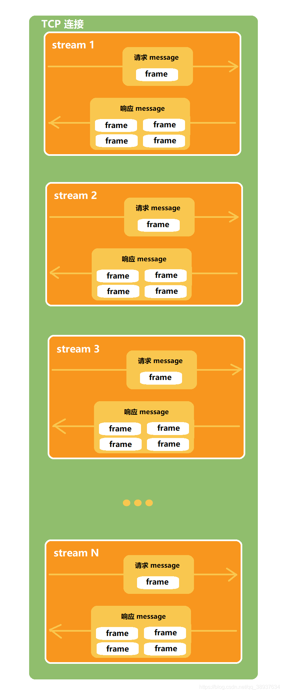
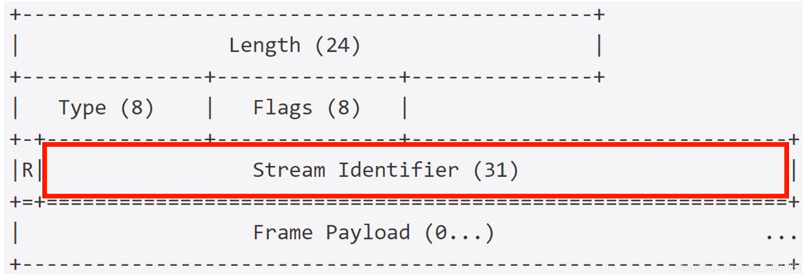

# HTTP/2

## 核心概念

| 概念       | 名称   | 含义                                                   |
| ---------- | ------ | ------------------------------------------------------ |
| connection | 连接   | 1 个 TCP 连接，包含一个或者多个 Stream。               |
| stream     | 数据流 | 一个双向通讯数据流，包含 1 条或者多条 Message。        |
| message    | 消息   | 对应 HTTP/1 中的请求或者响应，包含一条或者多条 Frame。 |
| frame      | 数据帧 | 最小单位，以二进制压缩格式存放 HTTP/1 中的内容。       |

帧（frame）、流（stream）、消息（message）示意图：

> Tips：图中 `Stream` 表示多个数据流，它们可以源源不断地并发传送，同一个 `Stream` 流中的 `frame` 数据是串行发送的。

## Stream ID实现多路复用

- 接收端的实现可据此并发组装消息
- 同一 `Stream` 内的 `frame` 必须是有序的（同一 `Stream` 内的 `frame` 是串行的）
- `SETTINGS_MAX_CONCURRENT_STREAMS` 控制着并发 `Stream` 数

## Stream流特性

- 由客户端建立的 `Stream ID` 必须是奇数。
- 由服务端建立的 `Stream ID` 必须是偶数（如服务端主动向客户端推送消息）。
- 新建立的 Stream ID 必须大于曾经建立过的状态为 opened 或 reserved 的 Stream ID。
- 在新建立的流上发送帧时，意味着将更小 ID 且为 idle 状态的 Stream 设置为 Closed 状态。
- Stream ID 不能复用，长连接耗尽 ID 应创建新连接。
- `Stream ID` 为 `0` 的流仅用于传输控制帧。

- 心跳往返都是 `PING`，`WebSocket` 中往返心跳对应 `PING`、`PONG`。

## 帧

帧头部（3+1+1+4=9字节）示意图:

| 帧类型        | 类型编码 | 含义                                  |
| ------------- | -------- | ------------------------------------- |
| DATA          | 0x0      | 传递 HTTP 包体                        |
| HEADERS       | 0x1      | 传递 HTTP 头部                        |
| PRIORITY      | 0x2      | 指定 Stream 流的优先级                |
| RST_STREAM    | 0x3      | 终止 Stream 流                        |
| SETTINGS      | 0x4      | 修改连接或者 Stream 流的配置          |
| PUSH_PROMISE  | 0x5      | 服务端推送资源时描述请求的帧          |
| PING          | 0x6      | 心跳检测，兼具计算 RTT 往返时间的功能 |
| GOAWAY        | 0x7      | 优雅的终止连接或者通知错误            |
| WINDOW UPDATE | 0x8      | 实现流量控制                          |
| CONTINUATION  | 0x9      | 传递较大 HTTP 头部时的持续帧          |

> Tips：心跳往返都是 `PING`，`WebSocket` 中往返心跳对应 `PING`、`PONG`。

## SETTINGS 帧类型

| SETTINGS 帧类型                      | 含义                                                         |
| ------------------------------------ | ------------------------------------------------------------ |
| SETTINGS_HEADERS_TABLE_SIZE          | 通知对端索引表的最大尺寸（单位字节，初始 4096 字节）         |
| SETTINGS_ENABLE_PUSH(0x2)            | Value 设置为 0 时可禁用服务器推送功能， 1 表示启用           |
| SETTINGS_MAX_CONCURRENT_STREAMS(0x3) | 告诉接收端允许的最大并发 Stream 数量                         |
| SETTINGS_INITIAL_WINDOW_SIZE(0x4)    | 声明发送端的窗口大小，用于 Stream 级别流控，初始值 2^16-1，即 65535字节 |
| SETTINGS_MAX_FRAME_SIZE(0x5)         | 设置帧的最大大小，初始值 2^14，即 16384 字节                 |
| SETTINGS_MAX_HEADER_LIST_SIZE(0x6)   | 知会对端头部索引表的最大尺寸，单位字节，基于未压缩前的头部   |

## Wireshark抓包分析

> Tips：从图中可以看出客户端 `Settings - Max concurrent streams : 1000` 表示客户端允许的最大并发 `Stream` 数量是 `1000`。
>
> Tips：从图中可以看出服务端的 Settings - Max concurrent streams : 128 表示服务端允许的最大并发 Stream 数是 128，Settings - Max frame size : 16777215表示服务端允许的最大帧大小 16777215 字节。
>

参考资料：[HTTP/2 协议（帧、消息、流简单的抓包分析）](https://blog.csdn.net/qq_38937634/article/details/111352895?utm_medium=distribute.pc_relevant.none-task-blog-2%7Edefault%7EBlogCommendFromMachineLearnPai2%7Edefault-1.control&dist_request_id=1331978.8272.16186134743356913&depth_1-utm_source=distribute.pc_relevant.none-task-blog-2%7Edefault%7EBlogCommendFromMachineLearnPai2%7Edefault-1.control)

