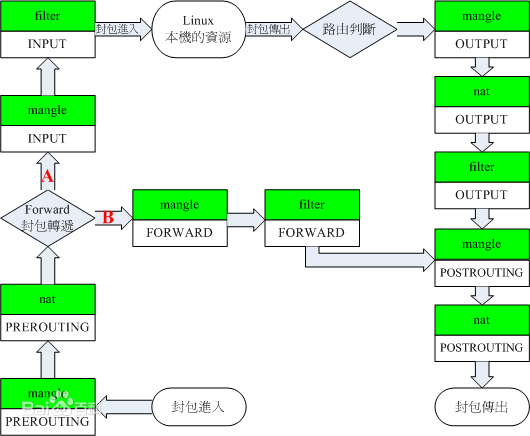
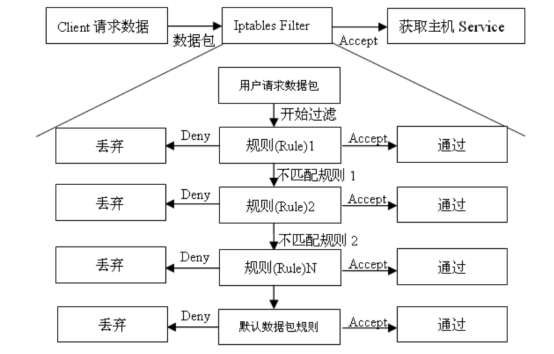

# Linux


## 需熟练掌握的命令

- 文件系统结构和基本操作 ls/chmod/chown/rm/find/ln/cat/mount/mkdir/tar/gzip …
- 学会使用一些文本操作命令 sed/awk/grep/tail/less/more …
- 学会使用一些管理命令 ps/top/lsof/netstat/kill/tcpdump/iptables/dd…


### sed


### awk


### lsof

lsof = list open files

```bash
# 使用-i:port来显示与指定端口相关的网络信息
lsof  -i :22

# 使用@host来显示指定到指定主机的连接
lsof  -i@172.16.12.5

# 使用@host:port显示基于主机与端口的连接
lsof  -i@172.16.12.5:22

# 找出正等候连接的端口。
lsof  -i -sTCP:LISTEN

# 找出已建立的连接
lsof  -i -sTCP:ESTABLISHED

# 消灭指定用户运行的所有程序
kill  -9  `lsof -t -u daniel`

# 使用-c查看指定的命令正在使用的文件和网络连接
lsof  -c syslog-ng

# 使用-p查看指定进程ID已打开的文件
lsof  -p 10075

# 显示开启文件abc.txt的进程
lsof abc.txt 

# 显示某个端口范围的打开的连接
lsof  -i @fw.google.com:2150=2180

# 同时使用-t和-c选项以给进程发送 HUP 信号
kill  -HUP `lsof -t -c sshd`
```

参考资料：

- [Linux 命令神器：lsof](https://www.jianshu.com/p/a3aa6b01b2e1)


### tcpdump

用简单的话来定义tcpdump，就是：dump the traffic on a network，根据使用者的定义对网络上的数据包进行截获的包分析工具。 tcpdump可以将网络中传送的数据包的“头”完全截获下来提供分析。它支持针对网络层、协议、主机、网络或端口的过滤，并提供and、or、not等逻辑语句来帮助你去掉无用的信息。

```bash
# 监视第一个网络接口上所有流过的数据包。
tcpdump

# 截获主机hostname发送的所有数据
tcpdump -i eth0 src host hostname

# 监视所有送到主机hostname的数据包
tcpdump -i eth0 dst host hostname

# 监视指定主机和端口的数据包
# 获取主机210.27.48.1接收或发出的telnet包
tcpdump tcp port 23 and host 210.27.48.1

# 使用tcpdump抓取HTTP包
# 0x4745 为"GET"前两个字母"GE",0x4854 为"HTTP"前两个字母"HT"。
tcpdump  -XvvennSs 0 -i eth0 tcp[20:2]=0x4745 or tcp[20:2]=0x4854

```

tcpdump 对截获的数据并没有进行彻底解码，数据包内的大部分内容是使用十六进制的形式直接打印输出的。显然这不利于分析网络故障，通常的解决办法是先使用带-w参数的tcpdump 截获数据并保存到文件中，然后再使用其他程序(如Wireshark)进行解码分析。当然也应该定义过滤规则，以避免捕获的数据包填满整个硬盘。


参考资料：

- [Linux tcpdump命令详解](https://www.cnblogs.com/ggjucheng/archive/2012/01/14/2322659.html)


### iptables

- iptables是Linux [内核](https://baike.baidu.com/item/内核/108410)集成的 IP 信息包过滤系统，有利于在 Linux 系统上更好地控制 IP 信息包过滤和[防火墙](https://baike.baidu.com/item/防火墙/52767)配置。

- iptables是基于包过滤的防火墙工具、可以对流入、流出及流经服务器的数据包进行精细的控制。

- iptables工作在OSI七层的二、三层、四层。

- 防火墙在做[数据包过滤](https://baike.baidu.com/item/数据包过滤/7747768)决定时，有一套遵循和组成的规则，这些规则存储在专用的数据包过滤表中，而这些表集成在 Linux 内核中。在数据包过滤表中，规则被分组放在我们所谓的链（chain）中。而netfilter/iptables IP 数据包过滤系统是一款功能强大的工具，可用于添加、编辑和移除规则。

- 虽然 netfilter/iptables IP 信息包过滤系统被称为单个实体，但它实际上由两个组件netfilter 和 iptables 组成。

- **netfilter 组件也称为内核空间（kernelspace）**，是内核的一部分，由一些信息包过滤表组成，这些表包含内核用来控制信息包过滤处理的规则集。

- **iptables 组件是一种工具，也称为用户空间（userspace）**，它使插入、修改和除去信息包过滤表中的规则变得容易。

  





> 开放式系统互联通信参考模型（英语：Open System Interconnection Reference Model，缩写为 *OSI*），简称为*OSI*模型（*OSI* model），一种概念模型，由国际标准化组织提出，一个试图使各种计算机在世界范围内互连为网络的标准框架。

基本术语：

| Netfileter/iptables | 表（tables） | 链（chains） |  规则（policy）  |
| ------------------- | ------------ | ------------ | :--------------: |
| 小区的一栋楼        | 楼里的房子   | 房子里的柜子 | 增加、摆放的规则 |

```bash
# 例如：为了防止DOS太多连接进来，那么可以允许最多15个初始连接，超过的丢弃.
/sbin/iptables -A INPUT -s 192.186.1.0/24 -p tcp --syn -m connlimit --connlimit-above 15 -j DROP

# ip范围应用
iptables -A FORWARD -m iprange --src-range 192.168.1.5-192.168.1.124 -j ACCEPT
```


参考资料：

- [iptables入门指南 --- iptables详解 ---iptbales 防火墙](https://www.cnblogs.com/liang2580/articles/8400140.html)


### dd


