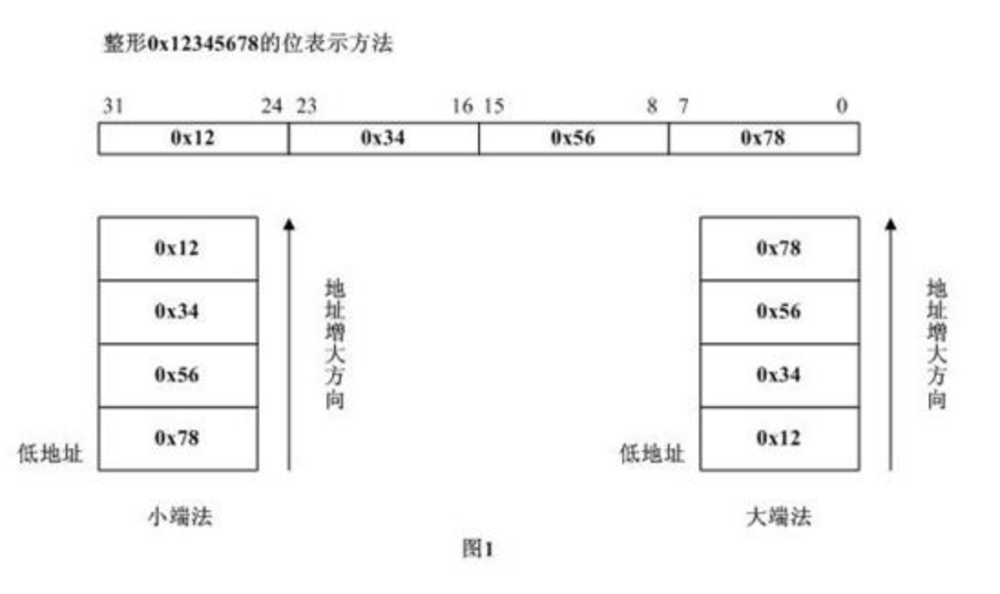

# TCP/IP

Transimission Control Protocol，传输控制协议。

- 要解决的问题：

  > 是为了在不可靠的互联网络上提供可靠的端到端字节流而专门设计的一个传输协议。因为互联网络的不同部分可能有截然不同的拓扑结构、带宽、延迟、数据包大小和其他参数。TCP的设计目标是能够动态地适应互联网络的这些特性，而且具备面对各种故障时的健壮性。

- 关键步骤：

  > 应用层向TCP层发送用于网间传输的、用8位字节表示的数据流，然后TCP把数据流分区成适当长度的报文段（通常受该计算机连接的网络的数据链路层的最大传输单元（MTU）的限制）。之后TCP把结果包传给IP层，由它来通过网络将包传送给接收端实体的TCP层。TCP为了保证不发生丢包，就给每个包一个序号，同时序号也保证了传送到接收端实体的包的按序接收。然后接收端实体对已成功收到的包发回一个相应的确认（ACK）；如果发送端实体在合理的往返时延（[RTT](https://baike.baidu.com/item/RTT)）内未收到确认，那么对应的数据包就被假设为已丢失将会被进行重传。TCP用一个校验和函数来检验数据是否有错误；在发送和接收时都要计算校验和。 [3] 

- TCP职责：

  > IP层并不保证数据报一定被正确地递交到接收方，也不指示数据报的发送速度有多快。正是TCP负责既要足够快地发送数据报，以便使用网络容量，但又不能引起网络拥塞：而且，TCP超时后，要重传没有递交的数据报。即使被正确递交的数据报，也可能存在错序的问题，这也是TCP的责任，它必须把接收到的数据报重新装配成正确的顺序。简而言之，TCP必须提供可靠性的良好性能，这正是大多数用户所期望的而IP又没有提供的功能。 [2] 


## 名词解释

### TCP拥塞控制算法-AIMD算法

1. 慢启动
2. 拥塞避免
3. 快速重传
4. 快速恢复


### RTT

Round Trip Time，网络往返时间，有三部分组成：

1. 链路的传播时间（propagation delay)
2. 末端系统的处理时间
3. 路由器缓存中的排队和处理时间（queuing delay）

其中，前两个部分的值对于一个TCP连接是相对固定的，后一个会随着整个网络拥塞程度的变化而变化。所以RTT的变化在一定程度上反映了网络的拥塞程度。


## 

### RTO

Retransmission TimeOut，重传超时时间。

TCP超时与重传中一个很重要的部分是对一个给定链接的RTT的测量。由于网络流量的变化，这个时间会相应地发生改变，TCP需要跟踪这些变化并动态调整超时时间RTO。


### MSL

Max Survive Live 最大报文段生存时间


## LFN长肥网络

带宽延迟积很大的网络叫做长肥网络。在LFN中建立的TCP链接叫做长肥管道。一个链接的时延带宽积可表示为：

```
capaticy(b) = bandwidth(b/s)xround-triptime(s)
```

具有打的带宽时延积的网络被称为长肥网络。其中存在很多问题：

1. TCP的窗口大小为16bit，即65535字节。这就将发送方发送但未被确认的数据的总长度限制到了65535字节。对于LFN管道，这可能会出现所有的数据还未到达接收方，但是发送方已受限于窗口大小而不能继续发送的情形。这就极大的降低了网络的吞吐量。

   >  扩大窗口选项可以解决这个问题

2. 根据TCP的拥塞控制，丢失分组会导致链接进行拥塞控制，即便是由于冗余ACK而进入了快速恢复，也会使得拥塞窗口降低一半，而如果是由于超时进入了慢启动，这回导致网络吞吐量降低。

   > 选择确认（SACK）可以用来部分避免该问题，采用该技术使得接收方可以有选择的对无序到达的报文段进行确认，而不是采用累积确认，这样被确认的报文段就不会超时，也不会有冗余的ACK。

3. 在LFN中，需要高的RTT测量机制。

4. TCP对每个字节数据使用一个32bit无符号的序号来进行标识。TCP定义了MSL，在LFN中，由于序号空间有限，在已经传输了4294967296个字节以后序号会被重用。如果网络快到在不到一个MSL的时候序号就发生了回绕，网络中就会有两个相同序号的不同的报文段，接收方将无法区分它们的顺序。（在一个千网络中只需要34秒就可以完成4294967296个字节的发送）。

   > 使用TCP的时间戳选项的PAWS(ProtectionAgainstWrappedSequencenumbers)算法（**保护回绕的序号**）可以解决该问题。


## Little-End小端 和 Big-End大端

描述的是两种不同的字节在内存中的存储顺序

```c
short int a = 0xABCD;
// 小端存储：0xCD, 0xAB
// 大端存储：0xAB, 0xCD
```

即：大端和书写顺序一致！

- 操作系统（主机）采用小端
- 网络通信都是大端
- socket 编程中的 htons()和htonl()

```c
inet->inet_sport = htons(inet->inet_num); // 绑定端口
```

htons = host to network short

htonl = host to network long

反之：ntohl(), ntohs()




## 参考资料

- [TCP中RTT的测量和RTO的计算](https://blog.csdn.net/zhangskd/article/details/7196707)

- [长肥管道](https://baike.baidu.com/item/%E9%95%BF%E8%82%A5%E7%AE%A1%E9%81%93/10679040?fr=aladdin)

