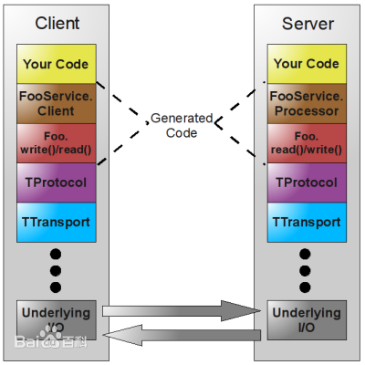

# Thrift

用于可扩展的跨语言服务开发的Apache Thrift软件框架将软件堆栈与代码生成引擎结合在一起，是一个跨语言的轻量级RPC消息和数据交换框架，Thrift能生成的语言有: C++, Java, Python, PHP, Ruby, Erlang, Perl, Haskell, C#, Cocoa, Smalltalk, and OCaml。


**Thrift**是一种[接口描述语言](https://baike.baidu.com/item/接口描述语言)和二进制通讯协议，它被用来定义和创建跨语言的服务。它被当作一个[远程过程调用](https://baike.baidu.com/item/远程过程调用)（RPC）框架来使用，是由[Facebook](https://baike.baidu.com/item/Facebook)为“大规模跨语言服务开发”而开发的。它通过一个代码生成引擎联合了一个软件栈，来创建不同程度的、无缝的[跨平台](https://baike.baidu.com/item/跨平台)高效服务，可以使用[C#](https://baike.baidu.com/item/C%23)、[C++](https://baike.baidu.com/item/C%2B%2B)（基于[POSIX](https://baike.baidu.com/item/POSIX)兼容系统）。由Facebook开发的。


Thrift包含一套完整的栈来创建客户端和服务端程序。顶层部分是由Thrift定义生成的代码。而服务则由这个文件客户端和处理器代码生成。在生成的代码里会创建不同于内建类型的数据结构，并将其作为结果发送。协议和[传输层](https://baike.baidu.com/item/传输层)是[运行时库](https://baike.baidu.com/item/运行时库)的一部分。有了Thrift，就可以定义一个服务或改变通讯和传输协议，而无需重新编译代码。除了客户端部分之外，Thrift还包括服务器基础设施来集成协议和传输，如阻塞、非阻塞及多线程服务器。栈中作为I/O基础的部分对于不同的语言则有不同的实现。


## Thrift支持的通讯协议：

- TBinaryProtocol – 一种简单的二进制格式，简单，但没有为空间效率而优化。比文本协议处理起来更快，但更难于[调试](https://baike.baidu.com/item/调试)。
- TCompactProtocol – 更紧凑的二进制格式，处理起来通常同样高效。
- TDebugProtocol – 一种人类可读的文本格式，用来协助调试。
- TDenseProtocol – 与TCompactProtocol类似，将传输数据的元信息剥离。
- TJSONProtocol – 使用[JSON](https://baike.baidu.com/item/JSON)对数据编码。
- TSimpleJSONProtocol – 一种只写协议，它不能被Thrift解析，因为它使用JSON时丢弃了元数据。适合用脚本语言来解析。

## 支持的传输协议有：

- TFileTransport – 该传输协议会写文件。
- TFramedTransport – 当使用一个非阻塞服务器时，要求使用这个传输协议。它按帧来发送数据，其中每一帧的开头是长度信息。
- TMemoryTransport – 使用存储器映射输入输出。（Java的实现使用了一个简单的ByteArrayOutputStream。）
- TSocket – 使用阻塞的套接字I/O来传输。
- TZlibTransport – 用[zlib](https://baike.baidu.com/item/zlib)执行压缩。用于连接另一个传输协议。

## Thrift提供的服务器：

- TNonblockingServer – 一个多线程服务器，它使用非阻塞I/O（Java的实现使用了[NIO](https://baike.baidu.com/item/NIO)通道）。TFramedTransport必须跟这个服务器配套使用。
- TSimpleServer – 一个单线程服务器，它使用标准的阻塞I/O。测试时很有用。
- TThreadPoolServer – 一个多线程服务器，它使用标准的阻塞I/O。





# Protobuf

Protocol Buffers，是Google公司开发的一种数据描述语言，类似于XML能够将[结构化数据](https://baike.baidu.com/item/结构化数据/5910594)序列化，可**用于数据存储、通信协议**等方面。


protobuf是Google的与语言无关，与平台无关的可扩展机制，用于对结构化数据进行序列化–以XML为例，但更小，更快，更简单。您可以定义如何一次构造数据，然后可以使用生成的特殊源代码轻松地使用各种语言（Java，C ++或Python）在各种数据流之间来回写入和读取结构化数据。


一条消息数据，protobuf序列化后的大小是json的10分之一，xml格式的20分之一，是二进制序列化的10分之一，总体看来ProtoBuf的优势还是很明显的。


protobuf在google中是一个比较核心的基础库，作为分布式运算涉及到大量的不同业务消息的传递，如何高效简洁的表示、操作这些业务消息在google这样的大规模应用中是至关重要的。而protobuf这样的库正好是在效率、数据大小、易用性之间取得了很好的平衡。


易于使用：开发人员通过按照一定的语法定义结构化的消息格式，然后送给命令行工具，工具将自动生成相关的类，可以支持java、c++、python等语言环境。通过将这些类包含在项目中，可以很轻松的调用相关方法来完成业务消息的序列化与反序列化工作。

```protobuf
message Point {
	required int32 x = 1;
	required int32 y = 2;
	optional string label = 3;
}

message Line {
	required Point start = 1;
	required Point end = 2;
	optional string label = 3;
}

message Polyline {
	repeated Point point = 1;
	optional string label = 2;
}
```

Protocol Buffers在谷歌被广泛用于各种[结构化信息](https://baike.baidu.com/item/结构化信息/3608157)存储和交换。Protocol Buffers作为一个自定义的[远程过程调用](https://baike.baidu.com/item/远程过程调用)（[RPC](https://baike.baidu.com/item/RPC/609861)）系统，用于在谷歌几乎所有的[设备间](https://baike.baidu.com/item/设备间/9034636)的通信。


## 适用protobuf的场合

1.需要和其它系统做消息交换的，对消息大小很敏感的。那么protobuf适合了，它语言无关，消息空间相对xml和json等节省很多。
2.小数据的场合。如果你是大数据，用它并不适合。
3.项目语言是c++,java,python的，因为它们可以使用google的源生类库，序列化和反序列化的效率非常高。其它的语言需要第三方或者自己写，序列化和反序列化的效率不保证。
4.总体而言，protobuf还是非常好用的，被很多开源系统用于数据通信的工具，在google也是核心的基础库。


# Thrift 和 Protobuf 应用场景

要从性能上的区别来在Thrift和Protobuf之间做选择意义不大，因为他们的性能太接近了。我们应该从项目支持，文档，易用性，特性方面来进行选择。

Thrift和Protobuf的最大不同，在于Thrift提供了完整的RPC支持，包含了Server/Client，而Protobuf只包括了stub的生成器和格式定义。


# 参考资料

- [Thrift-百度百科](https://baike.baidu.com/item/thrift/3879058?fr=aladdin)

- [Protobuf 和 Thrift对比](https://blog.csdn.net/weixin_33727510/article/details/90323290)

