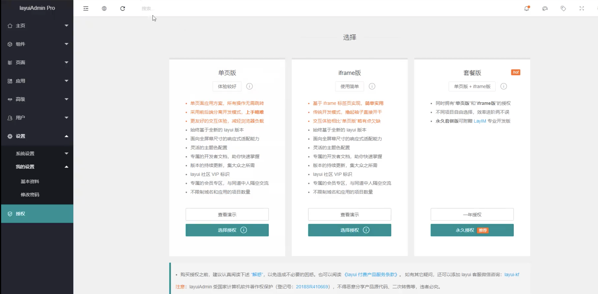

# swagger

layuiAdmin 框架，Vue的，1600元，分单页版，iframe版，套餐版（单页+iframe）



- api框架
- restful api 文档在线自定生成工具 =》api文档与api定义同步更新
- 可以直接运行，在线测试api接口
- 支持多种语言（java、php。。）
- 官网：https://swagger.io
- maven官网上找jar包：https://mvnrepository.com/
- 集成后的swagger web页面地址：http://localhost:port/swagger-ui.html


## 配置swagger

swagger的bean实例：Docket。使用注解的方式

```java
// SwaggerConfig.java

@Configuration
@EnableSwagger2
// 开启swagger2
public class SwaggerConfig {

  //配置swagger的bean实例
  @Bean
  public Docket docket() {
    return new Docket(DocumentionType.SWAGGER_2).apiInfo();
  }
}
```

