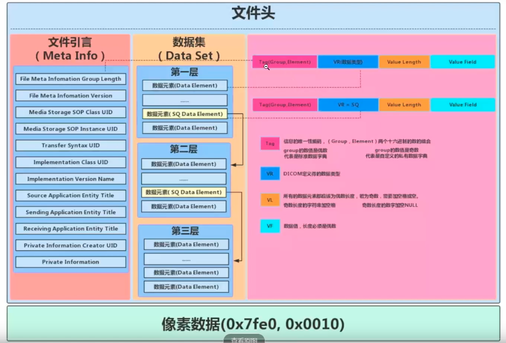

# DICOM

- Digital Imagine COmmunication in Medicine

- Both an image format & a network protocol
- 现在使用的主要的还是1993年的版本
- DICOM内容包括两部分：
  - 人体横断面的骨头、软组织的图片
  - 头文件，header信息，header包括：病人的信息、扫描的设备信息、如何扫描的信息。。

